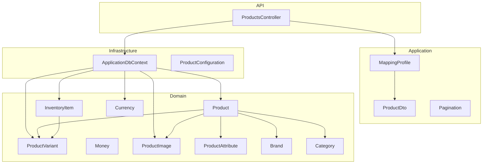
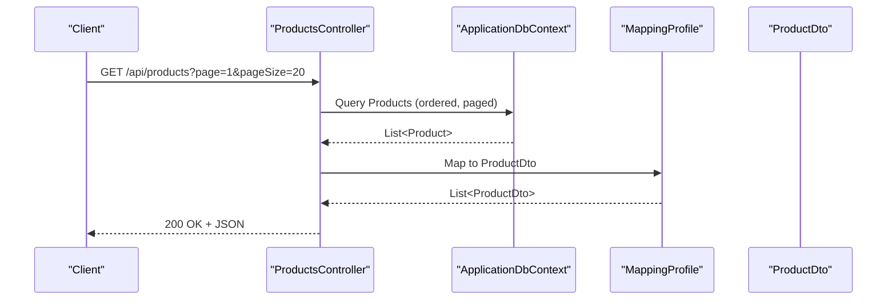
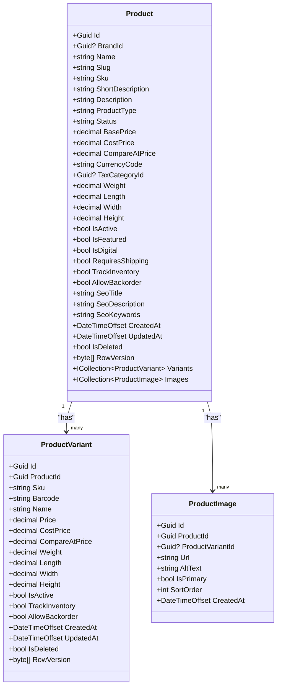
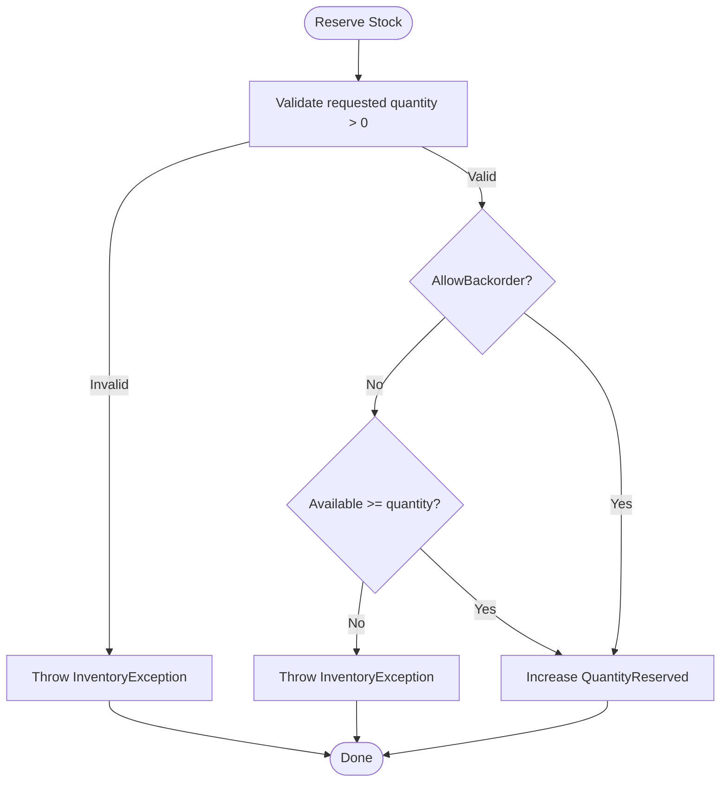
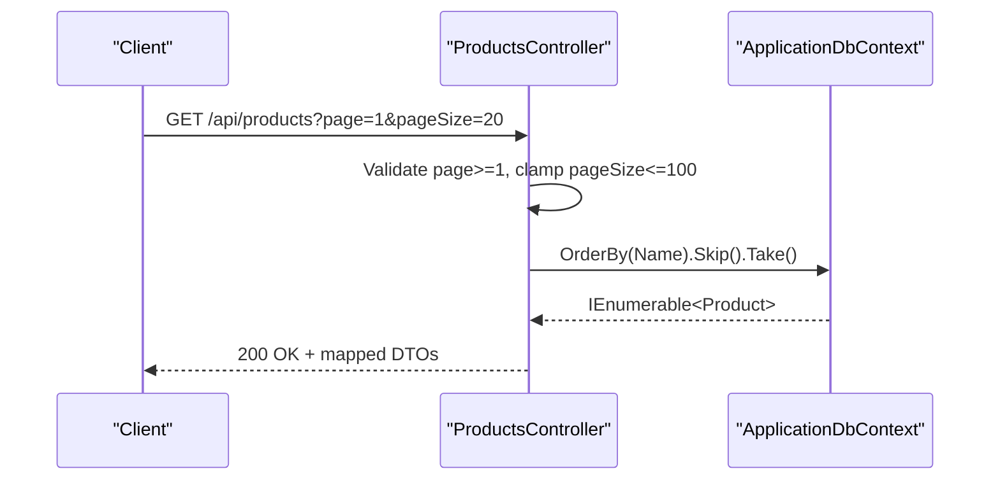
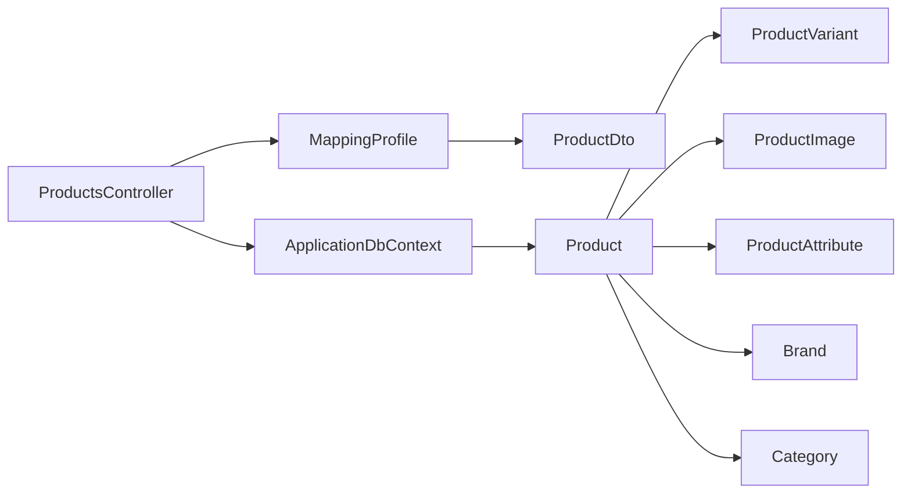

# Product Catalog

<cite>
**Referenced Files in This Document**
- [Product.cs](file://src/Ecommerce.Domain/Entities/Product.cs)
- [ProductVariant.cs](file://src/Ecommerce.Domain/Entities/ProductVariant.cs)
- [ProductAttribute.cs](file://src/Ecommerce.Domain/Entities/ProductAttribute.cs)
- [InventoryItem.cs](file://src/Ecommerce.Domain/Entities/InventoryItem.cs)
- [Currency.cs](file://src/Ecommerce.Domain/Entities/Currency.cs)
- [Money.cs](file://src/Ecommerce.Domain/ValueObjects/Money.cs)
- [ProductImage.cs](file://src/Ecommerce.Domain/Entities/ProductImage.cs)
- [Brand.cs](file://src/Ecommerce.Domain/Entities/Brand.cs)
- [Category.cs](file://src/Ecommerce.Domain/Entities/Category.cs)
- [ProductsController.cs](file://src/Ecommerce.Api/Controllers/ProductsController.cs)
- [ProductDto.cs](file://src/Ecommerce.Application/DTOs/ProductDto.cs)
- [MappingProfile.cs](file://src/Ecommerce.Application/Mappings/MappingProfile.cs)
- [ProductConfiguration.cs](file://src/Ecommerce.Infrastructure/Persistence/Configurations/ProductConfiguration.cs)
- [ApplicationDbContext.cs](file://src/Ecommerce.Infrastructure/Persistence/ApplicationDbContext.cs)
- [Pagination.cs](file://src/Ecommerce.Application/Common/Pagination.cs)
</cite>

## Table of Contents
1. [Introduction](#introduction)
2. [Project Structure](#project-structure)
3. [Core Components](#core-components)
4. [Architecture Overview](#architecture-overview)
5. [Detailed Component Analysis](#detailed-component-analysis)
6. [Dependency Analysis](#dependency-analysis)
7. [Performance Considerations](#performance-considerations)
8. [Troubleshooting Guide](#troubleshooting-guide)
9. [Conclusion](#conclusion)
10. [Appendices](#appendices)

## Introduction
This document explains the product catalog system with a focus on the Product entity, its pricing and status fields, digital vs physical handling, inventory tracking, lifecycle states, SEO metadata, attributes, variants, images, multi-currency support, and API patterns for search, filtering, and pagination. It also provides guidance on validation and best practices for creating and managing products.

## Project Structure
The product catalog spans multiple layers:
- Domain layer defines core entities (Product, ProductVariant, InventoryItem, Currency, Money, etc.)
- Application layer exposes DTOs, mappings, and shared utilities like Pagination
- Infrastructure layer configures EF Core models and DbContext
- API layer exposes HTTP endpoints for listing, retrieving by ID or slug

**Diagram sources**
- [ProductsController.cs:13-59](file://src/Ecommerce.Api/Controllers/ProductsController.cs#L13-L59)
- [MappingProfile.cs:22-27](file://src/Ecommerce.Application/Mappings/MappingProfile.cs#L22-L27)
- [ApplicationDbContext.cs:19-27](file://src/Ecommerce.Infrastructure/Persistence/ApplicationDbContext.cs#L19-L27)
- [ProductConfiguration.cs:7-21](file://src/Ecommerce.Infrastructure/Persistence/Configurations/ProductConfiguration.cs#L7-L21)
- [Product.cs:6-42](file://src/Ecommerce.Domain/Entities/Product.cs#L6-L42)
- [ProductVariant.cs:5-26](file://src/Ecommerce.Domain/Entities/ProductVariant.cs#L5-L26)
- [InventoryItem.cs:6-68](file://src/Ecommerce.Domain/Entities/InventoryItem.cs#L6-L68)
- [Currency.cs:5-11](file://src/Ecommerce.Domain/Entities/Currency.cs#L5-L11)
- [Money.cs:5-18](file://src/Ecommerce.Domain/ValueObjects/Money.cs#L5-L18)
- [ProductImage.cs:5-15](file://src/Ecommerce.Domain/Entities/ProductImage.cs#L5-L15)
- [ProductAttribute.cs:5-16](file://src/Ecommerce.Domain/Entities/ProductAttribute.cs#L5-L16)
- [Brand.cs:5-16](file://src/Ecommerce.Domain/Entities/Brand.cs#L5-L16)
- [Category.cs:6-24](file://src/Ecommerce.Domain/Entities/Category.cs#L6-L24)

**Section sources**
- [ProductsController.cs:13-59](file://src/Ecommerce.Api/Controllers/ProductsController.cs#L13-L59)
- [ApplicationDbContext.cs:19-27](file://src/Ecommerce.Infrastructure/Persistence/ApplicationDbContext.cs#L19-L27)
- [ProductConfiguration.cs:7-21](file://src/Ecommerce.Infrastructure/Persistence/Configurations/ProductConfiguration.cs#L7-L21)

## Core Components
- Product: Central entity with identity, identifiers, descriptive text, type, status, pricing, dimensions, flags for digital/shipping/inventory behavior, SEO fields, audit timestamps, soft delete, concurrency token, and relationships to variants and images.
- ProductVariant: Per-SKU variation with its own pricing, dimensions, stock controls, and timestamps.
- InventoryItem: Tracks per-warehouse stock levels, reservations, reorder points, backorder policy, and enforces business rules for adding/reserving/removing stock.
- Currency and Money: Support for currency codes and typed monetary values with validation.
- ProductImage and ProductAttribute: Enrich product presentation and attribute model.
- Brand and Category: Reference entities that can be associated with products.

Key Product properties include:
- Identifiers: Id, BrandId, Name, Slug, Sku
- Descriptions: ShortDescription, Description
- Type and Status: ProductType, Status
- Pricing: BasePrice, CostPrice, CompareAtPrice, CurrencyCode
- Dimensions and shipping: Weight, Length, Width, Height, RequiresShipping
- Flags: IsActive, IsFeatured, IsDigital, TrackInventory, AllowBackorder
- SEO: SeoTitle, SeoDescription, SeoKeywords
- Audit and concurrency: CreatedAt, UpdatedAt, IsDeleted, RowVersion

Pricing precision is enforced at the database level for BasePrice, CostPrice, and CompareAtPrice.

**Section sources**
- [Product.cs:6-42](file://src/Ecommerce.Domain/Entities/Product.cs#L6-L42)
- [ProductVariant.cs:5-26](file://src/Ecommerce.Domain/Entities/ProductVariant.cs#L5-L26)
- [InventoryItem.cs:6-68](file://src/Ecommerce.Domain/Entities/InventoryItem.cs#L6-L68)
- [Currency.cs:5-11](file://src/Ecommerce.Domain/Entities/Currency.cs#L5-L11)
- [Money.cs:5-18](file://src/Ecommerce.Domain/ValueObjects/Money.cs#L5-L18)
- [ProductImage.cs:5-15](file://src/Ecommerce.Domain/Entities/ProductImage.cs#L5-L15)
- [ProductAttribute.cs:5-16](file://src/Ecommerce.Domain/Entities/ProductAttribute.cs#L5-L16)
- [Brand.cs:5-16](file://src/Ecommerce.Domain/Entities/Brand.cs#L5-L16)
- [Category.cs:6-24](file://src/Ecommerce.Domain/Entities/Category.cs#L6-L24)
- [ProductConfiguration.cs:11-20](file://src/Ecommerce.Infrastructure/Persistence/Configurations/ProductConfiguration.cs#L11-L20)

## Architecture Overview
The API controller queries Products via EF Core, applies pagination, maps to DTOs, and returns results. The domain models define business rules (e.g., inventory operations), while configuration ensures constraints and performance characteristics (e.g., unique slug, row versioning).

**Diagram sources**
- [ProductsController.cs:26-41](file://src/Ecommerce.Api/Controllers/ProductsController.cs#L26-L41)
- [MappingProfile.cs:22-27](file://src/Ecommerce.Application/Mappings/MappingProfile.cs#L22-L27)
- [ApplicationDbContext.cs:19-27](file://src/Ecommerce.Infrastructure/Persistence/ApplicationDbContext.cs#L19-L27)

## Detailed Component Analysis

### Product Entity Model
- Identity and references: Guid Id; optional BrandId
- Identifiers and content: Name, Slug (unique index), Sku, ShortDescription, Description
- Classification: ProductType, Status
- Pricing: BasePrice, CostPrice, CompareAtPrice with decimal precision; CurrencyCode for multi-currency context
- Physical attributes: Weight, Length, Width, Height; RequiresShipping
- Lifecycle and visibility: IsActive, IsFeatured, IsDigital
- Inventory behavior: TrackInventory, AllowBackorder
- SEO: SeoTitle, SeoDescription, SeoKeywords
- Audit and concurrency: CreatedAt, UpdatedAt, IsDeleted, RowVersion
- Relationships: Variants collection, Images collection

**Diagram sources**
- [Product.cs:6-42](file://src/Ecommerce.Domain/Entities/Product.cs#L6-L42)
- [ProductVariant.cs:5-26](file://src/Ecommerce.Domain/Entities/ProductVariant.cs#L5-L26)
- [ProductImage.cs:5-15](file://src/Ecommerce.Domain/Entities/ProductImage.cs#L5-L15)

**Section sources**
- [Product.cs:6-42](file://src/Ecommerce.Domain/Entities/Product.cs#L6-L42)
- [ProductConfiguration.cs:11-20](file://src/Ecommerce.Infrastructure/Persistence/Configurations/ProductConfiguration.cs#L11-L20)

### Digital vs Physical Products
- IsDigital indicates whether a product is digital (no shipping required).
- RequiresShipping complements this to control fulfillment logic.
- For digital products, shipping-related calculations can be bypassed.

**Section sources**
- [Product.cs:26-30](file://src/Ecommerce.Domain/Entities/Product.cs#L26-L30)

### Inventory Tracking and Stock Rules
- TrackInventory enables stock management at product level.
- InventoryItem enforces:
  - Positive quantity checks for add/remove/reserve/release
  - Backorder policy enforcement when reserving or removing stock
  - Computed Available = QuantityOnHand - QuantityReserved
- ReorderLevel and ReorderQuantity support replenishment workflows.

**Diagram sources**
- [InventoryItem.cs:22-40](file://src/Ecommerce.Domain/Entities/InventoryItem.cs#L22-L40)

**Section sources**
- [InventoryItem.cs:6-68](file://src/Ecommerce.Domain/Entities/InventoryItem.cs#L6-L68)

### Multi-Currency Support
- Product stores CurrencyCode alongside prices to indicate the currency context.
- Money value object validates non-negative amounts and requires a currency code.
- Currency entity provides code and symbol for display and conversion contexts.

Best practice:
- Store base prices in a canonical currency if needed, and use exchange rates for display conversions.
- Always validate and persist CurrencyCode consistently.

**Section sources**
- [Product.cs:17-20](file://src/Ecommerce.Domain/Entities/Product.cs#L17-L20)
- [Money.cs:5-18](file://src/Ecommerce.Domain/ValueObjects/Money.cs#L5-L18)
- [Currency.cs:5-11](file://src/Ecommerce.Domain/Entities/Currency.cs#L5-L11)

### Product Attributes and Variants
- ProductAttribute defines attribute metadata (name, code, display type, filterability, variant flag, requirement).
- ProductVariant represents concrete SKU-level options with independent pricing and stock controls.
- Use attributes to drive UI rendering and filtering; use variants to manage distinct SKUs and inventory.

**Section sources**
- [ProductAttribute.cs:5-16](file://src/Ecommerce.Domain/Entities/ProductAttribute.cs#L5-L16)
- [ProductVariant.cs:5-26](file://src/Ecommerce.Domain/Entities/ProductVariant.cs#L5-L26)

### Product Images
- ProductImage supports primary image selection, alt text, ordering, and association to either product or specific variant.

**Section sources**
- [ProductImage.cs:5-15](file://src/Ecommerce.Domain/Entities/ProductImage.cs#L5-L15)

### Product Search, Filtering, and Pagination
- Listing endpoint supports page and pageSize query parameters with safe defaults and bounds.
- Results are ordered by Name and paged using Skip/Take.
- Retrieval by Id and by Slug is supported.
- A shared Pagination model exists for consistent request/response contracts.

**Diagram sources**
- [ProductsController.cs:26-41](file://src/Ecommerce.Api/Controllers/ProductsController.cs#L26-L41)
- [Pagination.cs:3-7](file://src/Ecommerce.Application/Common/Pagination.cs#L3-L7)

**Section sources**
- [ProductsController.cs:26-59](file://src/Ecommerce.Api/Controllers/ProductsController.cs#L26-L59)
- [Pagination.cs:3-7](file://src/Ecommerce.Application/Common/Pagination.cs#L3-L7)

### Validation and Creation Patterns
- A placeholder validator exists for products; extend it with FluentValidation rules to enforce required fields, format constraints, and business rules (e.g., positive prices, unique SKU/Slug).
- Recommended validations:
  - Name, Slug, Sku required and within length limits
  - Prices non-negative and within precision
  - CurrencyCode present and valid
  - Unique constraints on Slug and Sku
- Create flow:
  - Validate input against validator
  - Persist via DbContext
  - Map to DTO for response

**Section sources**
- [ProductValidator.cs:1-8](file://src/Ecommerce.Application/Validators/ProductValidator.cs#L1-L8)
- [ProductConfiguration.cs:11-20](file://src/Ecommerce.Infrastructure/Persistence/Configurations/ProductConfiguration.cs#L11-L20)

### DTOs and Mapping
- ProductDto exposes minimal read surface: Id, Name, Slug, BasePrice.
- AutoMapper mapping defined from Product to ProductDto.

**Section sources**
- [ProductDto.cs:5-11](file://src/Ecommerce.Application/DTOs/ProductDto.cs#L5-L11)
- [MappingProfile.cs:22-27](file://src/Ecommerce.Application/Mappings/MappingProfile.cs#L22-L27)

## Dependency Analysis
- API depends on EF Core through ApplicationDbContext and uses AutoMapper for DTO mapping.
- Domain entities encapsulate business rules; infrastructure applies EF configurations and persistence.
- Product has relationships to Brand, Category, ProductVariant, ProductImage, and ProductAttribute.

**Diagram sources**
- [ProductsController.cs:13-59](file://src/Ecommerce.Api/Controllers/ProductsController.cs#L13-L59)
- [MappingProfile.cs:22-27](file://src/Ecommerce.Application/Mappings/MappingProfile.cs#L22-L27)
- [ApplicationDbContext.cs:19-27](file://src/Ecommerce.Infrastructure/Persistence/ApplicationDbContext.cs#L19-L27)
- [Product.cs:6-42](file://src/Ecommerce.Domain/Entities/Product.cs#L6-L42)

**Section sources**
- [ProductsController.cs:13-59](file://src/Ecommerce.Api/Controllers/ProductsController.cs#L13-L59)
- [ApplicationDbContext.cs:19-27](file://src/Ecommerce.Infrastructure/Persistence/ApplicationDbContext.cs#L19-L27)

## Performance Considerations
- Use AsNoTracking for read-only queries to reduce change-tracking overhead.
- Enforce reasonable page sizes and clamp inputs to prevent large result sets.
- Ensure indexes exist for frequent filters (e.g., Slug is unique; consider additional indexes for common query fields).
- Keep DTOs lean to minimize payload size.

[No sources needed since this section provides general guidance]

## Troubleshooting Guide
Common issues and resolutions:
- Invalid page or page size: Controller clamps and normalizes inputs; ensure client sends valid values.
- Not found responses: GetById and GetBySlug return NotFound when no matching product exists.
- Inventory exceptions: Inventory operations throw explicit exceptions for invalid quantities or insufficient stock; handle these in application handlers.
- Concurrency conflicts: RowVersion enables optimistic concurrency; re-fetch and retry on conflicts.

**Section sources**
- [ProductsController.cs:26-59](file://src/Ecommerce.Api/Controllers/ProductsController.cs#L26-L59)
- [InventoryItem.cs:22-68](file://src/Ecommerce.Domain/Entities/InventoryItem.cs#L22-L68)
- [ProductConfiguration.cs:20-20](file://src/Ecommerce.Infrastructure/Persistence/Configurations/ProductConfiguration.cs#L20-L20)

## Conclusion
The product catalog centers around a rich Product entity with robust pricing, status, and SEO fields, complemented by variants, images, attributes, and inventory controls. The API provides efficient listing and retrieval with pagination and safe parameter handling. Extending validators and leveraging domain rules will ensure data integrity and predictable behavior across the catalog.

[No sources needed since this section summarizes without analyzing specific files]

## Appendices

### Example Workflows

#### Creating a Valid Product
- Validate required fields and business rules using a FluentValidation-based validator.
- Persist via DbContext; map to ProductDto for response.

**Section sources**
- [ProductValidator.cs:1-8](file://src/Ecommerce.Application/Validators/ProductValidator.cs#L1-L8)
- [MappingProfile.cs:22-27](file://src/Ecommerce.Application/Mappings/MappingProfile.cs#L22-L27)

#### Managing Product Attributes and Variants
- Define attributes to describe product options and mark variant-capable ones.
- Create ProductVariant entries for each SKU with independent pricing and stock settings.

**Section sources**
- [ProductAttribute.cs:5-16](file://src/Ecommerce.Domain/Entities/ProductAttribute.cs#L5-L16)
- [ProductVariant.cs:5-26](file://src/Ecommerce.Domain/Entities/ProductVariant.cs#L5-L26)

#### Handling Multi-Currency
- Set CurrencyCode on Product and ensure Money objects carry a valid currency code.
- Display prices using Currency symbol and formatting.

**Section sources**
- [Product.cs:17-20](file://src/Ecommerce.Domain/Entities/Product.cs#L17-L20)
- [Money.cs:5-18](file://src/Ecommerce.Domain/ValueObjects/Money.cs#L5-L18)
- [Currency.cs:5-11](file://src/Ecommerce.Domain/Entities/Currency.cs#L5-L11)