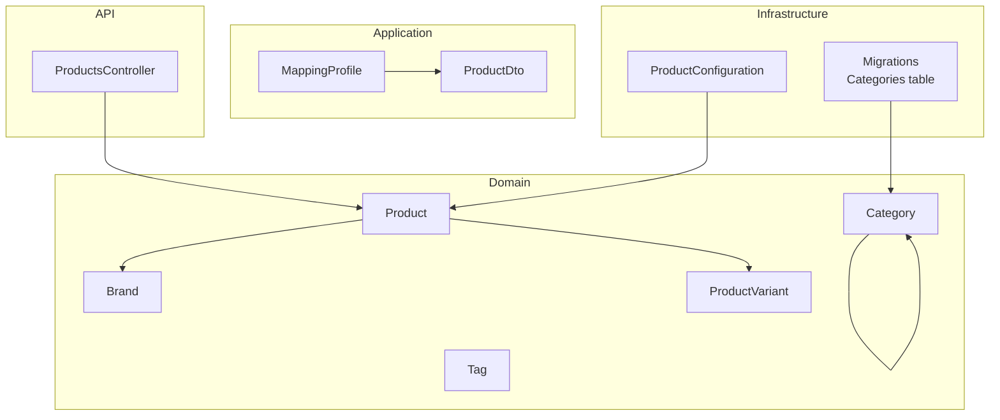
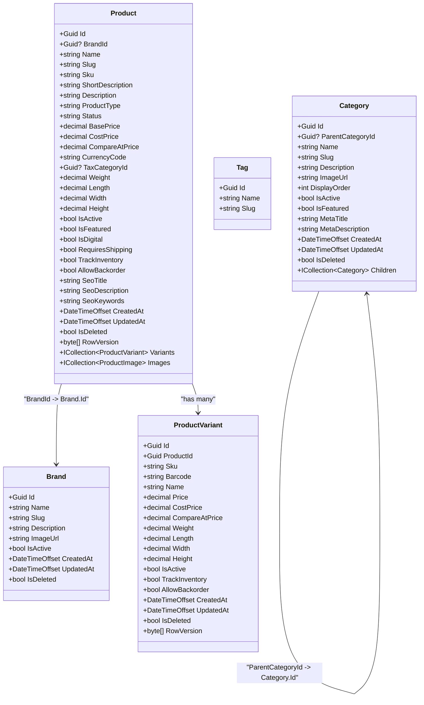
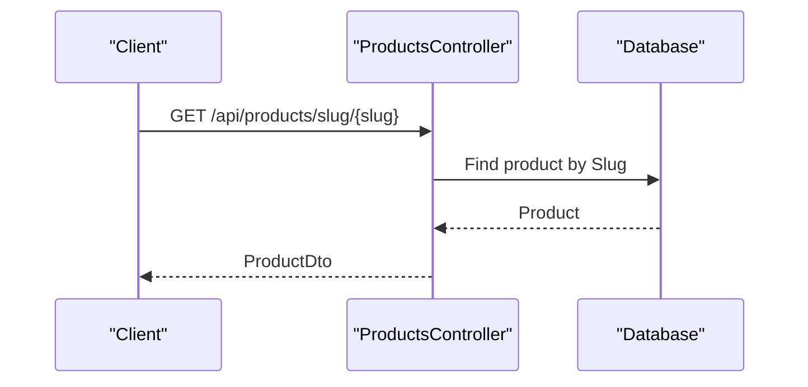
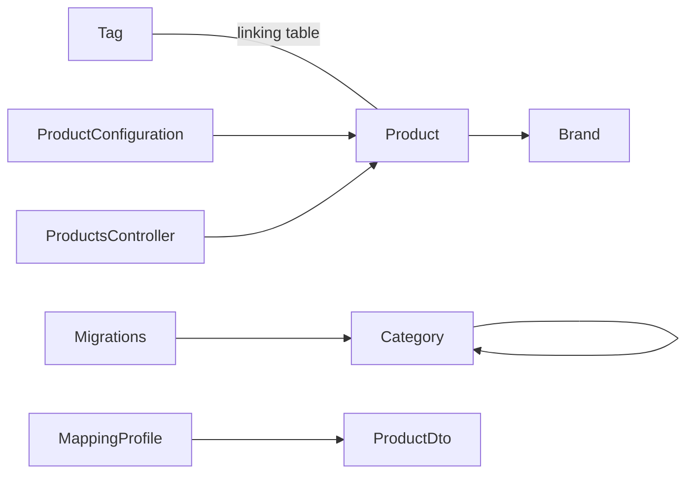
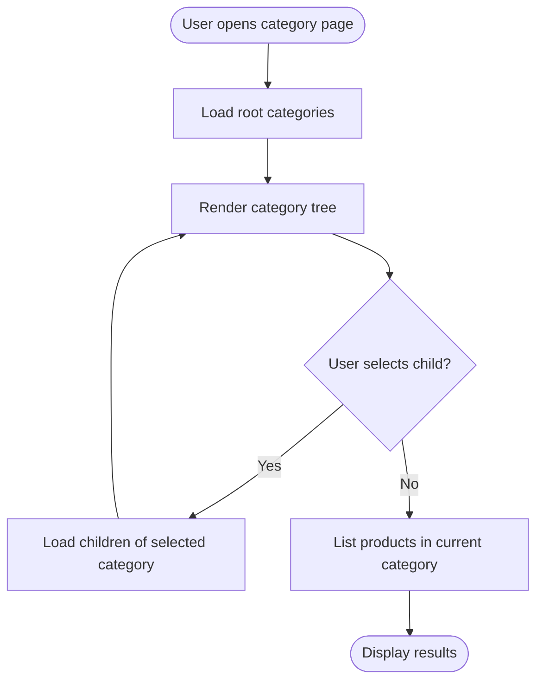

# Product Categorization

<cite>
**Referenced Files in This Document**
- [Brand.cs](file://src/Ecommerce.Domain/Entities/Brand.cs)
- [Category.cs](file://src/Ecommerce.Domain/Entities/Category.cs)
- [Tag.cs](file://src/Ecommerce.Domain/Entities/Tag.cs)
- [Product.cs](file://src/Ecommerce.Domain/Entities/Product.cs)
- [ProductVariant.cs](file://src/Ecommerce.Domain/Entities/ProductVariant.cs)
- [ProductsController.cs](file://src/Ecommerce.Api/Controllers/ProductsController.cs)
- [ProductConfiguration.cs](file://src/Ecommerce.Infrastructure/Persistence/Configurations/ProductConfiguration.cs)
- [MappingProfile.cs](file://src/Ecommerce.Application/Mappings/MappingProfile.cs)
- [ProductDto.cs](file://src/Ecommerce.Application/DTOs/ProductDto.cs)
- [erd.md](file://docs/architecture/erd.md)
- [entities_and_constraints.md](file://docs/architecture/entities_and_constraints.md)
- [InitialCreate.cs](file://src/Ecommerce.Infrastructure/Migrations/20260815214939_InitialCreate.cs)
</cite>

## Table of Contents
1. [Introduction](#introduction)
2. [Project Structure](#project-structure)
3. [Core Components](#core-components)
4. [Architecture Overview](#architecture-overview)
5. [Detailed Component Analysis](#detailed-component-analysis)
6. [Dependency Analysis](#dependency-analysis)
7. [Performance Considerations](#performance-considerations)
8. [Troubleshooting Guide](#troubleshooting-guide)
9. [Conclusion](#conclusion)
10. [Appendices](#appendices)

## Introduction
This document explains how products are categorized and organized using Brand, Category, and Tag entities. It covers hierarchical category structures, brand associations, tag-based grouping, navigation patterns, filtering strategies, SEO implications, and performance considerations for large catalogs with complex categorization schemes. The guidance is grounded in the domain entities, configuration, API surface, and architectural documentation present in the repository.

## Project Structure
The product categorization features span multiple layers:
- Domain layer defines core entities (Brand, Category, Tag, Product, ProductVariant).
- Infrastructure layer configures persistence and migrations for categories and products.
- Application layer provides DTOs and mappings used by APIs.
- API layer exposes endpoints to retrieve products and supports slug-based lookup.

**Diagram sources**
- [Brand.cs:5-16](file://src/Ecommerce.Domain/Entities/Brand.cs#L5-L16)
- [Category.cs:6-24](file://src/Ecommerce.Domain/Entities/Category.cs#L6-L24)
- [Tag.cs:5-10](file://src/Ecommerce.Domain/Entities/Tag.cs#L5-L10)
- [Product.cs:6-42](file://src/Ecommerce.Domain/Entities/Product.cs#L6-L42)
- [ProductVariant.cs:5-25](file://src/Ecommerce.Domain/Entities/ProductVariant.cs#L5-L25)
- [ProductConfiguration.cs:7-21](file://src/Ecommerce.Infrastructure/Persistence/Configurations/ProductConfiguration.cs#L7-L21)
- [InitialCreate.cs:64-81](file://src/Ecommerce.Infrastructure/Migrations/20260815214939_InitialCreate.cs#L64-L81)
- [MappingProfile.cs:22-26](file://src/Ecommerce.Application/Mappings/MappingProfile.cs#L22-L26)
- [ProductDto.cs:5-11](file://src/Ecommerce.Application/DTOs/ProductDto.cs#L5-L11)
- [ProductsController.cs:13-58](file://src/Ecommerce.Api/Controllers/ProductsController.cs#L13-L58)

**Section sources**
- [Brand.cs:5-16](file://src/Ecommerce.Domain/Entities/Brand.cs#L5-L16)
- [Category.cs:6-24](file://src/Ecommerce.Domain/Entities/Category.cs#L6-L24)
- [Tag.cs:5-10](file://src/Ecommerce.Domain/Entities/Tag.cs#L5-L10)
- [Product.cs:6-42](file://src/Ecommerce.Domain/Entities/Product.cs#L6-L20)
- [ProductVariant.cs:5-25](file://src/Ecommerce.Domain/Entities/ProductVariant.cs#L5-L25)
- [ProductConfiguration.cs:7-21](file://src/Ecommerce.Infrastructure/Persistence/Configurations/ProductConfiguration.cs#L7-L21)
- [MappingProfile.cs:22-26](file://src/Ecommerce.Application/Mappings/MappingProfile.cs#L22-L26)
- [ProductDto.cs:5-11](file://src/Ecommerce.Application/DTOs/ProductDto.cs#L5-L11)
- [ProductsController.cs:13-58](file://src/Ecommerce.Api/Controllers/ProductsController.cs#L13-L58)
- [InitialCreate.cs:64-81](file://src/Ecommerce.Infrastructure/Migrations/20260815214939_InitialCreate.cs#L64-L81)

## Core Components
- Brand: Represents a product brand with identity, metadata, and lifecycle flags. Products can be associated with a brand via a foreign key.
- Category: Supports hierarchical organization through a self-referencing parent relationship. Includes display ordering, visibility, feature flags, and SEO fields.
- Tag: A lightweight label entity intended for cross-cutting classification of products.
- Product: Central entity with brand association and rich metadata including SEO fields. Variants extend product details such as pricing and dimensions.
- ProductVariant: Represents specific instances of a product with distinct pricing and inventory attributes.

Key relationships:
- Product has an optional BrandId linking to Brand.
- Category has a ParentCategoryId enabling multi-level hierarchies.
- Tag exists as a standalone entity; the architecture documents recommend a many-to-many linking table between Product and Tag for flexible tagging.

**Section sources**
- [Brand.cs:5-16](file://src/Ecommerce.Domain/Entities/Brand.cs#L5-L16)
- [Category.cs:6-24](file://src/Ecommerce.Domain/Entities/Category.cs#L6-L24)
- [Tag.cs:5-10](file://src/Ecommerce.Domain/Entities/Tag.cs#L5-L10)
- [Product.cs:6-42](file://src/Ecommerce.Domain/Entities/Product.cs#L6-L42)
- [ProductVariant.cs:5-25](file://src/Ecommerce.Domain/Entities/ProductVariant.cs#L5-L25)
- [entities_and_constraints.md:132-139](file://docs/architecture/entities_and_constraints.md#L132-L139)

## Architecture Overview
The system models product categorization across domain, infrastructure, application, and API layers. Categories form a tree structure via self-references. Brands provide a flat association to products. Tags enable flexible, non-hierarchical groupings. The API currently exposes product listing and retrieval by ID or slug, which can serve as entry points for category and brand filtering once implemented.

**Diagram sources**
- [Brand.cs:5-16](file://src/Ecommerce.Domain/Entities/Brand.cs#L5-L16)
- [Category.cs:6-24](file://src/Ecommerce.Domain/Entities/Category.cs#L6-L24)
- [Tag.cs:5-10](file://src/Ecommerce.Domain/Entities/Tag.cs#L5-L10)
- [Product.cs:6-42](file://src/Ecommerce.Domain/Entities/Product.cs#L6-L42)
- [ProductVariant.cs:5-25](file://src/Ecommerce.Domain/Entities/ProductVariant.cs#L5-L25)

## Detailed Component Analysis

### Brand Entity and Product Association
- Purpose: Identify the manufacturer or brand behind a product.
- Key properties include identity, name, slug, description, image, active status, and timestamps.
- Relationship: Product references Brand via BrandId, enabling brand-based filtering and presentation.

Implementation notes:
- Ensure BrandId on Product is indexed for efficient filtering.
- Use slugs for SEO-friendly URLs when exposing brand pages.

**Section sources**
- [Brand.cs:5-16](file://src/Ecommerce.Domain/Entities/Brand.cs#L5-L16)
- [Product.cs:6-20](file://src/Ecommerce.Domain/Entities/Product.cs#L6-L20)
- [entities_and_constraints.md:83-112](file://docs/architecture/entities_and_constraints.md#L83-L112)

### Category Hierarchy
- Purpose: Organize products into structured, navigable hierarchies.
- Self-referencing ParentCategoryId enables unlimited nesting levels.
- Additional fields support display order, visibility, featured status, and SEO metadata.

Navigation and management:
- Build category trees by loading root categories (no parent) and recursively attaching children.
- Use DisplayOrder to control UI sorting within each level.
- Enforce uniqueness constraints per parent if needed to avoid duplicate child slugs.

SEO considerations:
- Leverage MetaTitle and MetaDescription for category pages.
- Maintain clean slugs for human-readable URLs.

**Section sources**
- [Category.cs:6-24](file://src/Ecommerce.Domain/Entities/Category.cs#L6-L24)
- [InitialCreate.cs:64-81](file://src/Ecommerce.Infrastructure/Migrations/20260815214939_InitialCreate.cs#L64-L81)
- [entities_and_constraints.md:74-81](file://docs/architecture/entities_and_constraints.md#L74-L81)

### Tag-Based Grouping
- Purpose: Provide flexible, cross-cutting labels that cut across categories and brands (e.g., “eco-friendly”, “new arrival”).
- Current domain model includes Tag; architecture documentation recommends a linking table between Product and Tag to support many-to-many relationships.

Usage patterns:
- Assign multiple tags to a product to enable tag-based searches and filters.
- Expose tag pages with slugs for SEO-friendly discovery.

Constraints and indexing:
- Index ProductId and TagId in the linking table for fast lookups.
- Enforce unique tag names/slugs to prevent duplication.

**Section sources**
- [Tag.cs:5-10](file://src/Ecommerce.Domain/Entities/Tag.cs#L5-L10)
- [entities_and_constraints.md:132-139](file://docs/architecture/entities_and_constraints.md#L132-L139)

### Product Model and Variants
- Purpose: Represent sellable items with rich metadata, pricing, and variants.
- Product holds brand association and SEO fields; ProductVariant captures variant-specific pricing and physical attributes.

Operational aspects:
- Use Slugs for SEO-friendly product URLs.
- Variants allow multiple SKUs and prices under one product.

**Section sources**
- [Product.cs:6-42](file://src/Ecommerce.Domain/Entities/Product.cs#L6-L42)
- [ProductVariant.cs:5-25](file://src/Ecommerce.Domain/Entities/ProductVariant.cs#L5-L25)
- [ProductConfiguration.cs:7-21](file://src/Ecommerce.Infrastructure/Persistence/Configurations/ProductConfiguration.cs#L7-L21)

### API Surface for Catalog Access
- ProductsController exposes:
  - Paginated list of products.
  - Get by ID.
  - Get by slug.
- These endpoints can be extended to filter by BrandId, CategoryId, or TagIds once relationships are fully modeled and queried.

Example flow (slug lookup):

**Diagram sources**
- [ProductsController.cs:51-58](file://src/Ecommerce.Api/Controllers/ProductsController.cs#L51-L58)
- [ProductConfiguration.cs:7-21](file://src/Ecommerce.Infrastructure/Persistence/Configurations/ProductConfiguration.cs#L7-L21)

**Section sources**
- [ProductsController.cs:13-58](file://src/Ecommerce.Api/Controllers/ProductsController.cs#L13-L58)
- [MappingProfile.cs:22-26](file://src/Ecommerce.Application/Mappings/MappingProfile.cs#L22-L26)
- [ProductDto.cs:5-11](file://src/Ecommerce.Application/DTOs/ProductDto.cs#L5-L11)

## Dependency Analysis
- Domain dependencies:
  - Product depends on Brand (via BrandId).
  - Category depends on itself (ParentCategoryId).
  - Tag is independent but intended to link to Product via a many-to-many relationship documented in architecture specs.
- Infrastructure dependencies:
  - Migrations define the Categories table schema with ParentCategoryId.
  - ProductConfiguration sets up keys, constraints, and indexes for Product.
- Application/API dependencies:
  - MappingProfile maps Product to ProductDto.
  - ProductsController queries Products and returns mapped DTOs.

**Diagram sources**
- [Brand.cs:5-16](file://src/Ecommerce.Domain/Entities/Brand.cs#L5-L16)
- [Category.cs:6-24](file://src/Ecommerce.Domain/Entities/Category.cs#L6-L24)
- [Tag.cs:5-10](file://src/Ecommerce.Domain/Entities/Tag.cs#L5-L10)
- [Product.cs:6-42](file://src/Ecommerce.Domain/Entities/Product.cs#L6-L42)
- [ProductConfiguration.cs:7-21](file://src/Ecommerce.Infrastructure/Persistence/Configurations/ProductConfiguration.cs#L7-L21)
- [InitialCreate.cs:64-81](file://src/Ecommerce.Infrastructure/Migrations/20260815214939_InitialCreate.cs#L64-L81)
- [MappingProfile.cs:22-26](file://src/Ecommerce.Application/Mappings/MappingProfile.cs#L22-L26)
- [ProductsController.cs:13-58](file://src/Ecommerce.Api/Controllers/ProductsController.cs#L13-L58)

**Section sources**
- [entities_and_constraints.md:74-139](file://docs/architecture/entities_and_constraints.md#L74-L139)
- [erd.md:23-85](file://docs/architecture/erd.md#L23-L85)

## Performance Considerations
- Indexing:
  - Add indexes on Product.BrandId for brand filtering.
  - Add indexes on Category.ParentCategoryId for hierarchy traversal.
  - For tag linking tables, index both ProductId and TagId to optimize tag-based queries.
- Query optimization:
  - Use AsNoTracking for read-only endpoints to reduce change tracking overhead.
  - Apply pagination and selective projection to minimize payload size.
- Caching:
  - Cache category trees and popular brand/tag lists at the API layer or via distributed cache.
- Concurrency:
  - Use RowVersion where applicable to handle concurrent updates safely.
- Database design:
  - Enforce unique constraints on slugs to avoid duplicates and ensure stable URLs.
  - Keep category depth reasonable to avoid expensive recursive queries.

[No sources needed since this section provides general guidance]

## Troubleshooting Guide
Common issues and resolutions:
- Missing relationships:
  - If brand/category/tag filtering does not work, verify that foreign keys and linking tables exist and are properly configured.
- Slow queries:
  - Check for missing indexes on frequently filtered columns (BrandId, ParentCategoryId, Tag links).
- Duplicate slugs:
  - Ensure unique constraints on slugs for Brand, Category, and Product to prevent conflicts.
- Soft-delete behavior:
  - Confirm that soft-delete flags are respected in queries to hide deleted entities from catalog views.

**Section sources**
- [entities_and_constraints.md:74-139](file://docs/architecture/entities_and_constraints.md#L74-L139)
- [ProductConfiguration.cs:7-21](file://src/Ecommerce.Infrastructure/Persistence/Configurations/ProductConfiguration.cs#L7-L21)

## Conclusion
The codebase provides a solid foundation for product categorization with Brand, Category, and Tag entities. Categories support hierarchical organization, brands offer flat associations, and tags enable flexible cross-cutting classifications. Extending the API to expose filtering by these dimensions, combined with proper indexing and caching, will deliver scalable and user-friendly catalog experiences.

[No sources needed since this section summarizes without analyzing specific files]

## Appendices

### Examples of Organizing Products
- Assign a brand to a product via BrandId to enable brand filtering and branding pages.
- Place a product under a category hierarchy by associating it with leaf categories; use category trees for navigation.
- Apply multiple tags to a product to support cross-cutting searches like “sale” or “organic”.

[No sources needed since this section provides conceptual examples]

### Category Navigation Flow

[No sources needed since this diagram shows conceptual workflow, not actual code structure]