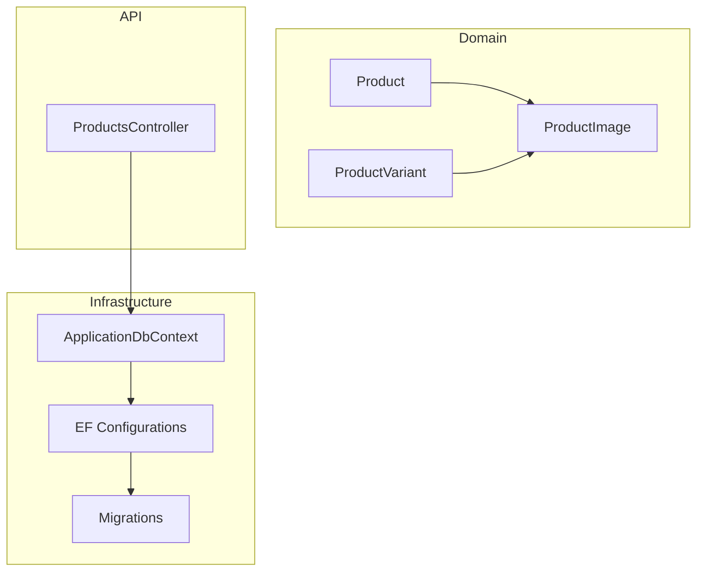
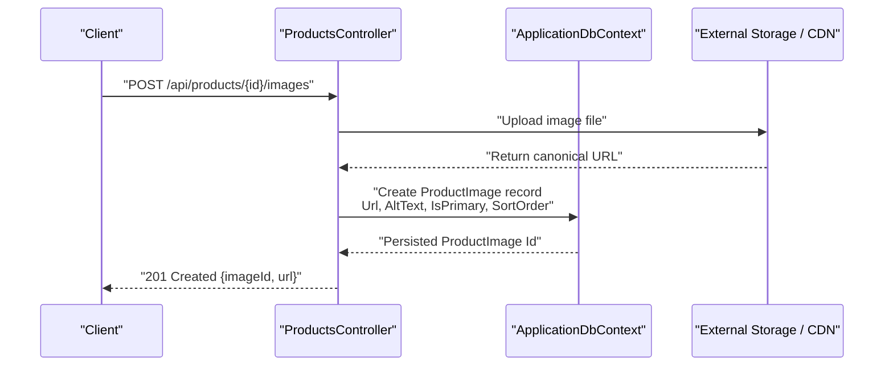
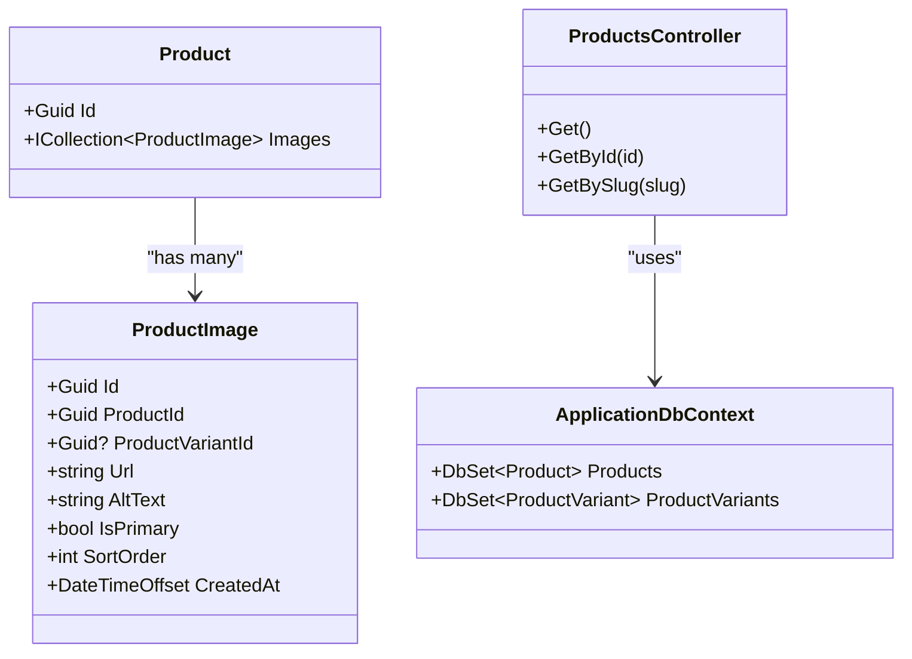

# Product Images

<cite>
**Referenced Files in This Document**
- [ProductImage.cs](file://src/Ecommerce.Domain/Entities/ProductImage.cs)
- [Product.cs](file://src/Ecommerce.Domain/Entities/Product.cs)
- [ApplicationDbContext.cs](file://src/Ecommerce.Infrastructure/Persistence/ApplicationDbContext.cs)
- [ProductConfiguration.cs](file://src/Ecommerce.Infrastructure/Persistence/Configurations/ProductConfiguration.cs)
- [20260815214939_InitialCreate.cs](file://src/Ecommerce.Infrastructure/Migrations/20260815214939_InitialCreate.cs)
- [20260815214939_InitialCreate.Designer.cs](file://src/Ecommerce.Infrastructure/Migrations/20260815214939_InitialCreate.Designer.cs)
- [ProductsController.cs](file://src/Ecommerce.Api/Controllers/ProductsController.cs)
- [ValidationBehavior.cs](file://src/Ecommerce.Application/Common/Commands/ValidationBehavior.cs)
- [IValidator.cs](file://src/Ecommerce.Application/Common/Validation/IValidator.cs)
</cite>

## Table of Contents
1. Introduction
2. Project Structure
3. Core Components
4. Architecture Overview
5. Detailed Component Analysis
6. Dependency Analysis
7. Performance Considerations
8. Troubleshooting Guide
9. Conclusion

## Introduction
This document explains the product image management system as implemented in the repository. It focuses on the ProductImage entity, its relationship with products and variants, metadata handling, and how images are persisted. It also outlines recommended workflows for uploading images, optimizing them, generating thumbnails, integrating with a CDN, and managing galleries (including primary images). Where implementation is not present in code, this section provides practical guidance aligned with the existing architecture.

## Project Structure
The product image feature spans Domain entities, Infrastructure persistence, and API controllers:
- Domain defines the ProductImage entity and its relation to Product and optional ProductVariant.
- Infrastructure configures EF Core mappings and migrations that persist ProductImage records.
- API exposes product queries; image upload endpoints are not yet implemented but can be added following the same patterns.

**Diagram sources**
- [Product.cs:40-42](file://src/Ecommerce.Domain/Entities/Product.cs#L40-L42)
- [ProductImage.cs:5-15](file://src/Ecommerce.Domain/Entities/ProductImage.cs#L5-L15)
- [ApplicationDbContext.cs:19-27](file://src/Ecommerce.Infrastructure/Persistence/ApplicationDbContext.cs#L19-L27)
- [ProductConfiguration.cs:7-21](file://src/Ecommerce.Infrastructure/Persistence/Configurations/ProductConfiguration.cs#L7-L21)
- [20260815214939_InitialCreate.cs:342-356](file://src/Ecommerce.Infrastructure/Migrations/20260815214939_InitialCreate.cs#L342-L356)
- [ProductsController.cs:13-24](file://src/Ecommerce.Api/Controllers/ProductsController.cs#L13-L24)

**Section sources**
- [ProductImage.cs:5-15](file://src/Ecommerce.Domain/Entities/ProductImage.cs#L5-L15)
- [Product.cs:40-42](file://src/Ecommerce.Domain/Entities/Product.cs#L40-L42)
- [ApplicationDbContext.cs:19-27](file://src/Ecommerce.Infrastructure/Persistence/ApplicationDbContext.cs#L19-L27)
- [ProductConfiguration.cs:7-21](file://src/Ecommerce.Infrastructure/Persistence/Configurations/ProductConfiguration.cs#L7-L21)
- [20260815214939_InitialCreate.cs:342-356](file://src/Ecommerce.Infrastructure/Migrations/20260815214939_InitialCreate.cs#L342-L356)
- [ProductsController.cs:13-24](file://src/Ecommerce.Api/Controllers/ProductsController.cs#L13-L24)

## Core Components
- ProductImage entity stores per-image metadata: unique identifier, associations to Product and optional ProductVariant, URL, alt text, primary flag, sort order, and creation timestamp.
- Product aggregates a collection of ProductImage instances, enabling one-to-many relationships between products and their images.
- EF Core configuration and migrations define the database schema for ProductImage, including required fields and indexes.

Key responsibilities:
- Persist image references and metadata.
- Support variant-scoped images via an optional foreign key.
- Maintain ordering and primary selection through SortOrder and IsPrimary.

**Section sources**
- [ProductImage.cs:5-15](file://src/Ecommerce.Domain/Entities/ProductImage.cs#L5-L15)
- [Product.cs:40-42](file://src/Ecommerce.Domain/Entities/Product.cs#L40-L42)
- [20260815214939_InitialCreate.cs:342-356](file://src/Ecommerce.Infrastructure/Migrations/20260815214939_InitialCreate.cs#L342-L356)
- [20260815214939_InitialCreate.Designer.cs:428-462](file://src/Ecommerce.Infrastructure/Migrations/20260815214939_InitialCreate.Designer.cs#L428-L462)

## Architecture Overview
The current codebase persists ProductImage records via EF Core and exposes product data through a REST controller. Image upload endpoints are not yet implemented; however, the domain model supports adding multiple images per product and per variant.

Notes:
- The sequence above illustrates a recommended workflow using the existing domain model and persistence layer.
- Actual upload endpoints are not present in the repository; implement them by extending the API layer and using the domain model.

**Diagram sources**
- [ProductsController.cs:13-24](file://src/Ecommerce.Api/Controllers/ProductsController.cs#L13-L24)
- [ApplicationDbContext.cs:19-27](file://src/Ecommerce.Infrastructure/Persistence/ApplicationDbContext.cs#L19-L27)
- [ProductImage.cs:5-15](file://src/Ecommerce.Domain/Entities/ProductImage.cs#L5-L15)

## Detailed Component Analysis

### ProductImage Entity
- Fields:
  - Id: Unique identifier for the image record.
  - ProductId: Foreign key to the owning product.
  - ProductVariantId: Optional association to a specific product variant.
  - Url: Canonical URL of the image asset (e.g., object storage or CDN).
  - AltText: Accessible description used for SEO and accessibility.
  - IsPrimary: Flag indicating if this image is the product’s primary image.
  - SortOrder: Ordering within the gallery for consistent display.
  - CreatedAt: Timestamp when the image was added.

Relationships:
- One Product has many ProductImage entries.
- A ProductImage optionally belongs to a ProductVariant.

Data constraints (from migrations):
- Url and AltText are required.
- Indexes exist on ProductId for efficient querying of product galleries.

**Section sources**
- [ProductImage.cs:5-15](file://src/Ecommerce.Domain/Entities/ProductImage.cs#L5-L15)
- [20260815214939_InitialCreate.cs:342-356](file://src/Ecommerce.Infrastructure/Migrations/20260815214939_InitialCreate.cs#L342-L356)
- [20260815214939_InitialCreate.Designer.cs:428-462](file://src/Ecommerce.Infrastructure/Migrations/20260815214939_InitialCreate.Designer.cs#L428-L462)

### Product Aggregation
- Product includes a collection of ProductImage instances, enabling direct navigation from product to its gallery.
- This design supports listing, filtering, and ordering images per product.

**Section sources**
- [Product.cs:40-42](file://src/Ecommerce.Domain/Entities/Product.cs#L40-L42)

### Persistence and Configuration
- ApplicationDbContext exposes DbSets for core entities and applies EF configurations from the assembly.
- ProductConfiguration demonstrates how to configure properties, keys, and indexes for domain entities.
- Migrations define the ProductImage table schema and ensure required fields and indexes.

Operational implications:
- Use AsNoTracking for read-heavy operations to improve performance.
- Ensure proper indexing on ProductId for fast gallery retrieval.

**Section sources**
- [ApplicationDbContext.cs:19-27](file://src/Ecommerce.Infrastructure/Persistence/ApplicationDbContext.cs#L19-L27)
- [ProductConfiguration.cs:7-21](file://src/Ecommerce.Infrastructure/Persistence/Configurations/ProductConfiguration.cs#L7-L21)
- [20260815214939_InitialCreate.cs:342-356](file://src/Ecommerce.Infrastructure/Migrations/20260815214939_InitialCreate.cs#L342-L356)

### API Layer
- ProductsController currently provides GET endpoints for listing and retrieving products.
- Image upload/update endpoints are not implemented; extend the controller to add POST/PUT handlers for images.

Recommended next steps:
- Add endpoints to create, update, and delete ProductImage records.
- Validate inputs and enforce business rules before persisting changes.

**Section sources**
- [ProductsController.cs:13-24](file://src/Ecommerce.Api/Controllers/ProductsController.cs#L13-L24)
- [ProductsController.cs:26-58](file://src/Ecommerce.Api/Controllers/ProductsController.cs#L26-L58)

### Validation Framework
- The application uses a command pipeline with a ValidationBehavior that resolves validators and throws a domain exception when validation fails.
- IValidator defines a generic interface for validating commands or DTOs.

Usage pattern:
- Create a validator for image-related commands (e.g., AddProductImageCommand).
- Register it so ValidationBehavior enforces rules automatically.

**Section sources**
- [ValidationBehavior.cs:17-37](file://src/Ecommerce.Application/Common/Commands/ValidationBehavior.cs#L17-L37)
- [IValidator.cs:5-14](file://src/Ecommerce.Application/Common/Validation/IValidator.cs#L5-L14)

## Dependency Analysis
The image subsystem depends on:
- Domain model (ProductImage, Product) for business semantics.
- Infrastructure (ApplicationDbContext, EF configurations, migrations) for persistence.
- API (ProductsController) for request handling and orchestration.

**Diagram sources**
- [Product.cs:40-42](file://src/Ecommerce.Domain/Entities/Product.cs#L40-L42)
- [ProductImage.cs:5-15](file://src/Ecommerce.Domain/Entities/ProductImage.cs#L5-L15)
- [ApplicationDbContext.cs:19-27](file://src/Ecommerce.Infrastructure/Persistence/ApplicationDbContext.cs#L19-L27)
- [ProductsController.cs:13-24](file://src/Ecommerce.Api/Controllers/ProductsController.cs#L13-L24)

**Section sources**
- [Product.cs:40-42](file://src/Ecommerce.Domain/Entities/Product.cs#L40-L42)
- [ProductImage.cs:5-15](file://src/Ecommerce.Domain/Entities/ProductImage.cs#L5-L15)
- [ApplicationDbContext.cs:19-27](file://src/Ecommerce.Infrastructure/Persistence/ApplicationDbContext.cs#L19-L27)
- [ProductsController.cs:13-24](file://src/Ecommerce.Api/Controllers/ProductsController.cs#L13-L24)

## Performance Considerations
- Query optimization:
  - Use AsNoTracking for read-only product and image queries to reduce change-tracking overhead.
  - Leverage the index on ProductId to efficiently load galleries.
- Storage and delivery:
  - Store images in external object storage and serve via CDN for low-latency global delivery.
  - Cache CDN responses with appropriate cache-control headers.
- Processing:
  - Generate optimized thumbnails at upload time to minimize bandwidth and rendering costs.
  - Normalize formats (e.g., WebP/AVIF) where supported by clients.
- Database:
  - Keep only URLs and metadata in the database; avoid storing large binary blobs.
  - Partition or archive old images if necessary based on retention policies.

[No sources needed since this section provides general guidance]

## Troubleshooting Guide
Common issues and resolutions:
- Missing image endpoints:
  - If image upload/update endpoints are missing, add them to the API layer and wire up validation and persistence.
- Validation failures:
  - Ensure validators are registered; ValidationBehavior will aggregate errors and throw a domain exception.
- Primary image conflicts:
  - Enforce at most one primary image per product (or per variant) during write operations.
- Sorting and ordering:
  - Validate SortOrder values to prevent duplicates or negative indices.
- Required fields:
  - Url and AltText must be provided; handle null or empty inputs early in the pipeline.

**Section sources**
- [ValidationBehavior.cs:17-37](file://src/Ecommerce.Application/Common/Commands/ValidationBehavior.cs#L17-L37)
- [IValidator.cs:5-14](file://src/Ecommerce.Application/Common/Validation/IValidator.cs#L5-L14)
- [20260815214939_InitialCreate.cs:342-356](file://src/Ecommerce.Infrastructure/Migrations/20260815214939_InitialCreate.cs#L342-L356)

## Conclusion
The repository provides a solid foundation for product image management through the ProductImage entity and EF Core persistence. While image upload endpoints are not yet implemented, the domain model supports multi-image galleries, variant-specific images, primary selection, and ordered presentation. Extend the API layer to implement uploads, integrate external storage and CDN, and apply validation and optimization strategies outlined here to deliver a performant and scalable image experience.

[No sources needed since this section summarizes without analyzing specific files]