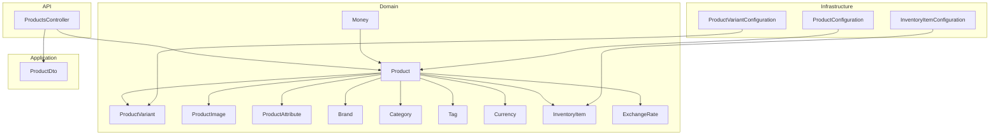
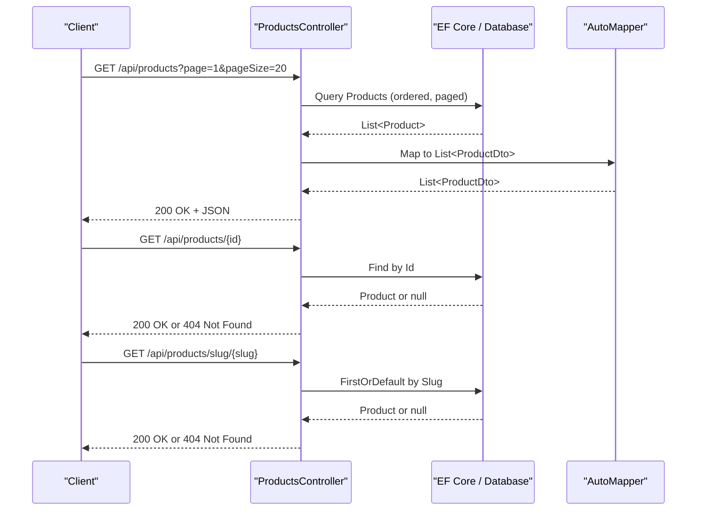
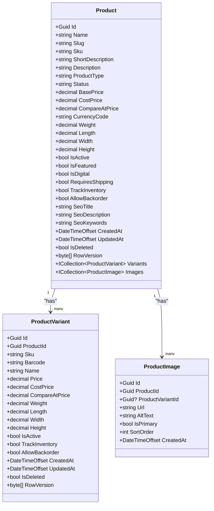
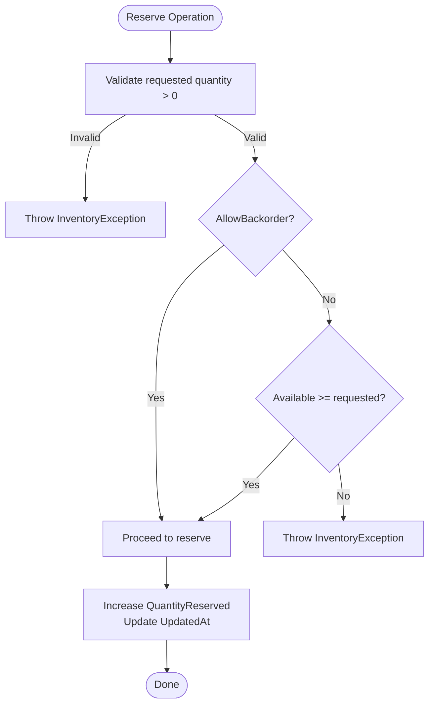
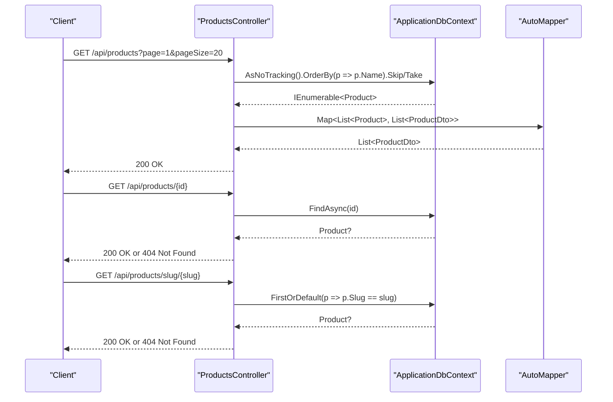
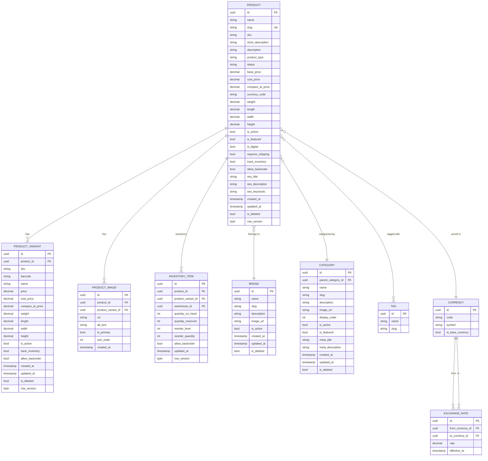
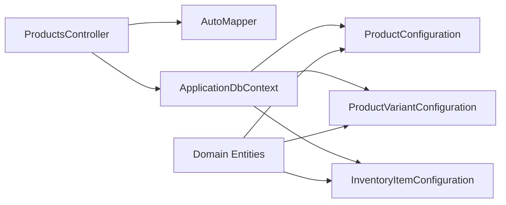

# Product Management

<cite>
**Referenced Files in This Document**
- [Product.cs](file://src/Ecommerce.Domain/Entities/Product.cs)
- [ProductVariant.cs](file://src/Ecommerce.Domain/Entities/ProductVariant.cs)
- [ProductImage.cs](file://src/Ecommerce.Domain/Entities/ProductImage.cs)
- [ProductAttribute.cs](file://src/Ecommerce.Domain/Entities/ProductAttribute.cs)
- [Brand.cs](file://src/Ecommerce.Domain/Entities/Brand.cs)
- [Category.cs](file://src/Ecommerce.Domain/Entities/Category.cs)
- [Tag.cs](file://src/Ecommerce.Domain/Entities/Tag.cs)
- [Currency.cs](file://src/Ecommerce.Domain/Entities/Currency.cs)
- [InventoryItem.cs](file://src/Ecommerce.Domain/Entities/InventoryItem.cs)
- [ExchangeRate.cs](file://src/Ecommerce.Domain/Entities/ExchangeRate.cs)
- [Money.cs](file://src/Ecommerce.Domain/ValueObjects/Money.cs)
- [ProductsController.cs](file://src/Ecommerce.Api/Controllers/ProductsController.cs)
- [ProductConfiguration.cs](file://src/Ecommerce.Infrastructure/Persistence/Configurations/ProductConfiguration.cs)
- [ProductVariantConfiguration.cs](file://src/Ecommerce.Infrastructure/Persistence/Configurations/ProductVariantConfiguration.cs)
- [InventoryItemConfiguration.cs](file://src/Ecommerce.Infrastructure/Persistence/Configurations/InventoryItemConfiguration.cs)
- [ProductDto.cs](file://src/Ecommerce.Application/DTOs/ProductDto.cs)
</cite>

## Table of Contents
1. Introduction
2. Project Structure
3. Core Components
4. Architecture Overview
5. Detailed Component Analysis
6. Dependency Analysis
7. Performance Considerations
8. Troubleshooting Guide
9. Conclusion
10. Appendices

## Introduction
This document explains the product management feature, covering the Product entity and its relationships to variants, images, pricing, attributes, catalog organization (brands, categories, tags), lifecycle states, inventory tracking, multi-currency pricing, search and filtering, SEO metadata, validation rules, business constraints, and data relationships. It also outlines API endpoints for listing and retrieving products and highlights configuration details that enforce data integrity.

## Project Structure
The product management feature spans Domain entities, Application DTOs, API controllers, and Infrastructure configurations:
- Domain: Product, ProductVariant, ProductImage, ProductAttribute, Brand, Category, Tag, Currency, InventoryItem, ExchangeRate, Money
- Application: ProductDto used by the API layer
- API: ProductsController exposes read operations for products
- Infrastructure: EF Core configurations for Product, ProductVariant, and InventoryItem

**Diagram sources**
- [Product.cs:6-42](file://src/Ecommerce.Domain/Entities/Product.cs#L6-L42)
- [ProductVariant.cs:5-26](file://src/Ecommerce.Domain/Entities/ProductVariant.cs#L5-L26)
- [ProductImage.cs:5-15](file://src/Ecommerce.Domain/Entities/ProductImage.cs#L5-L15)
- [ProductAttribute.cs:5-16](file://src/Ecommerce.Domain/Entities/ProductAttribute.cs#L5-L16)
- [Brand.cs:5-16](file://src/Ecommerce.Domain/Entities/Brand.cs#L5-L16)
- [Category.cs:6-24](file://src/Ecommerce.Domain/Entities/Category.cs#L6-L24)
- [Tag.cs:5-10](file://src/Ecommerce.Domain/Entities/Tag.cs#L5-L10)
- [Currency.cs:5-11](file://src/Ecommerce.Domain/Entities/Currency.cs#L5-L11)
- [InventoryItem.cs:6-18](file://src/Ecommerce.Domain/Entities/InventoryItem.cs#L6-L18)
- [ExchangeRate.cs:5-12](file://src/Ecommerce.Domain/Entities/ExchangeRate.cs#L5-L12)
- [Money.cs:5-17](file://src/Ecommerce.Domain/ValueObjects/Money.cs#L5-L17)
- [ProductsController.cs:13-59](file://src/Ecommerce.Api/Controllers/ProductsController.cs#L13-L59)
- [ProductConfiguration.cs:7-21](file://src/Ecommerce.Infrastructure/Persistence/Configurations/ProductConfiguration.cs#L7-L21)
- [ProductVariantConfiguration.cs:7-26](file://src/Ecommerce.Infrastructure/Persistence/Configurations/ProductVariantConfiguration.cs#L7-L26)
- [InventoryItemConfiguration.cs:7-34](file://src/Ecommerce.Infrastructure/Persistence/Configurations/InventoryItemConfiguration.cs#L7-L34)

**Section sources**
- [ProductsController.cs:13-59](file://src/Ecommerce.Api/Controllers/ProductsController.cs#L13-L59)
- [ProductConfiguration.cs:7-21](file://src/Ecommerce.Infrastructure/Persistence/Configurations/ProductConfiguration.cs#L7-L21)
- [ProductVariantConfiguration.cs:7-26](file://src/Ecommerce.Infrastructure/Persistence/Configurations/ProductVariantConfiguration.cs#L7-L26)
- [InventoryItemConfiguration.cs:7-34](file://src/Ecommerce.Infrastructure/Persistence/Configurations/InventoryItemConfiguration.cs#L7-L34)

## Core Components
- Product: Central entity with identifiers, descriptive fields, pricing, dimensions, flags for lifecycle and fulfillment, SEO metadata, timestamps, soft-delete, concurrency token, and collections for variants and images.
- ProductVariant: Per-SKU variation with its own pricing, dimensions, and inventory-related flags.
- ProductImage: Ordered images with optional variant association and primary image flag.
- ProductAttribute: Reusable attribute definitions (name, code, display type, filterability, variant usage).
- Catalog Organization: Brand, Category (with hierarchy via ParentCategoryId), Tag.
- Pricing and Multi-Currency: BasePrice/CostPrice/CompareAtPrice on Product; Currency entity; ExchangeRate for conversions; Money value object for typed amounts.
- Inventory: InventoryItem tracks stock levels per product/variant/warehouse, supports reservations, backorders, reorder thresholds, and optimistic concurrency.

Key responsibilities:
- Product defines the canonical product record and links to variants and images.
- Variants capture SKU-level specifics and override pricing/dimensions where needed.
- Images provide media assets with ordering and primary selection.
- Attributes define reusable characteristics that can drive filters or variant generation.
- InventoryItem enforces stock availability and reservation semantics.

**Section sources**
- [Product.cs:6-42](file://src/Ecommerce.Domain/Entities/Product.cs#L6-L42)
- [ProductVariant.cs:5-26](file://src/Ecommerce.Domain/Entities/ProductVariant.cs#L5-L26)
- [ProductImage.cs:5-15](file://src/Ecommerce.Domain/Entities/ProductImage.cs#L5-L15)
- [ProductAttribute.cs:5-16](file://src/Ecommerce.Domain/Entities/ProductAttribute.cs#L5-L16)
- [Brand.cs:5-16](file://src/Ecommerce.Domain/Entities/Brand.cs#L5-L16)
- [Category.cs:6-24](file://src/Ecommerce.Domain/Entities/Category.cs#L6-L24)
- [Tag.cs:5-10](file://src/Ecommerce.Domain/Entities/Tag.cs#L5-L10)
- [Currency.cs:5-11](file://src/Ecommerce.Domain/Entities/Currency.cs#L5-L11)
- [InventoryItem.cs:6-68](file://src/Ecommerce.Domain/Entities/InventoryItem.cs#L6-L68)
- [ExchangeRate.cs:5-12](file://src/Ecommerce.Domain/Entities/ExchangeRate.cs#L5-L12)
- [Money.cs:5-17](file://src/Ecommerce.Domain/ValueObjects/Money.cs#L5-L17)

## Architecture Overview
The API layer reads products using EF Core against configured entities. The controller returns mapped DTOs. Domain entities encapsulate business rules (e.g., inventory operations), while infrastructure configurations enforce schema constraints and concurrency tokens.

**Diagram sources**
- [ProductsController.cs:26-58](file://src/Ecommerce.Api/Controllers/ProductsController.cs#L26-L58)

**Section sources**
- [ProductsController.cs:26-58](file://src/Ecommerce.Api/Controllers/ProductsController.cs#L26-L58)

## Detailed Component Analysis

### Product Entity and Relationships
- Identifiers and metadata: Id, Name, Slug (unique index), Sku, ShortDescription, Description, ProductType.
- Pricing: BasePrice, CostPrice, CompareAtPrice, CurrencyCode.
- Fulfillment and lifecycle: IsActive, IsFeatured, IsDigital, RequiresShipping, TrackInventory, AllowBackorder.
- Dimensions: Weight, Length, Width, Height.
- SEO: SeoTitle, SeoDescription, SeoKeywords.
- Audit and concurrency: CreatedAt, UpdatedAt, IsDeleted, RowVersion.
- Relationships:
  - One-to-many with ProductVariant (Variants collection).
  - One-to-many with ProductImage (Images collection).
  - References to BrandId, TaxCategoryId (not shown here but present in entity).

**Diagram sources**
- [Product.cs:6-42](file://src/Ecommerce.Domain/Entities/Product.cs#L6-L42)
- [ProductVariant.cs:5-26](file://src/Ecommerce.Domain/Entities/ProductVariant.cs#L5-L26)
- [ProductImage.cs:5-15](file://src/Ecommerce.Domain/Entities/ProductImage.cs#L5-L15)

**Section sources**
- [Product.cs:6-42](file://src/Ecommerce.Domain/Entities/Product.cs#L6-L42)
- [ProductVariant.cs:5-26](file://src/Ecommerce.Domain/Entities/ProductVariant.cs#L5-L26)
- [ProductImage.cs:5-15](file://src/Ecommerce.Domain/Entities/ProductImage.cs#L5-L15)

### Catalog Organization: Brands, Categories, Tags
- Brand: Name, Slug, Description, ImageUrl, IsActive, audit fields.
- Category: Hierarchical via ParentCategoryId; includes Name, Slug, Description, ImageUrl, DisplayOrder, IsActive, IsFeatured, MetaTitle, MetaDescription, audit fields; children navigation.
- Tag: Simple name and slug for tagging products.

These enable product categorization, hierarchical browsing, and flexible tagging strategies.

**Section sources**
- [Brand.cs:5-16](file://src/Ecommerce.Domain/Entities/Brand.cs#L5-L16)
- [Category.cs:6-24](file://src/Ecommerce.Domain/Entities/Category.cs#L6-L24)
- [Tag.cs:5-10](file://src/Ecommerce.Domain/Entities/Tag.cs#L5-L10)

### Attributes and Variant Definitions
- ProductAttribute: Defines reusable attributes with Name, Code, DisplayType, IsFilterable, IsVariant, IsRequired, timestamps. These support UI rendering, filtering, and variant generation workflows.

**Section sources**
- [ProductAttribute.cs:5-16](file://src/Ecommerce.Domain/Entities/ProductAttribute.cs#L5-L16)

### Pricing and Multi-Currency
- Product stores BasePrice, CostPrice, CompareAtPrice, and a CurrencyCode to indicate the currency context.
- Currency entity provides standardized codes and symbols, plus base currency flag.
- ExchangeRate maps conversion rates between currencies with effective dates.
- Money value object enforces non-negative amounts and associates an amount with a currency code.

Use cases:
- Store prices in a base currency and convert for display using ExchangeRate.
- Validate and format monetary values consistently via Money.

**Section sources**
- [Product.cs:17-20](file://src/Ecommerce.Domain/Entities/Product.cs#L17-L20)
- [Currency.cs:5-11](file://src/Ecommerce.Domain/Entities/Currency.cs#L5-L11)
- [ExchangeRate.cs:5-12](file://src/Ecommerce.Domain/Entities/ExchangeRate.cs#L5-L12)
- [Money.cs:5-17](file://src/Ecommerce.Domain/ValueObjects/Money.cs#L5-L17)

### Inventory Tracking and Business Rules
InventoryItem models stock per product/variant/warehouse with:
- QuantityOnHand, QuantityReserved, Available (computed), ReorderLevel, ReorderQuantity, AllowBackorder, UpdatedAt, RowVersion.
- Methods:
  - AddStock: increases on-hand quantity; validates positive input.
  - Reserve: reserves available stock; respects backorder policy.
  - Release: releases previously reserved stock.
  - RemoveStock: decrements on-hand; prevents negative stock unless backorder allowed.

**Diagram sources**
- [InventoryItem.cs:29-40](file://src/Ecommerce.Domain/Entities/InventoryItem.cs#L29-L40)

**Section sources**
- [InventoryItem.cs:6-68](file://src/Ecommerce.Domain/Entities/InventoryItem.cs#L6-L68)

### API Surface for Products
- GET /api/products?page=1&pageSize=20: Returns paginated list of products ordered by name; applies safe defaults and clamps page size.
- GET /api/products/{id}: Retrieves a product by ID; returns 404 if not found.
- GET /api/products/slug/{slug}: Retrieves a product by URL-friendly slug; returns 404 if not found.

Responses are mapped to ProductDto.

**Diagram sources**
- [ProductsController.cs:26-58](file://src/Ecommerce.Api/Controllers/ProductsController.cs#L26-L58)

**Section sources**
- [ProductsController.cs:26-58](file://src/Ecommerce.Api/Controllers/ProductsController.cs#L26-L58)
- [ProductDto.cs:5-11](file://src/Ecommerce.Application/DTOs/ProductDto.cs#L5-L11)

### Data Model Diagram

**Diagram sources**
- [Product.cs:6-42](file://src/Ecommerce.Domain/Entities/Product.cs#L6-L42)
- [ProductVariant.cs:5-26](file://src/Ecommerce.Domain/Entities/ProductVariant.cs#L5-L26)
- [ProductImage.cs:5-15](file://src/Ecommerce.Domain/Entities/ProductImage.cs#L5-L15)
- [InventoryItem.cs:6-18](file://src/Ecommerce.Domain/Entities/InventoryItem.cs#L6-L18)
- [Brand.cs:5-16](file://src/Ecommerce.Domain/Entities/Brand.cs#L5-L16)
- [Category.cs:6-24](file://src/Ecommerce.Domain/Entities/Category.cs#L6-L24)
- [Tag.cs:5-10](file://src/Ecommerce.Domain/Entities/Tag.cs#L5-L10)
- [Currency.cs:5-11](file://src/Ecommerce.Domain/Entities/Currency.cs#L5-L11)
- [ExchangeRate.cs:5-12](file://src/Ecommerce.Domain/Entities/ExchangeRate.cs#L5-L12)

## Dependency Analysis
- API depends on EF Core DbContext and AutoMapper to query and map domain entities to DTOs.
- Domain entities are configured via EF Core entity configurations to enforce schema constraints, precision, uniqueness, and concurrency tokens.
- InventoryItem methods encapsulate business rules and throw domain exceptions when constraints are violated.

**Diagram sources**
- [ProductsController.cs:13-59](file://src/Ecommerce.Api/Controllers/ProductsController.cs#L13-L59)
- [ProductConfiguration.cs:7-21](file://src/Ecommerce.Infrastructure/Persistence/Configurations/ProductConfiguration.cs#L7-L21)
- [ProductVariantConfiguration.cs:7-26](file://src/Ecommerce.Infrastructure/Persistence/Configurations/ProductVariantConfiguration.cs#L7-L26)
- [InventoryItemConfiguration.cs:7-34](file://src/Ecommerce.Infrastructure/Persistence/Configurations/InventoryItemConfiguration.cs#L7-L34)

**Section sources**
- [ProductsController.cs:13-59](file://src/Ecommerce.Api/Controllers/ProductsController.cs#L13-L59)
- [ProductConfiguration.cs:7-21](file://src/Ecommerce.Infrastructure/Persistence/Configurations/ProductConfiguration.cs#L7-L21)
- [ProductVariantConfiguration.cs:7-26](file://src/Ecommerce.Infrastructure/Persistence/Configurations/ProductVariantConfiguration.cs#L7-L26)
- [InventoryItemConfiguration.cs:7-34](file://src/Ecommerce.Infrastructure/Persistence/Configurations/InventoryItemConfiguration.cs#L7-L34)

## Performance Considerations
- Use AsNoTracking for read-only queries to reduce change-tracking overhead.
- Enforce reasonable pagination limits; the controller clamps pageSize to prevent excessive payloads.
- Indexes: Slug is unique-indexed to optimize lookups by URL-friendly identifiers.
- Precision: Monetary and dimension properties use fixed precision to avoid rounding issues and ensure consistent storage.

[No sources needed since this section provides general guidance]

## Troubleshooting Guide
Common issues and resolutions:
- Invalid or missing slug: The slug endpoint validates input and returns BadRequest for empty slugs; ensure slugs are generated and stored correctly.
- Not found errors: GetById and GetBySlug return 404 when no matching product exists; verify IDs/slugs exist before requests.
- Inventory exceptions: Operations like Reserve, RemoveStock, AddStock, Release validate inputs and policies; handle InventoryException appropriately in higher layers.
- Concurrency conflicts: RowVersion is used as a concurrency token; concurrent updates may fail and require retry or conflict resolution.

**Section sources**
- [ProductsController.cs:51-58](file://src/Ecommerce.Api/Controllers/ProductsController.cs#L51-L58)
- [InventoryItem.cs:22-67](file://src/Ecommerce.Domain/Entities/InventoryItem.cs#L22-L67)
- [ProductConfiguration.cs:11-20](file://src/Ecommerce.Infrastructure/Persistence/Configurations/ProductConfiguration.cs#L11-L20)
- [ProductVariantConfiguration.cs:11-26](file://src/Ecommerce.Infrastructure/Persistence/Configurations/ProductVariantConfiguration.cs#L11-L26)
- [InventoryItemConfiguration.cs:23-30](file://src/Ecommerce.Infrastructure/Persistence/Configurations/InventoryItemConfiguration.cs#L23-L30)

## Conclusion
The product management feature centers on a robust Product entity with rich relationships to variants, images, attributes, and catalog structures. InventoryItem enforces stock and reservation rules with clear business constraints. The API provides efficient read access with pagination and slug-based retrieval. EF Core configurations ensure data integrity through indexes, precision, and concurrency tokens. Multi-currency support is modeled via Currency and ExchangeRate, complemented by a Money value object for safe monetary handling.

[No sources needed since this section summarizes without analyzing specific files]

## Appendices

### Creating a Product with Variants and Images (Conceptual Steps)
- Create Product with required fields (Name, Slug, BasePrice, CurrencyCode) and optional SEO and fulfillment flags.
- Add one or more ProductVariant entries with distinct SKUs and pricing overrides.
- Attach ProductImage records with SortOrder and optionally link to a specific ProductVariant; mark one as primary.
- Persist changes within a transaction to maintain consistency across related entities.

[No sources needed since this section describes conceptual steps]

### Managing Product Images
- Maintain SortOrder to control presentation sequence.
- Ensure only one primary image per product or variant as needed by application logic.
- Provide meaningful AltText for accessibility and SEO.

[No sources needed since this section describes conceptual steps]

### Handling Multi-Currency Pricing
- Store prices in a base currency and use ExchangeRate to compute displayed amounts for other currencies.
- Validate monetary amounts using Money to prevent negative values and associate correct currency codes.

**Section sources**
- [Currency.cs:5-11](file://src/Ecommerce.Domain/Entities/Currency.cs#L5-L11)
- [ExchangeRate.cs:5-12](file://src/Ecommerce.Domain/Entities/ExchangeRate.cs#L5-L12)
- [Money.cs:5-17](file://src/Ecommerce.Domain/ValueObjects/Money.cs#L5-L17)

### Search and Filtering Capabilities
- Current API supports listing with ordering by name and pagination.
- Additional filtering (by brand, category, tag, status, featured) can be implemented by extending query parameters and applying filters before paging.

**Section sources**
- [ProductsController.cs:26-41](file://src/Ecommerce.Api/Controllers/ProductsController.cs#L26-L41)

### SEO Metadata Management
- Product includes SeoTitle, SeoDescription, SeoKeywords for search engine optimization.
- Category includes MetaTitle and MetaDescription for category pages.

**Section sources**
- [Product.cs:32-34](file://src/Ecommerce.Domain/Entities/Product.cs#L32-L34)
- [Category.cs:17-18](file://src/Ecommerce.Domain/Entities/Category.cs#L17-L18)

### Bulk Operations (Conceptual Guidance)
- For bulk updates or deletions, consider batch commands that operate on sets of product IDs with appropriate validation and auditing.
- Use transactions to ensure atomicity and handle partial failures gracefully.

[No sources needed since this section provides general guidance]