# Product Variants

<cite>
**Referenced Files in This Document**
- [ProductVariant.cs](file://src/Ecommerce.Domain/Entities/ProductVariant.cs)
- [Product.cs](file://src/Ecommerce.Domain/Entities/Product.cs)
- [ProductAttribute.cs](file://src/Ecommerce.Domain/Entities/ProductAttribute.cs)
- [InventoryItem.cs](file://src/Ecommerce.Domain/Entities/InventoryItem.cs)
- [ProductImage.cs](file://src/Ecommerce.Domain/Entities/ProductImage.cs)
- [ProductVariantConfiguration.cs](file://src/Ecommerce.Infrastructure/Persistence/Configurations/ProductVariantConfiguration.cs)
- [ProductConfiguration.cs](file://src/Ecommerce.Infrastructure/Persistence/Configurations/ProductConfiguration.cs)
- [ApplicationDbContext.cs](file://src/Ecommerce.Infrastructure/Persistence/ApplicationDbContext.cs)
- [ProductsController.cs](file://src/Ecommerce.Api/Controllers/ProductsController.cs)
- [ProductDto.cs](file://src/Ecommerce.Application/DTOs/ProductDto.cs)
- [InventoryException.cs](file://src/Ecommerce.Domain/Exceptions/InventoryException.cs)
</cite>

## Table of Contents
1. Introduction
2. Project Structure
3. Core Components
4. Architecture Overview
5. Detailed Component Analysis
6. Dependency Analysis
7. Performance Considerations
8. Troubleshooting Guide
9. Conclusion

## Introduction
This document explains the product variant system that extends base product functionality with variant-specific attributes, pricing, and inventory. It covers how variants relate to products, how attributes define variant configurations, how variant-specific pricing works, and how inventory is tracked per variant. It also provides workflows for creating variants, assigning attribute values, managing availability, handling variant-specific images and descriptions, and performance guidance for large catalogs.

## Project Structure
The variant system spans Domain entities, Infrastructure persistence configuration, and API controllers:
- Domain entities define the core concepts: Product, ProductVariant, ProductAttribute, InventoryItem, and ProductImage.
- Infrastructure configures EF Core mappings and constraints for Product and ProductVariant.
- The API exposes product queries; variant operations are modeled by domain logic and can be extended via commands/handlers.

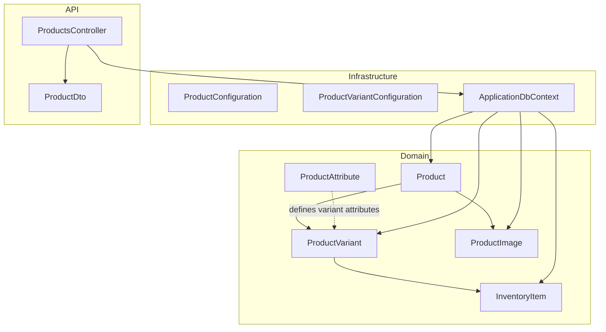

**Diagram sources**
- [Product.cs:6-42](file://src/Ecommerce.Domain/Entities/Product.cs#L6-L42)
- [ProductVariant.cs:5-26](file://src/Ecommerce.Domain/Entities/ProductVariant.cs#L5-L26)
- [ProductAttribute.cs:5-16](file://src/Ecommerce.Domain/Entities/ProductAttribute.cs#L5-L16)
- [InventoryItem.cs:6-18](file://src/Ecommerce.Domain/Entities/InventoryItem.cs#L6-L18)
- [ProductImage.cs:5-15](file://src/Ecommerce.Domain/Entities/ProductImage.cs#L5-L15)
- [ProductConfiguration.cs:7-21](file://src/Ecommerce.Infrastructure/Persistence/Configurations/ProductConfiguration.cs#L7-L21)
- [ProductVariantConfiguration.cs:7-26](file://src/Ecommerce.Infrastructure/Persistence/Configurations/ProductVariantConfiguration.cs#L7-L26)
- [ApplicationDbContext.cs:13-40](file://src/Ecommerce.Infrastructure/Persistence/ApplicationDbContext.cs#L13-L40)
- [ProductsController.cs:15-59](file://src/Ecommerce.Api/Controllers/ProductsController.cs#L15-L59)
- [ProductDto.cs:5-11](file://src/Ecommerce.Application/DTOs/ProductDto.cs#L5-L11)

**Section sources**
- [Product.cs:6-42](file://src/Ecommerce.Domain/Entities/Product.cs#L6-L42)
- [ProductVariant.cs:5-26](file://src/Ecommerce.Domain/Entities/ProductVariant.cs#L5-L26)
- [ProductAttribute.cs:5-16](file://src/Ecommerce.Domain/Entities/ProductAttribute.cs#L5-L16)
- [InventoryItem.cs:6-18](file://src/Ecommerce.Domain/Entities/InventoryItem.cs#L6-L18)
- [ProductImage.cs:5-15](file://src/Ecommerce.Domain/Entities/ProductImage.cs#L5-L15)
- [ProductConfiguration.cs:7-21](file://src/Ecommerce.Infrastructure/Persistence/Configurations/ProductConfiguration.cs#L7-L21)
- [ProductVariantConfiguration.cs:7-26](file://src/Ecommerce.Infrastructure/Persistence/Configurations/ProductVariantConfiguration.cs#L7-L26)
- [ApplicationDbContext.cs:13-40](file://src/Ecommerce.Infrastructure/Persistence/ApplicationDbContext.cs#L13-L40)
- [ProductsController.cs:15-59](file://src/Ecommerce.Api/Controllers/ProductsController.cs#L15-L59)
- [ProductDto.cs:5-11](file://src/Ecommerce.Application/DTOs/ProductDto.cs#L5-L11)

## Core Components
- Product: Base entity with shared metadata, pricing, dimensions, and flags such as TrackInventory and AllowBackorder. It owns a collection of ProductVariant and ProductImage.
- ProductVariant: Extends product with SKU, barcode, name, variant-level pricing (Price, CostPrice, CompareAtPrice), dimensions, and variant-level inventory controls (IsActive, TrackInventory, AllowBackorder).
- ProductAttribute: Defines reusable attribute definitions (name, code, display type, filterability, whether it drives variants, requiredness).
- InventoryItem: Tracks stock per product and variant across warehouses, including on-hand, reserved quantities, reorder thresholds, and backorder policy. Provides methods to add stock, reserve, release, and remove stock with validation.
- ProductImage: Supports both product-level and variant-level images with ordering and primary selection.

Key relationships:
- One Product has many ProductVariants and many ProductImages.
- Each InventoryItem links to a Product and a specific ProductVariant and Warehouse.
- ProductAttribute defines the schema for variant attributes; actual attribute values are typically stored alongside variants (not shown here).

**Section sources**
- [Product.cs:6-42](file://src/Ecommerce.Domain/Entities/Product.cs#L6-L42)
- [ProductVariant.cs:5-26](file://src/Ecommerce.Domain/Entities/ProductVariant.cs#L5-L26)
- [ProductAttribute.cs:5-16](file://src/Ecommerce.Domain/Entities/ProductAttribute.cs#L5-L16)
- [InventoryItem.cs:6-68](file://src/Ecommerce.Domain/Entities/InventoryItem.cs#L6-L68)
- [ProductImage.cs:5-15](file://src/Ecommerce.Domain/Entities/ProductImage.cs#L5-L15)

## Architecture Overview
The variant system follows a layered architecture:
- Domain layer encapsulates business rules for variants, inventory, and images.
- Infrastructure layer configures EF Core mappings and exposes DbSets through ApplicationDbContext.
- API layer reads products and can be extended to create/update variants and manage inventory.

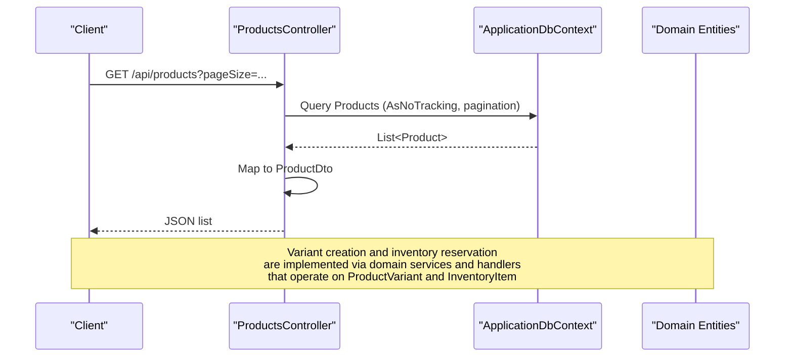

**Diagram sources**
- [ProductsController.cs:26-41](file://src/Ecommerce.Api/Controllers/ProductsController.cs#L26-L41)
- [ApplicationDbContext.cs:19-27](file://src/Ecommerce.Infrastructure/Persistence/ApplicationDbContext.cs#L19-L27)
- [Product.cs:6-42](file://src/Ecommerce.Domain/Entities/Product.cs#L6-L42)
- [ProductVariant.cs:5-26](file://src/Ecommerce.Domain/Entities/ProductVariant.cs#L5-L26)
- [InventoryItem.cs:6-68](file://src/Ecommerce.Domain/Entities/InventoryItem.cs#L6-L68)

## Detailed Component Analysis

### Product and ProductVariant Relationship
- Product owns a collection of ProductVariant, enabling one-to-many relationships.
- ProductVariant references its parent Product via ProductId and includes variant-specific identifiers (Sku, Barcode) and descriptive fields (Name).
- EF Core maps these entities and enforces precision for monetary and dimension fields.

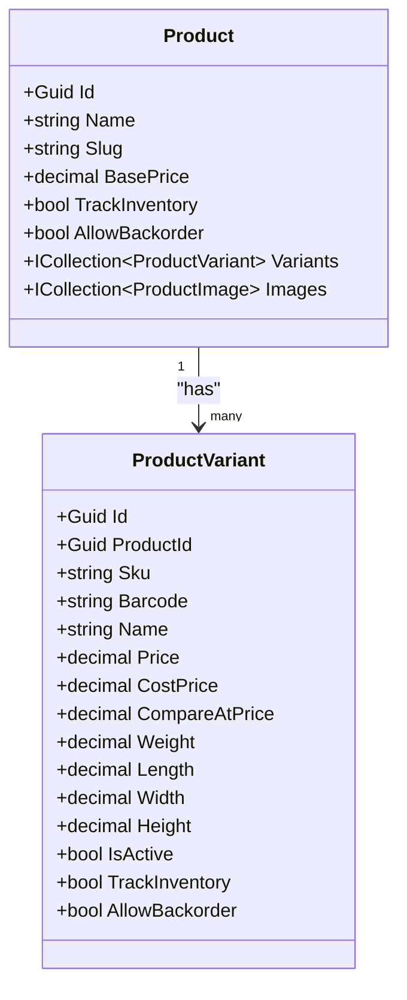

**Diagram sources**
- [Product.cs:6-42](file://src/Ecommerce.Domain/Entities/Product.cs#L6-L42)
- [ProductVariant.cs:5-26](file://src/Ecommerce.Domain/Entities/ProductVariant.cs#L5-L26)
- [ProductConfiguration.cs:7-21](file://src/Ecommerce.Infrastructure/Persistence/Configurations/ProductConfiguration.cs#L7-L21)
- [ProductVariantConfiguration.cs:7-26](file://src/Ecommerce.Infrastructure/Persistence/Configurations/ProductVariantConfiguration.cs#L7-L26)

**Section sources**
- [Product.cs:6-42](file://src/Ecommerce.Domain/Entities/Product.cs#L6-L42)
- [ProductVariant.cs:5-26](file://src/Ecommerce.Domain/Entities/ProductVariant.cs#L5-L26)
- [ProductConfiguration.cs:7-21](file://src/Ecommerce.Infrastructure/Persistence/Configurations/ProductConfiguration.cs#L7-L21)
- [ProductVariantConfiguration.cs:7-26](file://src/Ecommerce.Infrastructure/Persistence/Configurations/ProductVariantConfiguration.cs#L7-L26)

### Attribute Management for Variants
- ProductAttribute defines the structure of attributes used to build variants (e.g., Size, Color).
- Flags indicate whether an attribute drives variant generation (IsVariant), is filterable, and whether it is required.
- Typical workflow: define attributes, then generate combinations to create ProductVariant entries.

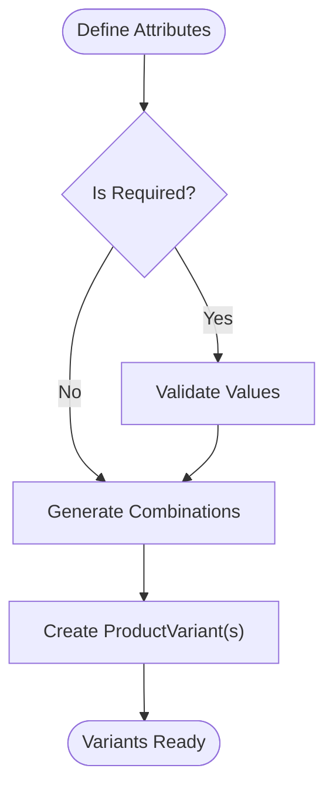

**Section sources**
- [ProductAttribute.cs:5-16](file://src/Ecommerce.Domain/Entities/ProductAttribute.cs#L5-L16)

### Variant-Specific Pricing Strategy
- ProductVariant carries Price, CostPrice, and CompareAtPrice, allowing per-variant pricing independent of the base Product.BasePrice.
- EF Core ensures decimal precision for accurate financial calculations.
- Business rule: choose variant price when selling or calculating margins; use CompareAtPrice for promotions or discounts.

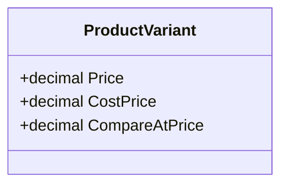

**Diagram sources**
- [ProductVariant.cs:12-14](file://src/Ecommerce.Domain/Entities/ProductVariant.cs#L12-L14)
- [ProductVariantConfiguration.cs:16-18](file://src/Ecommerce.Infrastructure/Persistence/Configurations/ProductVariantConfiguration.cs#L16-L18)

**Section sources**
- [ProductVariant.cs:12-14](file://src/Ecommerce.Domain/Entities/ProductVariant.cs#L12-L14)
- [ProductVariantConfiguration.cs:16-18](file://src/Ecommerce.Infrastructure/Persistence/Configurations/ProductVariantConfiguration.cs#L16-L18)

### Inventory Tracking Per Variant
- InventoryItem ties stock to a specific ProductVariant and Warehouse, tracking QuantityOnHand and QuantityReserved.
- Available quantity is computed as OnHand minus Reserved.
- Methods enforce business rules:
  - AddStock increases OnHand.
  - Reserve increments Reserved if sufficient available stock or backorders allowed.
  - Release decreases Reserved.
  - RemoveStock decreases OnHand with safeguards against negative stock.

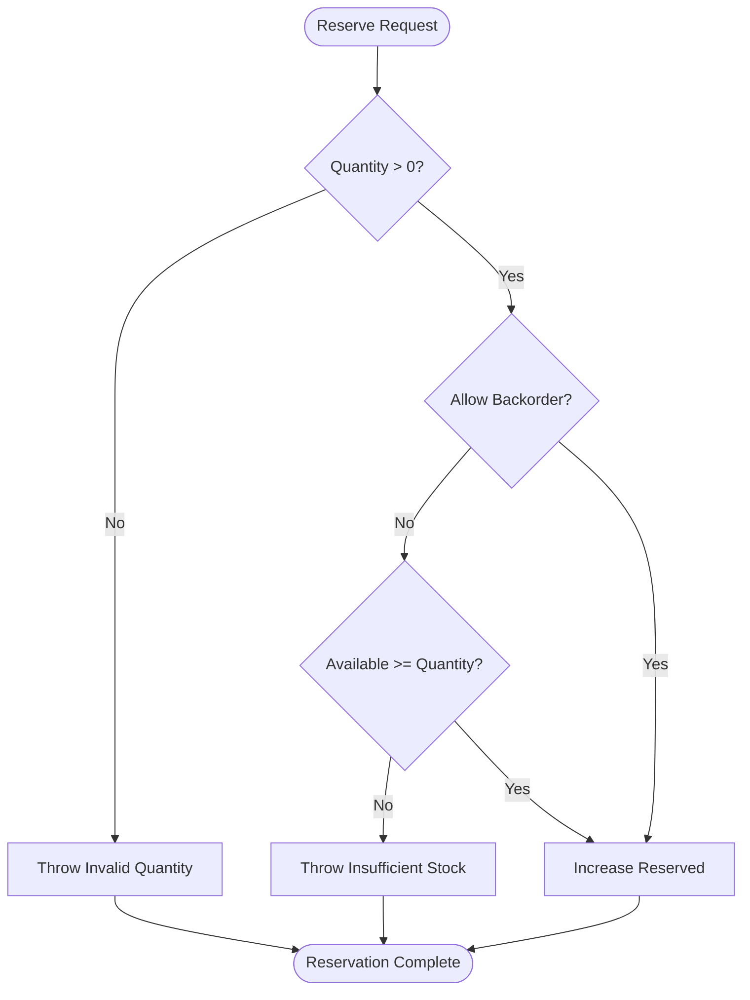

**Diagram sources**
- [InventoryItem.cs:29-40](file://src/Ecommerce.Domain/Entities/InventoryItem.cs#L29-L40)
- [InventoryException.cs:5-7](file://src/Ecommerce.Domain/Exceptions/InventoryException.cs#L5-L7)

**Section sources**
- [InventoryItem.cs:6-68](file://src/Ecommerce.Domain/Entities/InventoryItem.cs#L6-L68)
- [InventoryException.cs:5-7](file://src/Ecommerce.Domain/Exceptions/InventoryException.cs#L5-L7)

### Variant Availability and Lifecycle
- ProductVariant.IsActive indicates sellability.
- InventoryItem.AllowBackorder and ProductVariant.TrackInventory influence availability logic:
  - If TrackInventory is false, availability may be considered unlimited or not enforced.
  - If AllowBackorder is true, reservations can proceed even without stock.

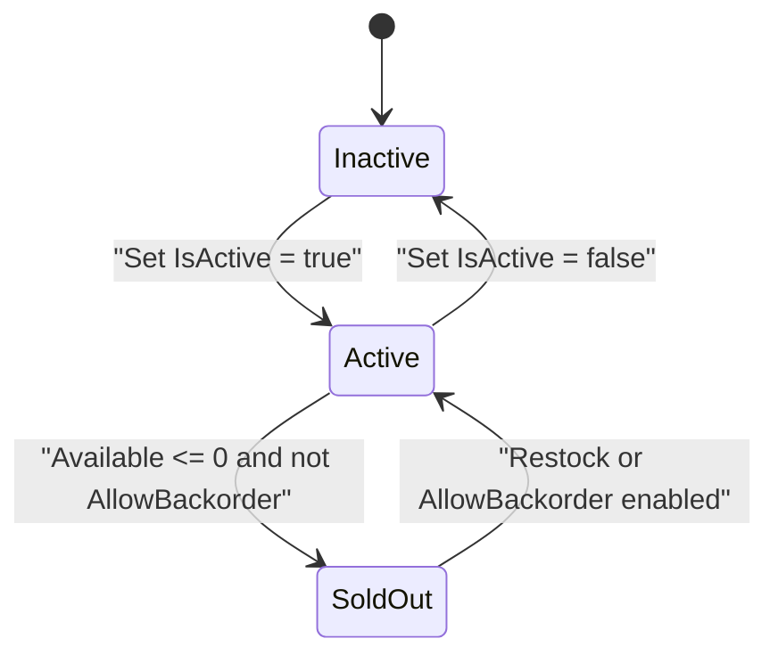

**Section sources**
- [ProductVariant.cs:19-21](file://src/Ecommerce.Domain/Entities/ProductVariant.cs#L19-L21)
- [InventoryItem.cs:16-20](file://src/Ecommerce.Domain/Entities/InventoryItem.cs#L16-L20)

### Variant-Specific Images and Descriptions
- ProductImage supports both product-level and variant-level images via optional ProductVariantId.
- Use IsPrimary and SortOrder to control presentation.
- Descriptions can be set at Product level and overridden at ProductVariant.Name for variant-specific titles.

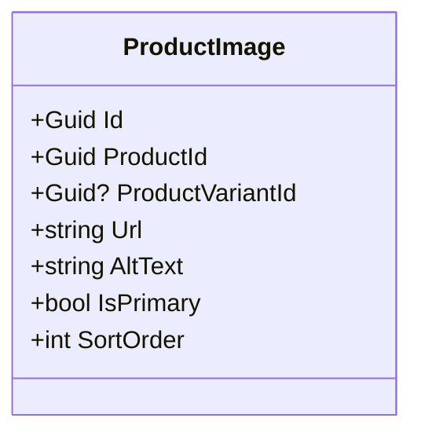

**Diagram sources**
- [ProductImage.cs:5-15](file://src/Ecommerce.Domain/Entities/ProductImage.cs#L5-L15)

**Section sources**
- [ProductImage.cs:5-15](file://src/Ecommerce.Domain/Entities/ProductImage.cs#L5-L15)

### Creating Complex Product Configurations
- Define multiple ProductAttribute entries (e.g., Size, Color, Material) with IsVariant=true.
- Generate all valid combinations to create corresponding ProductVariant records.
- For each variant:
  - Set unique Sku and optional Barcode.
  - Assign variant-specific Price, CostPrice, CompareAtPrice.
  - Configure TrackInventory and AllowBackorder per variant.
  - Attach variant-specific ProductImage entries.

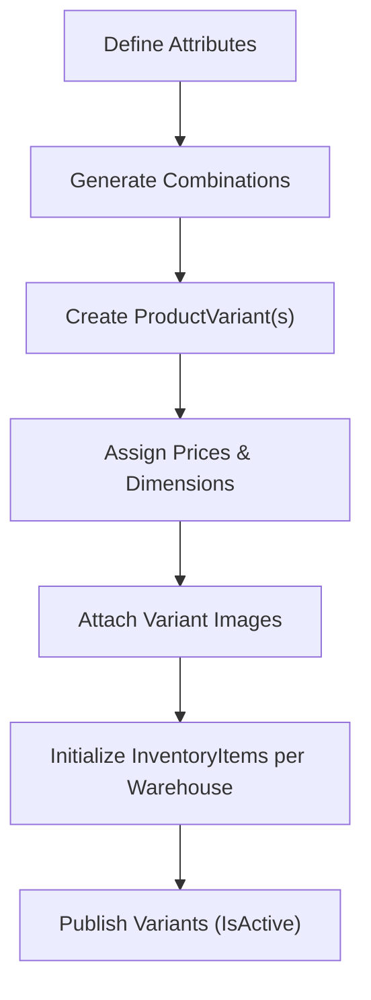

[No sources needed since this diagram shows conceptual workflow, not actual code structure]

### Managing Variant Availability
- Update InventoryItem.QuantityOnHand via AddStock or RemoveStock.
- During checkout, call Reserve to increment QuantityReserved; validate against Available unless AllowBackorder is enabled.
- On cancellation or failure, call Release to decrement QuantityReserved.

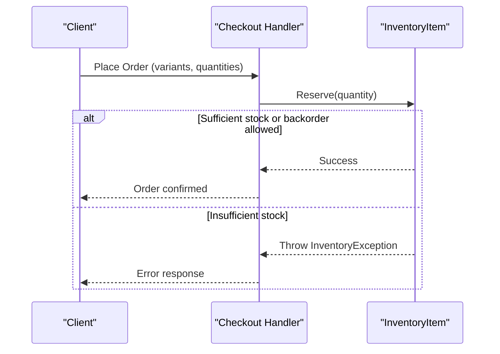

**Diagram sources**
- [InventoryItem.cs:29-40](file://src/Ecommerce.Domain/Entities/InventoryItem.cs#L29-L40)
- [InventoryException.cs:5-7](file://src/Ecommerce.Domain/Exceptions/InventoryException.cs#L5-L7)

**Section sources**
- [InventoryItem.cs:29-40](file://src/Ecommerce.Domain/Entities/InventoryItem.cs#L29-L40)
- [InventoryException.cs:5-7](file://src/Ecommerce.Domain/Exceptions/InventoryException.cs#L5-L7)

## Dependency Analysis
- Product depends on ProductVariant and ProductImage collections.
- ProductVariant depends on Product (via ProductId).
- InventoryItem depends on Product and ProductVariant for granular stock control.
- EF Core configurations enforce constraints and types for Product and ProductVariant.
- API controller uses DbContext to query Products and maps results to DTOs.

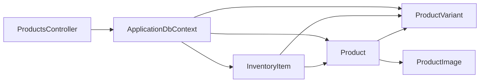

**Diagram sources**
- [Product.cs:6-42](file://src/Ecommerce.Domain/Entities/Product.cs#L6-L42)
- [ProductVariant.cs:5-26](file://src/Ecommerce.Domain/Entities/ProductVariant.cs#L5-L26)
- [InventoryItem.cs:6-18](file://src/Ecommerce.Domain/Entities/InventoryItem.cs#L6-L18)
- [ApplicationDbContext.cs:19-27](file://src/Ecommerce.Infrastructure/Persistence/ApplicationDbContext.cs#L19-L27)
- [ProductsController.cs:26-41](file://src/Ecommerce.Api/Controllers/ProductsController.cs#L26-L41)

**Section sources**
- [Product.cs:6-42](file://src/Ecommerce.Domain/Entities/Product.cs#L6-L42)
- [ProductVariant.cs:5-26](file://src/Ecommerce.Domain/Entities/ProductVariant.cs#L5-L26)
- [InventoryItem.cs:6-18](file://src/Ecommerce.Domain/Entities/InventoryItem.cs#L6-L18)
- [ApplicationDbContext.cs:19-27](file://src/Ecommerce.Infrastructure/Persistence/ApplicationDbContext.cs#L19-L27)
- [ProductsController.cs:26-41](file://src/Ecommerce.Api/Controllers/ProductsController.cs#L26-L41)

## Performance Considerations
- Use AsNoTracking for read-only queries to avoid change-tracking overhead.
- Apply pagination and reasonable page sizes to limit payload size.
- Ensure indexes exist for frequently queried fields (e.g., Product.Slug is unique and indexed).
- For large variant catalogs:
  - Avoid eager-loading entire variant graphs unless necessary.
  - Project only required fields into DTOs.
  - Consider caching strategies for product listings and variant options.
  - Batch inventory updates and minimize round-trips.

**Section sources**
- [ProductsController.cs:26-41](file://src/Ecommerce.Api/Controllers/ProductsController.cs#L26-L41)
- [ProductConfiguration.cs:11-14](file://src/Ecommerce.Infrastructure/Persistence/Configurations/ProductConfiguration.cs#L11-L14)

## Troubleshooting Guide
Common issues and resolutions:
- Reservation failures due to insufficient stock:
  - Verify InventoryItem.Available and AllowBackorder settings.
  - Ensure correct warehouse context and variant linkage.
- Negative stock or invalid quantities:
  - Validate input quantities before calling AddStock/RemoveStock/Reserve/Release.
  - Handle InventoryException appropriately in application layers.
- Concurrency conflicts:
  - Use RowVersion-based optimistic concurrency checks where applicable.

**Section sources**
- [InventoryItem.cs:22-67](file://src/Ecommerce.Domain/Entities/InventoryItem.cs#L22-L67)
- [InventoryException.cs:5-7](file://src/Ecommerce.Domain/Exceptions/InventoryException.cs#L5-L7)

## Conclusion
The product variant system cleanly separates base product data from variant-specific details, enabling flexible pricing, rich attribute-driven configurations, and precise inventory control per variant and warehouse. With proper attribute design, careful pricing strategy, and robust inventory operations, the system supports complex product catalogs while maintaining performance and data integrity.