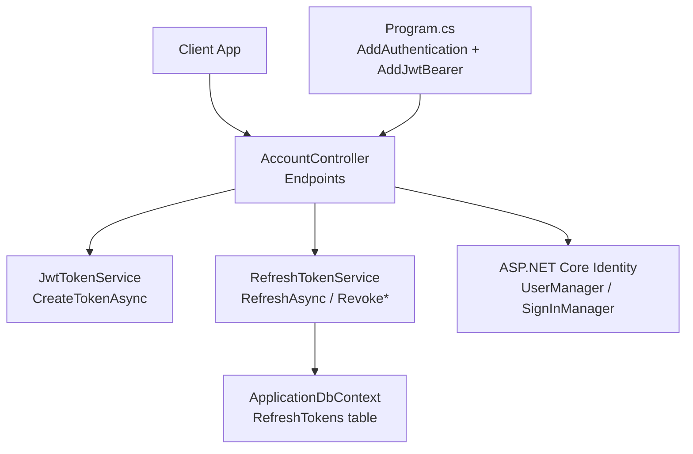
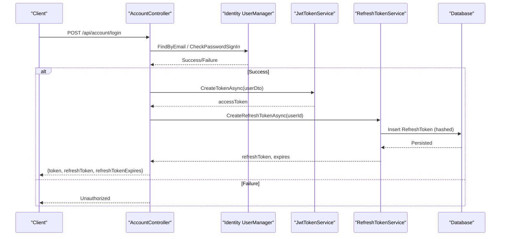
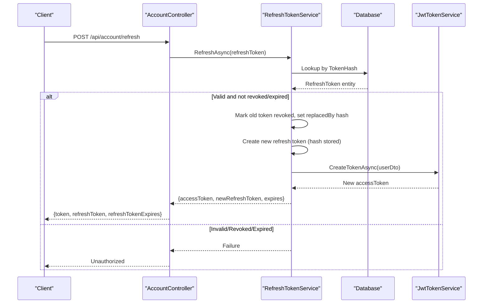
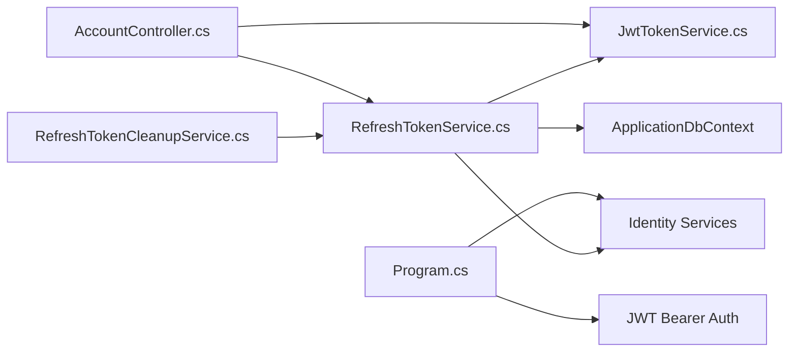

# JWT Authentication

<cite>
**Referenced Files in This Document**
- [Program.cs](file://src/Ecommerce.Api/Program.cs)
- [AccountController.cs](file://src/Ecommerce.Api/Controllers/AccountController.cs)
- [JwtTokenService.cs](file://src/Ecommerce.Infrastructure/Auth/JwtTokenService.cs)
- [ITokenService.cs](file://src/Ecommerce.Application/Interfaces/ITokenService.cs)
- [IRefreshTokenService.cs](file://src/Ecommerce.Application/Interfaces/IRefreshTokenService.cs)
- [RefreshTokenService.cs](file://src/Ecommerce.Infrastructure/Services/RefreshTokenService.cs)
- [RefreshToken.cs](file://src/Ecommerce.Domain/Entities/RefreshToken.cs)
- [DependencyInjection.cs](file://src/Ecommerce.Infrastructure/DependencyInjection.cs)
- [ApplicationUserDto.cs](file://src/Ecommerce.Application/DTOs/ApplicationUserDto.cs)
- [RefreshTokenCleanupService.cs](file://src/Ecommerce.Infrastructure/Services/RefreshTokenCleanupService.cs)
</cite>

## Table of Contents
1. [Introduction](#introduction)
2. [Project Structure](#project-structure)
3. [Core Components](#core-components)
4. [Architecture Overview](#architecture-overview)
5. [Detailed Component Analysis](#detailed-component-analysis)
6. [Dependency Analysis](#dependency-analysis)
7. [Performance Considerations](#performance-considerations)
8. [Troubleshooting Guide](#troubleshooting-guide)
9. [Conclusion](#conclusion)
10. [Appendices](#appendices)

## Introduction
This document explains the JWT authentication implementation in the project, covering token generation and validation, security measures, token structure and claims, expiration handling, signing mechanisms, integration with ASP.NET Core Identity, middleware configuration, refresh strategies, best practices, and common scenarios. It is designed for both technical and non-technical readers to understand how authentication works end-to-end.

## Project Structure
The JWT authentication spans multiple layers:
- API layer exposes endpoints for login, register, refresh, revoke, and user info retrieval.
- Application layer defines interfaces for token services and refresh token operations.
- Infrastructure layer implements JWT token creation, refresh token persistence, and background cleanup.
- Domain layer models refresh tokens and their lifecycle properties.
- Program configuration sets up ASP.NET Core Identity and JWT Bearer authentication.

**Diagram sources**
- [Program.cs:20-51](file://src/Ecommerce.Api/Program.cs#L20-L51)
- [AccountController.cs:34-107](file://src/Ecommerce.Api/Controllers/AccountController.cs#L34-L107)
- [JwtTokenService.cs:22-44](file://src/Ecommerce.Infrastructure/Auth/JwtTokenService.cs#L22-L44)
- [RefreshTokenService.cs:28-109](file://src/Ecommerce.Infrastructure/Services/RefreshTokenService.cs#L28-L109)

**Section sources**
- [Program.cs:1-77](file://src/Ecommerce.Api/Program.cs#L1-L77)
- [AccountController.cs:1-134](file://src/Ecommerce.Api/Controllers/AccountController.cs#L1-L134)

## Core Components
- JwtTokenService: Creates signed JWT access tokens using a symmetric key and configured issuer/audience.
- ITokenService: Interface abstracting token creation for testability and decoupling.
- RefreshTokenService: Manages refresh tokens (create, validate, revoke, rotate), stores hashed tokens, and issues new access tokens on successful refresh.
- RefreshToken entity: Represents stored refresh tokens with expiration and revocation state.
- AccountController: Orchestrates login/register/refresh/revoke flows and integrates Identity and token services.
- Program: Configures ASP.NET Core Identity and JWT Bearer authentication with token validation parameters.

Key responsibilities:
- Access tokens are short-lived and signed; they carry minimal claims.
- Refresh tokens are long-lived, securely stored as hashes, rotated on use, and can be revoked per token or per user.
- Background cleanup removes expired refresh tokens periodically.

**Section sources**
- [JwtTokenService.cs:13-45](file://src/Ecommerce.Infrastructure/Auth/JwtTokenService.cs#L13-L45)
- [ITokenService.cs:6-9](file://src/Ecommerce.Application/Interfaces/ITokenService.cs#L6-L9)
- [RefreshTokenService.cs:15-123](file://src/Ecommerce.Infrastructure/Services/RefreshTokenService.cs#L15-L123)
- [RefreshToken.cs:5-17](file://src/Ecommerce.Domain/Entities/RefreshToken.cs#L5-L17)
- [AccountController.cs:17-114](file://src/Ecommerce.Api/Controllers/AccountController.cs#L17-L114)
- [Program.cs:20-51](file://src/Ecommerce.Api/Program.cs#L20-L51)

## Architecture Overview
The system uses a hybrid approach:
- Access tokens: Stateless JWTs validated by ASP.NET Core JWT Bearer middleware.
- Refresh tokens: Stateful, server-side stored tokens used to obtain new access tokens without re-authentication.

**Diagram sources**
- [AccountController.cs:44-54](file://src/Ecommerce.Api/Controllers/AccountController.cs#L44-L54)
- [JwtTokenService.cs:22-44](file://src/Ecommerce.Infrastructure/Auth/JwtTokenService.cs#L22-L44)
- [RefreshTokenService.cs:28-47](file://src/Ecommerce.Infrastructure/Services/RefreshTokenService.cs#L28-L47)

**Diagram sources**
- [AccountController.cs:56-65](file://src/Ecommerce.Api/Controllers/AccountController.cs#L56-L65)
- [RefreshTokenService.cs:50-79](file://src/Ecommerce.Infrastructure/Services/RefreshTokenService.cs#L50-L79)
- [JwtTokenService.cs:22-44](file://src/Ecommerce.Infrastructure/Auth/JwtTokenService.cs#L22-L44)

## Detailed Component Analysis

### JWT Token Service
- Generates a JWT with:
  - Claims: subject (user id), email, unique token id (jti).
  - Issuer/Audience: read from configuration with safe defaults.
  - Expiration: 2 hours from UTC now.
  - Signing: HMAC-SHA256 with a symmetric key from configuration.
- Returns a serialized token string.

Security notes:
- The signing key should be strong and secret in production.
- The issuer/audience must match between token creation and validation.

**Section sources**
- [JwtTokenService.cs:22-44](file://src/Ecommerce.Infrastructure/Auth/JwtTokenService.cs#L22-L44)

### Refresh Token Service
- Create:
  - Generates a cryptographically random token, hashes it, stores with UserId, CreatedAt, ExpiresAt.
  - Returns plaintext token to client along with expiration.
- Refresh:
  - Hashes incoming token, looks up in database.
  - Rejects if missing, revoked, or expired.
  - Marks old token revoked, creates a new refresh token, and returns a new access token.
- Revoke:
  - Single token revocation by hash lookup.
- Revoke All:
  - Revokes all active tokens for a user.
- Cleanup:
  - Removes expired tokens in batches.

Security notes:
- Tokens are never stored in plaintext; only hashes are persisted.
- Rotation prevents reuse of refresh tokens.
- Revoking all sessions mitigates theft risk when reuse is detected.

**Section sources**
- [RefreshTokenService.cs:28-123](file://src/Ecommerce.Infrastructure/Services/RefreshTokenService.cs#L28-L123)
- [RefreshToken.cs:5-17](file://src/Ecommerce.Domain/Entities/RefreshToken.cs#L5-L17)

### Account Controller Endpoints
- Register:
  - Creates user via Identity, then issues access and refresh tokens.
- Login:
  - Validates credentials via Identity, then issues tokens.
- Refresh:
  - Accepts refresh token, validates via service, returns new access and refresh tokens.
- Revoke:
  - Revokes a specific refresh token (requires authorization).
- Revoke All:
  - Revokes all refresh tokens for current user (requires authorization).
- Me:
  - Returns current user profile based on JWT subject claim.

Error handling highlights:
- Unauthorized for invalid credentials or failed refresh.
- NotFound for invalid revoke requests.
- BadRequest for malformed inputs.

**Section sources**
- [AccountController.cs:34-114](file://src/Ecommerce.Api/Controllers/AccountController.cs#L34-L114)

### ASP.NET Core Identity and JWT Middleware Configuration
- Identity:
  - Configured with EF Core stores and default token providers.
- JWT Bearer:
  - Default schemes set to JwtBearer.
  - TokenValidationParameters:
    - ValidateIssuer, ValidateAudience, ValidateLifetime, ValidateIssuerSigningKey enabled.
    - ValidIssuer and ValidAudience set from configuration.
    - IssuerSigningKey matches the symmetric key used by JwtTokenService.
- Middleware pipeline:
  - UseRouting, UseAuthentication, UseAuthorization before MapControllers.

Security notes:
- RequireHttpsMetadata is disabled for development; enable HTTPS in production.
- Ensure configuration values are injected securely in production environments.

**Section sources**
- [Program.cs:20-51](file://src/Ecommerce.Api/Program.cs#L20-L51)
- [Program.cs:70-74](file://src/Ecommerce.Api/Program.cs#L70-L74)

### Dependency Injection Registration
- Registers DbContext, command pipeline behaviors, validators, handlers, payment gateway, idempotency service, refresh token service, JWT token service, and hosted cleanup service.
- Ensures services are available for controllers and background tasks.

**Section sources**
- [DependencyInjection.cs:11-85](file://src/Ecommerce.Infrastructure/DependencyInjection.cs#L11-L85)

### Background Cleanup
- Runs daily to remove expired refresh tokens.
- Uses a scoped service provider to call RemoveExpiredAsync and logs results.

**Section sources**
- [RefreshTokenCleanupService.cs:10-45](file://src/Ecommerce.Infrastructure/Services/RefreshTokenCleanupService.cs#L10-L45)

## Dependency Analysis

**Diagram sources**
- [Program.cs:20-51](file://src/Ecommerce.Api/Program.cs#L20-L51)
- [AccountController.cs:17-114](file://src/Ecommerce.Api/Controllers/AccountController.cs#L17-L114)
- [JwtTokenService.cs:13-45](file://src/Ecommerce.Infrastructure/Auth/JwtTokenService.cs#L13-L45)
- [RefreshTokenService.cs:15-123](file://src/Ecommerce.Infrastructure/Services/RefreshTokenService.cs#L15-L123)
- [RefreshTokenCleanupService.cs:10-45](file://src/Ecommerce.Infrastructure/Services/RefreshTokenCleanupService.cs#L10-L45)

**Section sources**
- [DependencyInjection.cs:76-83](file://src/Ecommerce.Infrastructure/DependencyInjection.cs#L76-L83)

## Performance Considerations
- Access tokens are small and stateless; keep claims minimal to reduce payload size.
- Refresh token lookups are indexed by hash; ensure database indexes exist for efficient queries.
- Background cleanup runs daily; adjust frequency based on expected token volume.
- Avoid storing sensitive data in JWT claims; prefer server-side storage for sensitive attributes.

[No sources needed since this section provides general guidance]

## Troubleshooting Guide
Common issues and resolutions:
- Invalid token signature:
  - Verify that the signing key used during creation matches the one configured for validation.
  - Ensure the key is loaded from secure configuration in production.
- Token expired:
  - Access tokens expire after 2 hours; use refresh endpoint to obtain a new access token.
- Refresh token rejected:
  - Check if the token was revoked or expired.
  - Confirm the token hash exists and is not marked revoked.
- Unauthorized responses:
  - For login/register failures, verify credentials and Identity configuration.
  - For protected endpoints, ensure Authorization header contains a valid bearer token.
- Missing configuration:
  - Ensure Jwt:Key and Jwt:Issuer are set in configuration.
  - In development, defaults are applied but should be overridden in production.

Operational checks:
- Confirm middleware order: UseRouting -> UseAuthentication -> UseAuthorization -> MapControllers.
- Validate that Identity stores are correctly configured and migrations applied.

**Section sources**
- [Program.cs:20-51](file://src/Ecommerce.Api/Program.cs#L20-L51)
- [Program.cs:70-74](file://src/Ecommerce.Api/Program.cs#L70-L74)
- [AccountController.cs:44-114](file://src/Ecommerce.Api/Controllers/AccountController.cs#L44-L114)
- [RefreshTokenService.cs:50-109](file://src/Ecommerce.Infrastructure/Services/RefreshTokenService.cs#L50-L109)

## Conclusion
The implementation combines stateless JWT access tokens with stateful, securely managed refresh tokens to provide robust authentication. ASP.NET Core Identity handles user management, while JWT Bearer middleware validates access tokens. Refresh tokens are hashed, rotated, and revocable, with background cleanup ensuring database hygiene. Following the outlined best practices ensures secure and scalable authentication.

[No sources needed since this section summarizes without analyzing specific files]

## Appendices

### Token Structure and Claims
- Subject (sub): User identifier.
- Email: User email address.
- JTI: Unique token identifier for traceability.
- Issuer/Audience: Set from configuration; must match validation settings.
- Expiration: 2 hours from issuance.

**Section sources**
- [JwtTokenService.cs:27-41](file://src/Ecommerce.Infrastructure/Auth/JwtTokenService.cs#L27-L41)

### Security Best Practices
- Use a strong, secret signing key; do not hardcode secrets.
- Enforce HTTPS in production; enable RequireHttpsMetadata.
- Keep access token lifetime short; rely on refresh tokens for renewal.
- Rotate refresh tokens on each use to prevent replay attacks.
- Revoke all sessions upon suspected compromise.
- Store only hashes of refresh tokens; never persist plaintext tokens.
- Limit claims in JWT to non-sensitive identifiers.

**Section sources**
- [Program.cs:26-47](file://src/Ecommerce.Api/Program.cs#L26-L47)
- [RefreshTokenService.cs:28-79](file://src/Ecommerce.Infrastructure/Services/RefreshTokenService.cs#L28-L79)

### Common Scenarios
- First-time login:
  - Register or login to receive access and refresh tokens.
- Silent token refresh:
  - Use refresh endpoint before access token expiry to maintain session.
- Logout:
  - Revoke the current refresh token or all tokens for the user.
- Multi-device sessions:
  - Each device maintains its own refresh token; revoke-all clears all devices.

**Section sources**
- [AccountController.cs:34-114](file://src/Ecommerce.Api/Controllers/AccountController.cs#L34-L114)
- [RefreshTokenService.cs:50-109](file://src/Ecommerce.Infrastructure/Services/RefreshTokenService.cs#L50-L109)