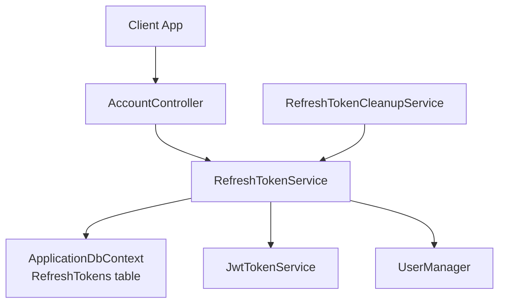
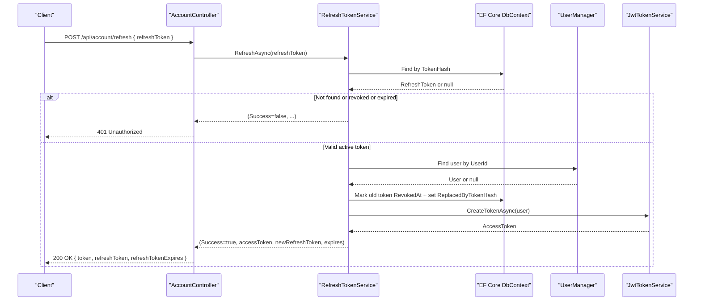
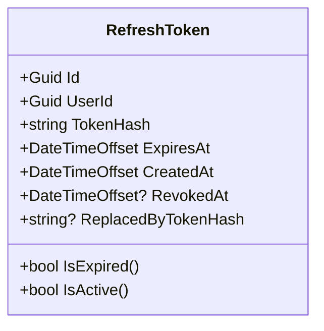
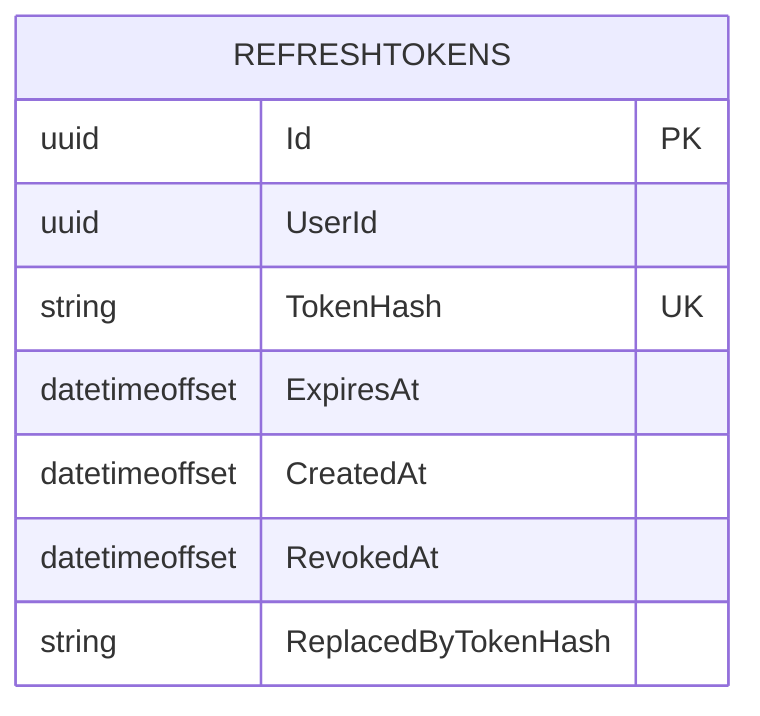
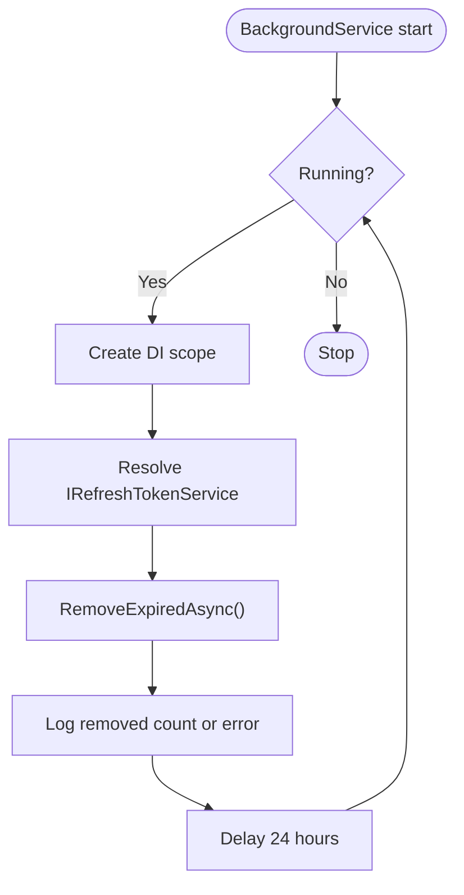
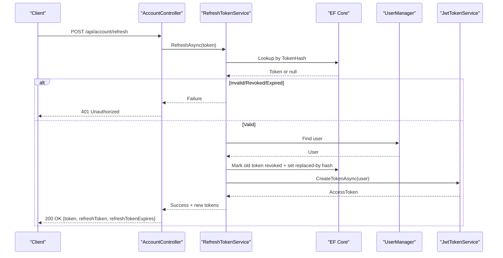
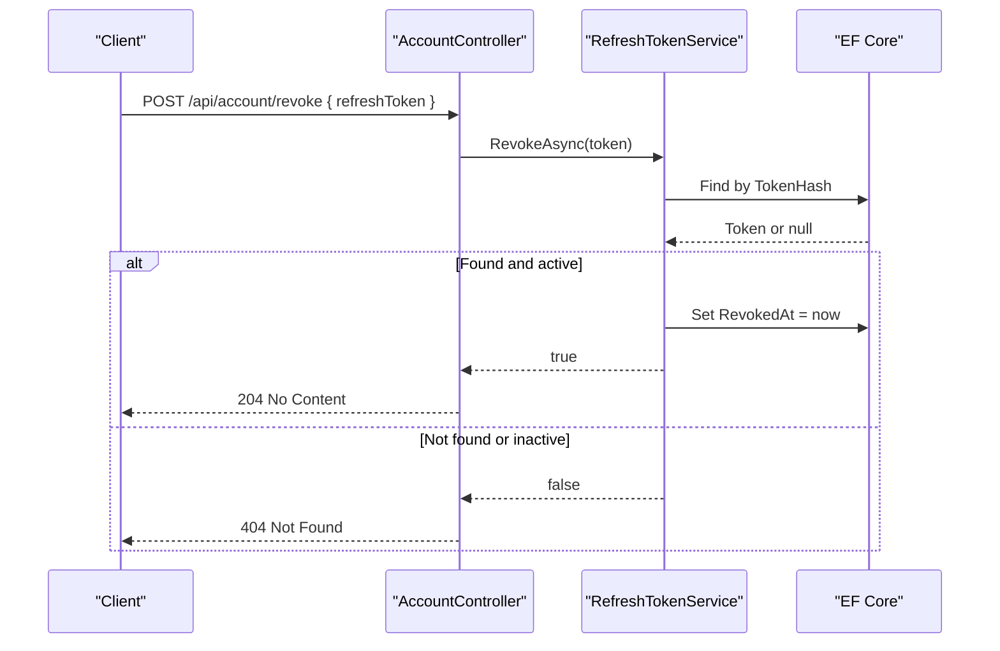
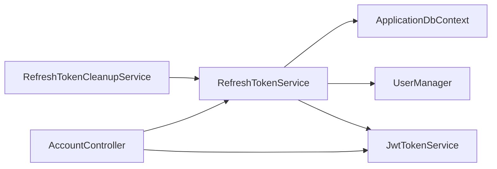

# Refresh Token Management

<cite>
**Referenced Files in This Document**
- [RefreshToken.cs](file://src/Ecommerce.Domain/Entities/RefreshToken.cs)
- [IRefreshTokenService.cs](file://src/Ecommerce.Application/Interfaces/IRefreshTokenService.cs)
- [RefreshTokenService.cs](file://src/Ecommerce.Infrastructure/Services/RefreshTokenService.cs)
- [JwtTokenService.cs](file://src/Ecommerce.Infrastructure/Auth/JwtTokenService.cs)
- [AccountController.cs](file://src/Ecommerce.Api/Controllers/AccountController.cs)
- [RefreshTokenConfiguration.cs](file://src/Ecommerce.Infrastructure/Persistence/Configurations/RefreshTokenConfiguration.cs)
- [20260816140220_AddRefreshTokensTable.cs](file://src/Ecommerce.Infrastructure/Migrations/20260816140220_AddRefreshTokensTable.cs)
- [20260816141752_AddRefreshTokenIndexes.cs](file://src/Ecommerce.Infrastructure/Migrations/20260816141752_AddRefreshTokenIndexes.cs)
- [RefreshTokenCleanupService.cs](file://src/Ecommerce.Infrastructure/Services/RefreshTokenCleanupService.cs)
- [RefreshTokenIntegrationTests.cs](file://tests/Ecommerce.IntegrationTests/RefreshTokenIntegrationTests.cs)
</cite>

## Table of Contents
1. [Introduction](#introduction)
2. [Project Structure](#project-structure)
3. [Core Components](#core-components)
4. [Architecture Overview](#architecture-overview)
5. [Detailed Component Analysis](#detailed-component-analysis)
6. [Dependency Analysis](#dependency-analysis)
7. [Performance Considerations](#performance-considerations)
8. [Troubleshooting Guide](#troubleshooting-guide)
9. [Conclusion](#conclusion)
10. [Appendices](#appendices)

## Introduction
This document explains the refresh token management system implemented in the project. It covers the full lifecycle of refresh tokens: creation, storage, validation, rotation, expiration handling, revocation, and cleanup. It also documents security measures such as hashing and theft mitigation, database schema and indexing strategies, performance considerations, and concurrent access handling. Examples include API endpoints for token refresh and revocation, and background cleanup procedures.

## Project Structure
The refresh token feature spans multiple layers:
- Domain entity defining token state and computed properties
- Application interface describing operations
- Infrastructure service implementing persistence, rotation, and revocation
- API controller exposing endpoints for login, refresh, revoke, and revoke-all
- EF Core configuration and migrations defining the database schema and indexes
- Background service performing periodic cleanup of expired tokens
- Integration tests validating behavior including rotation and theft detection

**Diagram sources**
- [AccountController.cs:1-134](file://src/Ecommerce.Api/Controllers/AccountController.cs#L1-L134)
- [RefreshTokenService.cs:1-126](file://src/Ecommerce.Infrastructure/Services/RefreshTokenService.cs#L1-L126)
- [JwtTokenService.cs:1-48](file://src/Ecommerce.Infrastructure/Auth/JwtTokenService.cs#L1-L48)
- [RefreshTokenConfiguration.cs:1-31](file://src/Ecommerce.Infrastructure/Persistence/Configurations/RefreshTokenConfiguration.cs#L1-L31)
- [RefreshTokenCleanupService.cs:1-47](file://src/Ecommerce.Infrastructure/Services/RefreshTokenCleanupService.cs#L1-L47)

**Section sources**
- [AccountController.cs:1-134](file://src/Ecommerce.Api/Controllers/AccountController.cs#L1-L134)
- [RefreshTokenService.cs:1-126](file://src/Ecommerce.Infrastructure/Services/RefreshTokenService.cs#L1-L126)
- [RefreshTokenConfiguration.cs:1-31](file://src/Ecommerce.Infrastructure/Persistence/Configurations/RefreshTokenConfiguration.cs#L1-L31)
- [RefreshTokenCleanupService.cs:1-47](file://src/Ecommerce.Infrastructure/Services/RefreshTokenCleanupService.cs#L1-L47)

## Core Components
- Domain model: Refresh token entity with identity, user association, hashed token value, timestamps, revocation state, and replacement reference.
- Application interface: Defines create, refresh, revoke, revoke-all, and remove-expired operations.
- Infrastructure service: Implements token generation, hashing, persistence, rotation, revocation, and bulk revocation; integrates with Identity and JWT services.
- API controller: Exposes endpoints for registration/login (issue tokens), refresh, revoke single, and revoke all.
- Persistence configuration and migrations: Define table schema, constraints, and indexes for efficient queries.
- Background cleanup: Periodically removes expired tokens to keep the table lean.

**Section sources**
- [RefreshToken.cs:1-19](file://src/Ecommerce.Domain/Entities/RefreshToken.cs#L1-L19)
- [IRefreshTokenService.cs:1-14](file://src/Ecommerce.Application/Interfaces/IRefreshTokenService.cs#L1-L14)
- [RefreshTokenService.cs:1-126](file://src/Ecommerce.Infrastructure/Services/RefreshTokenService.cs#L1-L126)
- [AccountController.cs:1-134](file://src/Ecommerce.Api/Controllers/AccountController.cs#L1-L134)
- [RefreshTokenConfiguration.cs:1-31](file://src/Ecommerce.Infrastructure/Persistence/Configurations/RefreshTokenConfiguration.cs#L1-L31)
- [20260816140220_AddRefreshTokensTable.cs:1-102](file://src/Ecommerce.Infrastructure/Migrations/20260816140220_AddRefreshTokensTable.cs#L1-L102)
- [20260816141752_AddRefreshTokenIndexes.cs:1-85](file://src/Ecommerce.Infrastructure/Migrations/20260816141752_AddRefreshTokenIndexes.cs#L1-L85)
- [RefreshTokenCleanupService.cs:1-47](file://src/Ecommerce.Infrastructure/Services/RefreshTokenCleanupService.cs#L1-L47)

## Architecture Overview
The system uses a short-lived access token (JWT) paired with a long-lived refresh token stored server-side as a hash. On each refresh, the old refresh token is revoked and replaced by a new one (rotation). If a revoked token is reused, all tokens for that user are revoked to mitigate theft. A background service periodically purges expired tokens.

**Diagram sources**
- [AccountController.cs:56-65](file://src/Ecommerce.Api/Controllers/AccountController.cs#L56-L65)
- [RefreshTokenService.cs:50-79](file://src/Ecommerce.Infrastructure/Services/RefreshTokenService.cs#L50-L79)
- [JwtTokenService.cs:22-45](file://src/Ecommerce.Infrastructure/Auth/JwtTokenService.cs#L22-L45)

## Detailed Component Analysis

### Domain Model: RefreshToken
- Fields: unique identifier, user id, hashed token, expiration and creation timestamps, optional revocation timestamp, optional hash of the replacing token.
- Computed properties: IsExpired based on current UTC time; IsActive when not revoked and not expired.

**Diagram sources**
- [RefreshToken.cs:5-17](file://src/Ecommerce.Domain/Entities/RefreshToken.cs#L5-L17)

**Section sources**
- [RefreshToken.cs:1-19](file://src/Ecommerce.Domain/Entities/RefreshToken.cs#L1-L19)

### Application Interface: IRefreshTokenService
Defines the contract for:
- Creating a refresh token for a user
- Refreshing using a valid token (returns new access token, new refresh token, and expiry)
- Revoking a specific token
- Revoking all tokens for a user
- Removing expired tokens

**Section sources**
- [IRefreshTokenService.cs:1-14](file://src/Ecommerce.Application/Interfaces/IRefreshTokenService.cs#L1-L14)

### Service Implementation: RefreshTokenService
Key behaviors:
- Creation: generates a cryptographically secure random token, hashes it, stores with expiration (30 days from creation), and persists.
- Refresh:
  - Hashes incoming token and looks up by unique index.
  - Rejects if not found, revoked, or expired.
  - Validates user existence.
  - Revokes the old token and records the new token’s hash as replacement.
  - Issues a new access token via JwtTokenService.
  - Returns new access token, new refresh token, and its expiry.
- Revocation: marks a specific token as revoked if active.
- Bulk revocation: marks all active tokens for a user as revoked.
- Cleanup: deletes expired tokens.
- Security:
  - Tokens are never stored in plaintext; only SHA-256 hashes are persisted.
  - Reuse of a revoked token triggers revocation of all tokens for that user to mitigate theft.

Concurrency and consistency:
- Uses EF Core queries and updates within a single save per operation. For high-concurrency scenarios, consider adding optimistic concurrency (e.g., RowVersion) or transactional locking around refresh to prevent race conditions where two concurrent refreshes could both succeed before either revokes the original.

**Section sources**
- [RefreshTokenService.cs:28-123](file://src/Ecommerce.Infrastructure/Services/RefreshTokenService.cs#L28-L123)

### API Endpoints: AccountController
- POST /api/account/register: creates user and issues access token + refresh token.
- POST /api/account/login: authenticates user and issues access token + refresh token.
- POST /api/account/refresh: accepts a refresh token; returns new access token and rotated refresh token or 401 on failure.
- POST /api/account/revoke: requires authorization; revokes the provided refresh token; returns 404 if not found or inactive.
- POST /api/account/revoke-all: requires authorization; revokes all active refresh tokens for the current user.

Request/response examples:
- Refresh request body: object containing a refresh token string.
- Refresh response: object containing access token, new refresh token, and refresh token expiry.

**Section sources**
- [AccountController.cs:34-107](file://src/Ecommerce.Api/Controllers/AccountController.cs#L34-L107)

### Database Schema and Indexes
- Table: RefreshTokens
  - Columns: Id (PK), UserId, TokenHash (unique), ExpiresAt, CreatedAt, RevokedAt, ReplacedByTokenHash
- Indexes:
  - Unique index on TokenHash for fast lookup and uniqueness enforcement
  - Non-unique index on UserId for user-scoped operations
  - Non-unique index on ExpiresAt for efficient cleanup of expired tokens

**Diagram sources**
- [20260816140220_AddRefreshTokensTable.cs:43-58](file://src/Ecommerce.Infrastructure/Migrations/20260816140220_AddRefreshTokensTable.cs#L43-L58)
- [20260816141752_AddRefreshTokenIndexes.cs:32-46](file://src/Ecommerce.Infrastructure/Migrations/20260816141752_AddRefreshTokenIndexes.cs#L32-L46)
- [RefreshTokenConfiguration.cs:11-27](file://src/Ecommerce.Infrastructure/Persistence/Configurations/RefreshTokenConfiguration.cs#L11-L27)

**Section sources**
- [20260816140220_AddRefreshTokensTable.cs:1-102](file://src/Ecommerce.Infrastructure/Migrations/20260816140220_AddRefreshTokensTable.cs#L1-L102)
- [20260816141752_AddRefreshTokenIndexes.cs:1-85](file://src/Ecommerce.Infrastructure/Migrations/20260816141752_AddRefreshTokenIndexes.cs#L1-L85)
- [RefreshTokenConfiguration.cs:1-31](file://src/Ecommerce.Infrastructure/Persistence/Configurations/RefreshTokenConfiguration.cs#L1-L31)

### Background Cleanup: RefreshTokenCleanupService
- Runs as a background service with a daily interval.
- Creates a scope to resolve IRefreshTokenService and calls RemoveExpiredAsync.
- Logs the number of removed tokens or errors encountered.

**Diagram sources**
- [RefreshTokenCleanupService.cs:10-44](file://src/Ecommerce.Infrastructure/Services/RefreshTokenCleanupService.cs#L10-L44)

**Section sources**
- [RefreshTokenCleanupService.cs:1-47](file://src/Ecommerce.Infrastructure/Services/RefreshTokenCleanupService.cs#L1-L47)

### Access Token Generation: JwtTokenService
- Creates a signed JWT with subject (user id), email, and a unique jti claim.
- Configurable issuer and signing key via configuration.
- Short lifetime (2 hours) suitable for access tokens.

**Section sources**
- [JwtTokenService.cs:1-48](file://src/Ecommerce.Infrastructure/Auth/JwtTokenService.cs#L1-L48)

### Refresh Flow Sequence (End-to-End)

**Diagram sources**
- [AccountController.cs:56-65](file://src/Ecommerce.Api/Controllers/AccountController.cs#L56-L65)
- [RefreshTokenService.cs:50-79](file://src/Ecommerce.Infrastructure/Services/RefreshTokenService.cs#L50-L79)
- [JwtTokenService.cs:22-45](file://src/Ecommerce.Infrastructure/Auth/JwtTokenService.cs#L22-L45)

### Revocation Flow

**Diagram sources**
- [AccountController.cs:67-77](file://src/Ecommerce.Api/Controllers/AccountController.cs#L67-L77)
- [RefreshTokenService.cs:81-89](file://src/Ecommerce.Infrastructure/Services/RefreshTokenService.cs#L81-L89)

### Theft Mitigation and Reuse Detection
- If a revoked token is presented during refresh, the system revokes all tokens for that user to invalidate potentially compromised sessions.
- The old token is marked as revoked and linked to the new token’s hash for auditability.

**Section sources**
- [RefreshTokenService.cs:56-72](file://src/Ecommerce.Infrastructure/Services/RefreshTokenService.cs#L56-L72)
- [RefreshTokenIntegrationTests.cs:166-178](file://tests/Ecommerce.IntegrationTests/RefreshTokenIntegrationTests.cs#L166-L178)

### Rotation Strategy
- Each successful refresh invalidates the previous refresh token and issues a new one (one-time use).
- The replaced-by relationship allows tracing which token replaced another.

**Section sources**
- [RefreshTokenService.cs:68-73](file://src/Ecommerce.Infrastructure/Services/RefreshTokenService.cs#L68-L73)
- [RefreshTokenIntegrationTests.cs:96-108](file://tests/Ecommerce.IntegrationTests/RefreshTokenIntegrationTests.cs#L96-L108)

### Expiration Handling
- New refresh tokens expire after 30 days from creation.
- Access tokens expire after 2 hours.
- Expired tokens cannot be used to refresh and are cleaned up by the background service.

**Section sources**
- [RefreshTokenService.cs:32-33](file://src/Ecommerce.Infrastructure/Services/RefreshTokenService.cs#L32-L33)
- [JwtTokenService.cs:36-41](file://src/Ecommerce.Infrastructure/Auth/JwtTokenService.cs#L36-L41)
- [RefreshTokenCleanupService.cs:21-44](file://src/Ecommerce.Infrastructure/Services/RefreshTokenCleanupService.cs#L21-L44)

## Dependency Analysis
- AccountController depends on UserManager, SignInManager, ITokenService, and IRefreshTokenService.
- RefreshTokenService depends on ApplicationDbContext, ITokenService, and UserManager.
- JwtTokenService depends on IConfiguration to read signing key and issuer.
- RefreshTokenCleanupService depends on IServiceProvider and IRefreshTokenService.

**Diagram sources**
- [AccountController.cs:17-31](file://src/Ecommerce.Api/Controllers/AccountController.cs#L17-L31)
- [RefreshTokenService.cs:17-26](file://src/Ecommerce.Infrastructure/Services/RefreshTokenService.cs#L17-L26)
- [JwtTokenService.cs:15-20](file://src/Ecommerce.Infrastructure/Auth/JwtTokenService.cs#L15-L20)
- [RefreshTokenCleanupService.cs:12-19](file://src/Ecommerce.Infrastructure/Services/RefreshTokenCleanupService.cs#L12-L19)

**Section sources**
- [AccountController.cs:1-134](file://src/Ecommerce.Api/Controllers/AccountController.cs#L1-L134)
- [RefreshTokenService.cs:1-126](file://src/Ecommerce.Infrastructure/Services/RefreshTokenService.cs#L1-L126)
- [JwtTokenService.cs:1-48](file://src/Ecommerce.Infrastructure/Auth/JwtTokenService.cs#L1-L48)
- [RefreshTokenCleanupService.cs:1-47](file://src/Ecommerce.Infrastructure/Services/RefreshTokenCleanupService.cs#L1-L47)

## Performance Considerations
- Unique index on TokenHash ensures O(log N) lookups and prevents duplicates.
- Index on ExpiresAt enables efficient batch deletion of expired tokens.
- Index on UserId supports quick user-scoped revocation.
- Avoid storing raw tokens; hashing reduces risk and keeps payloads small.
- Consider connection pooling and query batching for high-throughput refresh endpoints.
- For very high concurrency, add optimistic concurrency control (e.g., RowVersion) or explicit locking around refresh to avoid race conditions where concurrent refreshes bypass revocation.

[No sources needed since this section provides general guidance]

## Troubleshooting Guide
Common issues and resolutions:
- 401 on refresh:
  - Token not found, revoked, or expired. Verify client sends the latest refresh token and that the token has not been reused.
  - Check logs for theft detection path that revokes all tokens upon reuse.
- 404 on revoke:
  - Token not found or already inactive. Ensure the token exists and is active.
- High CPU or slow refresh:
  - Confirm indexes exist on TokenHash, UserId, and ExpiresAt.
  - Validate database connectivity and query plans.
- Stale data:
  - Ensure background cleanup is running and configured to run at desired intervals.

**Section sources**
- [AccountController.cs:56-87](file://src/Ecommerce.Api/Controllers/AccountController.cs#L56-L87)
- [RefreshTokenService.cs:50-109](file://src/Ecommerce.Infrastructure/Services/RefreshTokenService.cs#L50-L109)
- [RefreshTokenCleanupService.cs:21-44](file://src/Ecommerce.Infrastructure/Services/RefreshTokenCleanupService.cs#L21-L44)

## Conclusion
The refresh token system implements a secure, server-side managed rotation strategy with strong protections against reuse and theft. Tokens are hashed and indexed for performance, while a background job maintains database hygiene. The API exposes clear endpoints for issuing, refreshing, and revoking tokens. For production deployments, consider adding optimistic concurrency to further harden concurrent refresh scenarios and tuning cleanup frequency based on workload.

[No sources needed since this section summarizes without analyzing specific files]

## Appendices

### API Reference Summary
- POST /api/account/register: Creates a user and returns access token + refresh token.
- POST /api/account/login: Authenticates and returns access token + refresh token.
- POST /api/account/refresh: Accepts a refresh token; returns new access token and rotated refresh token or 401.
- POST /api/account/revoke: Requires authorization; revokes the provided refresh token; returns 404 if not found/inactive.
- POST /api/account/revoke-all: Requires authorization; revokes all active refresh tokens for the current user.

**Section sources**
- [AccountController.cs:34-107](file://src/Ecommerce.Api/Controllers/AccountController.cs#L34-L107)

### Validation and Tests
- Integration tests verify:
  - Successful creation and rotation
  - Reuse detection and mass revocation
  - Single token revocation
  - Active state transitions

**Section sources**
- [RefreshTokenIntegrationTests.cs:64-180](file://tests/Ecommerce.IntegrationTests/RefreshTokenIntegrationTests.cs#L64-L180)