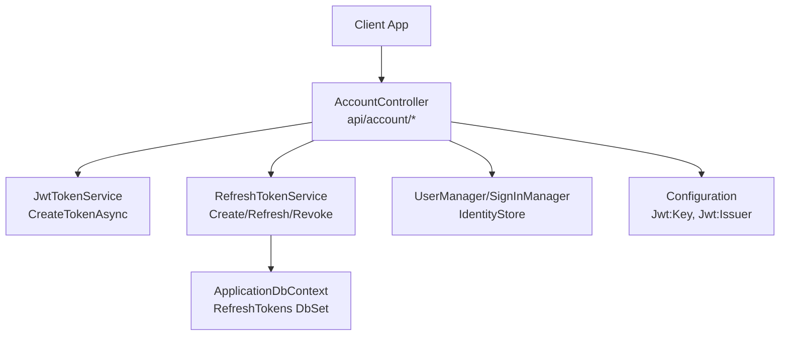
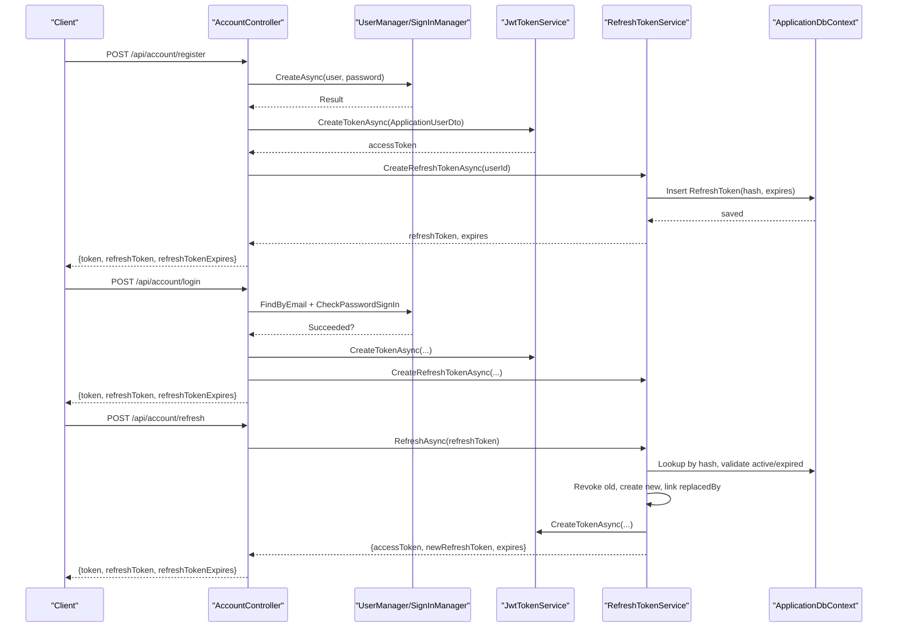
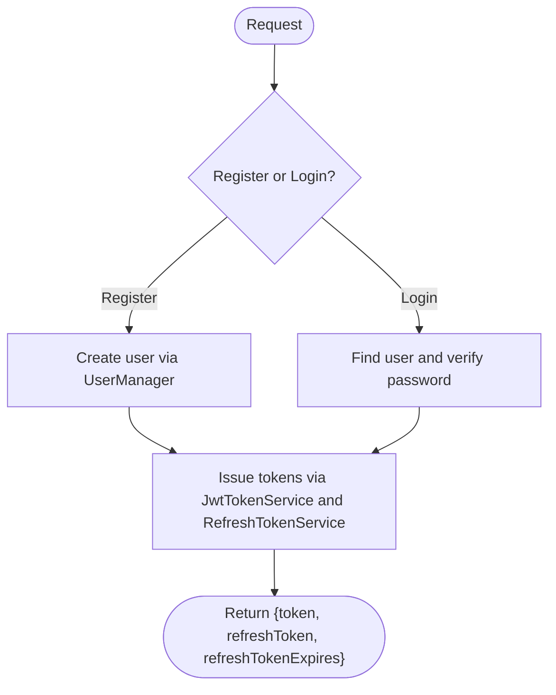
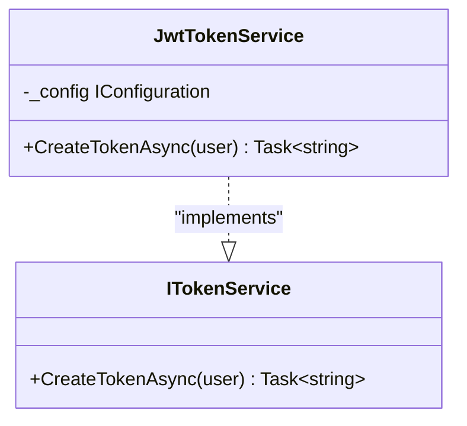
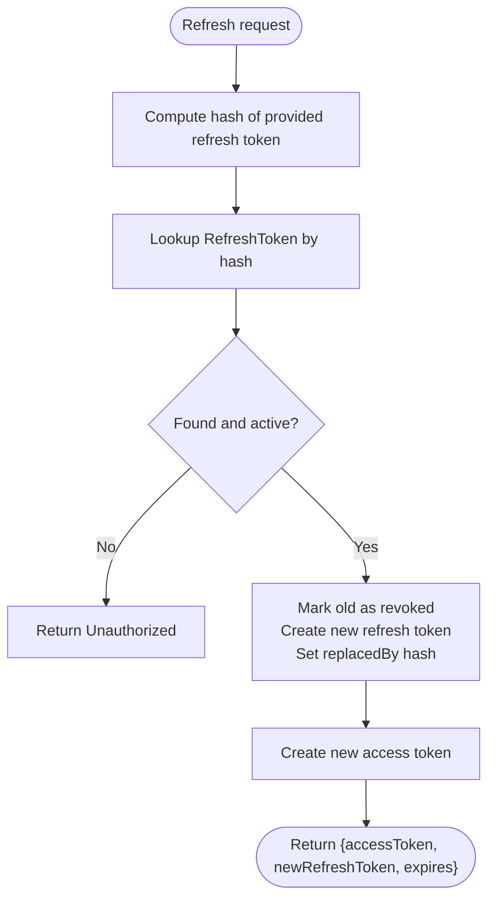
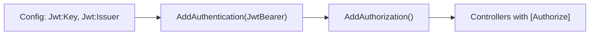
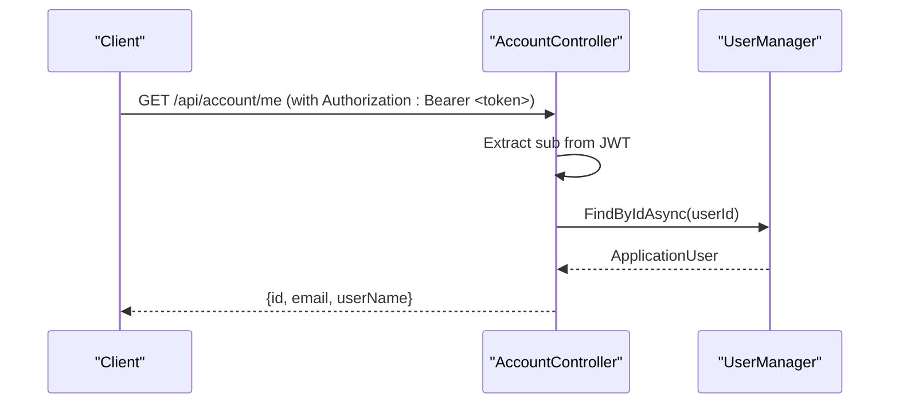
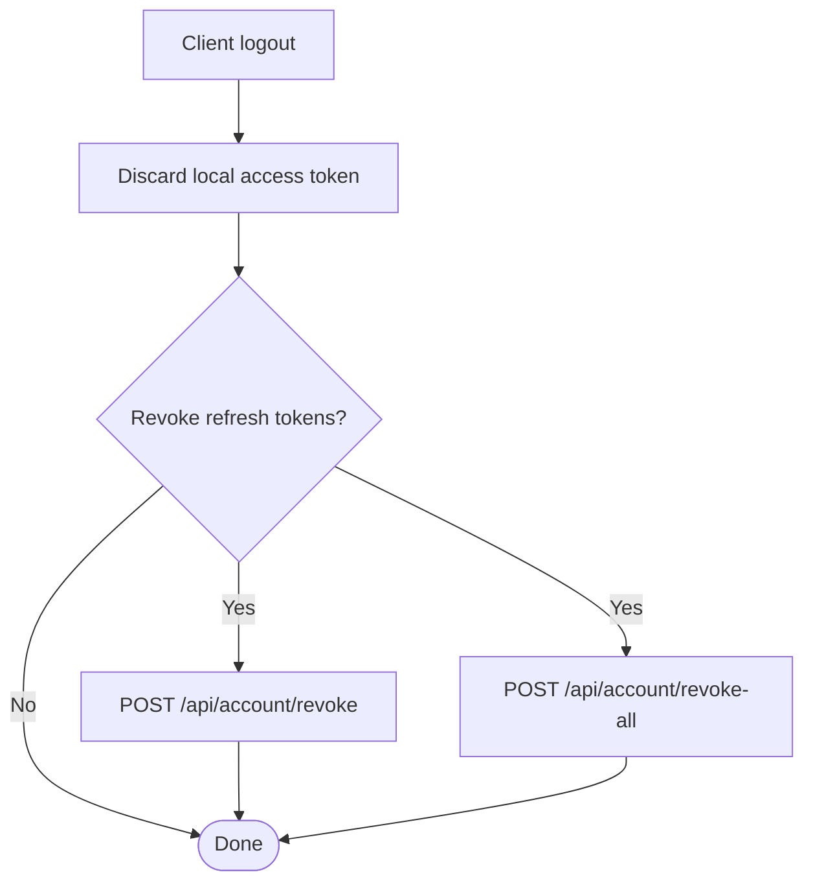
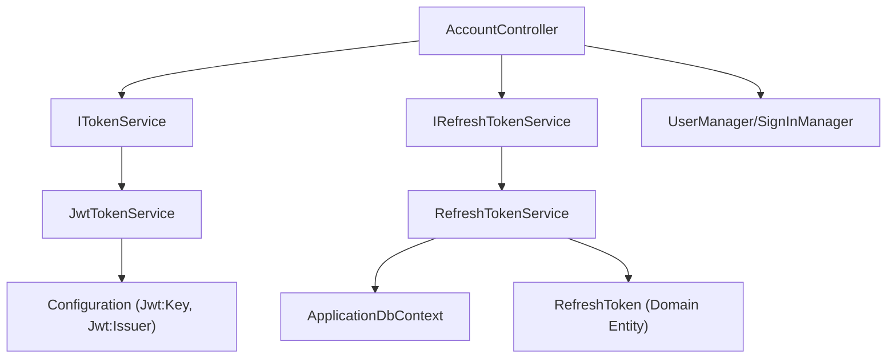

# User Authentication & Management

<cite>
**Referenced Files in This Document**
- [AccountController.cs](file://src/Ecommerce.Api/Controllers/AccountController.cs)
- [JwtTokenService.cs](file://src/Ecommerce.Infrastructure/Auth/JwtTokenService.cs)
- [RefreshTokenService.cs](file://src/Ecommerce.Infrastructure/Services/RefreshTokenService.cs)
- [ApplicationUser.cs](file://src/Ecommerce.Infrastructure/Identity/ApplicationUser.cs)
- [ApplicationRole.cs](file://src/Ecommerce.Infrastructure/Identity/ApplicationRole.cs)
- [ITokenService.cs](file://src/Ecommerce.Application/Interfaces/ITokenService.cs)
- [IRefreshTokenService.cs](file://src/Ecommerce.Application/Interfaces/IRefreshTokenService.cs)
- [ApplicationUserDto.cs](file://src/Ecommerce.Application/DTOs/ApplicationUserDto.cs)
- [RefreshToken.cs](file://src/Ecommerce.Domain/Entities/RefreshToken.cs)
- [ApplicationDbContext.cs](file://src/Ecommerce.Infrastructure/Persistence/ApplicationDbContext.cs)
- [DependencyInjection.cs](file://src/Ecommerce.Infrastructure/DependencyInjection.cs)
- [Program.cs](file://src/Ecommerce.Api/Program.cs)
- [appsettings.Development.json](file://src/Ecommerce.Api/appsettings.Development.json)
</cite>

## Table of Contents
1. Introduction
2. Project Structure
3. Core Components
4. Architecture Overview
5. Detailed Component Analysis
6. Dependency Analysis
7. Performance Considerations
8. Troubleshooting Guide
9. Conclusion
10. Appendices

## Introduction
This document explains the user authentication and management features implemented in the project. It covers JWT-based authentication, refresh token lifecycle, registration and login flows, profile retrieval, authorization setup, session revocation, and security best practices. It also clarifies what is currently implemented versus what is not present (for example, password reset and email verification endpoints are not included).

## Project Structure
The authentication system spans API controllers, application interfaces, infrastructure services, domain entities, and configuration:
- API layer exposes account endpoints for register, login, refresh, revoke, revoke-all, and profile retrieval.
- Application layer defines contracts for token and refresh token operations.
- Infrastructure implements JWT token creation, refresh token persistence and rotation, and dependency injection wiring.
- Domain models include the RefreshToken entity with expiration and revocation semantics.
- Configuration provides JWT signing key and issuer settings.

**Diagram sources**
- [AccountController.cs:34-99](file://src/Ecommerce.Api/Controllers/AccountController.cs#L34-L99)
- [JwtTokenService.cs:22-44](file://src/Ecommerce.Infrastructure/Auth/JwtTokenService.cs#L22-L44)
- [RefreshTokenService.cs:28-79](file://src/Ecommerce.Infrastructure/Services/RefreshTokenService.cs#L28-L79)
- [ApplicationDbContext.cs:13-27](file://src/Ecommerce.Infrastructure/Persistence/ApplicationDbContext.cs#L13-L27)
- [Program.cs:22-50](file://src/Ecommerce.Api/Program.cs#L22-L50)
- [appsettings.Development.json:8-11](file://src/Ecommerce.Api/appsettings.Development.json#L8-L11)

**Section sources**
- [AccountController.cs:34-99](file://src/Ecommerce.Api/Controllers/AccountController.cs#L34-L99)
- [Program.cs:22-50](file://src/Ecommerce.Api/Program.cs#L22-L50)
- [DependencyInjection.cs:76-83](file://src/Ecommerce.Infrastructure/DependencyInjection.cs#L76-L83)

## Core Components
- AccountController: Exposes HTTP endpoints for user registration, login, token refresh, session revocation, and profile retrieval.
- JwtTokenService: Creates signed JWT access tokens using configured key and issuer; includes standard claims (subject, email, jti) and a short lifetime.
- RefreshTokenService: Manages refresh tokens with hashing, expiration, rotation on use, revocation per token or per user, and cleanup of expired tokens.
- Identity Models: ApplicationUser extends IdentityUser with additional profile and verification flags; ApplicationRole extends IdentityRole.
- DTOs: ApplicationUserDto carries minimal user data used to build JWT claims.
- Persistence: ApplicationDbContext includes RefreshTokens DbSet and applies EF configurations.

**Section sources**
- [AccountController.cs:17-32](file://src/Ecommerce.Api/Controllers/AccountController.cs#L17-L32)
- [JwtTokenService.cs:13-44](file://src/Ecommerce.Infrastructure/Auth/JwtTokenService.cs#L13-L44)
- [RefreshTokenService.cs:15-26](file://src/Ecommerce.Infrastructure/Services/RefreshTokenService.cs#L15-L26)
- [ApplicationUser.cs:6-17](file://src/Ecommerce.Infrastructure/Identity/ApplicationUser.cs#L6-L17)
- [ApplicationRole.cs:6-10](file://src/Ecommerce.Infrastructure/Identity/ApplicationRole.cs#L6-L10)
- [ApplicationUserDto.cs:5-10](file://src/Ecommerce.Application/DTOs/ApplicationUserDto.cs#L5-L10)
- [ApplicationDbContext.cs:13-27](file://src/Ecommerce.Infrastructure/Persistence/ApplicationDbContext.cs#L13-L27)

## Architecture Overview
The authentication flow uses ASP.NET Core Identity for user store and sign-in, JWT Bearer for stateless access control, and server-side refresh tokens stored in the database with hashing and rotation.

**Diagram sources**
- [AccountController.cs:34-65](file://src/Ecommerce.Api/Controllers/AccountController.cs#L34-L65)
- [JwtTokenService.cs:22-44](file://src/Ecommerce.Infrastructure/Auth/JwtTokenService.cs#L22-L44)
- [RefreshTokenService.cs:28-79](file://src/Ecommerce.Infrastructure/Services/RefreshTokenService.cs#L28-L79)
- [ApplicationDbContext.cs:27](file://src/Ecommerce.Infrastructure/Persistence/ApplicationDbContext.cs#L27)

## Detailed Component Analysis

### Registration and Login Flow
- Register creates an identity user and issues both access and refresh tokens.
- Login validates credentials via Identity and issues tokens similarly.
- Both flows return a compact payload containing the access token, refresh token, and refresh token expiry.

**Diagram sources**
- [AccountController.cs:34-54](file://src/Ecommerce.Api/Controllers/AccountController.cs#L34-L54)
- [JwtTokenService.cs:22-44](file://src/Ecommerce.Infrastructure/Auth/JwtTokenService.cs#L22-L44)
- [RefreshTokenService.cs:28-48](file://src/Ecommerce.Infrastructure/Services/RefreshTokenService.cs#L28-L48)

**Section sources**
- [AccountController.cs:34-54](file://src/Ecommerce.Api/Controllers/AccountController.cs#L34-L54)

### Token Generation (JWT)
- Access tokens are created with subject (user id), email, and a unique jti claim.
- Tokens are signed with HMAC-SHA256 using a symmetric key from configuration.
- The issuer and audience are set from configuration; default values exist for development.
- Token lifetime is fixed at two hours.

**Diagram sources**
- [JwtTokenService.cs:13-44](file://src/Ecommerce.Infrastructure/Auth/JwtTokenService.cs#L13-L44)
- [ITokenService.cs:6-9](file://src/Ecommerce.Application/Interfaces/ITokenService.cs#L6-L9)

**Section sources**
- [JwtTokenService.cs:22-44](file://src/Ecommerce.Infrastructure/Auth/JwtTokenService.cs#L22-L44)
- [appsettings.Development.json:8-11](file://src/Ecommerce.Api/appsettings.Development.json#L8-L11)

### Refresh Token Lifecycle and Rotation
- Creation: generates a random token, stores its SHA-256 hash, sets expiry (30 days), and persists it.
- Refresh: looks up by hash, ensures not revoked or expired, revokes the old token, creates a new one, links replacement via replaced-by hash, and returns a new access token plus new refresh token.
- Revocation: supports single-token revocation and full-user revocation.
- Cleanup: background service removes expired tokens.

**Diagram sources**
- [RefreshTokenService.cs:50-79](file://src/Ecommerce.Infrastructure/Services/RefreshTokenService.cs#L50-L79)
- [RefreshToken.cs:5-17](file://src/Ecommerce.Domain/Entities/RefreshToken.cs#L5-L17)

**Section sources**
- [RefreshTokenService.cs:28-109](file://src/Ecommerce.Infrastructure/Services/RefreshTokenService.cs#L28-L109)
- [RefreshToken.cs:5-17](file://src/Ecommerce.Domain/Entities/RefreshToken.cs#L5-L17)

### Authorization and Role-Based Access Control
- JWT Bearer authentication is configured with validation of issuer, audience, lifetime, and signing key.
- Authorization middleware is enabled; controller actions can be protected with [Authorize].
- Roles are modeled via ApplicationRole extending IdentityRole; role enforcement can be applied via policies or attributes when implemented.

**Diagram sources**
- [Program.cs:22-50](file://src/Ecommerce.Api/Program.cs#L22-L50)
- [ApplicationRole.cs:6-10](file://src/Ecommerce.Infrastructure/Identity/ApplicationRole.cs#L6-L10)

**Section sources**
- [Program.cs:22-50](file://src/Ecommerce.Api/Program.cs#L22-L50)
- [ApplicationRole.cs:6-10](file://src/Ecommerce.Infrastructure/Identity/ApplicationRole.cs#L6-L10)

### Profile Operations
- GET /api/account/me retrieves current user profile information based on the authenticated sub claim.
- Returns a minimal DTO with id, email, and username.

**Diagram sources**
- [AccountController.cs:89-99](file://src/Ecommerce.Api/Controllers/AccountController.cs#L89-L99)

**Section sources**
- [AccountController.cs:89-99](file://src/Ecommerce.Api/Controllers/AccountController.cs#L89-L99)

### Session Management and Logout
- There is no explicit logout endpoint that invalidates the access token (stateless JWT cannot be invalidated server-side).
- Clients should discard the access token locally upon logout.
- To invalidate sessions, clients can call revoke endpoints to invalidate refresh tokens:
  - POST /api/account/revoke: revoke a specific refresh token.
  - POST /api/account/revoke-all: revoke all refresh tokens for the current user.

**Diagram sources**
- [AccountController.cs:67-87](file://src/Ecommerce.Api/Controllers/AccountController.cs#L67-L87)

**Section sources**
- [AccountController.cs:67-87](file://src/Ecommerce.Api/Controllers/AccountController.cs#L67-L87)

### Security Measures Implemented
- JWT signing with HMAC-SHA256 and configurable key/issuer.
- Short-lived access tokens (two hours).
- Refresh tokens are hashed before storage and rotated on each use.
- Revocation support for single token or all tokens per user.
- Background cleanup of expired refresh tokens.

**Section sources**
- [JwtTokenService.cs:22-44](file://src/Ecommerce.Infrastructure/Auth/JwtTokenService.cs#L22-L44)
- [RefreshTokenService.cs:28-109](file://src/Ecommerce.Infrastructure/Services/RefreshTokenService.cs#L28-L109)
- [DependencyInjection.cs:76-83](file://src/Ecommerce.Infrastructure/DependencyInjection.cs#L76-L83)

### What Is Not Implemented (Gaps)
- Password reset: No endpoints or services for resetting passwords are present.
- Email verification: While the user model has an IsEmailVerified flag, there are no endpoints to send verification emails or mark verification complete.
- Role-based authorization policies: Roles exist but no policy definitions or attribute usage beyond basic [Authorize] are shown.

[No sources needed since this section summarizes gaps without analyzing specific files]

## Dependency Analysis
The following diagram shows how components depend on each other during authentication and token management.

**Diagram sources**
- [AccountController.cs:17-32](file://src/Ecommerce.Api/Controllers/AccountController.cs#L17-L32)
- [ITokenService.cs:6-9](file://src/Ecommerce.Application/Interfaces/ITokenService.cs#L6-L9)
- [IRefreshTokenService.cs:5-12](file://src/Ecommerce.Application/Interfaces/IRefreshTokenService.cs#L5-L12)
- [JwtTokenService.cs:13-44](file://src/Ecommerce.Infrastructure/Auth/JwtTokenService.cs#L13-L44)
- [RefreshTokenService.cs:15-26](file://src/Ecommerce.Infrastructure/Services/RefreshTokenService.cs#L15-L26)
- [ApplicationDbContext.cs:13-27](file://src/Ecommerce.Infrastructure/Persistence/ApplicationDbContext.cs#L13-L27)
- [RefreshToken.cs:5-17](file://src/Ecommerce.Domain/Entities/RefreshToken.cs#L5-L17)
- [appsettings.Development.json:8-11](file://src/Ecommerce.Api/appsettings.Development.json#L8-L11)

**Section sources**
- [DependencyInjection.cs:76-83](file://src/Ecommerce.Infrastructure/DependencyInjection.cs#L76-L83)

## Performance Considerations
- Access tokens are short-lived to reduce exposure window and minimize server checks.
- Refresh token lookup uses indexed queries by hash; ensure database indexes exist for TokenHash to maintain performance at scale.
- Background cleanup removes expired tokens to prevent unbounded growth of the RefreshTokens table.
- Avoid storing sensitive data in JWT payloads; only minimal claims are included.

[No sources needed since this section provides general guidance]

## Troubleshooting Guide
- Invalid or missing refresh token: Ensure the client sends the latest refresh token returned by the server; tokens are rotated on each use.
- Unauthorized on refresh: Indicates token not found, revoked, or expired; check database entries and time synchronization.
- Authentication failures: Verify Jwt:Key and Jwt:Issuer match between token issuance and validation configuration.
- Missing roles or policies: If using roles, ensure they are assigned to users and policies are defined if required.

**Section sources**
- [RefreshTokenService.cs:50-89](file://src/Ecommerce.Infrastructure/Services/RefreshTokenService.cs#L50-L89)
- [Program.cs:22-50](file://src/Ecommerce.Api/Program.cs#L22-L50)
- [appsettings.Development.json:8-11](file://src/Ecommerce.Api/appsettings.Development.json#L8-L11)

## Conclusion
The system implements a robust JWT-based authentication flow with secure refresh token handling, including rotation, revocation, and cleanup. Registration and login issue paired access and refresh tokens, while profile retrieval is supported. Authorization is configured for JWT Bearer; role-based controls can be extended as needed. Features such as password reset and email verification are not implemented and would require additional endpoints and services.

[No sources needed since this section summarizes without analyzing specific files]

## Appendices

### API Endpoints Summary
- POST /api/account/register: Create user and return access and refresh tokens.
- POST /api/account/login: Authenticate and return access and refresh tokens.
- POST /api/account/refresh: Exchange refresh token for a new access token and a new refresh token.
- POST /api/account/revoke: Revoke a specific refresh token (requires authentication).
- POST /api/account/revoke-all: Revoke all refresh tokens for the current user (requires authentication).
- GET /api/account/me: Retrieve current user profile (requires authentication).

**Section sources**
- [AccountController.cs:34-99](file://src/Ecommerce.Api/Controllers/AccountController.cs#L34-L99)

### Data Model Highlights
- ApplicationUser: Extends IdentityUser with profile fields and verification flags.
- ApplicationRole: Extends IdentityRole with description and creation timestamp.
- RefreshToken: Stores hashed token, expiry, creation, revocation, and replacement relationships.

**Section sources**
- [ApplicationUser.cs:6-17](file://src/Ecommerce.Infrastructure/Identity/ApplicationUser.cs#L6-L17)
- [ApplicationRole.cs:6-10](file://src/Ecommerce.Infrastructure/Identity/ApplicationRole.cs#L6-L10)
- [RefreshToken.cs:5-17](file://src/Ecommerce.Domain/Entities/RefreshToken.cs#L5-L17)