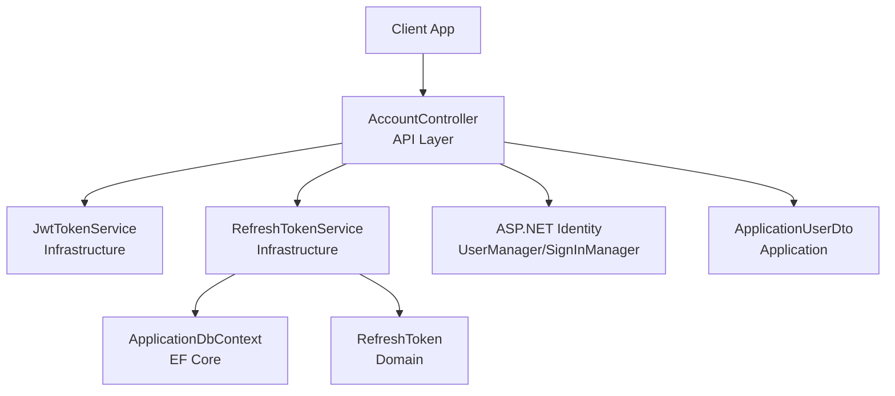
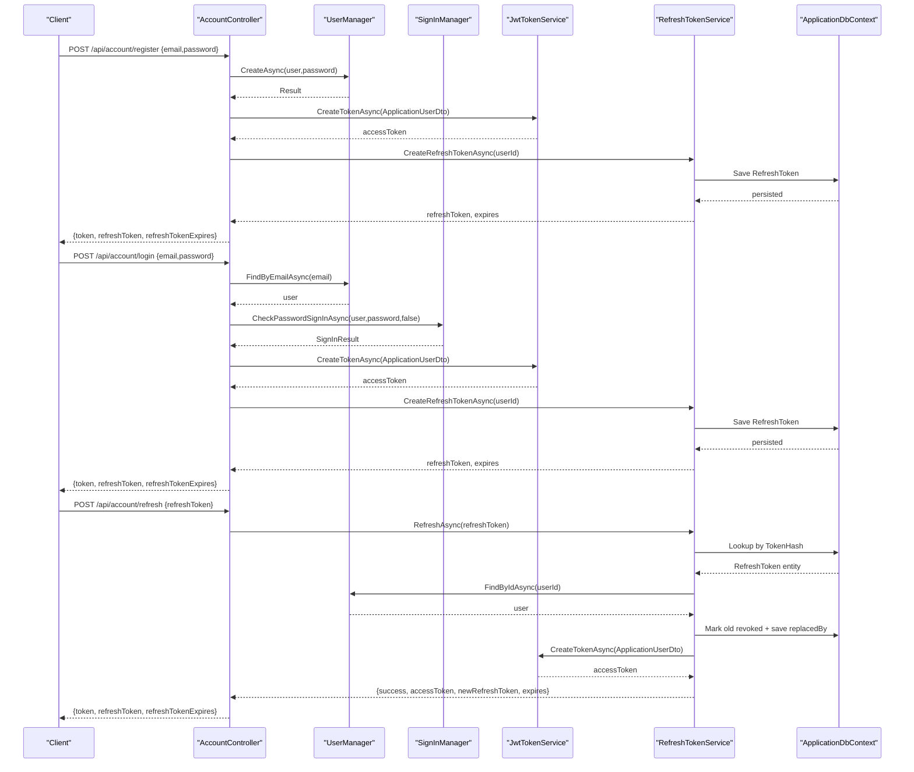
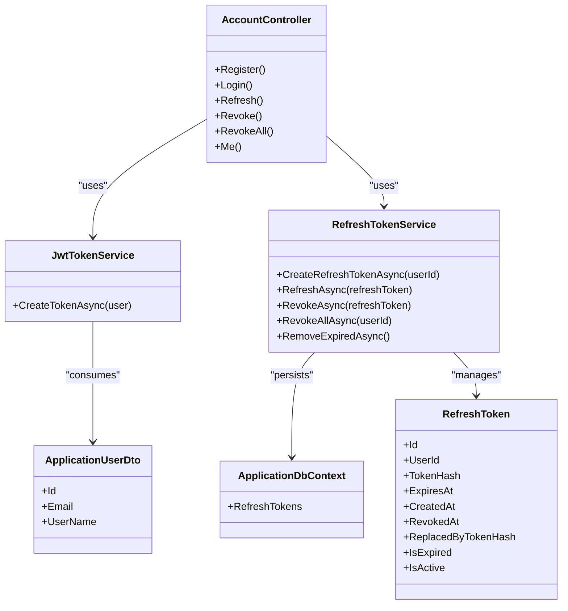

# User Management

<cite>
**Referenced Files in This Document**
- [AccountController.cs](file://src/Ecommerce.Api/Controllers/AccountController.cs)
- [ApplicationUser.cs](file://src/Ecommerce.Infrastructure/Identity/ApplicationUser.cs)
- [ApplicationRole.cs](file://src/Ecommerce.Infrastructure/Identity/ApplicationRole.cs)
- [JwtTokenService.cs](file://src/Ecommerce.Infrastructure/Auth/JwtTokenService.cs)
- [RefreshTokenService.cs](file://src/Ecommerce.Infrastructure/Services/RefreshTokenService.cs)
- [RefreshToken.cs](file://src/Ecommerce.Domain/Entities/RefreshToken.cs)
- [RefreshTokenConfiguration.cs](file://src/Ecommerce.Infrastructure/Persistence/Configurations/RefreshTokenConfiguration.cs)
- [ApplicationDbContext.cs](file://src/Ecommerce.Infrastructure/Persistence/ApplicationDbContext.cs)
- [ApplicationUserDto.cs](file://src/Ecommerce.Application/DTOs/ApplicationUserDto.cs)
- [IIdentityService.cs](file://src/Ecommerce.Application/Interfaces/IIdentityService.cs)
- [ITokenService.cs](file://src/Ecommerce.Application/Interfaces/ITokenService.cs)
- [IRefreshTokenService.cs](file://src/Ecommerce.Application/Interfaces/IRefreshTokenService.cs)
- [UserProfile.cs](file://src/Ecommerce.Domain/Entities/UserProfile.cs)
- [MappingProfile.cs](file://src/Ecommerce.Application/Mappings/MappingProfile.cs)
- [domain_rules_and_usecases.md](file://docs/architecture/domain_rules_and_usecases.md)
</cite>

## Table of Contents
1. Introduction
2. Project Structure
3. Core Components
4. Architecture Overview
5. Detailed Component Analysis
6. Dependency Analysis
7. Performance Considerations
8. Troubleshooting Guide
9. Conclusion

## Introduction
This document explains the user management functionality implemented in the project, focusing on user registration, login, profile management, and account operations. It covers the ApplicationUser entity structure, validation rules, business logic for authentication and token handling, DTO mappings, error handling strategies, roles and permissions, and security and privacy considerations.

## Project Structure
The user management feature spans multiple layers:
- API layer exposes endpoints for register, login, refresh, revoke, and current user retrieval.
- Application layer defines interfaces for identity, tokens, and refresh tokens, and provides DTOs for data transfer.
- Domain layer includes entities such as RefreshToken and UserProfile.
- Infrastructure layer implements JWT token creation, refresh token persistence and lifecycle, ASP.NET Identity integration, and EF Core configuration.

**Diagram sources**
- [AccountController.cs:13-32](file://src/Ecommerce.Api/Controllers/AccountController.cs#L13-L32)
- [JwtTokenService.cs:13-45](file://src/Ecommerce.Infrastructure/Auth/JwtTokenService.cs#L13-L45)
- [RefreshTokenService.cs:15-26](file://src/Ecommerce.Infrastructure/Services/RefreshTokenService.cs#L15-L26)
- [ApplicationDbContext.cs:13-27](file://src/Ecommerce.Infrastructure/Persistence/ApplicationDbContext.cs#L13-L27)
- [RefreshToken.cs:5-17](file://src/Ecommerce.Domain/Entities/RefreshToken.cs#L5-L17)
- [ApplicationUserDto.cs:5-10](file://src/Ecommerce.Application/DTOs/ApplicationUserDto.cs#L5-L10)

**Section sources**
- [AccountController.cs:13-114](file://src/Ecommerce.Api/Controllers/AccountController.cs#L13-L114)
- [ApplicationDbContext.cs:13-40](file://src/Ecommerce.Infrastructure/Persistence/ApplicationDbContext.cs#L13-L40)

## Core Components
- AccountController: Exposes HTTP endpoints for user registration, login, token refresh, session revocation, and retrieving the current user profile.
- ApplicationUser: Extends ASP.NET Identity user with additional profile fields and verification flags.
- ApplicationRole: Extends ASP.NET Identity role with description and creation timestamp.
- JwtTokenService: Creates signed JWT access tokens using configuration values.
- RefreshTokenService: Manages refresh token lifecycle (create, refresh, revoke, revoke-all, cleanup).
- RefreshToken: Domain entity representing a stored refresh token with hash-based storage and expiration semantics.
- RefreshTokenConfiguration: EF Core mapping and indexes for efficient lookup and cleanup.
- ApplicationUserDto: Lightweight DTO used to pass minimal user data into token creation.
- ITokenService, IRefreshTokenService, IIdentityService: Abstractions used by the API and infrastructure.

**Section sources**
- [AccountController.cs:17-114](file://src/Ecommerce.Api/Controllers/AccountController.cs#L17-L114)
- [ApplicationUser.cs:6-17](file://src/Ecommerce.Infrastructure/Identity/ApplicationUser.cs#L6-L17)
- [ApplicationRole.cs:6-10](file://src/Ecommerce.Infrastructure/Identity/ApplicationRole.cs#L6-L10)
- [JwtTokenService.cs:13-45](file://src/Ecommerce.Infrastructure/Auth/JwtTokenService.cs#L13-L45)
- [RefreshTokenService.cs:15-123](file://src/Ecommerce.Infrastructure/Services/RefreshTokenService.cs#L15-L123)
- [RefreshToken.cs:5-17](file://src/Ecommerce.Domain/Entities/RefreshToken.cs#L5-L17)
- [RefreshTokenConfiguration.cs:7-28](file://src/Ecommerce.Infrastructure/Persistence/Configurations/RefreshTokenConfiguration.cs#L7-L28)
- [ApplicationUserDto.cs:5-10](file://src/Ecommerce.Application/DTOs/ApplicationUserDto.cs#L5-L10)
- [IIdentityService.cs:6-9](file://src/Ecommerce.Application/Interfaces/IIdentityService.cs#L6-L9)
- [ITokenService.cs:6-9](file://src/Ecommerce.Application/Interfaces/ITokenService.cs#L6-L9)
- [IRefreshTokenService.cs:5-12](file://src/Ecommerce.Application/Interfaces/IRefreshTokenService.cs#L5-L12)

## Architecture Overview
The authentication flow uses ASP.NET Identity for user management and JWT for stateless authorization. Registration creates a user and issues an access token plus a refresh token. Login authenticates via credentials and issues tokens. Token refresh validates the stored refresh token, revokes it atomically, and returns a new access token and refresh token. Revocation endpoints allow single or all-session termination. The current user endpoint retrieves minimal user info from the database using the token’s subject claim.

**Diagram sources**
- [AccountController.cs:34-107](file://src/Ecommerce.Api/Controllers/AccountController.cs#L34-L107)
- [JwtTokenService.cs:22-45](file://src/Ecommerce.Infrastructure/Auth/JwtTokenService.cs#L22-L45)
- [RefreshTokenService.cs:28-79](file://src/Ecommerce.Infrastructure/Services/RefreshTokenService.cs#L28-L79)
- [ApplicationDbContext.cs:27-27](file://src/Ecommerce.Infrastructure/Persistence/ApplicationDbContext.cs#L27-L27)

## Detailed Component Analysis

### AccountController: Endpoints and Flow
- Register: Creates a user via UserManager and issues tokens.
- Login: Authenticates via SignInManager and issues tokens.
- Refresh: Delegates to RefreshTokenService to validate and rotate refresh tokens.
- Revoke/RevokeAll: Invalidates one or all refresh tokens for the current user.
- Me: Returns minimal user information based on the authenticated user’s ID extracted from the JWT subject claim.

Error handling:
- Unauthorized responses for invalid credentials or missing tokens.
- BadRequest for malformed requests.
- NotFound when resources are missing.

Authorization:
- Protected endpoints use the Authorize attribute and extract the user ID from the JWT subject claim.

**Section sources**
- [AccountController.cs:34-114](file://src/Ecommerce.Api/Controllers/AccountController.cs#L34-L114)

### ApplicationUser and Roles
- ApplicationUser extends IdentityUser with profile fields and verification flags.
- ApplicationRole extends IdentityRole with description and creation timestamp.
- These types integrate with ASP.NET Identity tables managed by EF Core.

Validation and constraints:
- Database schema enforces required fields and lengths for key properties through EF migrations and configurations.

Roles and permissions:
- Role entities exist; specific authorization policies are not defined in the analyzed files. Authorization can be enforced at controller or action level using standard ASP.NET Core mechanisms.

**Section sources**
- [ApplicationUser.cs:6-17](file://src/Ecommerce.Infrastructure/Identity/ApplicationUser.cs#L6-L17)
- [ApplicationRole.cs:6-10](file://src/Ecommerce.Infrastructure/Identity/ApplicationRole.cs#L6-L10)
- [ApplicationDbContext.cs:13-27](file://src/Ecommerce.Infrastructure/Persistence/ApplicationDbContext.cs#L13-L27)

### JWT Token Service
- Issues JWT access tokens with claims including user ID, email, and a unique JTI.
- Uses configuration for signing key and issuer; defaults are provided for development.
- Tokens have a fixed expiration window.

Security considerations:
- Ensure strong secrets in production.
- Avoid logging tokens.
- Rotate keys periodically.

**Section sources**
- [JwtTokenService.cs:13-45](file://src/Ecommerce.Infrastructure/Auth/JwtTokenService.cs#L13-L45)

### Refresh Token Service and Entity
- Create: Generates a cryptographically secure random token, hashes it, stores with expiration, and persists to the database.
- Refresh: Validates the token hash, checks revocation and expiration, rotates the token, and issues a new access token.
- Revoke/RevokeAll: Marks tokens as revoked; revoke-all invalidates all active sessions for a user.
- Cleanup: Removes expired tokens.

Entity and configuration:
- RefreshToken stores hashed tokens and metadata, with computed properties for expiration and activity status.
- Configuration sets table name, primary key, property lengths, uniqueness index on token hash, and indexes for user and expiration.

**Section sources**
- [RefreshTokenService.cs:28-123](file://src/Ecommerce.Infrastructure/Services/RefreshTokenService.cs#L28-L123)
- [RefreshToken.cs:5-17](file://src/Ecommerce.Domain/Entities/RefreshToken.cs#L5-L17)
- [RefreshTokenConfiguration.cs:7-28](file://src/Ecommerce.Infrastructure/Persistence/Configurations/RefreshTokenConfiguration.cs#L7-L28)

### Profile Management and Data Models
- Current user retrieval returns a minimal DTO with Id, Email, and UserName.
- UserProfile domain entity contains extended profile fields such as FirstName, LastName, DisplayName, Gender, DateOfBirth, and ProfileImageUrl.
- MappingProfile currently maps Order and Product entities; no explicit mapping for UserProfile is present in the analyzed file.

Recommendations:
- Add mapping profiles for UserProfile to/from DTOs if needed.
- Implement update endpoints that accept validated DTOs and persist changes to the appropriate store.

**Section sources**
- [AccountController.cs:89-99](file://src/Ecommerce.Api/Controllers/AccountController.cs#L89-L99)
- [ApplicationUserDto.cs:5-10](file://src/Ecommerce.Application/DTOs/ApplicationUserDto.cs#L5-L10)
- [UserProfile.cs:5-17](file://src/Ecommerce.Domain/Entities/UserProfile.cs#L5-L17)
- [MappingProfile.cs:7-27](file://src/Ecommerce.Application/Mappings/MappingProfile.cs#L7-L27)

### Validation Strategies
- Request-level validation: Use model binding and FluentValidation for request DTOs (e.g., RegisterRequest, LoginRequest, RefreshRequest).
- Identity-level validation: Leverage ASP.NET Identity validators for user and password rules.
- Business-level validation: Apply validators in application services before persisting changes.

Note: The analyzed files do not include explicit validators for account requests; add them to enforce format and policy requirements.

**Section sources**
- [AccountController.cs:117-132](file://src/Ecommerce.Api/Controllers/AccountController.cs#L117-L132)

### Error Handling
- Authentication failures return Unauthorized.
- Missing or invalid inputs return BadRequest.
- Resource not found returns NotFound.
- Token revocation returns NoContent on success.

Ensure consistent error shapes and log sensitive events without exposing secrets.

**Section sources**
- [AccountController.cs:34-114](file://src/Ecommerce.Api/Controllers/AccountController.cs#L34-L114)
- [RefreshTokenService.cs:50-99](file://src/Ecommerce.Infrastructure/Services/RefreshTokenService.cs#L50-L99)

### Security and Privacy
- Passwords are handled by ASP.NET Identity; ensure strong password policies.
- Tokens are signed and short-lived; refresh tokens are rotated and stored as hashes.
- Do not log tokens or secrets.
- Protect PII in transit and at rest; follow least privilege principles.
- Use secure configuration for JWT keys and issuers.

Compliance considerations:
- Follow data protection guidelines for storing personal data.
- Provide mechanisms for users to view, update, and delete their data where applicable.
- Audit sensitive actions without recording secrets.

**Section sources**
- [JwtTokenService.cs:22-45](file://src/Ecommerce.Infrastructure/Auth/JwtTokenService.cs#L22-L45)
- [RefreshTokenService.cs:28-123](file://src/Ecommerce.Infrastructure/Services/RefreshTokenService.cs#L28-L123)
- [domain_rules_and_usecases.md:38-55](file://docs/architecture/domain_rules_and_usecases.md#L38-L55)

## Dependency Analysis
Key dependencies:
- AccountController depends on UserManager, SignInManager, ITokenService, and IRefreshTokenService.
- JwtTokenService depends on IConfiguration for JWT settings.
- RefreshTokenService depends on ApplicationDbContext, ITokenService, and UserManager.
- RefreshTokenConfiguration configures EF Core mapping for RefreshTokens.

**Diagram sources**
- [AccountController.cs:17-114](file://src/Ecommerce.Api/Controllers/AccountController.cs#L17-L114)
- [JwtTokenService.cs:13-45](file://src/Ecommerce.Infrastructure/Auth/JwtTokenService.cs#L13-L45)
- [RefreshTokenService.cs:15-123](file://src/Ecommerce.Infrastructure/Services/RefreshTokenService.cs#L15-L123)
- [RefreshToken.cs:5-17](file://src/Ecommerce.Domain/Entities/RefreshToken.cs#L5-L17)
- [ApplicationUserDto.cs:5-10](file://src/Ecommerce.Application/DTOs/ApplicationUserDto.cs#L5-L10)
- [ApplicationDbContext.cs:13-27](file://src/Ecommerce.Infrastructure/Persistence/ApplicationDbContext.cs#L13-L27)

**Section sources**
- [AccountController.cs:17-114](file://src/Ecommerce.Api/Controllers/AccountController.cs#L17-L114)
- [RefreshTokenService.cs:15-123](file://src/Ecommerce.Infrastructure/Services/RefreshTokenService.cs#L15-L123)

## Performance Considerations
- Token creation is lightweight but should avoid unnecessary allocations.
- Refresh token lookups rely on indexed columns (TokenHash, UserId, ExpiresAt) for efficiency.
- Batch removal of expired tokens reduces database churn.
- Consider caching frequently accessed user profiles if read-heavy.

[No sources needed since this section provides general guidance]

## Troubleshooting Guide
Common issues and resolutions:
- Invalid credentials: Verify email exists and password matches; check Identity configuration.
- Unauthorized on refresh: Ensure the refresh token is valid, not revoked, and not expired.
- Token rotation failures: Confirm database writes succeed and that the old token is marked revoked and replaced.
- Missing user in refresh flow: Validate that the user still exists in Identity store.

Operational tips:
- Monitor refresh token cleanup jobs to prevent unbounded growth.
- Log errors without sensitive data.
- Use structured logging for auditability.

**Section sources**
- [AccountController.cs:34-114](file://src/Ecommerce.Api/Controllers/AccountController.cs#L34-L114)
- [RefreshTokenService.cs:50-109](file://src/Ecommerce.Infrastructure/Services/RefreshTokenService.cs#L50-L109)

## Conclusion
The user management system integrates ASP.NET Identity with JWT and refresh tokens to provide secure authentication and session management. The design separates concerns across API, application, domain, and infrastructure layers, enabling clear responsibilities and testability. To extend functionality, add robust request validation, profile update endpoints, and explicit authorization policies aligned with roles. Maintain security best practices around secrets, PII, and token handling to ensure compliance and resilience.