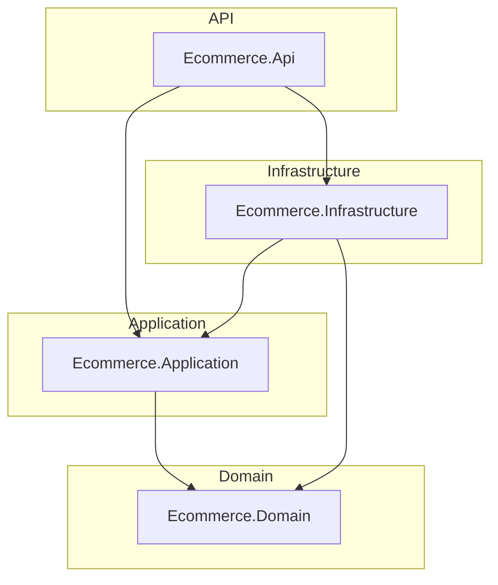
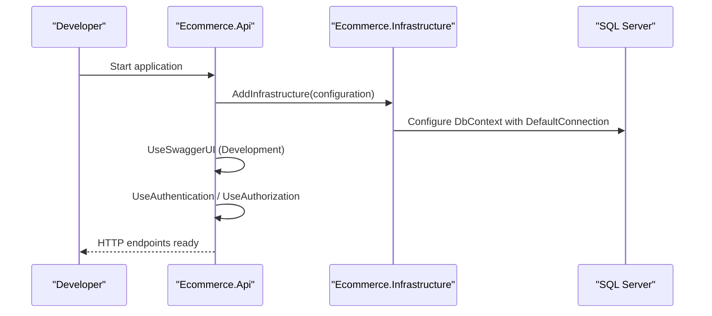
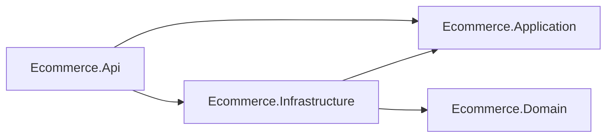

# Getting Started

<cite>
**Referenced Files in This Document**
- [README.md](file://README.md)
- [Program.cs](file://src/Ecommerce.Api/Program.cs)
- [appsettings.Development.json](file://src/Ecommerce.Api/appsettings.Development.json)
- [setup.ps1](file://scripts/setup.ps1)
- [setup.sh](file://scripts/setup.sh)
- [DependencyInjection.cs](file://src/Ecommerce.Infrastructure/DependencyInjection.cs)
- [Ecommerce.Api.csproj](file://src/Ecommerce.Api/Ecommerce.Api.csproj)
- [Ecommerce.Infrastructure.csproj](file://src/Ecommerce.Infrastructure/Ecommerce.Infrastructure.csproj)
- [Ecommerce.Application.csproj](file://src/Ecommerce.Application/Ecommerce.Application.csproj)
- [Ecommerce.Domain.csproj](file://src/Ecommerce.Domain/Ecommerce.Domain.csproj)
- [Directory.Build.props](file://Directory.Build.props)
</cite>

## Table of Contents
1. [Introduction](#introduction)
2. [Project Structure](#project-structure)
3. [Core Components](#core-components)
4. [Architecture Overview](#architecture-overview)
5. [Detailed Component Analysis](#detailed-component-analysis)
6. [Dependency Analysis](#dependency-analysis)
7. [Performance Considerations](#performance-considerations)
8. [Troubleshooting Guide](#troubleshooting-guide)
9. [Conclusion](#conclusion)
10. [Appendices](#appendices)

## Introduction
This guide helps you set up and run the E-Commerce Backend locally. The project is a .NET 8 solution organized using Clean Architecture with separate layers for Domain, Application, Infrastructure, and API. It includes:
- A minimal ASP.NET Core API entry point
- Entity Framework Core with SQL Server by default
- JWT-based authentication setup (best-effort; requires packages)
- Swagger UI for API exploration in development
- Cross-platform setup scripts to create the solution, add required packages, apply migrations, and run tests

You will learn how to prepare your environment, initialize the project, configure database and authentication settings, run the app, access Swagger, and verify that everything works.

## Project Structure
The repository follows a layered architecture:
- Domain: core business entities and value objects
- Application: use cases, DTOs, validators, command handlers
- Infrastructure: EF Core persistence, Identity, services, repositories
- API: controllers, middleware, Swagger, startup configuration

**Diagram sources**
- [Ecommerce.Api.csproj:5-8](file://src/Ecommerce.Api/Ecommerce.Api.csproj#L5-L8)
- [Ecommerce.Infrastructure.csproj:5-8](file://src/Ecommerce.Infrastructure/Ecommerce.Infrastructure.csproj#L5-L8)
- [Ecommerce.Application.csproj:5-7](file://src/Ecommerce.Application/Ecommerce.Application.csproj#L5-L7)

**Section sources**
- [README.md:1-34](file://README.md#L1-L34)
- [Directory.Build.props:1-9](file://Directory.Build.props#L1-L9)

## Core Components
- API entry point: configures controllers, Swagger, authentication, authorization, and maps endpoints
- Infrastructure DI: registers DbContext, application pipeline behaviors, command handlers, token service, idempotency service, refresh token service, and hosted cleanup
- Configuration: reads connection strings and JWT settings from configuration files/environment variables
- Setup scripts: automate solution creation, package restoration, migration creation, and test execution

Key responsibilities:
- Program.cs wires up the ASP.NET Core pipeline and optional Identity/JWT features
- DependencyInjection.cs centralizes infrastructure registrations and EF Core configuration
- appsettings.Development.json provides local defaults for logging, JWT, and database connection string

**Section sources**
- [Program.cs:9-76](file://src/Ecommerce.Api/Program.cs#L9-L76)
- [DependencyInjection.cs:11-85](file://src/Ecommerce.Infrastructure/DependencyInjection.cs#L11-L85)
- [appsettings.Development.json:1-16](file://src/Ecommerce.Api/appsettings.Development.json#L1-L16)

## Architecture Overview
At runtime, the API layer composes the application and infrastructure layers. In development, Swagger is enabled to explore APIs. Authentication is configured via JWT when available.

**Diagram sources**
- [Program.cs:11-17](file://src/Ecommerce.Api/Program.cs#L11-L17)
- [Program.cs:63-74](file://src/Ecommerce.Api/Program.cs#L63-L74)
- [DependencyInjection.cs:15-20](file://src/Ecommerce.Infrastructure/DependencyInjection.cs#L15-L20)

## Detailed Component Analysis

### Environment and SDK Requirements
- Target framework: .NET 8.0
- Required tools:
  - .NET 8 SDK
  - dotnet-ef global tool (installed automatically by setup scripts if missing)
  - SQL Server instance or compatible database server accessible at localhost by default

Notes:
- The solution targets net8.0 globally via Directory.Build.props
- The setup scripts restore dependencies, build, install dotnet-ef if needed, create an initial migration, update the database, and run tests

**Section sources**
- [Directory.Build.props:1-9](file://Directory.Build.props#L1-L9)
- [setup.ps1:30-43](file://scripts/setup.ps1#L30-L43)
- [setup.sh:32-44](file://scripts/setup.sh#L32-L44)

### Initialize the Project Using Setup Scripts
Use the provided cross-platform setup scripts to bootstrap the solution:
- Windows PowerShell: run the PowerShell script
- Linux/macOS: run the shell script

What the scripts do:
- Create a solution file and add all projects
- Add required NuGet packages (EF Core, Design, AutoMapper, FluentValidation)
- Restore and build the solution
- Ensure dotnet-ef is installed globally
- Create and apply the initial migration against the configured database
- Run tests

Important notes:
- The scripts assume the current directory contains the repository root
- If you encounter permission issues on Unix-like systems, ensure the shell script is executable
- The scripts target the Infrastructure project for EF commands and use the API project as the startup project

**Section sources**
- [setup.ps1:1-46](file://scripts/setup.ps1#L1-L46)
- [setup.sh:1-47](file://scripts/setup.sh#L1-L47)

### Configure Database Connections
The application expects a connection string named DefaultConnection. By default, it uses SQL Server.

Where to configure:
- Development: appsettings.Development.json includes a DefaultConnection pointing to a local SQL Server instance
- Production or other environments: override via environment variables or other configuration providers supported by ASP.NET Core

Steps:
- Ensure a SQL Server instance is running and reachable
- Update the DefaultConnection value to match your server, database name, and credentials
- If using a different provider, adjust the DbContext configuration accordingly

Verification:
- After running the setup scripts, the initial migration should have created the database schema
- You can confirm tables exist in your database server

**Section sources**
- [appsettings.Development.json:12-14](file://src/Ecommerce.Api/appsettings.Development.json#L12-L14)
- [DependencyInjection.cs:15-20](file://src/Ecommerce.Infrastructure/DependencyInjection.cs#L15-L20)

### Configure Authentication Settings (JWT)
JWT configuration is read from configuration and used to set up authentication and token validation.

Defaults in development:
- Jwt.Key: a placeholder secret used to sign tokens
- Jwt.Issuer: used as both issuer and audience for token validation

How to configure:
- Set Jwt:Key and Jwt:Issuer in your configuration (environment variables or appsettings)
- For production, replace the development key with a strong, randomly generated secret
- Keep the issuer consistent across services that validate tokens

Behavior:
- Authentication and authorization are registered in best-effort mode; if required packages are missing, they are skipped gracefully
- When packages are present, JWT Bearer authentication is enabled and applied to requests

**Section sources**
- [Program.cs:19-55](file://src/Ecommerce.Api/Program.cs#L19-L55)
- [appsettings.Development.json:8-11](file://src/Ecommerce.Api/appsettings.Development.json#L8-L11)

### Other Environment Variables and Configuration
- Logging level can be tuned via the Logging section in configuration
- ConnectionStrings:DefaultConnection must be set to connect to your database
- Any additional services or third-party integrations can be configured through standard ASP.NET Core configuration mechanisms

Tip:
- Use environment-specific configuration files or environment variables to manage secrets and per-environment settings

**Section sources**
- [appsettings.Development.json:2-7](file://src/Ecommerce.Api/appsettings.Development.json#L2-L7)
- [appsettings.Development.json:12-14](file://src/Ecommerce.Api/appsettings.Development.json#L12-L14)

### Run the Application Locally
After initialization and configuration:
- Restore and build the solution
- Run the API project
- Open a browser to the Swagger endpoint in development

Typical steps:
- Ensure the database is running and the connection string points to it
- Execute the setup scripts to create migrations and update the database
- Start the API project
- Navigate to the Swagger UI URL shown in the console output

Accessing Swagger:
- In development, Swagger UI is enabled and served automatically
- Use the UI to view and test endpoints once the API is running

**Section sources**
- [Program.cs:63-68](file://src/Ecommerce.Api/Program.cs#L63-L68)
- [setup.ps1:36-43](file://scripts/setup.ps1#L36-L43)
- [setup.sh:37-44](file://scripts/setup.sh#L37-L44)

### Verify the Setup
To confirm everything is working:
- Confirm the API starts without errors
- Open Swagger UI and verify endpoints are listed
- Check that the database has been created and populated with the expected schema
- Run the test suite to validate behavior

If tests fail due to missing packages, re-run the setup scripts to ensure all dependencies are added and restored.

**Section sources**
- [setup.ps1:42-43](file://scripts/setup.ps1#L42-L43)
- [setup.sh:43-44](file://scripts/setup.sh#L43-L44)

## Dependency Analysis
The API references Application and Infrastructure. Infrastructure depends on Application and Domain. The solution targets .NET 8.0 globally.

**Diagram sources**
- [Ecommerce.Api.csproj:5-8](file://src/Ecommerce.Api/Ecommerce.Api.csproj#L5-L8)
- [Ecommerce.Infrastructure.csproj:5-8](file://src/Ecommerce.Infrastructure/Ecommerce.Infrastructure.csproj#L5-L8)
- [Ecommerce.Application.csproj:5-7](file://src/Ecommerce.Application/Ecommerce.Application.csproj#L5-L7)

**Section sources**
- [Ecommerce.Api.csproj:1-20](file://src/Ecommerce.Api/Ecommerce.Api.csproj#L1-L20)
- [Ecommerce.Infrastructure.csproj:1-18](file://src/Ecommerce.Infrastructure/Ecommerce.Infrastructure.csproj#L1-L18)
- [Ecommerce.Application.csproj:1-15](file://src/Ecommerce.Application/Ecommerce.Application.csproj#L1-L15)
- [Ecommerce.Domain.csproj:1-6](file://src/Ecommerce.Domain/Ecommerce.Domain.csproj#L1-L6)
- [Directory.Build.props:1-9](file://Directory.Build.props#L1-L9)

## Performance Considerations
- Use connection pooling and appropriate timeouts for your database connection string
- Avoid heavy work in request pipelines; offload long-running tasks to background services
- Enable response caching where appropriate for read-heavy endpoints
- Monitor database query performance and consider indexing strategies based on usage patterns

[No sources needed since this section provides general guidance]

## Troubleshooting Guide

Common issues and resolutions:
- Missing .NET 8 SDK: Install the .NET 8 SDK and ensure it is on PATH
- dotnet-ef not found: The setup scripts install it globally if missing; otherwise install it manually
- Database connection failures: Verify the DefaultConnection string matches your server and credentials; ensure the server is reachable
- Migration errors: Re-run the setup scripts to recreate migrations and update the database
- Authentication package errors: The setup scripts add required packages; if missing, re-run the scripts or add them manually
- Swagger not available: Ensure you are running in Development environment; Swagger is enabled only in development

Verification checklist:
- Solution builds successfully
- Database exists and contains expected tables after migration
- API starts and Swagger UI lists endpoints
- Tests pass when executed

**Section sources**
- [setup.ps1:30-43](file://scripts/setup.ps1#L30-L43)
- [setup.sh:32-44](file://scripts/setup.sh#L32-L44)
- [Program.cs:19-55](file://src/Ecommerce.Api/Program.cs#L19-L55)
- [DependencyInjection.cs:15-20](file://src/Ecommerce.Infrastructure/DependencyInjection.cs#L15-L20)

## Conclusion
You now have the essentials to set up, configure, and run the E-Commerce Backend locally. Use the setup scripts to bootstrap the environment, configure your database and JWT settings, start the API, and explore endpoints via Swagger. Refer to the troubleshooting section if you encounter common setup issues.

[No sources needed since this section summarizes without analyzing specific files]

## Appendices

### Quick Start Checklist
- Install .NET 8 SDK
- Run the setup script for your platform
- Configure DefaultConnection in your environment
- Start the API project
- Open Swagger UI and test endpoints
- Run tests to validate setup

**Section sources**
- [setup.ps1:1-46](file://scripts/setup.ps1#L1-L46)
- [setup.sh:1-47](file://scripts/setup.sh#L1-L47)
- [appsettings.Development.json:12-14](file://src/Ecommerce.Api/appsettings.Development.json#L12-L14)
- [Program.cs:63-68](file://src/Ecommerce.Api/Program.cs#L63-L68)