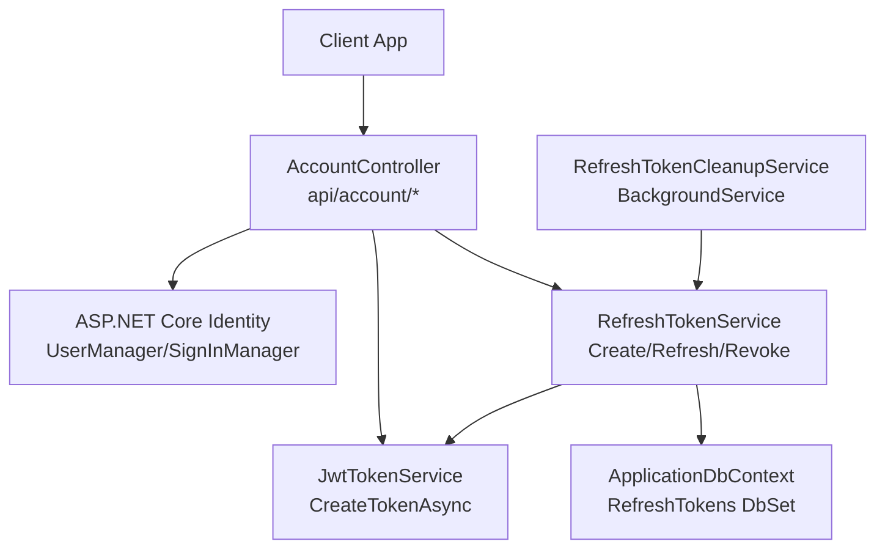
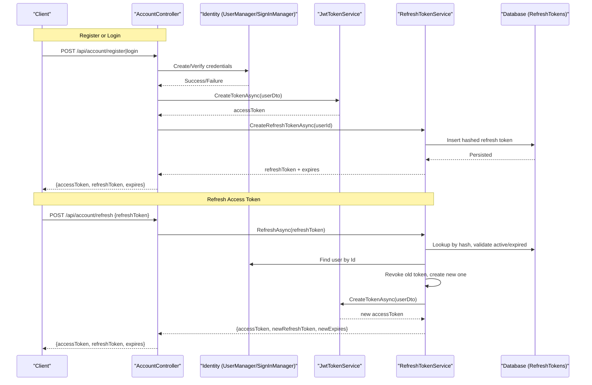
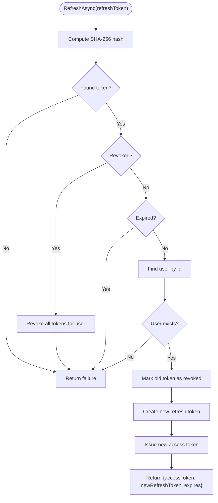
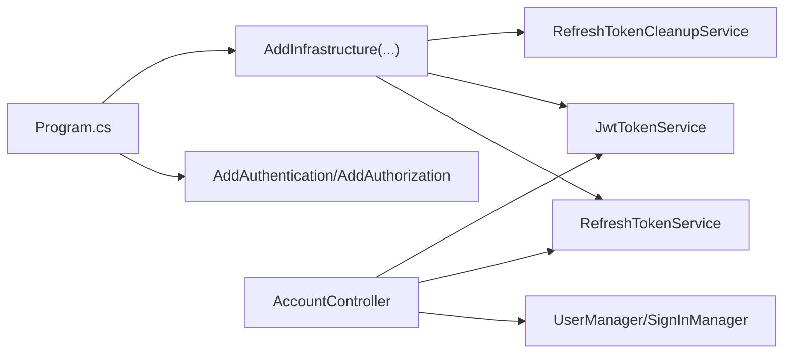

# Authentication & Authorization

<cite>
**Referenced Files in This Document**
- [Program.cs](file://src/Ecommerce.Api/Program.cs)
- [AccountController.cs](file://src/Ecommerce.Api/Controllers/AccountController.cs)
- [JwtTokenService.cs](file://src/Ecommerce.Infrastructure/Auth/JwtTokenService.cs)
- [RefreshTokenService.cs](file://src/Ecommerce.Infrastructure/Services/RefreshTokenService.cs)
- [RefreshTokenCleanupService.cs](file://src/Ecommerce.Infrastructure/Services/RefreshTokenCleanupService.cs)
- [ApplicationUser.cs](file://src/Ecommerce.Infrastructure/Identity/ApplicationUser.cs)
- [ApplicationRole.cs](file://src/Ecommerce.Infrastructure/Identity/ApplicationRole.cs)
- [RefreshToken.cs](file://src/Ecommerce.Domain/Entities/RefreshToken.cs)
- [ITokenService.cs](file://src/Ecommerce.Application/Interfaces/ITokenService.cs)
- [IRefreshTokenService.cs](file://src/Ecommerce.Application/Interfaces/IRefreshTokenService.cs)
- [ApplicationUserDto.cs](file://src/Ecommerce.Application/DTOs/ApplicationUserDto.cs)
- [DependencyInjection.cs](file://src/Ecommerce.Infrastructure/DependencyInjection.cs)
- [ApplicationDbContext.cs](file://src/Ecommerce.Infrastructure/Persistence/ApplicationDbContext.cs)
- [appsettings.Development.json](file://src/Ecommerce.Api/appsettings.Development.json)
</cite>

## Table of Contents
1. [Introduction](#introduction)
2. [Project Structure](#project-structure)
3. [Core Components](#core-components)
4. [Architecture Overview](#architecture-overview)
5. [Detailed Component Analysis](#detailed-component-analysis)
6. [Dependency Analysis](#dependency-analysis)
7. [Performance Considerations](#performance-considerations)
8. [Troubleshooting Guide](#troubleshooting-guide)
9. [Conclusion](#conclusion)
10. [Appendices](#appendices)

## Introduction
This document explains the authentication and authorization implementation for the application, focusing on:
- JWT access token generation and validation
- Refresh token lifecycle and rotation
- Integration with ASP.NET Core Identity for user and role management
- Security best practices, token expiration handling, and operational cleanup
- Configuration options for different environments
- Guidance for multi-factor authentication, password hashing, account lockout policies, and audit logging

The system uses a stateless JWT access token paired with a server-side refresh token stored as a hash to maintain secure sessions.

## Project Structure
Authentication-related code is spread across API controllers, infrastructure services, domain entities, and configuration:
- API layer exposes endpoints for register, login, refresh, revoke, and profile retrieval
- Infrastructure provides JWT token creation, refresh token storage and rotation, and background cleanup
- Domain defines the refresh token entity model
- Application interfaces define contracts for token services
- Program configures Identity, JWT bearer authentication, and authorization middleware

**Diagram sources**
- [AccountController.cs:34-107](file://src/Ecommerce.Api/Controllers/AccountController.cs#L34-L107)
- [JwtTokenService.cs:22-44](file://src/Ecommerce.Infrastructure/Auth/JwtTokenService.cs#L22-L44)
- [RefreshTokenService.cs:28-109](file://src/Ecommerce.Infrastructure/Services/RefreshTokenService.cs#L28-L109)
- [RefreshTokenCleanupService.cs:21-43](file://src/Ecommerce.Infrastructure/Services/RefreshTokenCleanupService.cs#L21-L43)
- [ApplicationDbContext.cs:13-27](file://src/Ecommerce.Infrastructure/Persistence/ApplicationDbContext.cs#L13-L27)

**Section sources**
- [Program.cs:19-55](file://src/Ecommerce.Api/Program.cs#L19-L55)
- [AccountController.cs:34-107](file://src/Ecommerce.Api/Controllers/AccountController.cs#L34-L107)
- [DependencyInjection.cs:76-83](file://src/Ecommerce.Infrastructure/DependencyInjection.cs#L76-L83)

## Core Components
- JwtTokenService: Creates signed JWT access tokens using symmetric key and issuer from configuration.
- RefreshTokenService: Manages refresh token creation, rotation, revocation, and expiration; stores only hashes.
- AccountController: Orchestrates registration, login, refresh, revoke, and profile retrieval using Identity and token services.
- Background cleanup: RefreshTokenCleanupService periodically removes expired refresh tokens.
- Identity models: ApplicationUser and ApplicationRole extend ASP.NET Core Identity types.
- Persistence: ApplicationDbContext includes RefreshTokens table and EF Core configurations.

**Section sources**
- [JwtTokenService.cs:22-44](file://src/Ecommerce.Infrastructure/Auth/JwtTokenService.cs#L22-L44)
- [RefreshTokenService.cs:28-109](file://src/Ecommerce.Infrastructure/Services/RefreshTokenService.cs#L28-L109)
- [AccountController.cs:34-107](file://src/Ecommerce.Api/Controllers/AccountController.cs#L34-L107)
- [RefreshTokenCleanupService.cs:21-43](file://src/Ecommerce.Infrastructure/Services/RefreshTokenCleanupService.cs#L21-L43)
- [ApplicationUser.cs:6-17](file://src/Ecommerce.Infrastructure/Identity/ApplicationUser.cs#L6-L17)
- [ApplicationRole.cs:6-10](file://src/Ecommerce.Infrastructure/Identity/ApplicationRole.cs#L6-L10)
- [RefreshToken.cs:5-17](file://src/Ecommerce.Domain/Entities/RefreshToken.cs#L5-L17)
- [ApplicationDbContext.cs:13-27](file://src/Ecommerce.Infrastructure/Persistence/ApplicationDbContext.cs#L13-L27)

## Architecture Overview
The authentication flow combines ASP.NET Core Identity for credential verification with JWT access tokens and server-side refresh tokens for session maintenance.

**Diagram sources**
- [AccountController.cs:34-107](file://src/Ecommerce.Api/Controllers/AccountController.cs#L34-L107)
- [JwtTokenService.cs:22-44](file://src/Ecommerce.Infrastructure/Auth/JwtTokenService.cs#L22-L44)
- [RefreshTokenService.cs:28-79](file://src/Ecommerce.Infrastructure/Services/RefreshTokenService.cs#L28-L79)
- [ApplicationDbContext.cs:13-27](file://src/Ecommerce.Infrastructure/Persistence/ApplicationDbContext.cs#L13-L27)

## Detailed Component Analysis

### JWT Token Service
Responsibilities:
- Build claims from user DTO
- Sign token with symmetric key and issuer configured via settings
- Set short-lived expiration for access tokens

Key behaviors:
- Uses HMAC-SHA256 signing
- Sets issuer and audience to the configured value
- Expiration set to a short window suitable for access tokens

Security notes:
- Ensure strong secret key in production
- Validate issuer and audience at runtime in JWT bearer options

**Section sources**
- [JwtTokenService.cs:22-44](file://src/Ecommerce.Infrastructure/Auth/JwtTokenService.cs#L22-L44)
- [ITokenService.cs:6-9](file://src/Ecommerce.Application/Interfaces/ITokenService.cs#L6-L9)
- [ApplicationUserDto.cs:5-10](file://src/Ecommerce.Application/DTOs/ApplicationUserDto.cs#L5-L10)

### Refresh Token Service
Responsibilities:
- Generate cryptographically random refresh tokens and store only their SHA-256 hashes
- Rotate tokens on each refresh (revoke old, issue new)
- Revoke single or all tokens for a user
- Remove expired tokens via background service

Flow highlights:
- On refresh: lookup by hash, ensure not revoked or expired, rotate, and issue new access token
- On revoke: mark token as revoked; reuse of revoked token triggers full session invalidation
- Cleanup: scheduled removal of expired tokens

**Diagram sources**
- [RefreshTokenService.cs:50-79](file://src/Ecommerce.Infrastructure/Services/RefreshTokenService.cs#L50-L79)

**Section sources**
- [RefreshTokenService.cs:28-109](file://src/Ecommerce.Infrastructure/Services/RefreshTokenService.cs#L28-L109)
- [RefreshToken.cs:5-17](file://src/Ecommerce.Domain/Entities/RefreshToken.cs#L5-L17)
- [IRefreshTokenService.cs:5-12](file://src/Ecommerce.Application/Interfaces/IRefreshTokenService.cs#L5-L12)

### Account Controller (API Endpoints)
Endpoints:
- POST /api/account/register: Creates user via Identity and issues tokens
- POST /api/account/login: Verifies credentials and issues tokens
- POST /api/account/refresh: Rotates refresh token and returns new access token
- POST /api/account/revoke: Revokes a specific refresh token
- POST /api/account/revoke-all: Revokes all refresh tokens for current user
- GET /api/account/me: Returns current user profile

Authorization:
- Protected endpoints use [Authorize] attribute
- Current user identity extracted from JWT sub claim

**Section sources**
- [AccountController.cs:34-107](file://src/Ecommerce.Api/Controllers/AccountController.cs#L34-L107)

### Identity Models and Roles
- ApplicationUser extends IdentityUser with additional profile fields and verification flags
- ApplicationRole extends IdentityRole with description and creation timestamp
- Role-based authorization can be enforced using ASP.NET Core policy/authorization attributes on controllers/actions

Best practices:
- Define roles and assign users appropriately
- Use policies for fine-grained access control beyond roles when needed

**Section sources**
- [ApplicationUser.cs:6-17](file://src/Ecommerce.Infrastructure/Identity/ApplicationUser.cs#L6-L17)
- [ApplicationRole.cs:6-10](file://src/Ecommerce.Infrastructure/Identity/ApplicationRole.cs#L6-L10)

### Background Cleanup Service
Purpose:
- Periodically remove expired refresh tokens to keep the database lean

Behavior:
- Runs daily, scoped service resolution, logs removed count
- Robust error handling to avoid background task failures

**Section sources**
- [RefreshTokenCleanupService.cs:21-43](file://src/Ecommerce.Infrastructure/Services/RefreshTokenCleanupService.cs#L21-L43)
- [DependencyInjection.cs:82-83](file://src/Ecommerce.Infrastructure/DependencyInjection.cs#L82-L83)

### Database Model for Refresh Tokens
- Stores UserId, hashed token, created/expires timestamps, optional revocation time, and replaced-by hash
- Computed properties indicate activity and expiration status

**Section sources**
- [RefreshToken.cs:5-17](file://src/Ecommerce.Domain/Entities/RefreshToken.cs#L5-L17)
- [ApplicationDbContext.cs:13-27](file://src/Ecommerce.Infrastructure/Persistence/ApplicationDbContext.cs#L13-L27)

## Dependency Analysis
- Program registers Identity, JWT Bearer authentication, and authorization middleware
- DependencyInjection wires up DbContext, command pipeline, refresh token service, JWT token service, and hosted cleanup service
- Controllers depend on Identity managers and token services through constructor injection

**Diagram sources**
- [Program.cs:19-55](file://src/Ecommerce.Api/Program.cs#L19-L55)
- [DependencyInjection.cs:76-83](file://src/Ecommerce.Infrastructure/DependencyInjection.cs#L76-L83)
- [AccountController.cs:17-31](file://src/Ecommerce.Api/Controllers/AccountController.cs#L17-L31)

**Section sources**
- [Program.cs:19-55](file://src/Ecommerce.Api/Program.cs#L19-L55)
- [DependencyInjection.cs:76-83](file://src/Ecommerce.Infrastructure/DependencyInjection.cs#L76-L83)

## Performance Considerations
- Short-lived access tokens reduce exposure risk and minimize validation overhead
- Refresh token rotation ensures each refresh yields a fresh token, limiting replay windows
- Storing only hashed refresh tokens reduces storage size and mitigates token leakage impact
- Background cleanup prevents unbounded growth of refresh token records
- Avoid heavy operations in request path; delegate periodic tasks to background services

[No sources needed since this section provides general guidance]

## Troubleshooting Guide
Common issues and resolutions:
- Invalid token errors: Verify JWT Key and Issuer match between token creation and validation parameters
- Unauthorized on refresh: Ensure refresh token is present, active, and not expired; check that it has not been revoked
- All sessions invalidated: Reuse of a revoked token triggers revocation of all tokens for that user; instruct clients to re-authenticate
- Missing tables: Ensure migrations are applied so RefreshTokens table exists
- Environment misconfiguration: Confirm connection strings and JWT settings per environment

Operational checks:
- Confirm background cleanup service is running and logging removals
- Validate that protected endpoints require authentication and that middleware order is correct

**Section sources**
- [Program.cs:29-48](file://src/Ecommerce.Api/Program.cs#L29-L48)
- [RefreshTokenService.cs:50-79](file://src/Ecommerce.Infrastructure/Services/RefreshTokenService.cs#L50-L79)
- [RefreshTokenCleanupService.cs:21-43](file://src/Ecommerce.Infrastructure/Services/RefreshTokenCleanupService.cs#L21-L43)
- [ApplicationDbContext.cs:13-27](file://src/Ecommerce.Infrastructure/Persistence/ApplicationDbContext.cs#L13-L27)

## Conclusion
The system implements a secure, scalable authentication model combining ASP.NET Core Identity with JWT access tokens and server-side refresh tokens. It enforces token rotation, supports revocation, and includes background cleanup to maintain performance and security. With proper configuration and operational hygiene, this approach provides robust session management and clear separation between short-lived access tokens and long-lived refresh mechanisms.

[No sources needed since this section summarizes without analyzing specific files]

## Appendices

### Configuration Options
- JWT settings:
  - Key: Symmetric signing key used to sign and validate JWTs
  - Issuer: Used as both issuer and audience for token validation
- Connection string:
  - DefaultConnection: Database provider and connection details for EF Core

Environment-specific values should be provided via appsettings.{Environment}.json or environment variables.

**Section sources**
- [appsettings.Development.json:8-14](file://src/Ecommerce.Api/appsettings.Development.json#L8-L14)
- [Program.cs:26-47](file://src/Ecommerce.Api/Program.cs#L26-L47)

### Security Best Practices
- Use strong, randomly generated JWT keys in production
- Keep access tokens short-lived; rely on refresh tokens for renewal
- Store only hashed refresh tokens; never log or expose raw tokens
- Enforce HTTPS in production to protect tokens in transit
- Implement rate limiting and account lockout policies via Identity options
- Log security events (e.g., failed logins, token revocations) for auditing
- Consider adding multi-factor authentication using Identity’s built-in providers

[No sources needed since this section provides general guidance]

### Multi-Factor Authentication Setup
- Enable MFA via ASP.NET Core Identity options and UI flows
- Require MFA enrollment for sensitive operations or privileged roles
- Store MFA recovery codes securely and allow users to manage them

[No sources needed since this section provides general guidance]

### Password Hashing and Account Lockout Policies
- Leverage ASP.NET Core Identity’s default password hasher and lockout settings
- Configure minimum password complexity and lockout thresholds based on organizational policy
- Integrate with external identity providers if required

[No sources needed since this section provides general guidance]

### Audit Logging for Security Events
- Log authentication successes/failures, token refreshes, and revocations
- Correlate events with user identifiers from JWT claims
- Centralize logs and integrate with monitoring/alerting systems

[No sources needed since this section provides general guidance]