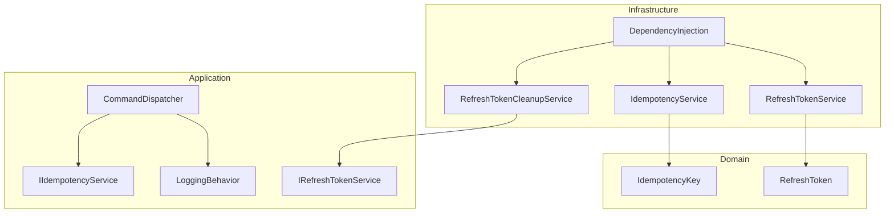
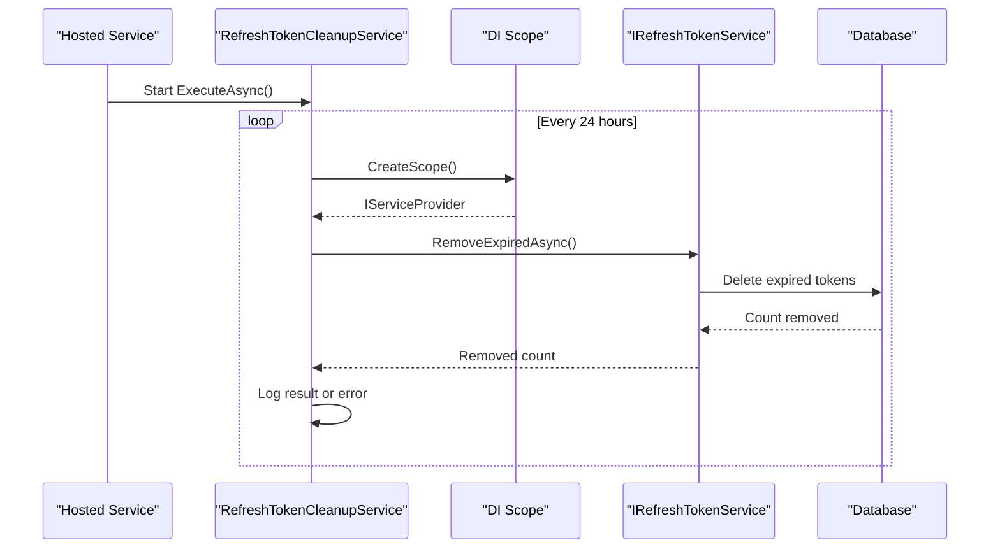
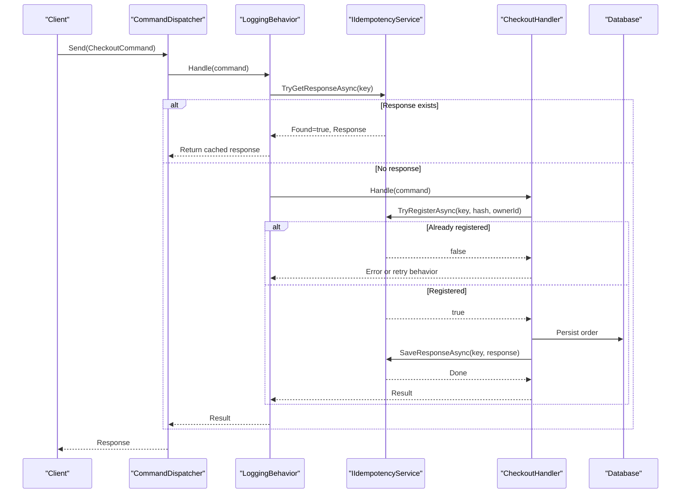
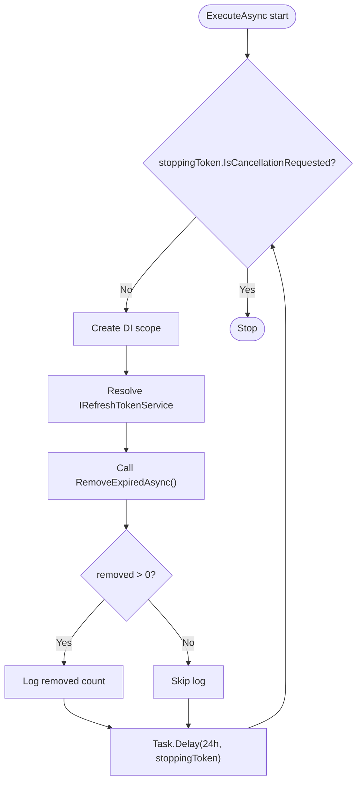
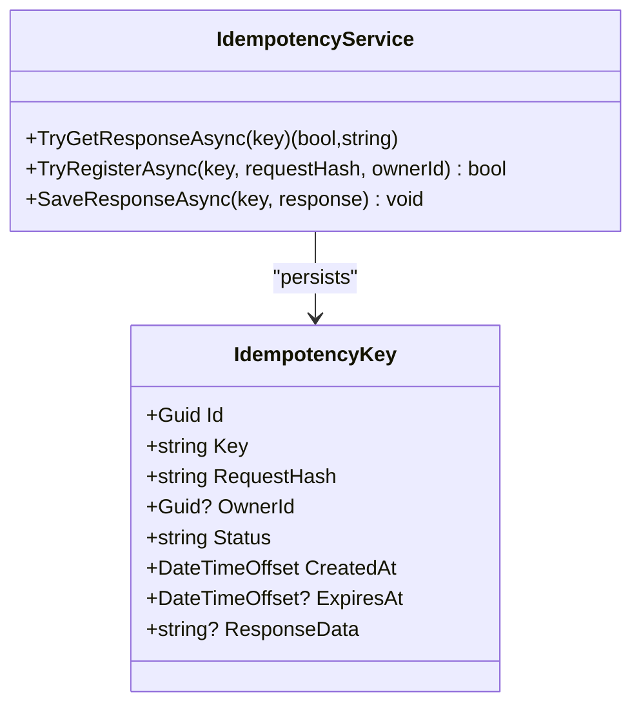
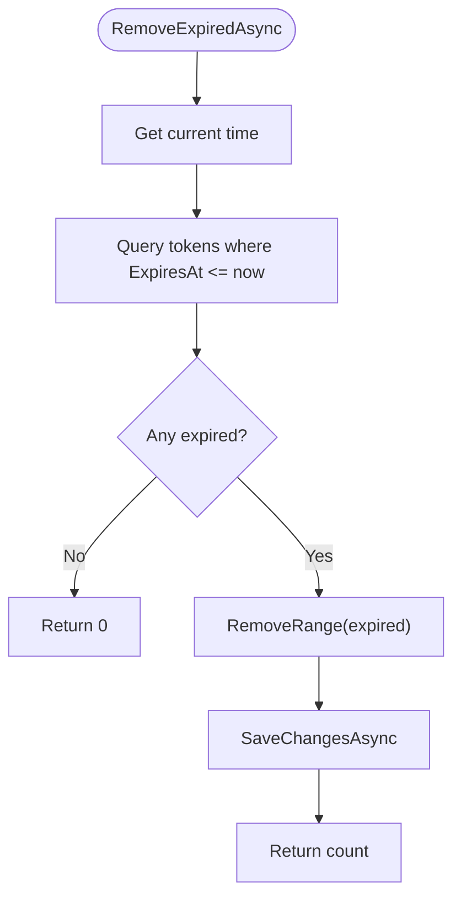
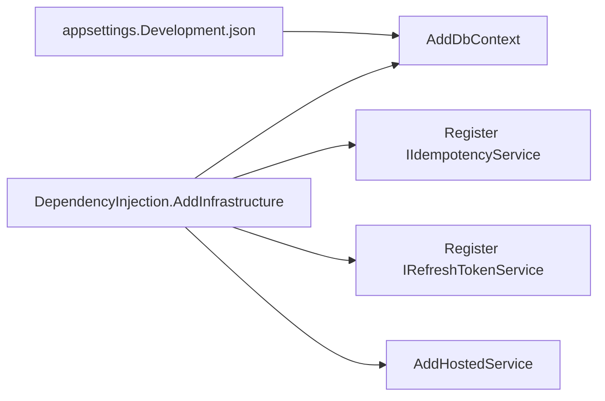
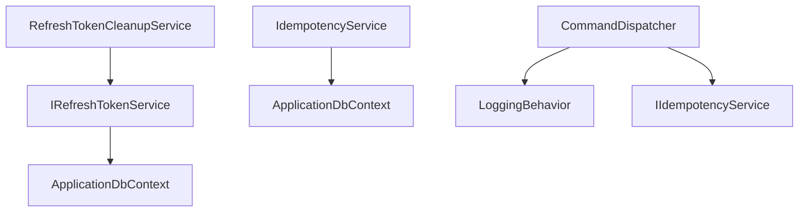

# Background Services

<cite>
**Referenced Files in This Document**
- [RefreshTokenCleanupService.cs](file://src/Ecommerce.Infrastructure/Services/RefreshTokenCleanupService.cs)
- [IdempotencyService.cs](file://src/Ecommerce.Infrastructure/Services/IdempotencyService.cs)
- [DependencyInjection.cs](file://src/Ecommerce.Infrastructure/DependencyInjection.cs)
- [IRefreshTokenService.cs](file://src/Ecommerce.Application/Interfaces/IRefreshTokenService.cs)
- [IIdempotencyService.cs](file://src/Ecommerce.Application/Interfaces/IIdempotencyService.cs)
- [RefreshTokenService.cs](file://src/Ecommerce.Infrastructure/Services/RefreshTokenService.cs)
- [RefreshToken.cs](file://src/Ecommerce.Domain/Entities/RefreshToken.cs)
- [IdempotencyKey.cs](file://src/Ecommerce.Domain/Entities/IdempotencyKey.cs)
- [appsettings.Development.json](file://src/Ecommerce.Api/appsettings.Development.json)
- [LoggingBehavior.cs](file://src/Ecommerce.Application/Common/Commands/LoggingBehavior.cs)
- [CommandDispatcher.cs](file://src/Ecommerce.Application/Common/Commands/CommandDispatcher.cs)
- [CheckoutIdempotencyTests.cs](file://tests/Ecommerce.Application.Tests/CheckoutIdempotencyTests.cs)
- [RefreshTokenIntegrationTests.cs](file://tests/Ecommerce.IntegrationTests/RefreshTokenIntegrationTests.cs)
</cite>

## Table of Contents
1. Introduction
2. Project Structure
3. Core Components
4. Architecture Overview
5. Detailed Component Analysis
6. Dependency Analysis
7. Performance Considerations
8. Troubleshooting Guide
9. Conclusion
10. Appendices

## Introduction
This document explains the background services and scheduled tasks that maintain system hygiene and reliability:
- RefreshTokenCleanupService: a hosted background service that periodically removes expired refresh tokens to keep the database clean and secure.
- IdempotencyService: ensures operations are executed at most once by tracking idempotency keys and responses, preventing duplicate processing under retries or network issues.

It also covers how these services are registered in the dependency injection container, configuration options, monitoring approaches, error handling, logging strategies, graceful shutdown, scalability considerations for distributed execution, failure recovery mechanisms, and testing approaches.

## Project Structure
The background services live in the Infrastructure layer and integrate with Application interfaces and Domain entities:
- Background service: RefreshTokenCleanupService (hosted service)
- Business logic: RefreshTokenService (token lifecycle and cleanup)
- Idempotency: IdempotencyService (key registration, response caching)
- DI registration: DependencyInjection (service registrations and hosted service wiring)
- Configuration: appsettings.Development.json (logging levels, connection strings)
- Tests: unit/integration tests validating idempotency and token lifecycle

**Diagram sources**
- [RefreshTokenCleanupService.cs:10-44](file://src/Ecommerce.Infrastructure/Services/RefreshTokenCleanupService.cs#L10-L44)
- [IdempotencyService.cs:10-54](file://src/Ecommerce.Infrastructure/Services/IdempotencyService.cs#L10-L54)
- [RefreshTokenService.cs:15-109](file://src/Ecommerce.Infrastructure/Services/RefreshTokenService.cs#L15-L109)
- [DependencyInjection.cs:73-83](file://src/Ecommerce.Infrastructure/DependencyInjection.cs#L73-L83)
- [IRefreshTokenService.cs:5-12](file://src/Ecommerce.Application/Interfaces/IRefreshTokenService.cs#L5-L12)
- [IIdempotencyService.cs:6-11](file://src/Ecommerce.Application/Interfaces/IIdempotencyService.cs#L6-L11)
- [RefreshToken.cs:5-17](file://src/Ecommerce.Domain/Entities/RefreshToken.cs#L5-L17)
- [IdempotencyKey.cs:5-15](file://src/Ecommerce.Domain/Entities/IdempotencyKey.cs#L5-L15)
- [CommandDispatcher.cs:20-32](file://src/Ecommerce.Application/Common/Commands/CommandDispatcher.cs#L20-L32)
- [LoggingBehavior.cs:17-31](file://src/Ecommerce.Application/Common/Commands/LoggingBehavior.cs#L17-L31)

**Section sources**
- [RefreshTokenCleanupService.cs:10-44](file://src/Ecommerce.Infrastructure/Services/RefreshTokenCleanupService.cs#L10-L44)
- [IdempotencyService.cs:10-54](file://src/Ecommerce.Infrastructure/Services/IdempotencyService.cs#L10-L54)
- [DependencyInjection.cs:73-83](file://src/Ecommerce.Infrastructure/DependencyInjection.cs#L73-L83)

## Core Components
- RefreshTokenCleanupService: Hosted background service that runs every 24 hours, creates a scoped service provider, resolves IRefreshTokenService, and calls RemoveExpiredAsync to delete expired tokens. It logs results and errors and respects cancellation on shutdown.
- IdempotencyService: Persists idempotency keys and optional responses to prevent duplicate operations. Provides TryGetResponseAsync, TryRegisterAsync, and SaveResponseAsync.
- RefreshTokenService: Implements token creation, rotation, revocation, bulk revocation, and cleanup. Stores hashed tokens and tracks replacements.
- DependencyInjection: Registers DbContext, application handlers, validators, services, and the hosted RefreshTokenCleanupService.

**Section sources**
- [RefreshTokenCleanupService.cs:21-43](file://src/Ecommerce.Infrastructure/Services/RefreshTokenCleanupService.cs#L21-L43)
- [IdempotencyService.cs:19-54](file://src/Ecommerce.Infrastructure/Services/IdempotencyService.cs#L19-L54)
- [RefreshTokenService.cs:28-109](file://src/Ecommerce.Infrastructure/Services/RefreshTokenService.cs#L28-L109)
- [DependencyInjection.cs:73-83](file://src/Ecommerce.Infrastructure/DependencyInjection.cs#L73-L83)

## Architecture Overview
The background service orchestrates periodic maintenance via DI-scoped resolution, while command pipelines use idempotency to ensure safe retries.

**Diagram sources**
- [RefreshTokenCleanupService.cs:21-43](file://src/Ecommerce.Infrastructure/Services/RefreshTokenCleanupService.cs#L21-L43)
- [RefreshTokenService.cs:101-109](file://src/Ecommerce.Infrastructure/Services/RefreshTokenService.cs#L101-L109)

**Diagram sources**
- [CommandDispatcher.cs:20-32](file://src/Ecommerce.Application/Common/Commands/CommandDispatcher.cs#L20-L32)
- [LoggingBehavior.cs:17-31](file://src/Ecommerce.Application/Common/Commands/LoggingBehavior.cs#L17-L31)
- [IdempotencyService.cs:19-54](file://src/Ecommerce.Infrastructure/Services/IdempotencyService.cs#L19-L54)

## Detailed Component Analysis

### RefreshTokenCleanupService
- Purpose: Periodically remove expired refresh tokens to maintain database hygiene and security posture.
- Execution model: Inherits from BackgroundService; loops with a 24-hour delay; uses CancellationToken for graceful shutdown.
- DI usage: Creates a scope per iteration to resolve IRefreshTokenService safely.
- Logging: Logs number of removed tokens and errors with structured messages.
- Error handling: Wraps each iteration in try/catch to avoid killing the background loop.

**Diagram sources**
- [RefreshTokenCleanupService.cs:21-43](file://src/Ecommerce.Infrastructure/Services/RefreshTokenCleanupService.cs#L21-L43)

**Section sources**
- [RefreshTokenCleanupService.cs:10-44](file://src/Ecommerce.Infrastructure/Services/RefreshTokenCleanupService.cs#L10-L44)

### IdempotencyService
- Purpose: Prevent duplicate operations by registering unique idempotency keys and optionally caching responses.
- Key methods:
  - TryGetResponseAsync: returns existing response if present.
  - TryRegisterAsync: registers a key only if not already present; persists status and metadata.
  - SaveResponseAsync: stores response and marks status completed.
- Data model: Uses IdempotencyKey entity with fields for key, request hash, owner, status, timestamps, and optional response data.

**Diagram sources**
- [IdempotencyService.cs:10-54](file://src/Ecommerce.Infrastructure/Services/IdempotencyService.cs#L10-L54)
- [IdempotencyKey.cs:5-15](file://src/Ecommerce.Domain/Entities/IdempotencyKey.cs#L5-L15)

**Section sources**
- [IdempotencyService.cs:19-54](file://src/Ecommerce.Infrastructure/Services/IdempotencyService.cs#L19-L54)
- [IdempotencyKey.cs:5-15](file://src/Ecommerce.Domain/Entities/IdempotencyKey.cs#L5-L15)

### RefreshTokenService
- Purpose: Manage refresh token lifecycle including creation, rotation, revocation, and cleanup.
- Security: Stores SHA-256 hashes of tokens; supports replacement tracking when rotating tokens.
- Cleanup: RemoveExpiredAsync deletes all tokens whose expiration is in the past.

**Diagram sources**
- [RefreshTokenService.cs:101-109](file://src/Ecommerce.Infrastructure/Services/RefreshTokenService.cs#L101-L109)

**Section sources**
- [RefreshTokenService.cs:28-109](file://src/Ecommerce.Infrastructure/Services/RefreshTokenService.cs#L28-L109)
- [RefreshToken.cs:5-17](file://src/Ecommerce.Domain/Entities/RefreshToken.cs#L5-L17)

### Service Registration and Configuration
- DI registration:
  - DbContext configured with SQL Server using connection string name DefaultConnection.
  - IIdempotencyService and IRefreshTokenService registered as scoped.
  - RefreshTokenCleanupService registered as a hosted service via AddHostedService.
- Configuration:
  - Logging level set to Debug for development.
  - Connection string provided for database access.

**Diagram sources**
- [DependencyInjection.cs:15-20](file://src/Ecommerce.Infrastructure/DependencyInjection.cs#L15-L20)
- [DependencyInjection.cs:73-83](file://src/Ecommerce.Infrastructure/DependencyInjection.cs#L73-L83)
- [appsettings.Development.json:1-15](file://src/Ecommerce.Api/appsettings.Development.json#L1-L15)

**Section sources**
- [DependencyInjection.cs:15-20](file://src/Ecommerce.Infrastructure/DependencyInjection.cs#L15-L20)
- [DependencyInjection.cs:73-83](file://src/Ecommerce.Infrastructure/DependencyInjection.cs#L73-L83)
- [appsettings.Development.json:1-15](file://src/Ecommerce.Api/appsettings.Development.json#L1-L15)

## Dependency Analysis
- RefreshTokenCleanupService depends on:
  - IServiceProvider to create scopes
  - ILogger for structured logging
  - IRefreshTokenService to perform cleanup
- IdempotencyService depends on:
  - ApplicationDbContext for persistence
  - IdempotencyKey domain entity
- Command pipeline depends on:
  - CommandDispatcher to route commands
  - LoggingBehavior for request-level observability
  - IIdempotencyService for deduplication

**Diagram sources**
- [RefreshTokenCleanupService.cs:12-18](file://src/Ecommerce.Infrastructure/Services/RefreshTokenCleanupService.cs#L12-L18)
- [RefreshTokenService.cs:17-25](file://src/Ecommerce.Infrastructure/Services/RefreshTokenService.cs#L17-L25)
- [IdempotencyService.cs:12-16](file://src/Ecommerce.Infrastructure/Services/IdempotencyService.cs#L12-L16)
- [CommandDispatcher.cs:11-17](file://src/Ecommerce.Application/Common/Commands/CommandDispatcher.cs#L11-L17)
- [LoggingBehavior.cs:10-14](file://src/Ecommerce.Application/Common/Commands/LoggingBehavior.cs#L10-L14)

**Section sources**
- [RefreshTokenCleanupService.cs:12-18](file://src/Ecommerce.Infrastructure/Services/RefreshTokenCleanupService.cs#L12-L18)
- [IdempotencyService.cs:12-16](file://src/Ecommerce.Infrastructure/Services/IdempotencyService.cs#L12-L16)
- [CommandDispatcher.cs:11-17](file://src/Ecommerce.Application/Common/Commands/CommandDispatcher.cs#L11-L17)

## Performance Considerations
- Background service interval: The cleanup runs every 24 hours. For high-volume systems, consider making this configurable and reducing the interval during peak growth periods.
- Database load: RemoveExpiredAsync queries and deletes potentially large sets. Ensure appropriate indexes exist on ExpiresAt and UserId to optimize scans and deletions.
- Transaction boundaries: Each operation uses its own save changes; batch deletions are efficient but monitor transaction size and memory usage for very large datasets.
- Idempotency storage: IdempotencyKey table can grow over time. Implement retention policies or TTL-based cleanup to control growth.
- Concurrency: Idempotency registration uses uniqueness checks; ensure database constraints or transactions prevent race conditions in multi-instance deployments.

[No sources needed since this section provides general guidance]

## Troubleshooting Guide
- Background service not running:
  - Verify AddHostedService registration in DependencyInjection.
  - Check host startup logs for service initialization.
- Cleanup not removing tokens:
  - Confirm RemoveExpiredAsync logic and database state (ExpiresAt values).
  - Validate that the service has permissions to delete rows.
- Duplicate operations despite idempotency:
  - Ensure callers generate stable idempotency keys per request intent.
  - Verify TryRegisterAsync is called before business logic and SaveResponseAsync after completion.
  - Inspect IdempotencyKey records for duplicates or missing entries.
- Logging and diagnostics:
  - Use LoggingBehavior to trace command entry/exit and exceptions.
  - Review RefreshTokenCleanupService logs for removal counts and errors.
  - Adjust LogLevel in appsettings.Development.json for more verbose output.

**Section sources**
- [DependencyInjection.cs:73-83](file://src/Ecommerce.Infrastructure/DependencyInjection.cs#L73-L83)
- [RefreshTokenService.cs:101-109](file://src/Ecommerce.Infrastructure/Services/RefreshTokenService.cs#L101-L109)
- [IdempotencyService.cs:19-54](file://src/Ecommerce.Infrastructure/Services/IdempotencyService.cs#L19-L54)
- [LoggingBehavior.cs:17-31](file://src/Ecommerce.Application/Common/Commands/LoggingBehavior.cs#L17-L31)
- [appsettings.Development.json:1-15](file://src/Ecommerce.Api/appsettings.Development.json#L1-L15)

## Conclusion
RefreshTokenCleanupService and IdempotencyService provide essential operational guarantees:
- Regular cleanup keeps authentication artifacts secure and databases lean.
- Idempotency prevents costly duplicate operations and improves resilience under retries.
Together, they form a robust foundation for reliable background maintenance and safe command processing. Proper configuration, logging, and testing ensure predictable behavior across environments.

[No sources needed since this section summarizes without analyzing specific files]

## Appendices

### Monitoring Approaches
- Structured logging:
  - Background service logs removal counts and errors.
  - Command pipeline logs command handling and exceptions.
- Metrics and health:
  - Expose counters for tokens removed per run and idempotency hits/misses.
  - Add health checks to verify database connectivity and background service liveness.

[No sources needed since this section provides general guidance]

### Graceful Shutdown Procedures
- Background service respects CancellationToken and stops waiting between iterations.
- Ensure long-running operations are cancellable and do not block shutdown.
- Flush logs and metrics before process termination.

**Section sources**
- [RefreshTokenCleanupService.cs:21-43](file://src/Ecommerce.Infrastructure/Services/RefreshTokenCleanupService.cs#L21-L43)

### Scalability and Distributed Task Execution
- Single-host background service:
  - Suitable for single-instance deployments.
- Multi-instance deployments:
  - Use a distributed lock or external scheduler (e.g., Azure Timer Functions, Hangfire, Quartz.NET) to coordinate cleanup across instances.
  - Ensure idempotency keys are globally unique and persisted in a shared store.
- Partitioning:
  - Shard cleanup by user or tenant to reduce contention.
- Backpressure:
  - Batch deletions and respect timeouts to avoid long-running transactions.

[No sources needed since this section provides general guidance]

### Failure Recovery Mechanisms
- Retry strategy:
  - Wrap cleanup calls with exponential backoff for transient failures.
- Dead lettering:
  - Record failed cleanup attempts with details for later inspection.
- Observability:
  - Alert on repeated failures or unusually high numbers of expired tokens.

[No sources needed since this section provides general guidance]

### Testing Approaches
- Unit tests:
  - Validate IdempotencyService behavior with in-memory context and assertions on order counts and idempotency key states.
- Integration tests:
  - Exercise full token lifecycle: create, refresh, revoke, revoke-all, and cleanup.
  - Verify revoked token reuse triggers revocation of all user tokens.
- Test utilities:
  - In-memory database for fast, isolated tests.
  - Fake token service to isolate JWT generation.

**Section sources**
- [CheckoutIdempotencyTests.cs:22-53](file://tests/Ecommerce.Application.Tests/CheckoutIdempotencyTests.cs#L22-L53)
- [RefreshTokenIntegrationTests.cs:60-141](file://tests/Ecommerce.IntegrationTests/RefreshTokenIntegrationTests.cs#L60-L141)
- [RefreshTokenIntegrationTests.cs:143-178](file://tests/Ecommerce.IntegrationTests/RefreshTokenIntegrationTests.cs#L143-L178)