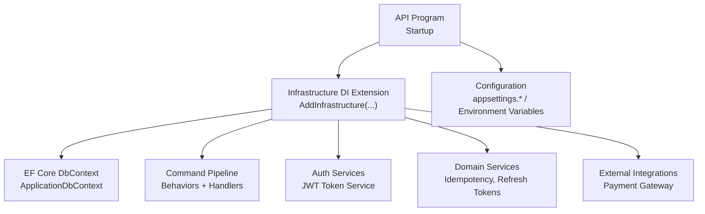
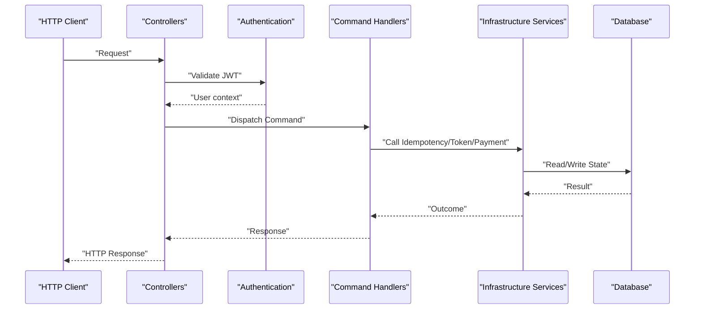
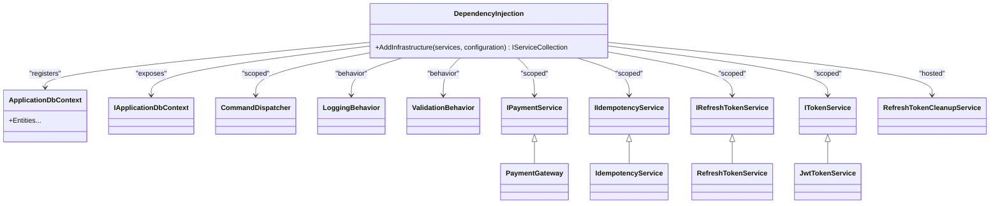
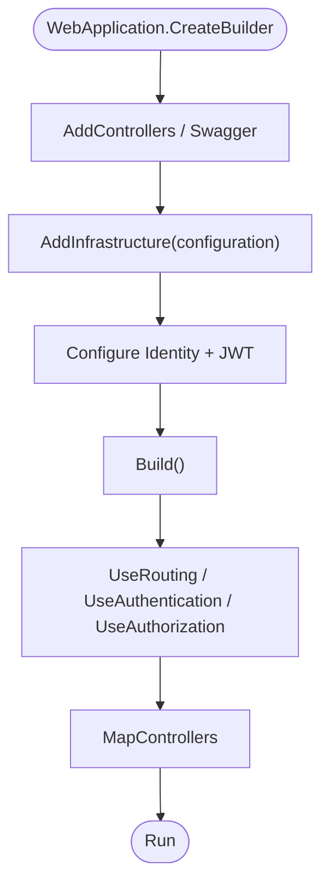
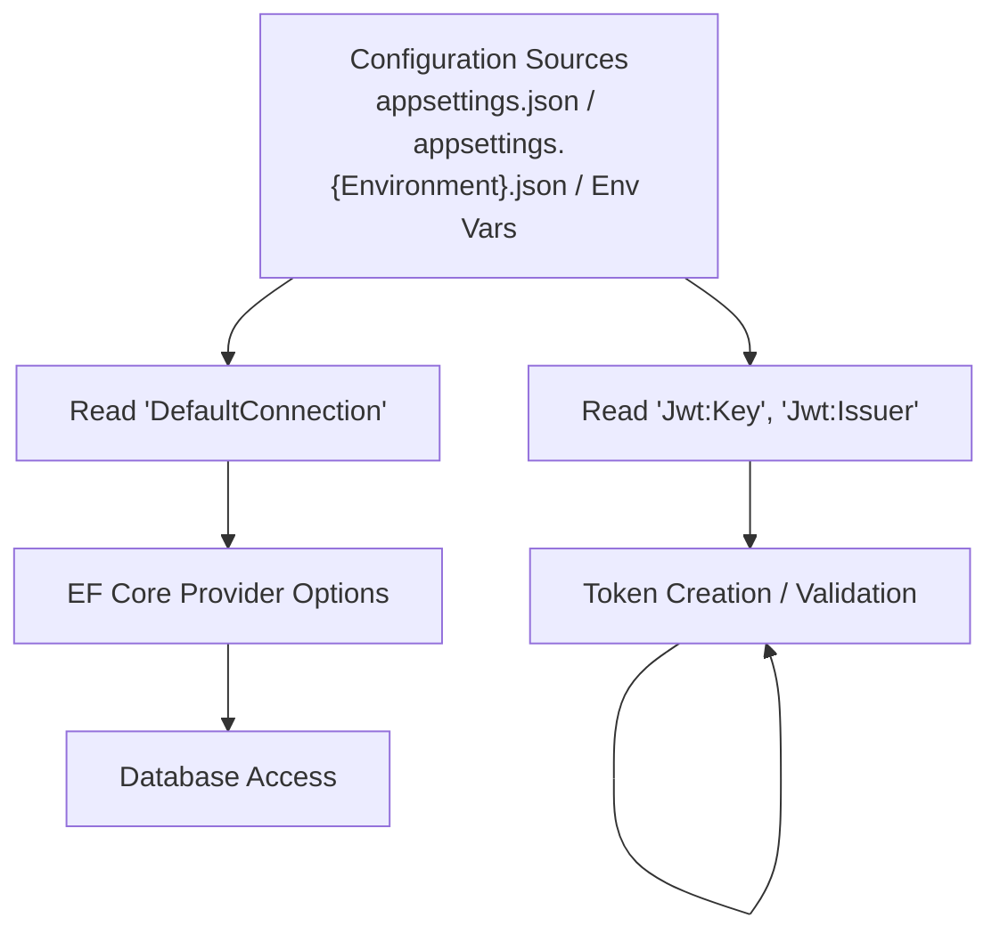
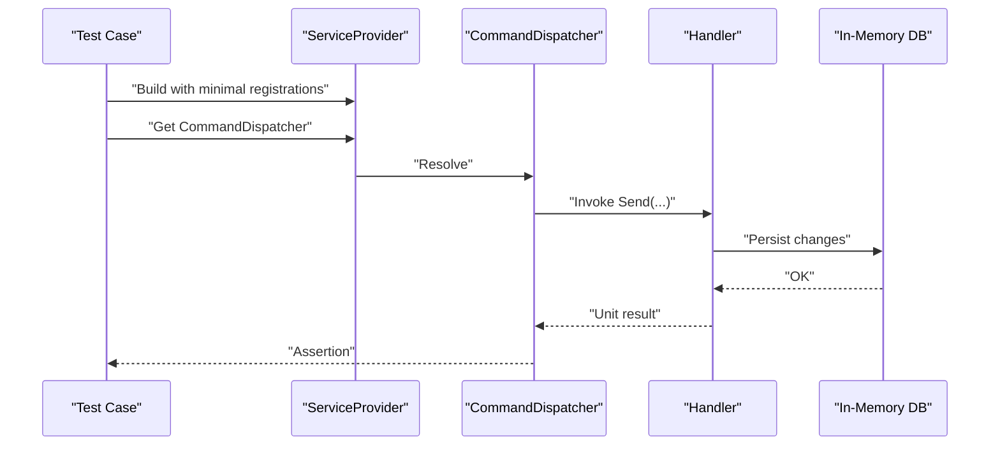
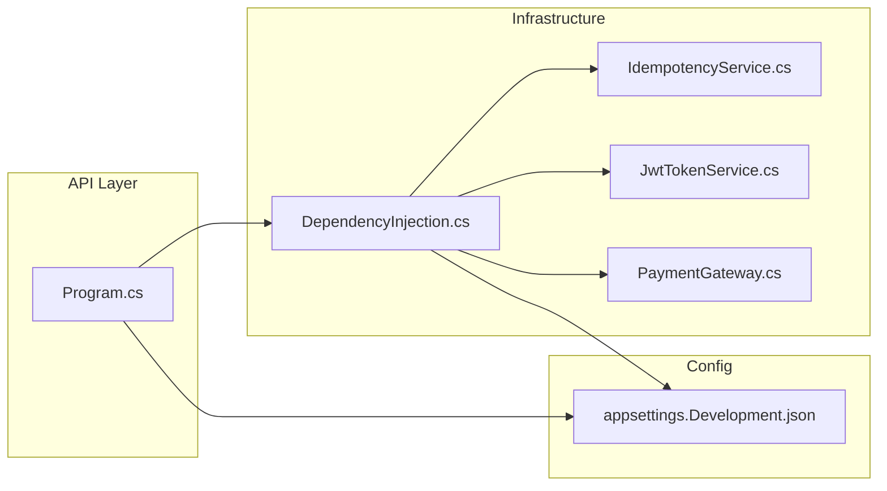

# Dependency Injection & Configuration

<cite>
**Referenced Files in This Document**
- [DependencyInjection.cs](file://src/Ecommerce.Infrastructure/DependencyInjection.cs)
- [Program.cs](file://src/Ecommerce.Api/Program.cs)
- [appsettings.Development.json](file://src/Ecommerce.Api/appsettings.Development.json)
- [IdempotencyService.cs](file://src/Ecommerce.Infrastructure/Services/IdempotencyService.cs)
- [JwtTokenService.cs](file://src/Ecommerce.Infrastructure/Auth/JwtTokenService.cs)
- [PaymentGateway.cs](file://src/Ecommerce.Infrastructure/Payments/PaymentGateway.cs)
- [DispatcherReserveInventoryTests.cs](file://tests/Ecommerce.Application.Tests/DispatcherReserveInventoryTests.cs)
</cite>

## Table of Contents
1. [Introduction](#introduction)
2. [Project Structure](#project-structure)
3. [Core Components](#core-components)
4. [Architecture Overview](#architecture-overview)
5. [Detailed Component Analysis](#detailed-component-analysis)
6. [Dependency Analysis](#dependency-analysis)
7. [Performance Considerations](#performance-considerations)
8. [Troubleshooting Guide](#troubleshooting-guide)
9. [Conclusion](#conclusion)
10. [Appendices](#appendices)

## Introduction
This document explains how dependency injection (DI) is configured and how services are registered in the application. It focuses on the infrastructure DI extension, lifetime management (transient, scoped, singleton), configuration binding, environment-specific settings, secrets management, modular registration via extension methods, conditional activation, testing setup patterns, and performance implications.

## Project Structure
The DI configuration spans two primary locations:
- Infrastructure layer: a centralized extension method that registers data access, command pipeline behaviors, validators, token/payment services, and hosted background services.
- API layer: application bootstrap that wires up controllers, Swagger, authentication, authorization, and invokes the infrastructure registration.

**Diagram sources**
- [Program.cs:9-17](file://src/Ecommerce.Api/Program.cs#L9-L17)
- [DependencyInjection.cs:11-85](file://src/Ecommerce.Infrastructure/DependencyInjection.cs#L11-L85)

**Section sources**
- [Program.cs:9-17](file://src/Ecommerce.Api/Program.cs#L9-L17)
- [DependencyInjection.cs:11-85](file://src/Ecommerce.Infrastructure/DependencyInjection.cs#L11-L85)

## Core Components
- Infrastructure DI extension: centralizes service registrations for EF Core, command pipeline, validation, auth, idempotency, refresh tokens, payment gateway, and a hosted cleanup service.
- API bootstrap: configures middleware pipeline, authentication/authorization, and calls the infrastructure registration.
- Configuration: connection strings and JWT settings are loaded from configuration files and environment variables.

Key responsibilities:
- Register DbContext with a provider based on configuration.
- Expose application interfaces implemented by infrastructure services.
- Wire command handlers and behaviors for cross-cutting concerns (logging, validation).
- Provide optional integrations (FluentValidation, AutoMapper) with graceful fallbacks.
- Register background services to run during application lifetime.

**Section sources**
- [DependencyInjection.cs:11-85](file://src/Ecommerce.Infrastructure/DependencyInjection.cs#L11-L85)
- [Program.cs:9-17](file://src/Ecommerce.Api/Program.cs#L9-L17)

## Architecture Overview
The application uses a layered architecture where the API layer depends on the Application layer abstractions and the Infrastructure layer provides concrete implementations. DI binds these layers at runtime.

**Diagram sources**
- [Program.cs:20-59](file://src/Ecommerce.Api/Program.cs#L20-L59)
- [DependencyInjection.cs:27-83](file://src/Ecommerce.Infrastructure/DependencyInjection.cs#L27-L83)
- [IdempotencyService.cs:19-54](file://src/Ecommerce.Infrastructure/Services/IdempotencyService.cs#L19-L54)

## Detailed Component Analysis

### Infrastructure DI Extension
Centralizes all infrastructure-related registrations. Responsibilities include:
- Registering EF Core DbContext and exposing an interface for the Application layer.
- Registering command dispatcher and pipeline behaviors (logging, validation).
- Optionally registering FluentValidation validators and adapters when available.
- Registering AutoMapper profiles if present.
- Registering command handlers for domain operations.
- Registering infrastructure services: payment gateway, idempotency, refresh tokens, JWT token service.
- Adding a hosted service for periodic cleanup.

Lifetime summary:
- Scoped: DbContext, command dispatcher, behaviors, handlers, infrastructure services.
- Transient: FluentValidation validators and their adapters.
- Singleton: Hosted service lifecycle managed by the framework.

**Diagram sources**
- [DependencyInjection.cs:11-85](file://src/Ecommerce.Infrastructure/DependencyInjection.cs#L11-L85)
- [IdempotencyService.cs:10-54](file://src/Ecommerce.Infrastructure/Services/IdempotencyService.cs#L10-L54)
- [JwtTokenService.cs:13-45](file://src/Ecommerce.Infrastructure/Auth/JwtTokenService.cs#L13-L45)
- [PaymentGateway.cs:8-22](file://src/Ecommerce.Infrastructure/Payments/PaymentGateway.cs#L8-L22)

**Section sources**
- [DependencyInjection.cs:11-85](file://src/Ecommerce.Infrastructure/DependencyInjection.cs#L11-L85)

### API Bootstrap and Authentication
The API project sets up controllers, Swagger, and invokes the infrastructure registration. It also configures Identity and JWT authentication with configuration-driven keys and issuers.

**Diagram sources**
- [Program.cs:9-17](file://src/Ecommerce.Api/Program.cs#L9-L17)
- [Program.cs:20-59](file://src/Ecommerce.Api/Program.cs#L20-L59)
- [Program.cs:61-76](file://src/Ecommerce.Api/Program.cs#L61-L76)

**Section sources**
- [Program.cs:9-17](file://src/Ecommerce.Api/Program.cs#L9-L17)
- [Program.cs:20-59](file://src/Ecommerce.Api/Program.cs#L20-L59)
- [Program.cs:61-76](file://src/Ecommerce.Api/Program.cs#L61-L76)

### Configuration Binding and Secrets Management
- Connection strings and JWT settings are read from configuration sources.
- Development settings are provided in an environment-specific file.
- In production, use environment variables or secret managers to supply sensitive values such as JWT keys and connection strings.

**Diagram sources**
- [DependencyInjection.cs:15-19](file://src/Ecommerce.Infrastructure/DependencyInjection.cs#L15-L19)
- [Program.cs:26-47](file://src/Ecommerce.Api/Program.cs#L26-L47)
- [appsettings.Development.json:8-14](file://src/Ecommerce.Api/appsettings.Development.json#L8-L14)

**Section sources**
- [DependencyInjection.cs:15-19](file://src/Ecommerce.Infrastructure/DependencyInjection.cs#L15-L19)
- [Program.cs:26-47](file://src/Ecommerce.Api/Program.cs#L26-L47)
- [appsettings.Development.json:8-14](file://src/Ecommerce.Api/appsettings.Development.json#L8-L14)

### Modular Registration and Conditional Activation
- The infrastructure registration is encapsulated in an extension method to keep startup clean and modular.
- Optional packages (e.g., FluentValidation, AutoMapper) are conditionally registered using try/catch blocks so the application can start without them installed.
- Additional handler registrations are duplicated in the API layer for convenience; prefer consolidating into the infrastructure extension for maintainability.

Best practices:
- Keep each feature’s registrations in its own extension method and compose them in startup.
- Use conditional registration only when truly optional; otherwise, fail fast at startup if required dependencies are missing.

**Section sources**
- [DependencyInjection.cs:35-63](file://src/Ecommerce.Infrastructure/DependencyInjection.cs#L35-L63)
- [Program.cs:57-59](file://src/Ecommerce.Api/Program.cs#L57-L59)

### Testing Setup with Isolated Containers
- Unit tests build a minimal ServiceProvider with in-memory database and required handlers to isolate behavior under test.
- Tests register only what is needed for the scenario, demonstrating how to override or stub services for deterministic outcomes.

**Diagram sources**
- [DispatcherReserveInventoryTests.cs:17-27](file://tests/Ecommerce.Application.Tests/DispatcherReserveInventoryTests.cs#L17-L27)
- [DispatcherReserveInventoryTests.cs:30-54](file://tests/Ecommerce.Application.Tests/DispatcherReserveInventoryTests.cs#L30-L54)

**Section sources**
- [DispatcherReserveInventoryTests.cs:17-27](file://tests/Ecommerce.Application.Tests/DispatcherReserveInventoryTests.cs#L17-L27)
- [DispatcherReserveInventoryTests.cs:30-54](file://tests/Ecommerce.Application.Tests/DispatcherReserveInventoryTests.cs#L30-L54)

## Dependency Analysis
The following diagram shows key runtime dependencies resolved through DI.

**Diagram sources**
- [Program.cs:9-17](file://src/Ecommerce.Api/Program.cs#L9-L17)
- [DependencyInjection.cs:11-85](file://src/Ecommerce.Infrastructure/DependencyInjection.cs#L11-L85)
- [appsettings.Development.json:8-14](file://src/Ecommerce.Api/appsettings.Development.json#L8-L14)

**Section sources**
- [Program.cs:9-17](file://src/Ecommerce.Api/Program.cs#L9-L17)
- [DependencyInjection.cs:11-85](file://src/Ecommerce.Infrastructure/DependencyInjection.cs#L11-L85)

## Performance Considerations
- Prefer scoped lifetimes for request-scoped state (e.g., DbContext, command handlers) to avoid memory leaks and ensure thread safety per request.
- Avoid singletons for services that hold per-request state; they should be stateless or rely on scoped dependencies.
- Minimize transient registrations for heavy objects; reuse via scoped where appropriate.
- Defer expensive initialization until first use or use lazy loading patterns.
- Keep optional integrations behind conditional registration to reduce startup overhead when not used.
- Use in-memory databases only for tests; production should use real providers with proper connection pooling.

[No sources needed since this section provides general guidance]

## Troubleshooting Guide
Common issues and resolutions:
- Missing connection string: Ensure the correct connection string name exists in configuration for the active environment.
- JWT misconfiguration: Verify issuer and signing key match between token creation and validation.
- Optional packages not installed: If FluentValidation or AutoMapper are missing, the application starts but those features are skipped; install packages to enable full functionality.
- Duplicate handler registrations: Consolidate handler registrations into the infrastructure extension to avoid confusion.

**Section sources**
- [DependencyInjection.cs:15-19](file://src/Ecommerce.Infrastructure/DependencyInjection.cs#L15-L19)
- [Program.cs:26-47](file://src/Ecommerce.Api/Program.cs#L26-L47)
- [DependencyInjection.cs:35-63](file://src/Ecommerce.Infrastructure/DependencyInjection.cs#L35-L63)
- [Program.cs:57-59](file://src/Ecommerce.Api/Program.cs#L57-L59)

## Conclusion
The DI configuration centralizes infrastructure concerns in a single extension method, promoting modularity and clarity. Lifetimes are chosen to align with usage patterns: scoped for request-bound services, transient for lightweight validators, and framework-managed lifetimes for hosted services. Configuration is environment-aware, enabling safe local development while supporting secure production deployments. Adopting modular extensions and consistent lifetime choices will improve maintainability and performance over time.

[No sources needed since this section summarizes without analyzing specific files]

## Appendices

### Lifetime Reference
- Transient: Validators and adapters created per resolution.
- Scoped: DbContext, command dispatcher, behaviors, handlers, infrastructure services.
- Singleton: Framework-managed hosted service lifecycle.

**Section sources**
- [DependencyInjection.cs:23-83](file://src/Ecommerce.Infrastructure/DependencyInjection.cs#L23-L83)

### Example Service Usage Paths
- Idempotency: Used by command handlers to prevent duplicate processing.
- JWT Token: Creates and validates tokens using configuration-driven keys and issuers.
- Payment Gateway: Stub implementation for development; replace with provider in production.

**Section sources**
- [IdempotencyService.cs:19-54](file://src/Ecommerce.Infrastructure/Services/IdempotencyService.cs#L19-L54)
- [JwtTokenService.cs:22-45](file://src/Ecommerce.Infrastructure/Auth/JwtTokenService.cs#L22-L45)
- [PaymentGateway.cs:10-22](file://src/Ecommerce.Infrastructure/Payments/PaymentGateway.cs#L10-L22)