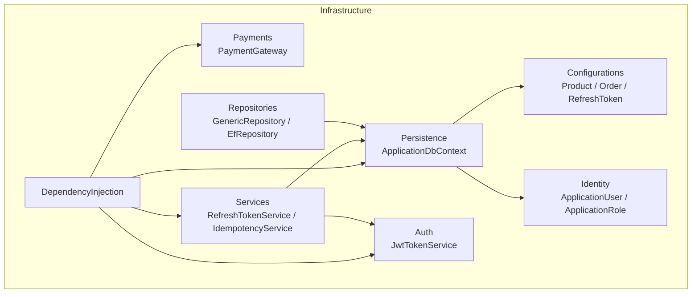
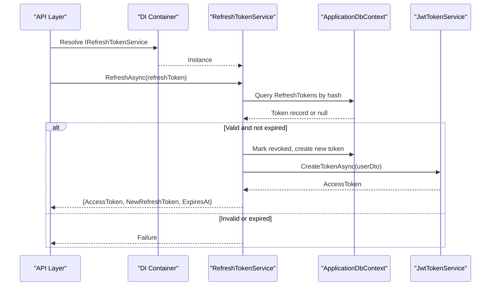
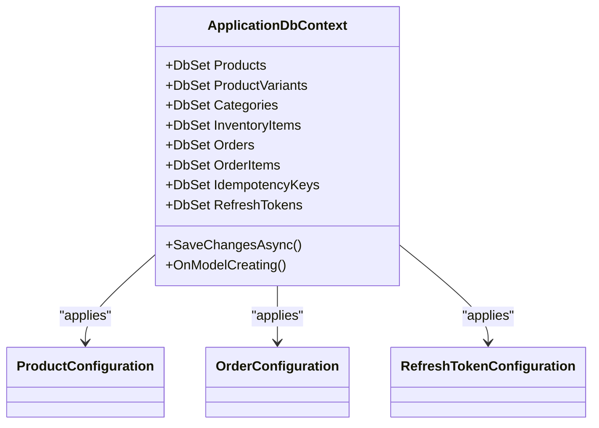
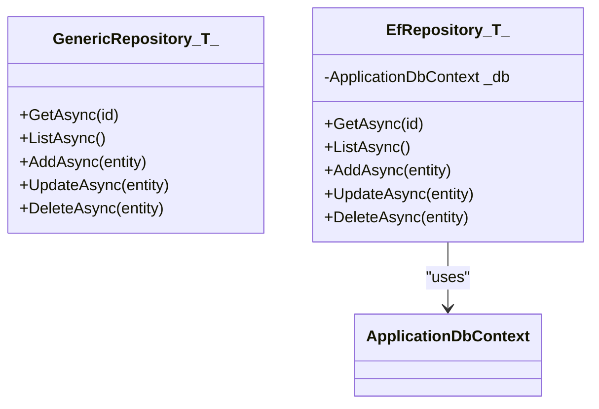
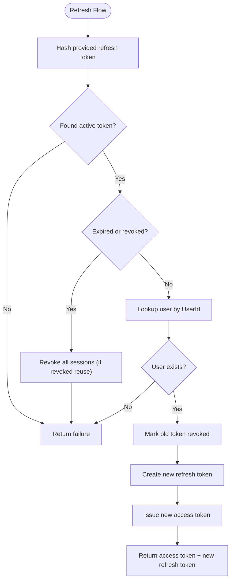
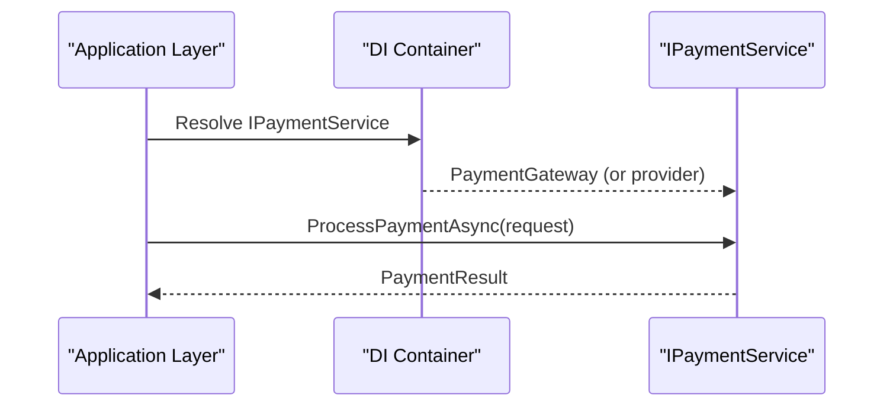
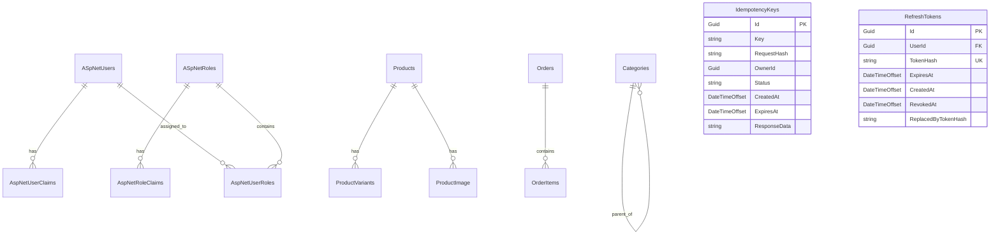
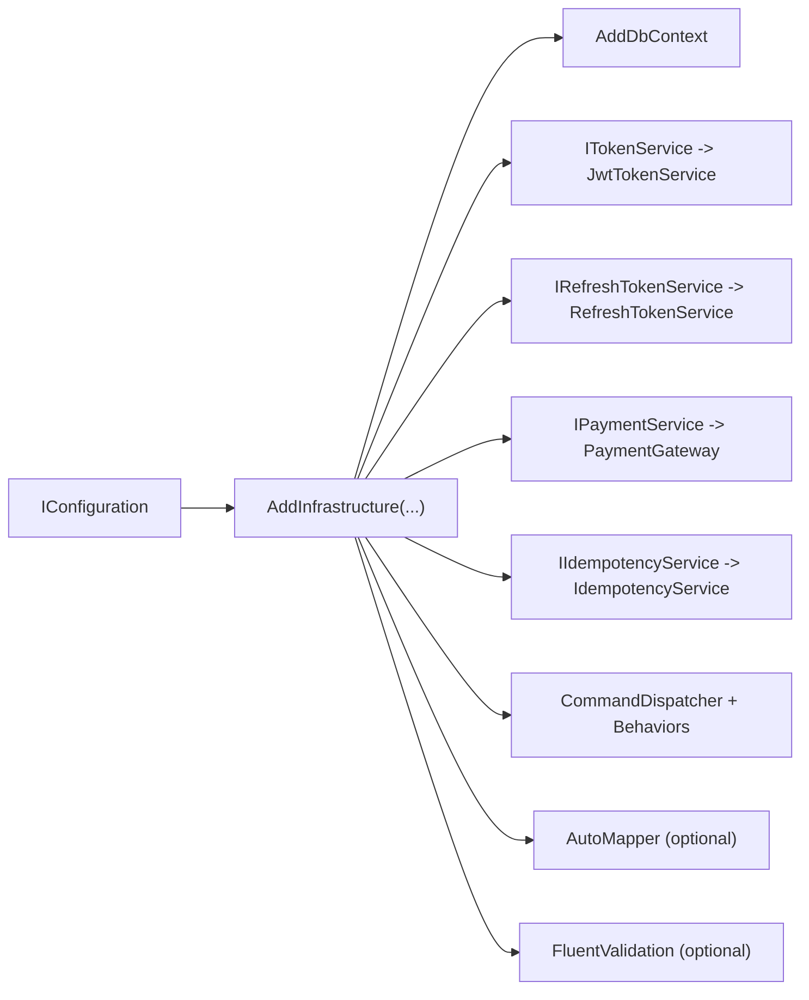
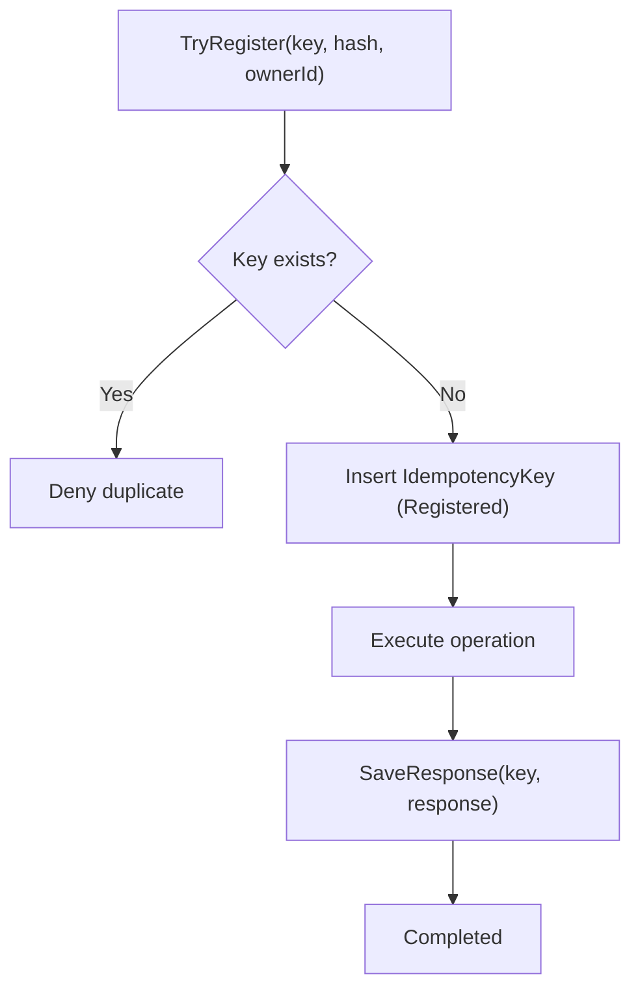
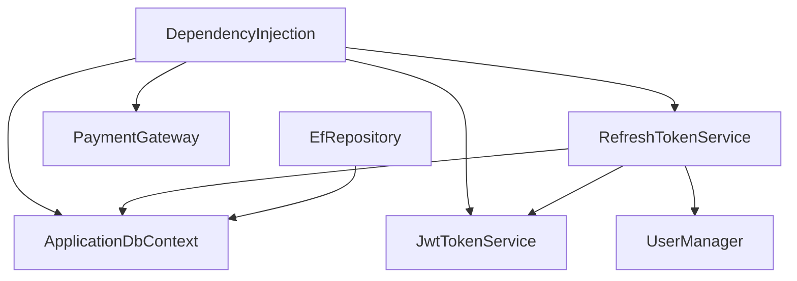

# Infrastructure Layer

<cite>
**Referenced Files in This Document**
- [DependencyInjection.cs](file://src/Ecommerce.Infrastructure/DependencyInjection.cs)
- [ApplicationDbContext.cs](file://src/Ecommerce.Infrastructure/Persistence/ApplicationDbContext.cs)
- [ProductConfiguration.cs](file://src/Ecommerce.Infrastructure/Persistence/Configurations/ProductConfiguration.cs)
- [OrderConfiguration.cs](file://src/Ecommerce.Infrastructure/Persistence/Configurations/OrderConfiguration.cs)
- [RefreshTokenConfiguration.cs](file://src/Ecommerce.Infrastructure/Persistence/Configurations/RefreshTokenConfiguration.cs)
- [20260815214939_InitialCreate.cs](file://src/Ecommerce.Infrastructure/Migrations/20260815214939_InitialCreate.cs)
- [JwtTokenService.cs](file://src/Ecommerce.Infrastructure/Auth/JwtTokenService.cs)
- [PaymentGateway.cs](file://src/Ecommerce.Infrastructure/Payments/PaymentGateway.cs)
- [GenericRepository.cs](file://src/Ecommerce.Infrastructure/Repositories/GenericRepository.cs)
- [EfRepository.cs](file://src/Ecommerce.Infrastructure/Repositories/EfRepository.cs)
- [RefreshTokenService.cs](file://src/Ecommerce.Infrastructure/Services/RefreshTokenService.cs)
- [IdempotencyService.cs](file://src/Ecommerce.Infrastructure/Services/IdempotencyService.cs)
- [ApplicationUser.cs](file://src/Ecommerce.Infrastructure/Identity/ApplicationUser.cs)
- [ApplicationRole.cs](file://src/Ecommerce.Infrastructure/Identity/ApplicationRole.cs)
</cite>

## Table of Contents
1. [Introduction](#introduction)
2. [Project Structure](#project-structure)
3. [Core Components](#core-components)
4. [Architecture Overview](#architecture-overview)
5. [Detailed Component Analysis](#detailed-component-analysis)
6. [Dependency Analysis](#dependency-analysis)
7. [Performance Considerations](#performance-considerations)
8. [Troubleshooting Guide](#troubleshooting-guide)
9. [Conclusion](#conclusion)
10. [Appendices](#appendices)

## Introduction
This document describes the Infrastructure Layer that provides external service implementations for the e-commerce system. It covers Entity Framework Core configuration, DbContext setup, entity mappings, repository patterns, authentication and authorization (JWT and refresh tokens), payment gateway integration with extensibility points, database migrations and schema evolution, configuration management, dependency injection registration, and performance considerations including connection pooling and database optimization techniques.

## Project Structure
The Infrastructure Layer is organized into focused directories:
- Persistence: EF Core DbContext and entity configurations
- Auth: JWT token generation
- Payments: Payment gateway abstraction and stub implementation
- Repositories: Generic and EF-backed repositories
- Services: Refresh token lifecycle and idempotency support
- Identity: ASP.NET Identity user and role entities
- DependencyInjection: Centralized service registration

**Diagram sources**
- [DependencyInjection.cs:11-85](file://src/Ecommerce.Infrastructure/DependencyInjection.cs#L11-L85)
- [ApplicationDbContext.cs:12-40](file://src/Ecommerce.Infrastructure/Persistence/ApplicationDbContext.cs#L12-L40)
- [JwtTokenService.cs:13-45](file://src/Ecommerce.Infrastructure/Auth/JwtTokenService.cs#L13-L45)
- [PaymentGateway.cs:7-22](file://src/Ecommerce.Infrastructure/Payments/PaymentGateway.cs#L7-L22)
- [GenericRepository.cs:7-15](file://src/Ecommerce.Infrastructure/Repositories/GenericRepository.cs#L7-L15)
- [EfRepository.cs:9-45](file://src/Ecommerce.Infrastructure/Repositories/EfRepository.cs#L9-L45)
- [RefreshTokenService.cs:15-123](file://src/Ecommerce.Infrastructure/Services/RefreshTokenService.cs#L15-L123)
- [IdempotencyService.cs:10-54](file://src/Ecommerce.Infrastructure/Services/IdempotencyService.cs#L10-L54)
- [ApplicationUser.cs:6-17](file://src/Ecommerce.Infrastructure/Identity/ApplicationUser.cs#L6-L17)
- [ApplicationRole.cs:6-10](file://src/Ecommerce.Infrastructure/Identity/ApplicationRole.cs#L6-L10)

**Section sources**
- [DependencyInjection.cs:11-85](file://src/Ecommerce.Infrastructure/DependencyInjection.cs#L11-L85)
- [ApplicationDbContext.cs:12-40](file://src/Ecommerce.Infrastructure/Persistence/ApplicationDbContext.cs#L12-L40)

## Core Components
- DbContext and persistence: ApplicationDbContext extends IdentityDbContext and exposes DbSets for core domain entities. It applies all entity configurations from the assembly.
- Entity configurations: Product, Order, and RefreshToken have explicit EF Core type configurations defining keys, constraints, indexes, concurrency tokens, and relationships.
- Repositories: GenericRepository is a placeholder; EfRepository implements CRUD over EF Core via ApplicationDbContext.
- Authentication: JwtTokenService creates signed JWT access tokens using configuration values.
- Authorization helpers: RefreshTokenService manages creation, validation, rotation, revocation, and cleanup of refresh tokens stored in the database.
- Payment integration: PaymentGateway implements IPaymentService as a development stub; replaceable by real providers.
- Idempotency: IdempotencyService ensures operations are executed at most once per key and stores responses to prevent duplicates.
- Identity: ApplicationUser and ApplicationRole extend ASP.NET Identity types with additional fields.

**Section sources**
- [ApplicationDbContext.cs:12-40](file://src/Ecommerce.Infrastructure/Persistence/ApplicationDbContext.cs#L12-L40)
- [ProductConfiguration.cs:7-21](file://src/Ecommerce.Infrastructure/Persistence/Configurations/ProductConfiguration.cs#L7-L21)
- [OrderConfiguration.cs:7-44](file://src/Ecommerce.Infrastructure/Persistence/Configurations/OrderConfiguration.cs#L7-L44)
- [RefreshTokenConfiguration.cs:7-28](file://src/Ecommerce.Infrastructure/Persistence/Configurations/RefreshTokenConfiguration.cs#L7-L28)
- [GenericRepository.cs:7-15](file://src/Ecommerce.Infrastructure/Repositories/GenericRepository.cs#L7-L15)
- [EfRepository.cs:9-45](file://src/Ecommerce.Infrastructure/Repositories/EfRepository.cs#L9-L45)
- [JwtTokenService.cs:13-45](file://src/Ecommerce.Infrastructure/Auth/JwtTokenService.cs#L13-L45)
- [RefreshTokenService.cs:15-123](file://src/Ecommerce.Infrastructure/Services/RefreshTokenService.cs#L15-L123)
- [PaymentGateway.cs:7-22](file://src/Ecommerce.Infrastructure/Payments/PaymentGateway.cs#L7-L22)
- [IdempotencyService.cs:10-54](file://src/Ecommerce.Infrastructure/Services/IdempotencyService.cs#L10-L54)
- [ApplicationUser.cs:6-17](file://src/Ecommerce.Infrastructure/Identity/ApplicationUser.cs#L6-L17)
- [ApplicationRole.cs:6-10](file://src/Ecommerce.Infrastructure/Identity/ApplicationRole.cs#L6-L10)

## Architecture Overview
The Infrastructure Layer wires up services via dependency injection, configures EF Core with SQL Server, and exposes abstractions consumed by the Application layer.

**Diagram sources**
- [DependencyInjection.cs:76-80](file://src/Ecommerce.Infrastructure/DependencyInjection.cs#L76-L80)
- [RefreshTokenService.cs:50-78](file://src/Ecommerce.Infrastructure/Services/RefreshTokenService.cs#L50-L78)
- [JwtTokenService.cs:22-44](file://src/Ecommerce.Infrastructure/Auth/JwtTokenService.cs#L22-L44)
- [ApplicationDbContext.cs:19-27](file://src/Ecommerce.Infrastructure/Persistence/ApplicationDbContext.cs#L19-L27)

## Detailed Component Analysis

### Entity Framework Core Configuration and DbContext
- ApplicationDbContext derives from IdentityDbContext and implements IApplicationDbContext, exposing DbSets for Products, ProductVariants, Categories, InventoryItems, Orders, OrderItems, IdempotencyKeys, and RefreshTokens.
- OnModelCreating applies all entity configurations from the same assembly, centralizing mapping logic.
- SaveChangesAsync is overridden to integrate potential cross-cutting concerns if needed.

**Diagram sources**
- [ApplicationDbContext.cs:12-40](file://src/Ecommerce.Infrastructure/Persistence/ApplicationDbContext.cs#L12-L40)
- [ProductConfiguration.cs:7-21](file://src/Ecommerce.Infrastructure/Persistence/Configurations/ProductConfiguration.cs#L7-L21)
- [OrderConfiguration.cs:7-44](file://src/Ecommerce.Infrastructure/Persistence/Configurations/OrderConfiguration.cs#L7-L44)
- [RefreshTokenConfiguration.cs:7-28](file://src/Ecommerce.Infrastructure/Persistence/Configurations/RefreshTokenConfiguration.cs#L7-L28)

**Section sources**
- [ApplicationDbContext.cs:12-40](file://src/Ecommerce.Infrastructure/Persistence/ApplicationDbContext.cs#L12-L40)

### Repository Implementations
- GenericRepository<T>: Placeholder with no-op methods intended to be replaced by concrete implementations.
- EfRepository<T>: Implements Get, List, Add, Update, Delete using EF Core Set operations and saves changes after mutations.

**Diagram sources**
- [GenericRepository.cs:7-15](file://src/Ecommerce.Infrastructure/Repositories/GenericRepository.cs#L7-L15)
- [EfRepository.cs:9-45](file://src/Ecommerce.Infrastructure/Repositories/EfRepository.cs#L9-L45)
- [ApplicationDbContext.cs:12-40](file://src/Ecommerce.Infrastructure/Persistence/ApplicationDbContext.cs#L12-L40)

**Section sources**
- [GenericRepository.cs:7-15](file://src/Ecommerce.Infrastructure/Repositories/GenericRepository.cs#L7-L15)
- [EfRepository.cs:9-45](file://src/Ecommerce.Infrastructure/Repositories/EfRepository.cs#L9-L45)

### Authentication and Authorization Services
- JWT Access Tokens: JwtTokenService reads signing key and issuer from configuration, builds claims, signs with HMAC-SHA256, and returns a serialized token string.
- Refresh Tokens: RefreshTokenService generates secure random tokens, stores hashed tokens, supports rotation on use, revocation, and cleanup of expired entries. It integrates with ASP.NET Identity UserManager to resolve users by ID.

**Diagram sources**
- [RefreshTokenService.cs:28-78](file://src/Ecommerce.Infrastructure/Services/RefreshTokenService.cs#L28-L78)
- [JwtTokenService.cs:22-44](file://src/Ecommerce.Infrastructure/Auth/JwtTokenService.cs#L22-L44)

**Section sources**
- [JwtTokenService.cs:13-45](file://src/Ecommerce.Infrastructure/Auth/JwtTokenService.cs#L13-L45)
- [RefreshTokenService.cs:15-123](file://src/Ecommerce.Infrastructure/Services/RefreshTokenService.cs#L15-L123)

### Payment Gateway Integration and Extensibility
- PaymentGateway implements IPaymentService and returns a successful result with a generated transaction identifier. It is registered in DI as the default provider.
- Extensibility: Replace PaymentGateway with a production provider (e.g., Stripe, PayPal, Adyen) by implementing IPaymentService and updating the DI registration to bind the interface to the new implementation.

**Diagram sources**
- [DependencyInjection.cs:70-71](file://src/Ecommerce.Infrastructure/DependencyInjection.cs#L70-L71)
- [PaymentGateway.cs:7-22](file://src/Ecommerce.Infrastructure/Payments/PaymentGateway.cs#L7-L22)

**Section sources**
- [PaymentGateway.cs:7-22](file://src/Ecommerce.Infrastructure/Payments/PaymentGateway.cs#L7-L22)
- [DependencyInjection.cs:70-71](file://src/Ecommerce.Infrastructure/DependencyInjection.cs#L70-L71)

### Database Migrations and Schema Evolution
- Initial migration creates identity tables, product catalog, orders, order items, inventory, categories, product images, and idempotency keys.
- Subsequent migrations add refresh token table and indexes.
- Entity configurations define constraints, precision, row versioning, and relationships.

**Diagram sources**
- [20260815214939_InitialCreate.cs:12-465](file://src/Ecommerce.Infrastructure/Migrations/20260815214939_InitialCreate.cs#L12-L465)
- [RefreshTokenConfiguration.cs:11-28](file://src/Ecommerce.Infrastructure/Persistence/Configurations/RefreshTokenConfiguration.cs#L11-L28)

**Section sources**
- [20260815214939_InitialCreate.cs:12-465](file://src/Ecommerce.Infrastructure/Migrations/20260815214939_InitialCreate.cs#L12-L465)
- [RefreshTokenConfiguration.cs:11-28](file://src/Ecommerce.Infrastructure/Persistence/Configurations/RefreshTokenConfiguration.cs#L11-L28)

### Configuration Management and Dependency Injection
- Connection string: Configured via IConfiguration under "DefaultConnection" and applied to UseSqlServer.
- JWT settings: Key and Issuer read from configuration with safe defaults for development.
- Service registrations:
  - ApplicationDbContext scoped via AddDbContext
  - IApplicationDbContext mapped to ApplicationDbContext
  - Command dispatcher and behaviors
  - FluentValidation validators and adapter (optional)
  - AutoMapper profile (optional)
  - Command handlers
  - IPaymentService bound to PaymentGateway
  - IIdempotencyService bound to IdempotencyService
  - IRefreshTokenService bound to RefreshTokenService
  - ITokenService bound to JwtTokenService
  - Hosted service for refresh token cleanup

**Diagram sources**
- [DependencyInjection.cs:11-85](file://src/Ecommerce.Infrastructure/DependencyInjection.cs#L11-L85)
- [JwtTokenService.cs:15-26](file://src/Ecommerce.Infrastructure/Auth/JwtTokenService.cs#L15-L26)

**Section sources**
- [DependencyInjection.cs:11-85](file://src/Ecommerce.Infrastructure/DependencyInjection.cs#L11-L85)
- [JwtTokenService.cs:15-26](file://src/Ecommerce.Infrastructure/Auth/JwtTokenService.cs#L15-L26)

### Idempotency Service
- Ensures request uniqueness by key, registers attempts, and stores responses to replay results without re-executing side effects.
- Uses IdempotencyKeys table created by the initial migration.

**Diagram sources**
- [IdempotencyService.cs:27-54](file://src/Ecommerce.Infrastructure/Services/IdempotencyService.cs#L27-L54)
- [20260815214939_InitialCreate.cs:94-110](file://src/Ecommerce.Infrastructure/Migrations/20260815214939_InitialCreate.cs#L94-L110)

**Section sources**
- [IdempotencyService.cs:10-54](file://src/Ecommerce.Infrastructure/Services/IdempotencyService.cs#L10-L54)

## Dependency Analysis
- ApplicationDbContext depends on ASP.NET Identity base classes and exposes domain DbSets.
- EfRepository depends on ApplicationDbContext for data access.
- RefreshTokenService depends on ApplicationDbContext, ITokenService, and UserManager<ApplicationUser>.
- JwtTokenService depends on IConfiguration for JWT parameters.
- PaymentGateway depends only on application interfaces.
- DependencyInjection orchestrates all registrations and optional features.

**Diagram sources**
- [DependencyInjection.cs:11-85](file://src/Ecommerce.Infrastructure/DependencyInjection.cs#L11-L85)
- [RefreshTokenService.cs:17-25](file://src/Ecommerce.Infrastructure/Services/RefreshTokenService.cs#L17-L25)
- [JwtTokenService.cs:15-26](file://src/Ecommerce.Infrastructure/Auth/JwtTokenService.cs#L15-L26)
- [EfRepository.cs:11-16](file://src/Ecommerce.Infrastructure/Repositories/EfRepository.cs#L11-L16)
- [ApplicationUser.cs:6-17](file://src/Ecommerce.Infrastructure/Identity/ApplicationUser.cs#L6-L17)

**Section sources**
- [DependencyInjection.cs:11-85](file://src/Ecommerce.Infrastructure/DependencyInjection.cs#L11-L85)
- [RefreshTokenService.cs:17-25](file://src/Ecommerce.Infrastructure/Services/RefreshTokenService.cs#L17-L25)
- [JwtTokenService.cs:15-26](file://src/Ecommerce.Infrastructure/Auth/JwtTokenService.cs#L15-L26)
- [EfRepository.cs:11-16](file://src/Ecommerce.Infrastructure/Repositories/EfRepository.cs#L11-L16)
- [ApplicationUser.cs:6-17](file://src/Ecommerce.Infrastructure/Identity/ApplicationUser.cs#L6-L17)

## Performance Considerations
- Connection pooling: Enabled by default with EF Core’s SQL Server provider; ensure appropriate pool size and lifetime settings in your environment.
- Query efficiency:
  - Use projections and selective field loading where possible.
  - Leverage indexes defined in entity configurations (e.g., unique slug, token hashes, user IDs).
- Concurrency control:
  - RowVersion columns on Products and Orders enable optimistic concurrency to detect conflicting updates.
- Transaction boundaries:
  - Keep unit-of-work within command handlers; avoid long-running transactions.
- Background maintenance:
  - Refresh token cleanup removes expired tokens to keep queries fast and storage bounded.
- External calls:
  - Payment provider calls should be wrapped with retries and timeouts; consider caching non-sensitive metadata when appropriate.

[No sources needed since this section provides general guidance]

## Troubleshooting Guide
- Missing connection string: Ensure "DefaultConnection" is present in configuration; otherwise EF Core will fail to connect.
- JWT misconfiguration: If Jwt:Key or Jwt:Issuer are missing, defaults are used; verify these in production environments.
- Refresh token failures:
  - Expired or revoked tokens return failure; check token validity and expiration.
  - Reuse of a revoked token triggers full session revocation for security.
- Idempotency conflicts:
  - Duplicate keys are rejected; ensure clients generate unique idempotency keys per request.
- Migration issues:
  - Apply migrations in the correct order; ensure the database schema matches the latest snapshot before running the app.

**Section sources**
- [DependencyInjection.cs:15-19](file://src/Ecommerce.Infrastructure/DependencyInjection.cs#L15-L19)
- [JwtTokenService.cs:22-26](file://src/Ecommerce.Infrastructure/Auth/JwtTokenService.cs#L22-L26)
- [RefreshTokenService.cs:50-78](file://src/Ecommerce.Infrastructure/Services/RefreshTokenService.cs#L50-L78)
- [IdempotencyService.cs:27-54](file://src/Ecommerce.Infrastructure/Services/IdempotencyService.cs#L27-L54)
- [20260815214939_InitialCreate.cs:12-465](file://src/Ecommerce.Infrastructure/Migrations/20260815214939_InitialCreate.cs#L12-L465)

## Conclusion
The Infrastructure Layer centralizes data access, authentication, authorization, payments, and operational services. It uses EF Core with clear entity configurations, robust refresh token handling, idempotency guarantees, and a pluggable payment abstraction. Dependency injection ties everything together, while migrations and configurations provide a stable, evolving database schema. Follow the extensibility points to integrate production-grade providers and optimize performance according to workload characteristics.

## Appendices

### Entity Mapping Highlights
- Products: Unique slug index, precise decimal pricing, row versioning.
- Orders: Decimal financial fields, status enums as strings, cascade delete to OrderItems, row versioning.
- RefreshTokens: Unique token hash, indexed by UserId and ExpiresAt for efficient lookups and cleanup.

**Section sources**
- [ProductConfiguration.cs:7-21](file://src/Ecommerce.Infrastructure/Persistence/Configurations/ProductConfiguration.cs#L7-L21)
- [OrderConfiguration.cs:7-44](file://src/Ecommerce.Infrastructure/Persistence/Configurations/OrderConfiguration.cs#L7-L44)
- [RefreshTokenConfiguration.cs:7-28](file://src/Ecommerce.Infrastructure/Persistence/Configurations/RefreshTokenConfiguration.cs#L7-L28)