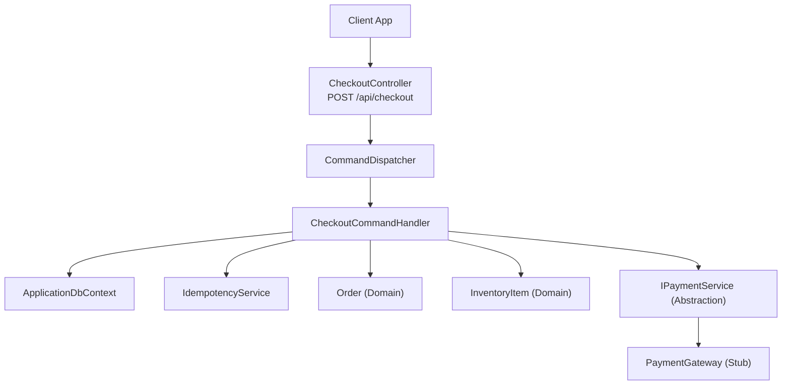
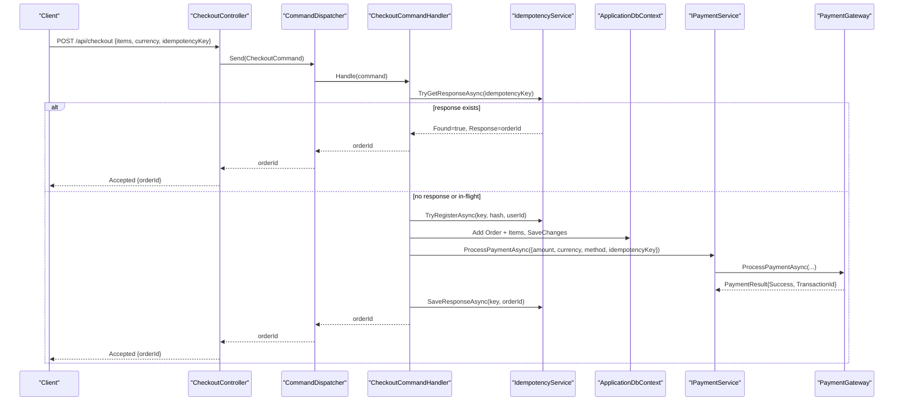
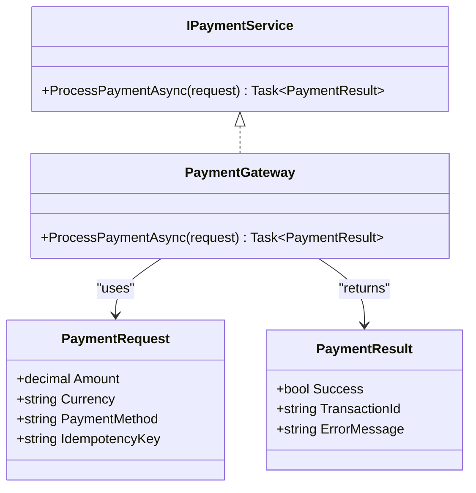
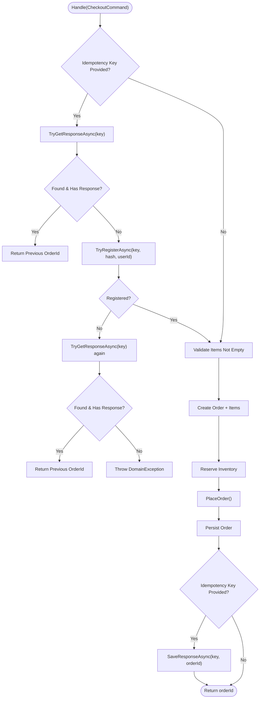
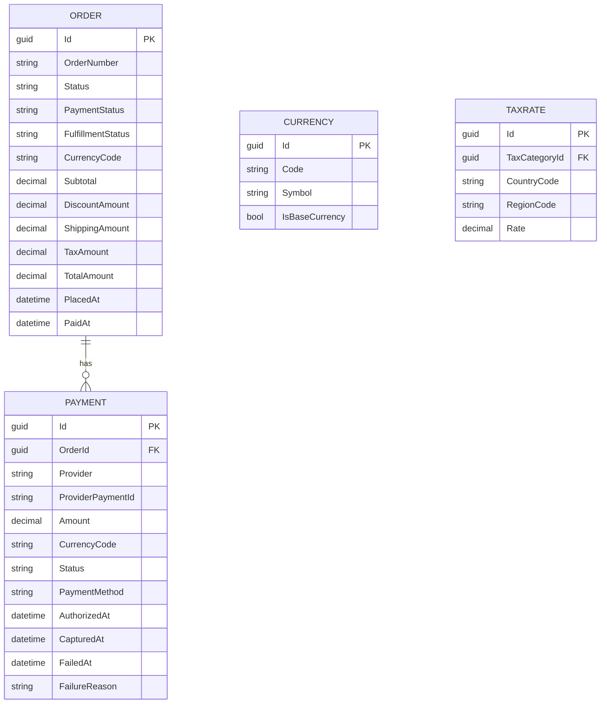
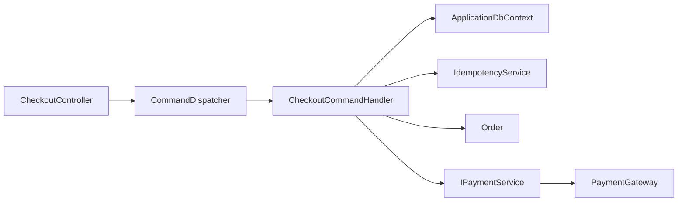

# Payment Integration

<cite>
**Referenced Files in This Document**
- [CheckoutController.cs](file://src/Ecommerce.Api/Controllers/CheckoutController.cs)
- [CheckoutCommand.cs](file://src/Ecommerce.Application/Commands/Checkout/CheckoutCommand.cs)
- [CheckoutCommandHandler.cs](file://src/Ecommerce.Application/Commands/Checkout/CheckoutCommandHandler.cs)
- [IPaymentService.cs](file://src/Ecommerce.Application/Interfaces/IPaymentService.cs)
- [PaymentGateway.cs](file://src/Ecommerce.Infrastructure/Payments/PaymentGateway.cs)
- [IdempotencyService.cs](file://src/Ecommerce.Infrastructure/Services/IdempotencyService.cs)
- [DependencyInjection.cs](file://src/Ecommerce.Infrastructure/DependencyInjection.cs)
- [Order.cs](file://src/Ecommerce.Domain/Entities/Order.cs)
- [Payment.cs](file://src/Ecommerce.Domain/Entities/Payment.cs)
- [Money.cs](file://src/Ecommerce.Domain/ValueObjects/Money.cs)
- [Currency.cs](file://src/Ecommerce.Domain/Entities/Currency.cs)
- [TaxRate.cs](file://src/Ecommerce.Domain/Entities/TaxRate.cs)
- [appsettings.Development.json](file://src/Ecommerce.Api/appsettings.Development.json)
- [CheckoutHandlerTests.cs](file://tests/Ecommerce.Application.Tests/CheckoutHandlerTests.cs)
- [CheckoutIdempotencyTests.cs](file://tests/Ecommerce.Application.Tests/CheckoutIdempotencyTests.cs)
</cite>

## Table of Contents
1. Introduction
2. Project Structure
3. Core Components
4. Architecture Overview
5. Detailed Component Analysis
6. Dependency Analysis
7. Performance Considerations
8. Troubleshooting Guide
9. Conclusion
10. Appendices

## Introduction
This document explains the payment integration design and implementation for the ecommerce system. It covers the abstraction layer for payment providers, the concrete stub implementation used during development/testing, and how checkout flows create orders, reserve inventory, and coordinate with payments. It also documents idempotency, error handling strategies, retry considerations, currency and tax modeling, security and PCI compliance guidance, testing approaches, and extensibility points to add new payment providers.

## Project Structure
The payment-related logic spans multiple layers:
- API layer exposes an endpoint to initiate checkout.
- Application layer orchestrates commands (checkout), enforces idempotency, and coordinates domain operations.
- Domain layer models orders, payments, money, currencies, and taxes.
- Infrastructure layer provides a stub payment gateway and idempotency persistence.

**Diagram sources**
- [CheckoutController.cs:1-27](file://src/Ecommerce.Api/Controllers/CheckoutController.cs#L1-L27)
- [CheckoutCommandHandler.cs:1-94](file://src/Ecommerce.Application/Commands/Checkout/CheckoutCommandHandler.cs#L1-L94)
- [IdempotencyService.cs:1-57](file://src/Ecommerce.Infrastructure/Services/IdempotencyService.cs#L1-L57)
- [IPaymentService.cs:1-25](file://src/Ecommerce.Application/Interfaces/IPaymentService.cs#L1-L25)
- [PaymentGateway.cs:1-25](file://src/Ecommerce.Infrastructure/Payments/PaymentGateway.cs#L1-L25)

**Section sources**
- [CheckoutController.cs:1-27](file://src/Ecommerce.Api/Controllers/CheckoutController.cs#L1-L27)
- [CheckoutCommandHandler.cs:1-94](file://src/Ecommerce.Application/Commands/Checkout/CheckoutCommandHandler.cs#L1-L94)
- [DependencyInjection.cs:56-76](file://src/Ecommerce.Infrastructure/DependencyInjection.cs#L56-L76)

## Core Components
- Checkout command and handler: Validates input, ensures idempotency, builds and persists an order, reserves inventory, and returns the order identifier.
- Payment abstraction: IPaymentService defines a single method to process payments; PaymentRequest carries amount, currency, payment method, and idempotency key; PaymentResult indicates success/failure and provider transaction identifiers.
- Stub payment gateway: A simple implementation that always succeeds and returns a generated transaction ID for development and tests.
- Idempotency service: Persists idempotency keys and responses to prevent duplicate processing and to return consistent results for repeated requests.
- Domain entities: Order tracks totals, currency, and statuses; Payment captures provider details and lifecycle timestamps; Money value object encapsulates amounts and currency codes; Currency and TaxRate support multi-currency and tax calculations.

Key responsibilities:
- Orchestrate checkout flow without leaking infrastructure concerns into application logic.
- Ensure idempotent behavior across retries and network failures.
- Provide a clear extension point for integrating real payment providers.

**Section sources**
- [CheckoutCommand.cs:1-22](file://src/Ecommerce.Application/Commands/Checkout/CheckoutCommand.cs#L1-L22)
- [CheckoutCommandHandler.cs:1-94](file://src/Ecommerce.Application/Commands/Checkout/CheckoutCommandHandler.cs#L1-L94)
- [IPaymentService.cs:1-25](file://src/Ecommerce.Application/Interfaces/IPaymentService.cs#L1-L25)
- [PaymentGateway.cs:1-25](file://src/Ecommerce.Infrastructure/Payments/PaymentGateway.cs#L1-L25)
- [IdempotencyService.cs:1-57](file://src/Ecommerce.Infrastructure/Services/IdempotencyService.cs#L1-L57)
- [Order.cs:1-105](file://src/Ecommerce.Domain/Entities/Order.cs#L1-L105)
- [Payment.cs:1-23](file://src/Ecommerce.Domain/Entities/Payment.cs#L1-L23)
- [Money.cs:1-20](file://src/Ecommerce.Domain/ValueObjects/Money.cs#L1-L20)
- [Currency.cs:1-13](file://src/Ecommerce.Domain/Entities/Currency.cs#L1-L13)
- [TaxRate.cs:1-15](file://src/Ecommerce.Domain/Entities/TaxRate.cs#L1-L15)

## Architecture Overview
The checkout flow is command-driven and uses dependency injection to wire abstractions to implementations. The API controller delegates to a command dispatcher, which invokes the checkout handler. The handler performs validation, idempotency checks, order creation, inventory reservation, and returns the order ID. Payment processing is abstracted behind IPaymentService so that production integrations can be swapped in without changing orchestration logic.

**Diagram sources**
- [CheckoutController.cs:1-27](file://src/Ecommerce.Api/Controllers/CheckoutController.cs#L1-L27)
- [CheckoutCommandHandler.cs:1-94](file://src/Ecommerce.Application/Commands/Checkout/CheckoutCommandHandler.cs#L1-L94)
- [IdempotencyService.cs:1-57](file://src/Ecommerce.Infrastructure/Services/IdempotencyService.cs#L1-L57)
- [IPaymentService.cs:1-25](file://src/Ecommerce.Application/Interfaces/IPaymentService.cs#L1-L25)
- [PaymentGateway.cs:1-25](file://src/Ecommerce.Infrastructure/Payments/PaymentGateway.cs#L1-L25)

## Detailed Component Analysis

### Payment Abstraction and Stub Implementation
- IPaymentService defines a single asynchronous method to process payments with a request containing amount, currency, payment method, and idempotency key.
- PaymentGateway implements this interface with a stub that always succeeds and returns a generated transaction ID. This enables end-to-end testing without external dependencies.
- Dependency injection registers the stub implementation for development and tests, allowing easy replacement with a real provider in production.

**Diagram sources**
- [IPaymentService.cs:1-25](file://src/Ecommerce.Application/Interfaces/IPaymentService.cs#L1-L25)
- [PaymentGateway.cs:1-25](file://src/Ecommerce.Infrastructure/Payments/PaymentGateway.cs#L1-L25)

**Section sources**
- [IPaymentService.cs:1-25](file://src/Ecommerce.Application/Interfaces/IPaymentService.cs#L1-L25)
- [PaymentGateway.cs:1-25](file://src/Ecommerce.Infrastructure/Payments/PaymentGateway.cs#L1-L25)
- [DependencyInjection.cs:56-76](file://src/Ecommerce.Infrastructure/DependencyInjection.cs#L56-L76)

### Checkout Command Flow and Idempotency
- The checkout command includes items, currency, shipping address, and an optional idempotency key.
- The handler first checks for an existing response by idempotency key; if found, it returns the prior order ID immediately.
- If not present, it attempts to register the key to prevent concurrent duplicates; on failure, it either returns an existing response or throws a domain exception indicating the request is already in flight.
- After validation, it constructs an order, adds items, reserves inventory, places the order, persists changes, and saves the response under the idempotency key.

**Diagram sources**
- [CheckoutCommandHandler.cs:1-94](file://src/Ecommerce.Application/Commands/Checkout/CheckoutCommandHandler.cs#L1-L94)
- [IdempotencyService.cs:1-57](file://src/Ecommerce.Infrastructure/Services/IdempotencyService.cs#L1-L57)

**Section sources**
- [CheckoutCommand.cs:1-22](file://src/Ecommerce.Application/Commands/Checkout/CheckoutCommand.cs#L1-L22)
- [CheckoutCommandHandler.cs:1-94](file://src/Ecommerce.Application/Commands/Checkout/CheckoutCommandHandler.cs#L1-L94)
- [IdempotencyService.cs:1-57](file://src/Ecommerce.Infrastructure/Services/IdempotencyService.cs#L1-L57)

### Domain Models for Payments, Orders, Currency, and Taxes
- Order maintains currency code, line items, totals, and status fields including payment status. Totals are recalculated when items change.
- Payment entity stores provider-specific identifiers, amounts, currency codes, statuses, and lifecycle timestamps for authorization, capture, and failure.
- Money value object encapsulates amount and currency code with validation rules.
- Currency and TaxRate entities support multi-currency and tax rate configuration.

**Diagram sources**
- [Order.cs:1-105](file://src/Ecommerce.Domain/Entities/Order.cs#L1-L105)
- [Payment.cs:1-23](file://src/Ecommerce.Domain/Entities/Payment.cs#L1-L23)
- [Currency.cs:1-13](file://src/Ecommerce.Domain/Entities/Currency.cs#L1-L13)
- [TaxRate.cs:1-15](file://src/Ecommerce.Domain/Entities/TaxRate.cs#L1-L15)

**Section sources**
- [Order.cs:1-105](file://src/Ecommerce.Domain/Entities/Order.cs#L1-L105)
- [Payment.cs:1-23](file://src/Ecommerce.Domain/Entities/Payment.cs#L1-L23)
- [Money.cs:1-20](file://src/Ecommerce.Domain/ValueObjects/Money.cs#L1-L20)
- [Currency.cs:1-13](file://src/Ecommerce.Domain/Entities/Currency.cs#L1-L13)
- [TaxRate.cs:1-15](file://src/Ecommerce.Domain/Entities/TaxRate.cs#L1-L15)

### Webhook Handling and Status Synchronization
- The current codebase does not include webhook endpoints or event handlers for payment provider notifications.
- Recommended approach:
  - Create dedicated webhook endpoints per provider to receive asynchronous confirmations (e.g., authorized, captured, failed).
  - Validate signatures and enforce strict content-type and payload checks.
  - Update Payment records and Order.PaymentStatus based on provider events.
  - Use idempotency keys from provider payloads to handle duplicate webhooks safely.
  - Emit domain events (e.g., PaymentCompletedDomainEvent) to notify downstream processes such as fulfillment or notifications.

[No sources needed since this section proposes future enhancements not present in the current code]

### Error Handling Strategies and Retry Mechanisms
- Validation errors: The handler throws domain exceptions for invalid inputs (e.g., empty items).
- Concurrency and idempotency: If registration fails due to an in-flight request, the handler either returns a previous result or throws a domain exception to signal conflict.
- External calls: The stub payment gateway currently never fails. For real providers:
  - Implement retry with exponential backoff for transient network errors.
  - Classify errors as retriable vs. non-retriable (e.g., insufficient funds).
  - Record failures in Payment.FailureReason and set appropriate statuses.
  - Avoid retrying idempotent operations beyond a bounded number of attempts to prevent storms.

**Section sources**
- [CheckoutCommandHandler.cs:1-94](file://src/Ecommerce.Application/Commands/Checkout/CheckoutCommandHandler.cs#L1-L94)
- [PaymentGateway.cs:1-25](file://src/Ecommerce.Infrastructure/Payments/PaymentGateway.cs#L1-L25)

### Configuration for Multiple Providers, Currency Handling, and Tax Calculation
- Provider configuration:
  - Use environment-based settings to select the active provider and supply credentials securely.
  - Register provider implementations via dependency injection based on configuration.
- Currency handling:
  - Store currency codes on orders and payments; use Money value objects to encapsulate amounts and currency codes consistently.
  - Validate currency codes against configured supported currencies.
- Tax calculation:
  - Model tax rates by country/region and apply them when building order items or recalculating totals.
  - Integrate tax computation into item addition or order total recalculation to ensure accurate totals before payment.

**Section sources**
- [DependencyInjection.cs:56-76](file://src/Ecommerce.Infrastructure/DependencyInjection.cs#L56-L76)
- [Money.cs:1-20](file://src/Ecommerce.Domain/ValueObjects/Money.cs#L1-L20)
- [Currency.cs:1-13](file://src/Ecommerce.Domain/Entities/Currency.cs#L1-L13)
- [TaxRate.cs:1-15](file://src/Ecommerce.Domain/Entities/TaxRate.cs#L1-L15)
- [Order.cs:1-105](file://src/Ecommerce.Domain/Entities/Order.cs#L1-L105)

### Security Considerations and PCI Compliance
- Do not store sensitive card data (full PAN, CVV, PIN) in your systems.
- Use provider-hosted payment pages or tokenization services to minimize PCI scope.
- Enforce HTTPS, secure headers, and least-privilege access to secrets.
- Log only safe identifiers (e.g., last four digits or provider tokens); avoid logging full payloads unless necessary and sanitized.
- Validate and sign webhook requests; reject unknown or malformed events.

[No sources needed since this section provides general guidance]

### Testing Strategies with Sandbox Environments
- Unit tests validate checkout behavior, including order creation and inventory reservation.
- Idempotency tests verify that duplicate requests with the same key return consistent results without side effects.
- Use in-memory databases for fast, isolated tests.
- Replace the stub payment gateway with a test double that simulates provider responses (success, failure, timeouts) to exercise error paths.

**Section sources**
- [CheckoutHandlerTests.cs:1-57](file://tests/Ecommerce.Application.Tests/CheckoutHandlerTests.cs#L1-L57)
- [CheckoutIdempotencyTests.cs:1-40](file://tests/Ecommerce.Application.Tests/CheckoutIdempotencyTests.cs#L1-L40)

### Extensibility Points for New Payment Providers
- Implement IPaymentService for each provider and register it via dependency injection.
- Use configuration to select the active provider at runtime.
- Keep provider-specific details out of the application layer; rely on the abstraction for orchestration.
- Extend PaymentRequest and PaymentResult as needed to carry provider-specific metadata while maintaining backward compatibility.

**Section sources**
- [IPaymentService.cs:1-25](file://src/Ecommerce.Application/Interfaces/IPaymentService.cs#L1-L25)
- [DependencyInjection.cs:56-76](file://src/Ecommerce.Infrastructure/DependencyInjection.cs#L56-L76)

## Dependency Analysis
The checkout flow depends on:
- API controller delegating to command dispatcher.
- Command handler depending on database context, idempotency service, and domain entities.
- Payment processing decoupled via IPaymentService, registered through DI.

**Diagram sources**
- [CheckoutController.cs:1-27](file://src/Ecommerce.Api/Controllers/CheckoutController.cs#L1-L27)
- [CheckoutCommandHandler.cs:1-94](file://src/Ecommerce.Application/Commands/Checkout/CheckoutCommandHandler.cs#L1-L94)
- [IdempotencyService.cs:1-57](file://src/Ecommerce.Infrastructure/Services/IdempotencyService.cs#L1-L57)
- [IPaymentService.cs:1-25](file://src/Ecommerce.Application/Interfaces/IPaymentService.cs#L1-L25)
- [PaymentGateway.cs:1-25](file://src/Ecommerce.Infrastructure/Payments/PaymentGateway.cs#L1-L25)

**Section sources**
- [DependencyInjection.cs:56-76](file://src/Ecommerce.Infrastructure/DependencyInjection.cs#L56-L76)

## Performance Considerations
- Idempotency checks are O(1) lookups by key; ensure indexes exist on idempotency key columns in production.
- Minimize database round-trips by batching operations within a single unit of work where possible.
- Avoid synchronous blocking calls to external payment providers; use async patterns throughout.
- Consider caching provider metadata (e.g., supported currencies) to reduce overhead.

[No sources needed since this section provides general guidance]

## Troubleshooting Guide
Common issues and resolutions:
- Duplicate checkout submissions: Ensure clients send unique idempotency keys per intent; the handler will return the same order ID for repeated keys.
- In-flight conflicts: If registration fails because another request is processing, the handler either returns a prior result or throws a domain exception; implement client-side retry with backoff and deduplication.
- Payment failures: Inspect PaymentResult.ErrorMessage and update Payment.Status accordingly; log provider error codes without sensitive data.
- Database connectivity: Verify connection strings and ensure migrations are applied; check logs for timeout or concurrency errors.

**Section sources**
- [CheckoutCommandHandler.cs:1-94](file://src/Ecommerce.Application/Commands/Checkout/CheckoutCommandHandler.cs#L1-L94)
- [IdempotencyService.cs:1-57](file://src/Ecommerce.Infrastructure/Services/IdempotencyService.cs#L1-L57)
- [appsettings.Development.json:1-16](file://src/Ecommerce.Api/appsettings.Development.json#L1-L16)

## Conclusion
The system provides a clean separation between orchestration and payment provider specifics through an abstraction layer. Checkout is idempotent, resilient to retries, and backed by robust domain models for orders, payments, currency, and taxes. While the current implementation uses a stub payment gateway, the design supports straightforward integration of real providers, webhook handling, and comprehensive testing strategies. Following the security and PCI guidelines will help maintain a compliant and secure payment experience.

## Appendices

### Configuration Notes
- Connection strings and JWT settings are defined in configuration files; adjust for different environments.
- Provider credentials should be managed via secure secret storage and injected at runtime.

**Section sources**
- [appsettings.Development.json:1-16](file://src/Ecommerce.Api/appsettings.Development.json#L1-L16)