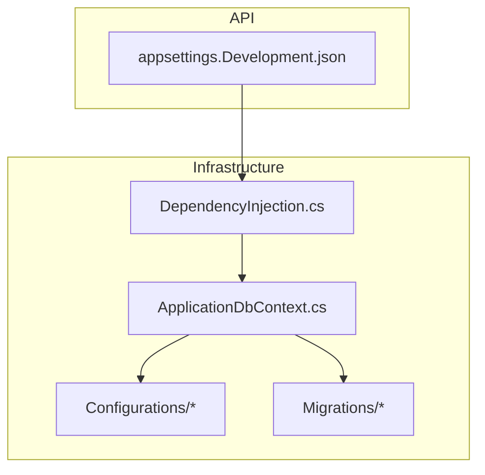
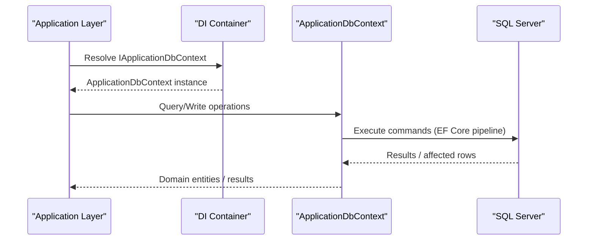
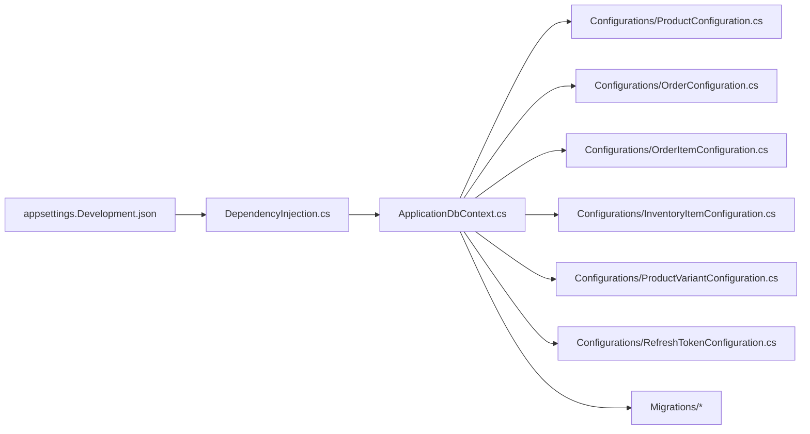

# Persistence Layer

<cite>
**Referenced Files in This Document**
- [ApplicationDbContext.cs](file://src/Ecommerce.Infrastructure\Persistence\ApplicationDbContext.cs)
- [DependencyInjection.cs](file://src/Ecommerce.Infrastructure\DependencyInjection.cs)
- [ProductConfiguration.cs](file://src/Ecommerce.Infrastructure\Persistence\Configurations\ProductConfiguration.cs)
- [OrderConfiguration.cs](file://src/Ecommerce.Infrastructure\Persistence\Configurations\OrderConfiguration.cs)
- [OrderItemConfiguration.cs](file://src/Ecommerce.Infrastructure\Persistence\Configurations\OrderItemConfiguration.cs)
- [InventoryItemConfiguration.cs](file://src/Ecommerce.Infrastructure\Persistence\Configurations\InventoryItemConfiguration.cs)
- [ProductVariantConfiguration.cs](file://src/Ecommerce.Infrastructure\Persistence\Configurations\ProductVariantConfiguration.cs)
- [RefreshTokenConfiguration.cs](file://src/Ecommerce.Infrastructure\Persistence\Configurations\RefreshTokenConfiguration.cs)
- [20260815214939_InitialCreate.cs](file://src/Ecommerce.Infrastructure\Migrations\20260815214939_InitialCreate.cs)
- [20260816140220_AddRefreshTokensTable.cs](file://src/Ecommerce.Infrastructure\Migrations\20260816140220_AddRefreshTokensTable.cs)
- [20260816141752_AddRefreshTokenIndexes.cs](file://src/Ecommerce.Infrastructure\Migrations\20260816141752_AddRefreshTokenIndexes.cs)
- [appsettings.Development.json](file://src/Ecommerce.Api\appsettings.Development.json)
</cite>

## Table of Contents
1. Introduction
2. Project Structure
3. Core Components
4. Architecture Overview
5. Detailed Component Analysis
6. Dependency Analysis
7. Performance Considerations
8. Troubleshooting Guide
9. Conclusion

## Introduction
This document describes the Persistence Layer built on Entity Framework Core. It covers ApplicationDbContext configuration, connection string management, Fluent API entity configurations, migrations and schema versioning, seed data and initialization strategies, performance optimization techniques, transaction management, concurrency handling, and error recovery patterns. The goal is to provide both a high-level understanding and detailed guidance for developers working with the database layer.

## Project Structure
The persistence implementation resides in the Infrastructure project and is consumed by the Application layer through an interface. Key elements:
- DbContext and EF Core setup in Infrastructure
- Fluent API configurations in a dedicated Configurations folder
- Migrations under Migrations for schema evolution
- Connection string provided via configuration in the API project

**Diagram sources**
- [DependencyInjection.cs:11-23](file://src/Ecommerce.Infrastructure\DependencyInjection.cs#L11-L23)
- [ApplicationDbContext.cs:12-40](file://src/Ecommerce.Infrastructure\Persistence\ApplicationDbContext.cs#L12-L40)
- [appsettings.Development.json:12-14](file://src/Ecommerce.Api/appsettings.Development.json#L12-L14)

**Section sources**
- [DependencyInjection.cs:11-23](file://src/Ecommerce.Infrastructure\DependencyInjection.cs#L11-L23)
- [ApplicationDbContext.cs:12-40](file://src/Ecommerce.Infrastructure\Persistence\ApplicationDbContext.cs#L12-L40)
- [appsettings.Development.json:12-14](file://src/Ecommerce.Api/appsettings.Development.json#L12-L14)

## Core Components
- ApplicationDbContext: Central EF Core context that exposes DbSets and applies Fluent API configurations from the assembly.
- Fluent API Configurations: Per-entity configuration classes defining keys, constraints, types, relationships, indexes, and concurrency tokens.
- Dependency Injection: Registers the DbContext with a SQL Server provider using a connection string from configuration and exposes it via an interface to the Application layer.
- Migrations: Versioned schema changes including initial creation, table additions, column alterations, and index definitions.

Key responsibilities:
- Configure EF Core provider and options
- Apply entity mappings and relationships
- Provide a consistent context for queries and writes
- Track and evolve the database schema via migrations

**Section sources**
- [ApplicationDbContext.cs:12-40](file://src/Ecommerce.Infrastructure\Persistence\ApplicationDbContext.cs#L12-L40)
- [DependencyInjection.cs:11-23](file://src/Ecommerce.Infrastructure\DependencyInjection.cs#L11-L23)

## Architecture Overview
The persistence architecture follows a layered approach:
- API reads connection strings from configuration
- Infrastructure registers DbContext with DI and configures EF Core
- Application layer uses IApplicationDbContext for domain operations
- Fluent API configurations define the model and constraints
- Migrations manage schema changes over time

**Diagram sources**
- [DependencyInjection.cs:11-23](file://src/Ecommerce.Infrastructure\DependencyInjection.cs#L11-L23)
- [ApplicationDbContext.cs:12-40](file://src/Ecommerce.Infrastructure\Persistence\ApplicationDbContext.cs#L12-L40)

## Detailed Component Analysis

### ApplicationDbContext Configuration
- Inherits from IdentityDbContext and implements IApplicationDbContext
- Exposes DbSets for core entities such as Products, ProductVariants, Categories, InventoryItems, Orders, OrderItems, IdempotencyKeys, RefreshTokens
- Overrides SaveChangesAsync to forward async saves
- Applies all entity configurations from the same assembly using ModelBuilder.ApplyConfigurationsFromAssembly

Connection string management:
- Connection string name used: DefaultConnection
- Provider configured as SQL Server
- Retrieved from IConfiguration at runtime

Initialization strategy:
- No automatic database creation or seeding is performed in this codebase; ensure migrations are applied before use in your environment.

**Section sources**
- [ApplicationDbContext.cs:12-40](file://src/Ecommerce.Infrastructure\Persistence\ApplicationDbContext.cs#L12-L40)
- [DependencyInjection.cs:11-23](file://src/Ecommerce.Infrastructure\DependencyInjection.cs#L11-L23)
- [appsettings.Development.json:12-14](file://src/Ecommerce.Api/appsettings.Development.json#L12-L14)

### Fluent API Entity Configurations
Each entity has a dedicated configuration class implementing IEntityTypeConfiguration<T>. Highlights:

- ProductConfiguration
  - Primary key, required properties, max lengths
  - Unique index on Slug
  - Decimal precision for price fields
  - RowVersion for optimistic concurrency

- OrderConfiguration
  - Table name mapping
  - Property types and constraints for order metadata and amounts
  - One-to-many relationship to OrderItems with cascade delete
  - RowVersion concurrency token

- OrderItemConfiguration
  - Property constraints and decimal precision
  - Index on OrderId for efficient lookups

- InventoryItemConfiguration
  - Required inventory fields
  - RowVersion concurrency token
  - Ignores computed property Available

- ProductVariantConfiguration
  - Property constraints and decimal precision for pricing and dimensions
  - RowVersion concurrency token

- RefreshTokenConfiguration
  - Hash-based token storage with unique constraint
  - Indexes on TokenHash, UserId, ExpiresAt for efficient queries

Relationships and constraints:
- Orders to OrderItems: one-to-many with cascade delete
- Unique constraints on product slugs and refresh token hashes
- Numeric precision enforced for monetary values

Indexing strategy:
- Unique index on Product.Slug
- Non-unique index on OrderItems.OrderId
- Unique index on RefreshTokens.TokenHash
- Additional indexes on RefreshTokens.UserId and ExpiresAt

Concurrency control:
- RowVersion columns marked as rowversion and concurrency tokens on Product, Order, ProductVariant, and InventoryItem

**Section sources**
- [ProductConfiguration.cs:7-21](file://src/Ecommerce.Infrastructure\Persistence\Configurations\ProductConfiguration.cs#L7-L21)
- [OrderConfiguration.cs:7-44](file://src/Ecommerce.Infrastructure\Persistence\Configurations\OrderConfiguration.cs#L7-L44)
- [OrderItemConfiguration.cs:7-26](file://src/Ecommerce.Infrastructure\Persistence\Configurations\OrderItemConfiguration.cs#L7-L26)
- [InventoryItemConfiguration.cs:7-34](file://src/Ecommerce.Infrastructure\Persistence\Configurations\InventoryItemConfiguration.cs#L7-L34)
- [ProductVariantConfiguration.cs:7-26](file://src/Ecommerce.Infrastructure\Persistence\Configurations\ProductVariantConfiguration.cs#L7-L26)
- [RefreshTokenConfiguration.cs:7-28](file://src/Ecommerce.Infrastructure\Persistence\Configurations\RefreshTokenConfiguration.cs#L7-L28)

### Database Migrations and Schema Version Control
Migrations are stored under Migrations and represent incremental schema changes:
- InitialCreate: Creates core tables including identity tables, products, orders, order items, categories, idempotency keys, inventory items, and product images
- AddRefreshTokensTable: Adds RefreshTokens table and adjusts ProductVariants columns
- AddRefreshTokenIndexes: Alters hash columns to fixed length and creates indexes on RefreshTokens

Best practices observed:
- Each migration includes Up and Down methods for reversible changes
- Column type and length changes are explicit
- Indexes are added separately to keep migrations focused

Schema evolution workflow:
- Generate migration when model changes
- Review generated SQL
- Apply to target databases via CI/CD or tooling
- Keep migrations ordered and descriptive

**Section sources**
- [20260815214939_InitialCreate.cs:9-465](file://src/Ecommerce.Infrastructure\Migrations/20260815214939_InitialCreate.cs#L9-L465)
- [20260816140220_AddRefreshTokensTable.cs:9-99](file://src/Ecommerce.Infrastructure\Migrations/20260816140220_AddRefreshTokensTable.cs#L9-L99)
- [20260816141752_AddRefreshTokenIndexes.cs:8-83](file://src/Ecommerce.Infrastructure\Migrations/20260816141752_AddRefreshTokenIndexes.cs#L8-L83)

### Seed Data and Database Initialization
- No built-in seed data or automatic database initialization is present in the referenced files.
- Recommended approaches:
  - Use migration seed logic within migrations for small, static datasets
  - Implement a startup initializer service to populate reference data if needed
  - Ensure seeds run after migrations and handle idempotency

[No sources needed since this section provides general guidance]

### Transaction Management, Concurrency Handling, and Error Recovery
Transaction management:
- Use a single unit of work per request by leveraging scoped DbContext lifetime
- For multi-step operations, wrap related changes in a transaction scope or use EF Core’s SaveChangesAsync within a managed transaction

Concurrency handling:
- Optimistic concurrency via RowVersion columns on Product, Order, ProductVariant, and InventoryItem
- On conflict, catch concurrency exceptions and apply retry or user-facing error handling

Error recovery:
- Handle transient failures (e.g., network blips) with retry policies around database calls
- Log errors and return appropriate HTTP status codes in API controllers

[No sources needed since this section provides general guidance]

## Dependency Analysis
The following diagram shows how components depend on each other:

**Diagram sources**
- [DependencyInjection.cs:11-23](file://src/Ecommerce.Infrastructure\DependencyInjection.cs#L11-L23)
- [ApplicationDbContext.cs:12-40](file://src/Ecommerce.Infrastructure\Persistence\ApplicationDbContext.cs#L12-L40)
- [ProductConfiguration.cs:7-21](file://src/Ecommerce.Infrastructure\Persistence\Configurations\ProductConfiguration.cs#L7-L21)
- [OrderConfiguration.cs:7-44](file://src/Ecommerce.Infrastructure\Persistence\Configurations\OrderConfiguration.cs#L7-L44)
- [OrderItemConfiguration.cs:7-26](file://src/Ecommerce.Infrastructure\Persistence\Configurations\OrderItemConfiguration.cs#L7-L26)
- [InventoryItemConfiguration.cs:7-34](file://src/Ecommerce.Infrastructure\Persistence\Configurations\InventoryItemConfiguration.cs#L7-L34)
- [ProductVariantConfiguration.cs:7-26](file://src/Ecommerce.Infrastructure\Persistence\Configurations\ProductVariantConfiguration.cs#L7-L26)
- [RefreshTokenConfiguration.cs:7-28](file://src/Ecommerce.Infrastructure\Persistence\Configurations\RefreshTokenConfiguration.cs#L7-L28)

**Section sources**
- [DependencyInjection.cs:11-23](file://src/Ecommerce.Infrastructure\DependencyInjection.cs#L11-L23)
- [ApplicationDbContext.cs:12-40](file://src/Ecommerce.Infrastructure\Persistence\ApplicationDbContext.cs#L12-L40)

## Performance Considerations
Query optimization:
- Use selective projections to fetch only required columns
- Leverage indexes defined in configurations (e.g., Product.Slug, OrderItems.OrderId, RefreshTokens.TokenHash)
- Avoid N+1 queries by using Include or explicit joins where appropriate

Connection pooling:
- Rely on EF Core’s default connection pooling with SQL Server
- Ensure connection strings include appropriate pool settings for your workload

Model efficiency:
- Keep entity graphs minimal for read-heavy endpoints
- Use AsNoTracking for read-only queries to reduce change tracking overhead

Indexing strategy:
- Maintain indexes for frequently filtered or joined columns
- Monitor query plans and add composite indexes when necessary

[No sources needed since this section provides general guidance]

## Troubleshooting Guide
Common issues and resolutions:
- Missing migrations: Ensure migrations are applied to the target database before running the application
- Connection failures: Verify the DefaultConnection string points to a reachable SQL Server instance
- Concurrency conflicts: Handle DbUpdateConcurrencyException and implement retry or user feedback
- Slow queries: Analyze execution plans and validate indexes exist for filter/join columns
- Unexpected schema drift: Compare model snapshot with actual database state and regenerate migrations if necessary

Operational tips:
- Enable logging for EF Core SQL statements during development
- Use separate connection strings per environment
- Validate migrations in CI pipelines before deployment

[No sources needed since this section provides general guidance]

## Conclusion
The Persistence Layer is implemented with a clear separation of concerns:
- ApplicationDbContext centralizes EF Core configuration and exposes domain entities
- Fluent API configurations encapsulate model details, constraints, relationships, and indexing
- Migrations provide version-controlled schema evolution
- DI wires up the DbContext with a SQL Server provider using configuration-driven connection strings

Adopting the recommended practices for transactions, concurrency, and performance will help maintain a robust and scalable data access layer.

[No sources needed since this section summarizes without analyzing specific files]