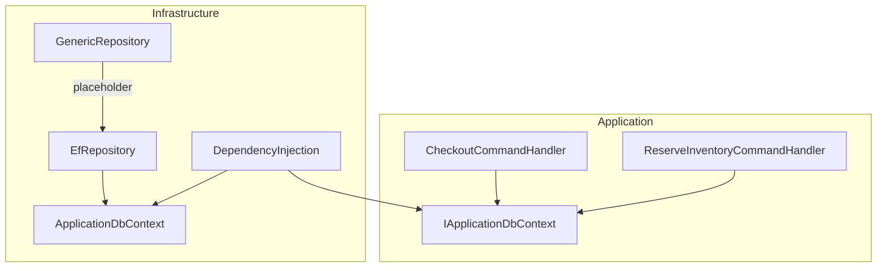
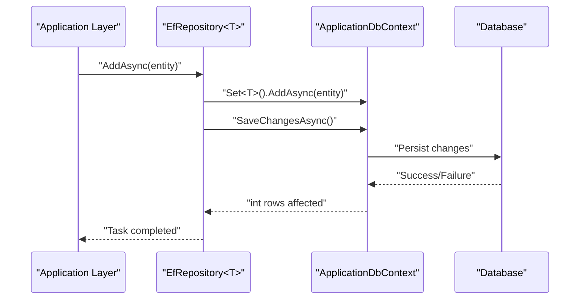
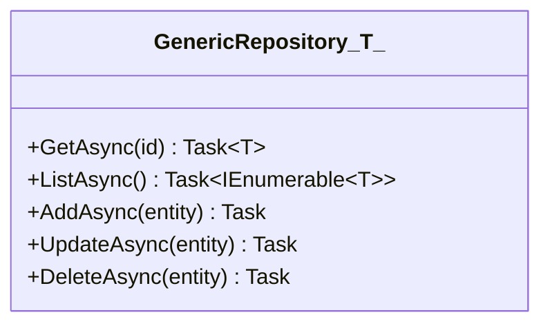
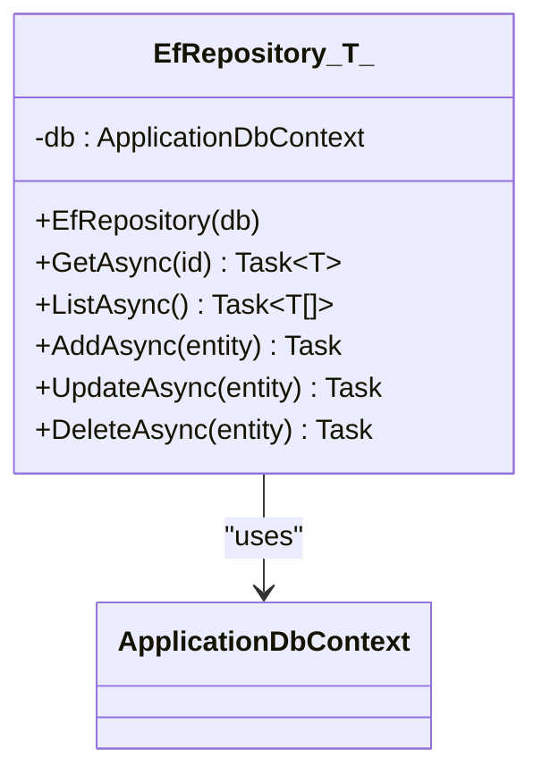
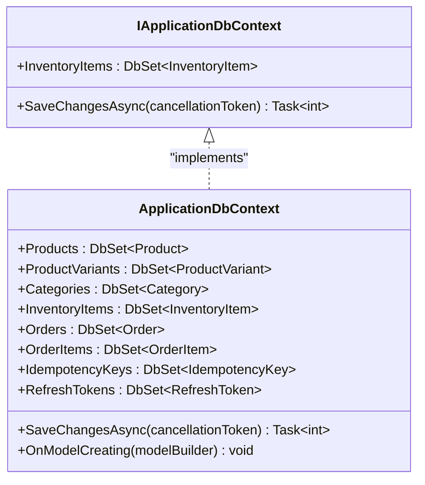
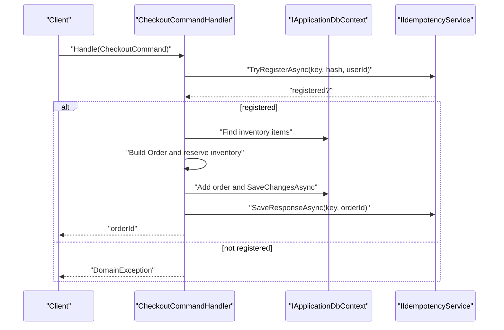
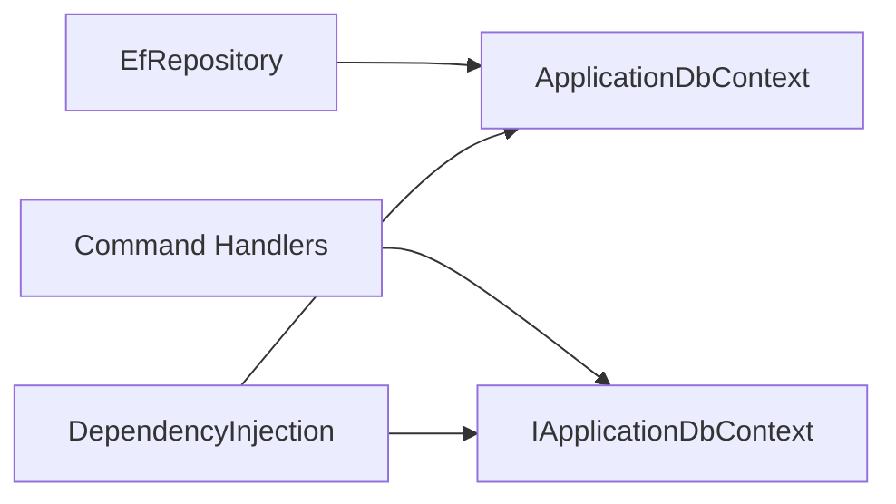

# Repository Pattern

<cite>
**Referenced Files in This Document**
- [GenericRepository.cs](file://src/Ecommerce.Infrastructure/Repositories/GenericRepository.cs)
- [EfRepository.cs](file://src/Ecommerce.Infrastructure/Repositories/EfRepository.cs)
- [ApplicationDbContext.cs](file://src/Ecommerce.Infrastructure/Persistence/ApplicationDbContext.cs)
- [IApplicationDbContext.cs](file://src/Ecommerce.Application/Interfaces/IApplicationDbContext.cs)
- [DependencyInjection.cs](file://src/Ecommerce.Infrastructure/DependencyInjection.cs)
- [CheckoutCommandHandler.cs](file://src/Ecommerce.Application/Commands/Checkout/CheckoutCommandHandler.cs)
- [ReserveInventoryCommandHandler.cs](file://src/Ecommerce.Application/Commands/ReserveInventory/ReserveInventoryCommandHandler.cs)
</cite>

## Table of Contents
1. Introduction
2. Project Structure
3. Core Components
4. Architecture Overview
5. Detailed Component Analysis
6. Dependency Analysis
7. Performance Considerations
8. Troubleshooting Guide
9. Conclusion
10. Appendices

## Introduction
This document explains the Repository Pattern implementation in the project, focusing on:
- The generic repository base class that defines common CRUD operations and query capabilities
- The Entity Framework-specific repository that implements persistence using EF Core
- Interface contracts for data access abstractions
- How application layer components interact with repositories or DbContext directly
- Unit of Work integration via DbContext, transaction boundaries, and testing strategies using mocks
- Advanced querying techniques, pagination support, and bulk operations guidance

The goal is to provide both a conceptual understanding and practical guidance for extending and using repositories effectively within this codebase.

## Project Structure
The repository-related code resides in the Infrastructure layer, while the Application layer consumes either repository abstractions or the DbContext abstraction. Key files include:
- Generic repository placeholder
- EF Core repository implementation
- DbContext and its interface exposed to Application
- Dependency injection configuration
- Command handlers demonstrating current usage patterns

**Diagram sources**
- [GenericRepository.cs:7-15](file://src/Ecommerce.Infrastructure/Repositories/GenericRepository.cs#L7-L15)
- [EfRepository.cs:9-45](file://src/Ecommerce.Infrastructure/Repositories/EfRepository.cs#L9-L45)
- [ApplicationDbContext.cs:13-40](file://src/Ecommerce.Infrastructure/Persistence/ApplicationDbContext.cs#L13-L40)
- [IApplicationDbContext.cs:8-13](file://src/Ecommerce.Application/Interfaces/IApplicationDbContext.cs#L8-L13)
- [DependencyInjection.cs:11-24](file://src/Ecommerce.Infrastructure/DependencyInjection.cs#L11-L24)
- [CheckoutCommandHandler.cs:13-22](file://src/Ecommerce.Application/Commands/Checkout/CheckoutCommandHandler.cs#L13-L22)
- [ReserveInventoryCommandHandler.cs:11-17](file://src/Ecommerce.Application/Commands/ReserveInventory/ReserveInventoryCommandHandler.cs#L11-L17)

**Section sources**
- [GenericRepository.cs:7-15](file://src/Ecommerce.Infrastructure/Repositories/GenericRepository.cs#L7-L15)
- [EfRepository.cs:9-45](file://src/Ecommerce.Infrastructure/Repositories/EfRepository.cs#L9-L45)
- [ApplicationDbContext.cs:13-40](file://src/Ecommerce.Infrastructure/Persistence/ApplicationDbContext.cs#L13-L40)
- [IApplicationDbContext.cs:8-13](file://src/Ecommerce.Application/Interfaces/IApplicationDbContext.cs#L8-L13)
- [DependencyInjection.cs:11-24](file://src/Ecommerce.Infrastructure/DependencyInjection.cs#L11-L24)
- [CheckoutCommandHandler.cs:13-22](file://src/Ecommerce.Application/Commands/Checkout/CheckoutCommandHandler.cs#L13-L22)
- [ReserveInventoryCommandHandler.cs:11-17](file://src/Ecommerce.Application/Commands/ReserveInventory/ReserveInventoryCommandHandler.cs#L11-L17)

## Core Components
- GenericRepository<T>: A minimal placeholder defining typical CRUD method signatures (GetAsync, ListAsync, AddAsync, UpdateAsync, DeleteAsync). It does not implement persistence logic; it serves as a contract baseline for future implementations.
- EfRepository<T>: Implements persistence using EF Core’s DbSet and ApplicationDbContext. Provides concrete GetAsync, ListAsync, AddAsync, UpdateAsync, DeleteAsync methods that call EF Core APIs and persist changes via SaveChangesAsync.
- IApplicationDbContext: An abstraction over DbContext exposed to the Application layer, currently exposing InventoryItems and SaveChangesAsync.
- ApplicationDbContext: Concrete EF Core DbContext implementing IApplicationDbContext and exposing multiple DbSets for domain entities.

Key responsibilities:
- GenericRepository<T>: Define consistent method signatures across repositories.
- EfRepository<T>: Bridge between domain/application and EF Core, encapsulating basic CRUD.
- IApplicationDbContext/ApplicationDbContext: Provide a testable persistence boundary and entity set access.

**Section sources**
- [GenericRepository.cs:7-15](file://src/Ecommerce.Infrastructure/Repositories/GenericRepository.cs#L7-L15)
- [EfRepository.cs:9-45](file://src/Ecommerce.Infrastructure/Repositories/EfRepository.cs#L9-L45)
- [IApplicationDbContext.cs:8-13](file://src/Ecommerce.Application/Interfaces/IApplicationDbContext.cs#L8-L13)
- [ApplicationDbContext.cs:13-40](file://src/Ecommerce.Infrastructure/Persistence/ApplicationDbContext.cs#L13-L40)

## Architecture Overview
The system uses a layered architecture:
- Application layer commands orchestrate business logic and use IApplicationDbContext for persistence.
- Infrastructure layer provides the concrete DbContext and repository implementations.
- Dependency injection wires up services and DbContext lifetimes.

**Diagram sources**
- [EfRepository.cs:28-38](file://src/Ecommerce.Infrastructure/Repositories/EfRepository.cs#L28-L38)
- [ApplicationDbContext.cs:29-32](file://src/Ecommerce.Infrastructure/Persistence/ApplicationDbContext.cs#L29-L32)

**Section sources**
- [DependencyInjection.cs:11-24](file://src/Ecommerce.Infrastructure/DependencyInjection.cs#L11-L24)
- [EfRepository.cs:9-45](file://src/Ecommerce.Infrastructure/Repositories/EfRepository.cs#L9-L45)
- [ApplicationDbContext.cs:13-40](file://src/Ecommerce.Infrastructure/Persistence/ApplicationDbContext.cs#L13-L40)

## Detailed Component Analysis

### GenericRepository<T>
- Purpose: Placeholder defining standard CRUD method signatures for consistency across repositories.
- Methods:
  - GetAsync(id): Returns a single entity by identifier.
  - ListAsync(): Returns all entities.
  - AddAsync(entity): Adds an entity.
  - UpdateAsync(entity): Updates an existing entity.
  - DeleteAsync(entity): Deletes an entity.
- Notes: No persistence logic is implemented here; intended as a base or template for concrete implementations.

**Diagram sources**
- [GenericRepository.cs:7-15](file://src/Ecommerce.Infrastructure/Repositories/GenericRepository.cs#L7-L15)

**Section sources**
- [GenericRepository.cs:7-15](file://src/Ecommerce.Infrastructure/Repositories/GenericRepository.cs#L7-L15)

### EfRepository<T>
- Purpose: Concrete repository using EF Core to perform CRUD operations against the database.
- Dependencies: ApplicationDbContext via constructor injection.
- Methods:
  - GetAsync(id): Uses FindAsync to retrieve by primary key.
  - ListAsync(): Retrieves all entities using ToListAsync.
  - AddAsync(entity): Adds entity and persists via SaveChangesAsync.
  - UpdateAsync(entity): Marks entity as modified and persists.
  - DeleteAsync(entity): Removes entity and persists.
- Transactional behavior: Each method calls SaveChangesAsync individually; consider grouping related operations into a single unit of work for atomicity.

**Diagram sources**
- [EfRepository.cs:9-45](file://src/Ecommerce.Infrastructure/Repositories/EfRepository.cs#L9-L45)
- [ApplicationDbContext.cs:13-40](file://src/Ecommerce.Infrastructure/Persistence/ApplicationDbContext.cs#L13-L40)

**Section sources**
- [EfRepository.cs:9-45](file://src/Ecommerce.Infrastructure/Repositories/EfRepository.cs#L9-L45)

### IApplicationDbContext and ApplicationDbContext
- IApplicationDbContext: Abstraction exposing InventoryItems DbSet and SaveChangesAsync for the Application layer.
- ApplicationDbContext: Concrete EF Core DbContext implementing IdentityDbContext and IApplicationDbContext, exposing multiple DbSets and model configurations.

**Diagram sources**
- [IApplicationDbContext.cs:8-13](file://src/Ecommerce.Application/Interfaces/IApplicationDbContext.cs#L8-L13)
- [ApplicationDbContext.cs:13-40](file://src/Ecommerce.Infrastructure/Persistence/ApplicationDbContext.cs#L13-L40)

**Section sources**
- [IApplicationDbContext.cs:8-13](file://src/Ecommerce.Application/Interfaces/IApplicationDbContext.cs#L8-L13)
- [ApplicationDbContext.cs:13-40](file://src/Ecommerce.Infrastructure/Persistence/ApplicationDbContext.cs#L13-L40)

### Usage in Application Layer
Current command handlers demonstrate direct usage of IApplicationDbContext rather than repositories:
- CheckoutCommandHandler:
  - Uses IApplicationDbContext to find inventory items and add orders.
  - Persists changes via SaveChangesAsync.
  - Integrates idempotency service for request deduplication.
- ReserveInventoryCommandHandler:
  - Reserves inventory quantity and persists changes.

**Diagram sources**
- [CheckoutCommandHandler.cs:22-90](file://src/Ecommerce.Application/Commands/Checkout/CheckoutCommandHandler.cs#L22-L90)
- [IApplicationDbContext.cs:8-13](file://src/Ecommerce.Application/Interfaces/IApplicationDbContext.cs#L8-L13)

**Section sources**
- [CheckoutCommandHandler.cs:22-90](file://src/Ecommerce.Application/Commands/Checkout/CheckoutCommandHandler.cs#L22-L90)
- [ReserveInventoryCommandHandler.cs:17-27](file://src/Ecommerce.Application/Commands/ReserveInventory/ReserveInventoryCommandHandler.cs#L17-L27)

## Dependency Analysis
- EfRepository<T> depends on ApplicationDbContext for persistence.
- Application layer depends on IApplicationDbContext, decoupling from EF Core specifics.
- DependencyInjection registers ApplicationDbContext and exposes it as IApplicationDbContext.

**Diagram sources**
- [EfRepository.cs:9-16](file://src/Ecommerce.Infrastructure/Repositories/EfRepository.cs#L9-L16)
- [ApplicationDbContext.cs:13-40](file://src/Ecommerce.Infrastructure/Persistence/ApplicationDbContext.cs#L13-L40)
- [DependencyInjection.cs:11-24](file://src/Ecommerce.Infrastructure/DependencyInjection.cs#L11-L24)
- [CheckoutCommandHandler.cs:13-22](file://src/Ecommerce.Application/Commands/Checkout/CheckoutCommandHandler.cs#L13-L22)

**Section sources**
- [DependencyInjection.cs:11-24](file://src/Ecommerce.Infrastructure/DependencyInjection.cs#L11-L24)
- [EfRepository.cs:9-16](file://src/Ecommerce.Infrastructure/Repositories/EfRepository.cs#L9-L16)
- [ApplicationDbContext.cs:13-40](file://src/Ecommerce.Infrastructure/Persistence/ApplicationDbContext.cs#L13-L40)
- [CheckoutCommandHandler.cs:13-22](file://src/Ecommerce.Application/Commands/Checkout/CheckoutCommandHandler.cs#L13-L22)

## Performance Considerations
- Batch operations: EfRepository<T> performs SaveChangesAsync per operation. For better performance, group multiple changes within a single unit of work to reduce round trips.
- Query efficiency: Use specific queries instead of loading entire sets when possible. Currently ListAsync retrieves all entities; prefer filtered queries for large datasets.
- Indexing: Ensure appropriate indexes on frequently queried columns (e.g., ProductId, ProductVariantId) to optimize lookups.
- Concurrency: Apply optimistic concurrency control where necessary to prevent lost updates.
- Pagination: Implement skip/take patterns for large result sets to avoid memory pressure and improve response times.

[No sources needed since this section provides general guidance]

## Troubleshooting Guide
Common issues and resolutions:
- Missing DbSet: If accessing entities not declared in ApplicationDbContext, add corresponding DbSet properties.
- SaveChanges failures: Validate entity state and constraints before saving; handle exceptions appropriately.
- Idempotency conflicts: Ensure idempotency key registration succeeds; handle cases where requests are already in flight.
- Transaction boundaries: Group related operations within a single SaveChangesAsync call to maintain consistency.

**Section sources**
- [CheckoutCommandHandler.cs:22-90](file://src/Ecommerce.Application/Commands/Checkout/CheckoutCommandHandler.cs#L22-L90)
- [ReserveInventoryCommandHandler.cs:17-27](file://src/Ecommerce.Application/Commands/ReserveInventory/ReserveInventoryCommandHandler.cs#L17-L27)
- [ApplicationDbContext.cs:29-32](file://src/Ecommerce.Infrastructure/Persistence/ApplicationDbContext.cs#L29-L32)

## Conclusion
The repository pattern in this project includes a generic placeholder and an EF Core-based implementation. While the current application layer uses IApplicationDbContext directly, adopting repositories can centralize data access logic, improve testability, and enforce consistent query patterns. Extending EfRepository<T> with advanced querying, pagination, and bulk operations will enhance scalability and maintainability. Proper transaction management and indexing will further optimize performance.

[No sources needed since this section summarizes without analyzing specific files]

## Appendices

### Unit of Work and Transactions
- DbContext acts as the unit of work; group multiple changes and call SaveChangesAsync once to ensure atomicity.
- For complex workflows, consider explicit transactions using Database.BeginTransactionAsync to encompass multiple operations.

**Section sources**
- [EfRepository.cs:28-44](file://src/Ecommerce.Infrastructure/Repositories/EfRepository.cs#L28-L44)
- [ApplicationDbContext.cs:29-32](file://src/Ecommerce.Infrastructure/Persistence/ApplicationDbContext.cs#L29-L32)

### Testing Strategies with Mock Repositories
- Mock IApplicationDbContext to isolate command handlers during unit tests.
- Replace EfRepository<T> with a mock or in-memory implementation for repository-focused tests.
- Verify interactions such as SaveChangesAsync calls and entity mutations.

**Section sources**
- [IApplicationDbContext.cs:8-13](file://src/Ecommerce.Application/Interfaces/IApplicationDbContext.cs#L8-L13)
- [EfRepository.cs:9-45](file://src/Ecommerce.Infrastructure/Repositories/EfRepository.cs#L9-L45)

### Advanced Querying Techniques
- Filtered queries: Use Where clauses to narrow results before materialization.
- Projections: Select only required fields to reduce payload size.
- Asynchronous queries: Prefer async methods to avoid blocking threads.
- Eager loading: Use Include for related entities when necessary, but be mindful of N+1 issues.

[No sources needed since this section provides general guidance]

### Pagination Support
- Implement Skip/Take patterns to paginate large result sets.
- Return metadata such as total count, page number, and page size alongside paginated results.

[No sources needed since this section provides general guidance]

### Bulk Operations
- For high-volume inserts/updates/deletes, consider batch processing libraries or EF Core bulk extensions to minimize round trips.
- Ensure proper transaction boundaries to maintain consistency.

[No sources needed since this section provides general guidance]