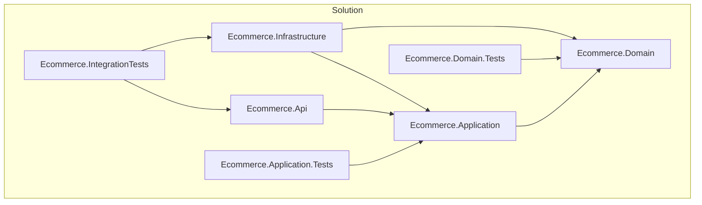
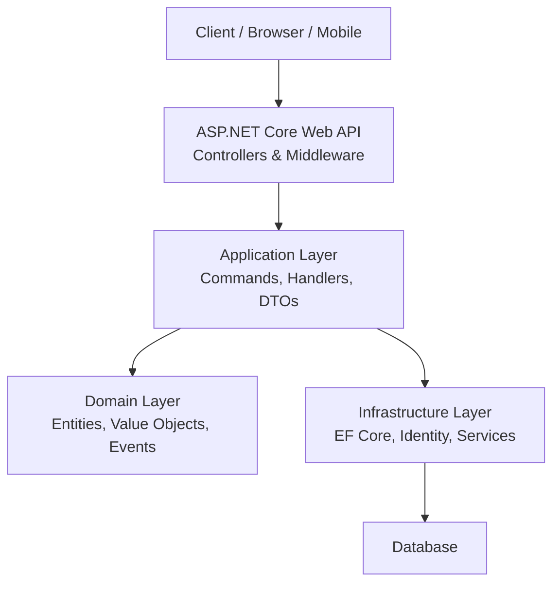
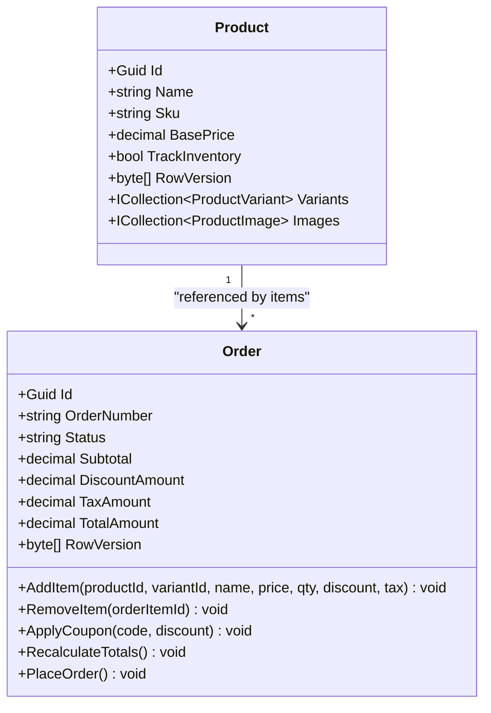
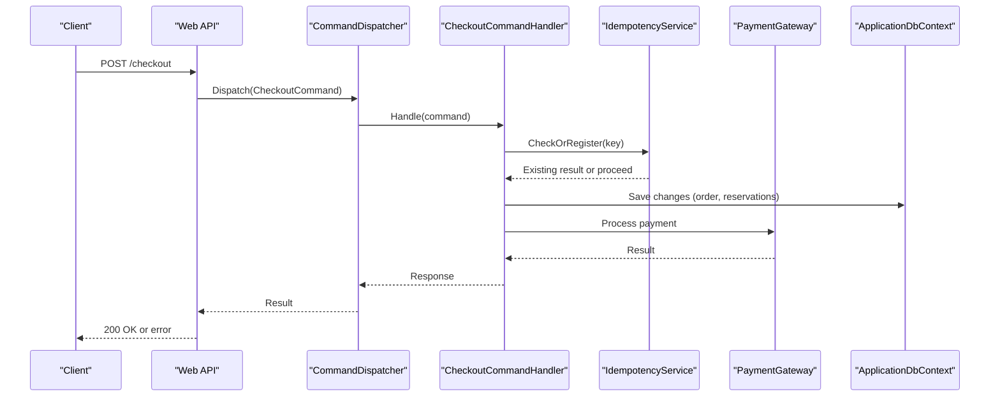
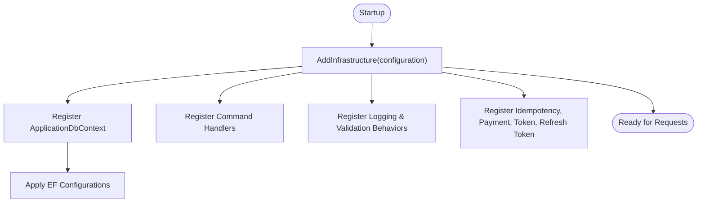
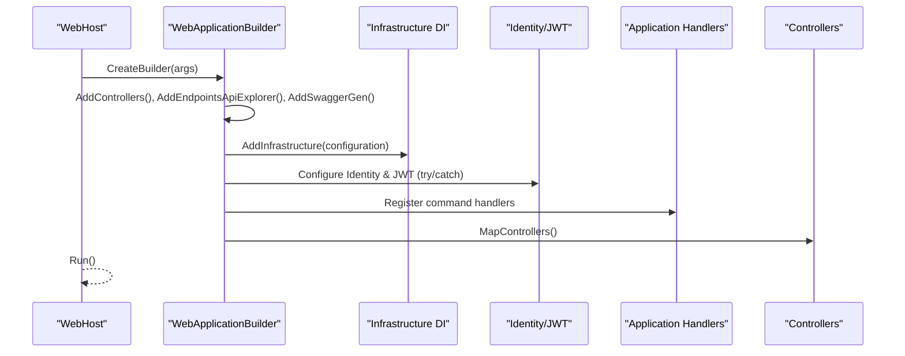
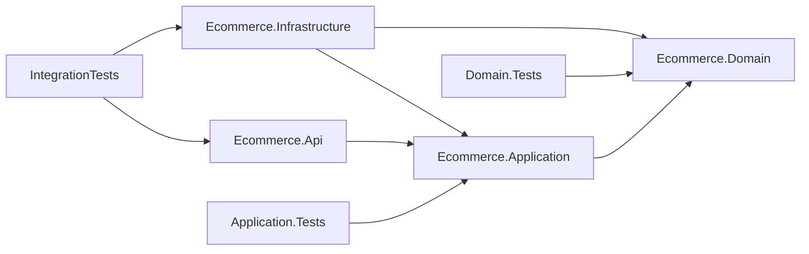

# Project Overview

<cite>
**Referenced Files in This Document**
- [README.md](file://README.md)
- [PROJECT_PROGRESS.md](file://PROJECT_PROGRESS.md)
- [Ecommerce.sln](file://Ecommerce.sln)
- [Directory.Build.props](file://Directory.Build.props)
- [Program.cs](file://src/Ecommerce.Api/Program.cs)
- [DependencyInjection.cs](file://src/Ecommerce.Infrastructure/DependencyInjection.cs)
- [ApplicationDbContext.cs](file://src/Ecommerce.Infrastructure/Persistence/ApplicationDbContext.cs)
- [Product.cs](file://src/Ecommerce.Domain/Entities/Product.cs)
- [Order.cs](file://src/Ecommerce.Domain/Entities/Order.cs)
- [CheckoutCommand.cs](file://src/Ecommerce.Application/Commands/Checkout/CheckoutCommand.cs)
- [dependency_diagram.md](file://docs/architecture/dependency_diagram.md)
- [entities_and_constraints.md](file://docs/architecture/entities_and_constraints.md)
</cite>

## Table of Contents
1. [Introduction](#introduction)
2. [Project Structure](#project-structure)
3. [Core Components](#core-components)
4. [Architecture Overview](#architecture-overview)
5. [Detailed Component Analysis](#detailed-component-analysis)
6. [Dependency Analysis](#dependency-analysis)
7. [Performance Considerations](#performance-considerations)
8. [Troubleshooting Guide](#troubleshooting-guide)
9. [Conclusion](#conclusion)
10. [Appendices](#appendices)

## Introduction
This project is a production-ready e-commerce backend built with Clean Architecture principles to ensure maintainability, testability, and scalability. It separates concerns into four layers: API, Application, Domain, and Infrastructure. The technology stack centers on .NET 8.0, ASP.NET Core Web API, Entity Framework Core, and Microsoft Identity for authentication and authorization.

Why Clean Architecture benefits e-commerce:
- Clear separation of business rules (Domain) from UI and persistence makes it easier to evolve features like catalog, inventory, checkout, payments, and post-order workflows without side effects.
- Testability improves because the Domain has no external dependencies, enabling fast unit tests for critical rules such as order totals and inventory constraints.
- Replaceable infrastructure allows swapping databases or payment providers while keeping application logic stable.
- CQRS and Repository patterns simplify complex workflows like checkout and reservation by modeling commands and isolating data access.

Current status and phases:
- Phase 1 (Architecture): Completed. Solution scaffolding, CI, and architecture documentation are in place.
- Phase 2 (Domain): In progress. Domain entities and value objects are scaffolded; domain behaviors are being added.
- Phase 3 (Application): In progress. CQRS command pipeline, DTOs, validators, and mappings are partially implemented.
- Phase 4 (Infrastructure): Partially complete. EF Core DbContext and configurations exist; migrations and full DI wiring are ongoing.
- Phase 5 (API): Partially complete. Program.cs configures controllers, Swagger, Identity/JWT setup, and registers application handlers.
- Feature phases (Catalog, Customer, Inventory, Checkout, Payments, Post-order, Admin): Planned and under construction.

**Section sources**
- [README.md:1-34](file://README.md#L1-L34)
- [PROJECT_PROGRESS.md:1-11](file://PROJECT_PROGRESS.md#L1-L11)

## Project Structure
The solution organizes code into four core projects plus test projects:
- Ecommerce.Domain: Pure business logic (entities, value objects, domain events, exceptions).
- Ecommerce.Application: Use cases and orchestration (CQRS commands/handlers, DTOs, validators, interfaces).
- Ecommerce.Infrastructure: Persistence and external services (EF Core, Identity, repositories, services, DI registration).
- Ecommerce.Api: HTTP entry point (controllers, middleware, configuration).
- Tests: Unit and integration tests aligned with layers.

**Diagram sources**
- [dependency_diagram.md:1-33](file://docs/architecture/dependency_diagram.md#L1-L33)
- [Ecommerce.sln:1-64](file://Ecommerce.sln#L1-L64)

**Section sources**
- [Ecommerce.sln:1-64](file://Ecommerce.sln#L1-L64)
- [dependency_diagram.md:1-33](file://docs/architecture/dependency_diagram.md#L1-L33)

## Core Components
Key building blocks that enable robust e-commerce operations:
- Domain Entities: Product, Order, InventoryItem, and related aggregates encapsulate business rules and state transitions.
- Value Objects: Money and AddressVO model immutable concepts used across the system.
- Domain Events: OrderPlacedDomainEvent and PaymentCompletedDomainEvent capture important business milestones for downstream processing.
- Application Commands: CheckoutCommand and ReserveInventoryCommand define user intents; handlers implement use cases via the command pipeline.
- Validation and Behaviors: FluentValidation adapters and pipeline behaviors (logging, validation) enforce input correctness and cross-cutting concerns.
- Infrastructure Services: IdempotencyService ensures safe retries; PaymentGateway provides a pluggable payment abstraction; RefreshTokenService manages tokens; JwtTokenService issues JWTs.
- Persistence: ApplicationDbContext exposes DbSets and applies EF Core configurations; DependencyInjection wires DbContext, services, and handlers.

Benefits for e-commerce:
- Strong domain boundaries protect inventory and order integrity.
- Command-driven flows make checkout and reservation predictable and testable.
- Idempotency prevents duplicate charges and orders during retries.
- Pluggable infrastructure supports multiple payment providers and database backends.

**Section sources**
- [Product.cs:1-44](file://src/Ecommerce.Domain/Entities/Product.cs#L1-L44)
- [Order.cs:1-105](file://src/Ecommerce.Domain/Entities/Order.cs#L1-L105)
- [CheckoutCommand.cs:1-22](file://src/Ecommerce.Application/Commands/Checkout/CheckoutCommand.cs#L1-L22)
- [DependencyInjection.cs:1-89](file://src/Ecommerce.Infrastructure/DependencyInjection.cs#L1-L89)
- [ApplicationDbContext.cs:1-43](file://src/Ecommerce.Infrastructure/Persistence/ApplicationDbContext.cs#L1-L43)

## Architecture Overview
The system follows Clean Architecture with strict layering:
- API Layer: Thin controllers and middleware; delegates to Application layer.
- Application Layer: Orchestrates use cases using CQRS; depends only on Domain and its own abstractions.
- Domain Layer: Contains business rules, entities, value objects, and domain events; no external dependencies.
- Infrastructure Layer: Implements Application abstractions (e.g., IApplicationDbContext), handles persistence, identity, and external integrations.

**Diagram sources**
- [Program.cs:1-77](file://src/Ecommerce.Api/Program.cs#L1-L77)
- [DependencyInjection.cs:1-89](file://src/Ecommerce.Infrastructure/DependencyInjection.cs#L1-L89)
- [dependency_diagram.md:1-33](file://docs/architecture/dependency_diagram.md#L1-L33)

## Detailed Component Analysis

### Domain Layer: Entities and Business Rules
- Product: Represents catalog items with pricing, dimensions, SEO fields, and relationships to variants and images. Includes soft-delete and concurrency support via RowVersion.
- Order: Encapsulates order lifecycle and calculations. Methods add/remove items, apply coupons, recalculate totals, and place orders with validations and timestamps.

**Diagram sources**
- [Product.cs:1-44](file://src/Ecommerce.Domain/Entities/Product.cs#L1-L44)
- [Order.cs:1-105](file://src/Ecommerce.Domain/Entities/Order.cs#L1-L105)

**Section sources**
- [Product.cs:1-44](file://src/Ecommerce.Domain/Entities/Product.cs#L1-L44)
- [Order.cs:1-105](file://src/Ecommerce.Domain/Entities/Order.cs#L1-L105)

### Application Layer: CQRS Command Pipeline
- CheckoutCommand: Captures user intent to purchase items with idempotency key support.
- Command Dispatcher and Behaviors: LoggingBehavior and ValidationBehavior wrap handler execution to enforce cross-cutting concerns consistently.
- Validators: FluentValidation adapters integrate with the pipeline to validate commands before handling.

**Diagram sources**
- [CheckoutCommand.cs:1-22](file://src/Ecommerce.Application/Commands/Checkout/CheckoutCommand.cs#L1-L22)
- [DependencyInjection.cs:1-89](file://src/Ecommerce.Infrastructure/DependencyInjection.cs#L1-L89)
- [ApplicationDbContext.cs:1-43](file://src/Ecommerce.Infrastructure/Persistence/ApplicationDbContext.cs#L1-L43)

**Section sources**
- [CheckoutCommand.cs:1-22](file://src/Ecommerce.Application/Commands/Checkout/CheckoutCommand.cs#L1-L22)
- [DependencyInjection.cs:1-89](file://src/Ecommerce.Infrastructure/DependencyInjection.cs#L1-L89)

### Infrastructure Layer: Persistence and Services
- ApplicationDbContext: EF Core context exposing DbSets for core entities and applying configurations from the assembly.
- DependencyInjection: Registers DbContext, command dispatcher, behaviors, validators, AutoMapper profiles, command handlers, payment gateway, idempotency service, refresh token service, JWT token service, and hosted cleanup service.

**Diagram sources**
- [DependencyInjection.cs:1-89](file://src/Ecommerce.Infrastructure/DependencyInjection.cs#L1-L89)
- [ApplicationDbContext.cs:1-43](file://src/Ecommerce.Infrastructure/Persistence/ApplicationDbContext.cs#L1-L43)

**Section sources**
- [DependencyInjection.cs:1-89](file://src/Ecommerce.Infrastructure/DependencyInjection.cs#L1-L89)
- [ApplicationDbContext.cs:1-43](file://src/Ecommerce.Infrastructure/Persistence/ApplicationDbContext.cs#L1-L43)

### API Layer: Entry Point and Configuration
- Program.cs configures controllers, Swagger, Identity/JWT (with graceful fallback if packages are missing), and maps routes.
- It also registers application command handlers directly when not auto-discovered.

**Diagram sources**
- [Program.cs:1-77](file://src/Ecommerce.Api/Program.cs#L1-L77)

**Section sources**
- [Program.cs:1-77](file://src/Ecommerce.Api/Program.cs#L1-L77)

## Dependency Analysis
Layer dependencies follow Clean Architecture rules:
- API depends on Application.
- Application depends on Domain.
- Infrastructure implements Application abstractions and depends on Domain.
- Tests target appropriate layers for isolation and integration scenarios.

**Diagram sources**
- [dependency_diagram.md:1-33](file://docs/architecture/dependency_diagram.md#L1-L33)
- [Ecommerce.sln:1-64](file://Ecommerce.sln#L1-L64)

**Section sources**
- [dependency_diagram.md:1-33](file://docs/architecture/dependency_diagram.md#L1-L33)
- [Ecommerce.sln:1-64](file://Ecommerce.sln#L1-L64)

## Performance Considerations
- Optimistic Concurrency: Use RowVersion on critical entities (Order, Product, InventoryItem) to prevent lost updates and overselling.
- Transaction Boundaries: Execute checkout within transactions to atomically reserve inventory, create orders, and record payments.
- Indexes and Unique Constraints: Ensure efficient queries and uniqueness for keys like OrderNumber, SKU, and ProviderPaymentId.
- Idempotency: Persist IdempotencyKey to avoid duplicate processing on retries, reducing redundant work and race conditions.
- Minimal API Surface: Keep controllers thin to reduce overhead and focus on orchestration through Application handlers.

[No sources needed since this section provides general guidance]

## Troubleshooting Guide
Common issues and resolutions:
- Missing NuGet Packages: If Identity/JWT or FluentValidation packages are not installed, Program.cs and DependencyInjection.cs gracefully skip registration. Install required packages locally and restore.
- Connection String: Ensure DefaultConnection is configured in appsettings.Development.json for SQL Server or your chosen provider.
- Migrations: Generate and apply EF Core migrations from the Infrastructure project after adding provider packages and configuring DbContext.
- Build Errors: Verify solution file includes all projects and targets net8.0 as defined in Directory.Build.props.

**Section sources**
- [Program.cs:1-77](file://src/Ecommerce.Api/Program.cs#L1-L77)
- [DependencyInjection.cs:1-89](file://src/Ecommerce.Infrastructure/DependencyInjection.cs#L1-L89)
- [Directory.Build.props:1-9](file://Directory.Build.props#L1-L9)

## Conclusion
This e-commerce backend leverages Clean Architecture to deliver a scalable, maintainable system tailored for complex commerce workflows. With strong domain modeling, command-driven application logic, and pluggable infrastructure, the platform supports catalog management, inventory control, checkout, payments, and post-order processes. Current progress shows solid scaffolding and partial implementations; next steps include completing domain behaviors, expanding application features, finalizing infrastructure wiring, and implementing API endpoints.

[No sources needed since this section summarizes without analyzing specific files]

## Appendices

### Technology Stack Summary
- .NET 8.0 and ASP.NET Core Web API for high-performance APIs.
- Entity Framework Core for relational data access and migrations.
- Microsoft Identity for user and role management.
- FluentValidation for request validation.
- AutoMapper for object mapping between DTOs and domain models.

**Section sources**
- [Directory.Build.props:1-9](file://Directory.Build.props#L1-L9)
- [DependencyInjection.cs:1-89](file://src/Ecommerce.Infrastructure/DependencyInjection.cs#L1-L89)

### Implementation Phases and Status
- Phase 1 (Architecture): Complete.
- Phase 2 (Domain): In progress; skeletons present, behaviors being added.
- Phase 3 (Application): In progress; CQRS pipeline, DTOs, validators partially implemented.
- Phase 4 (Infrastructure): Partially complete; DbContext and configurations exist; migrations and full DI ongoing.
- Phase 5 (API): Partially complete; Program.cs configured; controllers pending.
- Feature Phases: Catalog, Customer, Inventory, Checkout, Payments, Post-order, Admin planned.

**Section sources**
- [README.md:1-34](file://README.md#L1-L34)
- [PROJECT_PROGRESS.md:1-11](file://PROJECT_PROGRESS.md#L1-L11)

### Data Model Highlights
- Entities span catalog, inventory, orders, payments, shipping, coupons, taxes, reviews, returns, notifications, support tickets, audit logs, multi-currency, vendor marketplace, and idempotency.
- Concurrency and transactional guarantees are emphasized for critical operations like checkout and inventory reservation.

**Section sources**
- [entities_and_constraints.md:1-470](file://docs/architecture/entities_and_constraints.md#L1-L470)