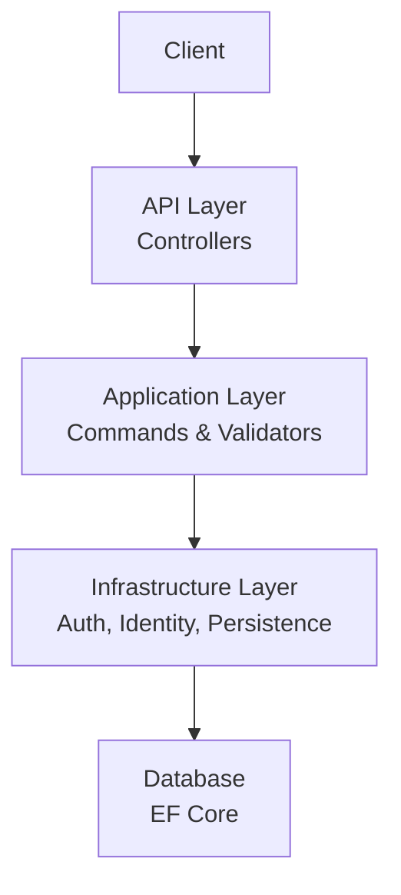
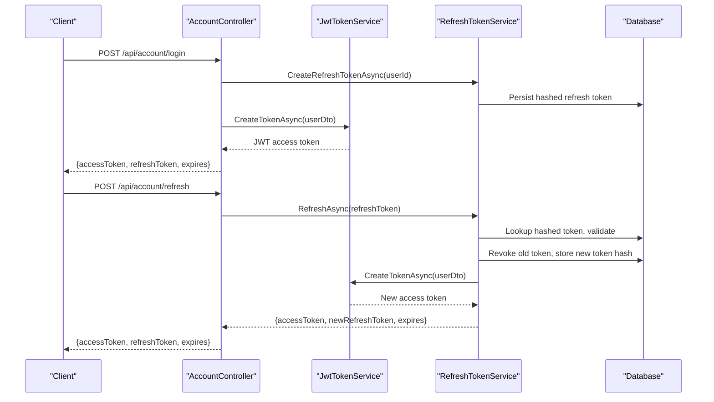
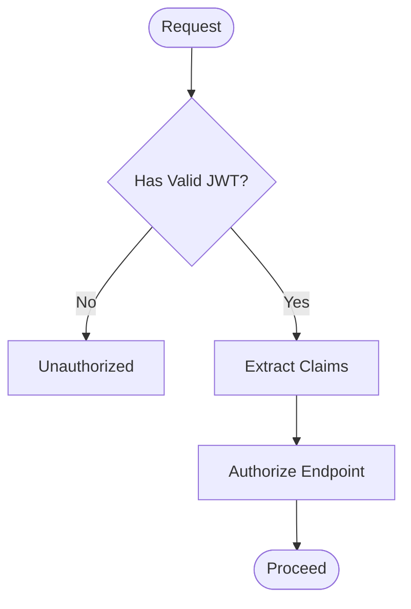
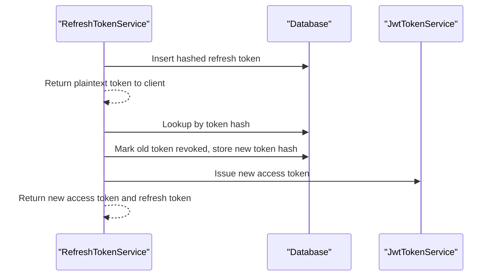
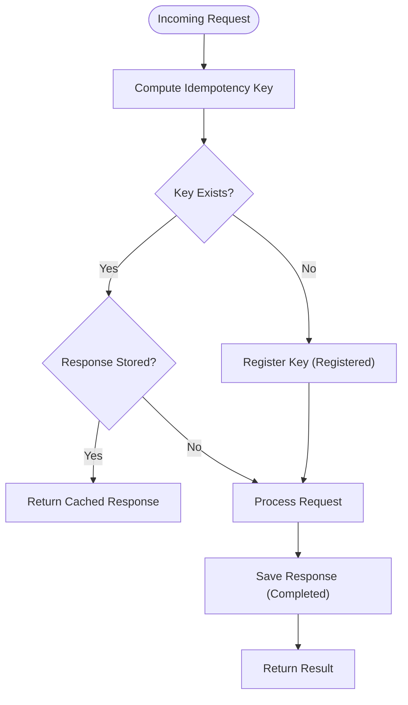
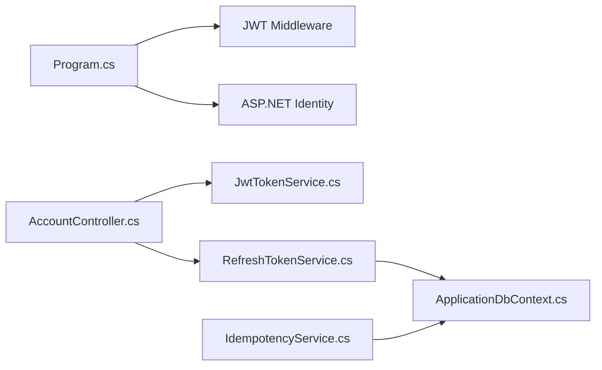

# Security Considerations

<cite>
**Referenced Files in This Document**
- [Program.cs](file://src/Ecommerce.Api/Program.cs)
- [AccountController.cs](file://src/Ecommerce.Api/Controllers/AccountController.cs)
- [JwtTokenService.cs](file://src/Ecommerce.Infrastructure/Auth/JwtTokenService.cs)
- [RefreshTokenService.cs](file://src/Ecommerce.Infrastructure/Services/RefreshTokenService.cs)
- [ApplicationUser.cs](file://src/Ecommerce.Infrastructure/Identity/ApplicationUser.cs)
- [ApplicationDbContext.cs](file://src/Ecommerce.Infrastructure/Persistence/ApplicationDbContext.cs)
- [IdempotencyKey.cs](file://src/Ecommerce.Domain/Entities/IdempotencyKey.cs)
- [IdempotencyService.cs](file://src/Ecommerce.Infrastructure/Services/IdempotencyService.cs)
- [CheckoutCommandFluentValidator.cs](file://src/Ecommerce.Application/Validators/CheckoutCommandFluentValidator.cs)
- [appsettings.Development.json](file://src/Ecommerce.Api/appsettings.Development.json)
- [AuditLog.cs](file://src/Ecommerce.Domain/Entities/AuditLog.cs)
</cite>

## Table of Contents
1. Introduction
2. Project Structure
3. Core Components
4. Architecture Overview
5. Detailed Component Analysis
6. Dependency Analysis
7. Performance Considerations
8. Troubleshooting Guide
9. Conclusion
10. Appendices

## Introduction
This document provides comprehensive security guidance for the E-Commerce Backend, focusing on authentication and authorization using JWT tokens and Microsoft Identity, password hashing via ASP.NET Identity, session management with refresh tokens, secure cookie handling considerations, input validation, SQL injection prevention through EF Core, XSS mitigation strategies, data encryption practices, secure communication protocols, idempotency to prevent duplicate transactions and race conditions, API/database/file upload security best practices, and vulnerability assessment procedures.

## Project Structure
The application follows a layered architecture:
- API layer exposes HTTP endpoints (controllers).
- Application layer implements use cases and command handlers with validators.
- Domain layer defines entities and value objects.
- Infrastructure layer provides persistence, identity, authentication services, and external integrations.

[No sources needed since this diagram shows conceptual workflow, not actual code structure]

## Core Components
- Authentication and Authorization:
  - JWT bearer authentication configured at startup.
  - Token issuance and refresh flows implemented.
- Identity Management:
  - ASP.NET Identity with custom user entity.
  - Password hashing handled by Identity framework.
- Session Management:
  - Refresh token lifecycle with server-side storage and rotation.
- Input Validation:
  - FluentValidation rules for commands.
- Data Protection:
  - EF Core parameterized queries to prevent SQL injection.
  - Audit logging model available for tracking changes.

**Section sources**
- [Program.cs:19-55](file://src/Ecommerce.Api/Program.cs#L19-L55)
- [AccountController.cs:34-107](file://src/Ecommerce.Api/Controllers/AccountController.cs#L34-L107)
- [JwtTokenService.cs:22-45](file://src/Ecommerce.Infrastructure/Auth/JwtTokenService.cs#L22-L45)
- [RefreshTokenService.cs:28-79](file://src/Ecommerce.Infrastructure/Services/RefreshTokenService.cs#L28-L79)
- [ApplicationUser.cs:6-17](file://src/Ecommerce.Infrastructure/Identity/ApplicationUser.cs#L6-L17)
- [CheckoutCommandFluentValidator.cs:5-17](file://src/Ecommerce.Application/Validators/CheckoutCommandFluentValidator.cs#L5-L17)
- [ApplicationDbContext.cs:13-40](file://src/Ecommerce.Infrastructure/Persistence/ApplicationDbContext.cs#L13-L40)
- [AuditLog.cs:5-17](file://src/Ecommerce.Domain/Entities/AuditLog.cs#L5-L17)

## Architecture Overview
Authentication and authorization flow:
- Clients authenticate via login/register endpoints.
- Server issues short-lived access tokens (JWT) and long-lived refresh tokens.
- Protected endpoints require valid JWT; refresh endpoint rotates refresh tokens securely.

**Diagram sources**
- [AccountController.cs:44-65](file://src/Ecommerce.Api/Controllers/AccountController.cs#L44-L65)
- [JwtTokenService.cs:22-45](file://src/Ecommerce.Infrastructure/Auth/JwtTokenService.cs#L22-L45)
- [RefreshTokenService.cs:28-79](file://src/Ecommerce.Infrastructure/Services/RefreshTokenService.cs#L28-L79)

**Section sources**
- [Program.cs:19-55](file://src/Ecommerce.Api/Program.cs#L19-L55)
- [AccountController.cs:44-65](file://src/Ecommerce.Api/Controllers/AccountController.cs#L44-L65)

## Detailed Component Analysis

### Authentication and Authorization (JWT + Microsoft Identity)
- JWT configuration:
  - Symmetric signing key and issuer configured via settings.
  - Token validation enforces issuer, audience, lifetime, and signing key.
- Token creation:
  - Claims include subject, email, and unique JTI.
  - Expiration set to a short window for access tokens.
- Authorization:
  - Controllers protect sensitive endpoints with Authorize attribute.
  - Current user identity extracted from JWT claims.

**Diagram sources**
- [Program.cs:29-48](file://src/Ecommerce.Api/Program.cs#L29-L48)
- [AccountController.cs:67-99](file://src/Ecommerce.Api/Controllers/AccountController.cs#L67-L99)
- [JwtTokenService.cs:22-45](file://src/Ecommerce.Infrastructure/Auth/JwtTokenService.cs#L22-L45)

**Section sources**
- [Program.cs:29-48](file://src/Ecommerce.Api/Program.cs#L29-L48)
- [JwtTokenService.cs:22-45](file://src/Ecommerce.Infrastructure/Auth/JwtTokenService.cs#L22-L45)
- [AccountController.cs:67-99](file://src/Ecommerce.Api/Controllers/AccountController.cs#L67-L99)

### Password Hashing and User Management
- ASP.NET Identity handles password hashing automatically when creating users.
- Custom user entity extends IdentityUser with additional profile fields.
- Login uses SignInManager to verify credentials securely.

**Section sources**
- [AccountController.cs:34-54](file://src/Ecommerce.Api/Controllers/AccountController.cs#L34-L54)
- [ApplicationUser.cs:6-17](file://src/Ecommerce.Infrastructure/Identity/ApplicationUser.cs#L6-L17)

### Session Management and Secure Refresh Tokens
- Refresh tokens are generated cryptographically and stored hashed in the database.
- On refresh, the old token is revoked and replaced with a new one (rotation).
- Revocation supports single-token or all-sessions revocation.
- Expired tokens are cleaned up periodically.

**Diagram sources**
- [RefreshTokenService.cs:28-79](file://src/Ecommerce.Infrastructure/Services/RefreshTokenService.cs#L28-L79)

**Section sources**
- [RefreshTokenService.cs:28-123](file://src/Ecommerce.Infrastructure/Services/RefreshTokenService.cs#L28-L123)
- [AccountController.cs:56-87](file://src/Ecommerce.Api/Controllers/AccountController.cs#L56-L87)

### Secure Cookie Handling
- The current implementation returns tokens in JSON responses rather than cookies.
- If cookies are used later, ensure:
  - HttpOnly and Secure flags.
  - SameSite policy appropriate for cross-site scenarios.
  - Short expiration and rotation strategy.
  - Avoid storing sensitive data in cookies.

[No sources needed since this section provides general guidance]

### Input Validation and XSS Protection
- Command-level validation via FluentValidation ensures business constraints.
- Use output encoding and content security policies to mitigate XSS.
- Validate and sanitize any user-supplied content before rendering.

**Section sources**
- [CheckoutCommandFluentValidator.cs:5-17](file://src/Ecommerce.Application/Validators/CheckoutCommandFluentValidator.cs#L5-L17)

[No sources needed since this section provides general guidance]

### SQL Injection Prevention
- EF Core generates parameterized queries, mitigating SQL injection risks.
- Avoid raw SQL unless necessary; if required, parameterize inputs rigorously.
- Apply least privilege database accounts.

**Section sources**
- [ApplicationDbContext.cs:13-40](file://src/Ecommerce.Infrastructure/Persistence/ApplicationDbContext.cs#L13-L40)

### Idempotency Implementation
- Idempotency keys track requests to prevent duplicate processing.
- Service checks for existing keys, registers new ones, and stores responses.
- Owner scoping and status transitions support safe retries.

**Diagram sources**
- [IdempotencyService.cs:19-54](file://src/Ecommerce.Infrastructure/Services/IdempotencyService.cs#L19-L54)
- [IdempotencyKey.cs:5-15](file://src/Ecommerce.Domain/Entities/IdempotencyKey.cs#L5-L15)

**Section sources**
- [IdempotencyService.cs:19-54](file://src/Ecommerce.Infrastructure/Services/IdempotencyService.cs#L19-L54)
- [IdempotencyKey.cs:5-15](file://src/Ecommerce.Domain/Entities/IdempotencyKey.cs#L5-L15)

### Data Encryption Strategies
- Secrets (JWT key) should be managed via secure configuration providers (e.g., Azure Key Vault, environment variables), not hard-coded defaults.
- Prefer HTTPS for all communications; enforce TLS in production.
- Encrypt sensitive data at rest where required (e.g., PII, payment details) using platform encryption or libraries.

**Section sources**
- [appsettings.Development.json:8-14](file://src/Ecommerce.Api/appsettings.Development.json#L8-L14)
- [Program.cs:26-48](file://src/Ecommerce.Api/Program.cs#L26-L48)

### Secure Communication Protocols
- Configure HTTPS redirection and HSTS in production.
- Ensure RequireHttpsMetadata is enabled for JWT Bearer in production environments.
- Restrict CORS origins and methods to only what is necessary.

**Section sources**
- [Program.cs:29-48](file://src/Ecommerce.Api/Program.cs#L29-L48)

### API Endpoint Security Best Practices
- Enforce authentication on all sensitive endpoints.
- Validate all inputs; reject invalid payloads early.
- Limit response data to minimal necessary fields.
- Implement rate limiting and request throttling.
- Log security-relevant events without sensitive data.

**Section sources**
- [AccountController.cs:67-99](file://src/Ecommerce.Api/Controllers/AccountController.cs#L67-L99)

### Database Access Security
- Use EF Core configurations and migrations to manage schema safely.
- Apply least privilege database credentials.
- Enable audit logging for critical operations.

**Section sources**
- [ApplicationDbContext.cs:13-40](file://src/Ecommerce.Infrastructure/Persistence/ApplicationDbContext.cs#L13-L40)
- [AuditLog.cs:5-17](file://src/Ecommerce.Domain/Entities/AuditLog.cs#L5-L17)

### File Upload Security
- Validate file types and sizes server-side.
- Store files outside web root; serve via secure endpoints.
- Scan uploaded files for malware.
- Sanitize filenames and metadata.

[No sources needed since this section provides general guidance]

## Dependency Analysis
Security-related dependencies and their roles:
- Program configures authentication middleware and JWT options.
- AccountController orchestrates login, registration, refresh, and revocation.
- JwtTokenService creates signed JWTs.
- RefreshTokenService manages refresh token lifecycle and rotation.
- DbContext persists entities including idempotency keys and refresh tokens.

**Diagram sources**
- [Program.cs:19-55](file://src/Ecommerce.Api/Program.cs#L19-L55)
- [AccountController.cs:34-107](file://src/Ecommerce.Api/Controllers/AccountController.cs#L34-L107)
- [JwtTokenService.cs:22-45](file://src/Ecommerce.Infrastructure/Auth/JwtTokenService.cs#L22-L45)
- [RefreshTokenService.cs:28-79](file://src/Ecommerce.Infrastructure/Services/RefreshTokenService.cs#L28-L79)
- [ApplicationDbContext.cs:13-40](file://src/Ecommerce.Infrastructure/Persistence/ApplicationDbContext.cs#L13-L40)
- [IdempotencyService.cs:19-54](file://src/Ecommerce.Infrastructure/Services/IdempotencyService.cs#L19-L54)

**Section sources**
- [Program.cs:19-55](file://src/Ecommerce.Api/Program.cs#L19-L55)
- [AccountController.cs:34-107](file://src/Ecommerce.Api/Controllers/AccountController.cs#L34-L107)

## Performance Considerations
- Keep JWT payload small to reduce bandwidth and parsing overhead.
- Cache read-only data appropriately while avoiding sensitive information.
- Use asynchronous operations for I/O-bound tasks (already present).
- Rotate refresh tokens to limit exposure windows.
- Monitor database query performance and indexes for idempotency and refresh token lookups.

[No sources needed since this section provides general guidance]

## Troubleshooting Guide
Common issues and resolutions:
- Invalid JWT errors:
  - Verify signing key and issuer match between issuer and validator.
  - Ensure token has not expired and was issued by trusted source.
- Unauthorized refresh attempts:
  - Confirm refresh token exists, is active, and not revoked.
  - Check that token hash lookup succeeds and replacement logic runs.
- Duplicate transactions:
  - Ensure idempotency keys are unique per owner and operation.
  - Validate that responses are cached and returned for repeated keys.
- Auditability:
  - Use audit logs to trace actions, IPs, and user agents for investigations.

**Section sources**
- [Program.cs:29-48](file://src/Ecommerce.Api/Program.cs#L29-L48)
- [RefreshTokenService.cs:50-89](file://src/Ecommerce.Infrastructure/Services/RefreshTokenService.cs#L50-L89)
- [IdempotencyService.cs:19-54](file://src/Ecommerce.Infrastructure/Services/IdempotencyService.cs#L19-L54)
- [AuditLog.cs:5-17](file://src/Ecommerce.Domain/Entities/AuditLog.cs#L5-L17)

## Conclusion
The backend implements robust authentication and authorization using JWT and ASP.NET Identity, with secure refresh token rotation and server-side storage. Input validation is enforced via FluentValidation, and EF Core mitigates SQL injection risks. Idempotency keys prevent duplicate transactions. Production hardening should focus on secure secret management, HTTPS enforcement, strict CORS, rate limiting, and comprehensive auditing.

[No sources needed since this section summarizes without analyzing specific files]

## Appendices

### Configuration Notes
- JWT key and issuer are loaded from configuration; replace development defaults with secure secrets in production.
- Connection strings should reference secure databases with least privilege accounts.

**Section sources**
- [appsettings.Development.json:8-14](file://src/Ecommerce.Api/appsettings.Development.json#L8-L14)
- [Program.cs:26-48](file://src/Ecommerce.Api/Program.cs#L26-L48)

### Vulnerability Assessment and Security Testing
- Static analysis:
  - Run .NET analyzers and dependency scanning tools to detect known vulnerabilities.
- Dynamic testing:
  - Perform penetration testing focusing on authentication, authorization, input validation, and session handling.
- Unit and integration tests:
  - Validate idempotency behavior under concurrent requests.
  - Test refresh token rotation and revocation flows.
- Compliance checks:
  - Ensure HTTPS, HSTS, and secure headers are configured.
  - Validate that no sensitive data is logged or exposed in responses.

[No sources needed since this section provides general guidance]