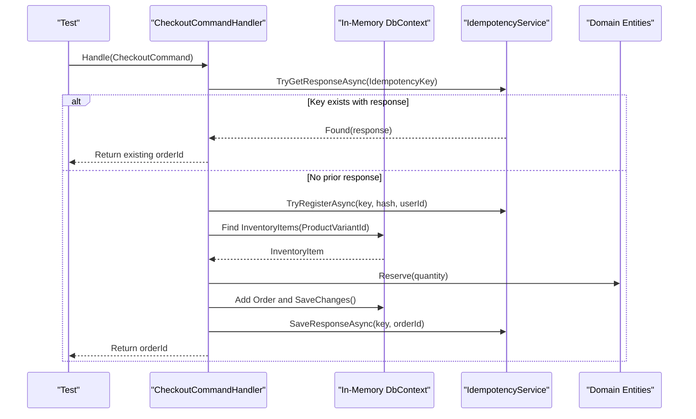
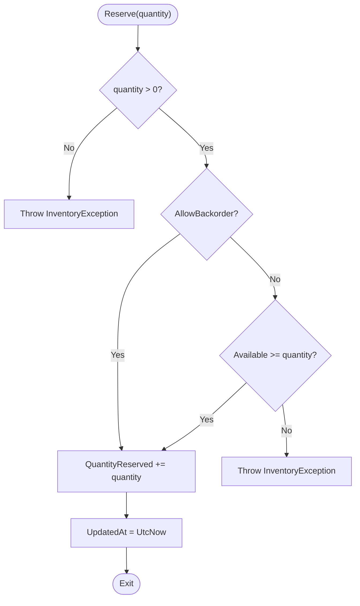
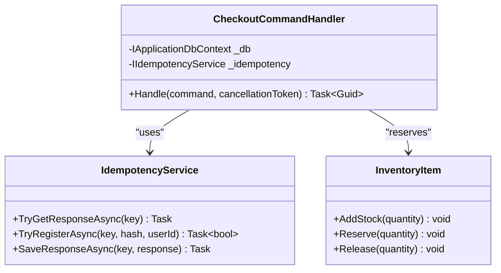
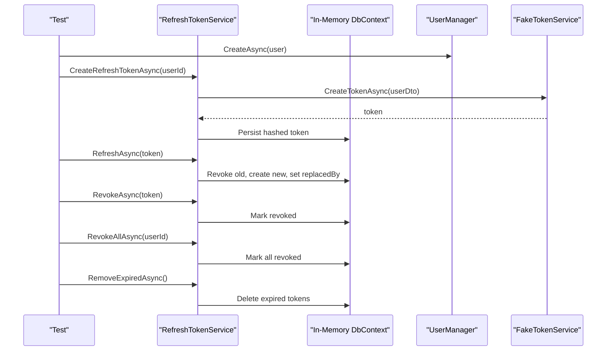
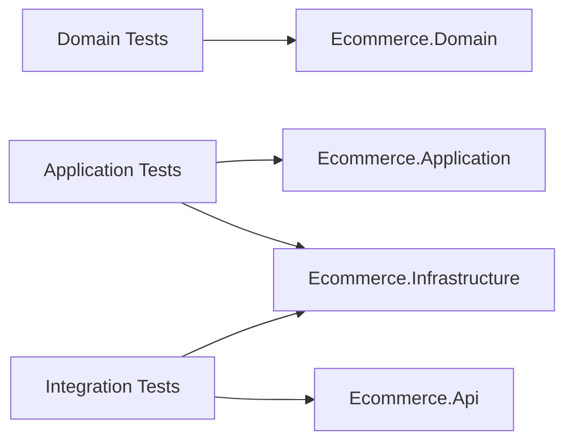

# Testing Strategy

<cite>
**Referenced Files in This Document**
- [ci.yml](file://.github/workflows/ci.yml)
- [InventoryItemTests.cs](file://tests/Ecommerce.Domain.Tests/InventoryItemTests.cs)
- [OrderTests.cs](file://tests/Ecommerce.Domain.Tests/OrderTests.cs)
- [Ecommerce.Domain.Tests.csproj](file://tests/Ecommerce.Domain.Tests/Ecommerce.Domain.Tests.csproj)
- [CheckoutHandlerTests.cs](file://tests/Ecommerce.Application.Tests/CheckoutHandlerTests.cs)
- [ReserveInventoryHandlerTests.cs](file://tests/Ecommerce.Application.Tests/ReserveInventoryHandlerTests.cs)
- [CheckoutIdempotencyTests.cs](file://tests/Ecommerce.Application.Tests/CheckoutIdempotencyTests.cs)
- [DispatcherReserveInventoryTests.cs](file://tests/Ecommerce.Application.Tests/DispatcherReserveInventoryTests.cs)
- [Ecommerce.Application.Tests.csproj](file://tests/Ecommerce.Application.Tests/Ecommerce.Application.Tests.csproj)
- [CheckoutIdempotencyIntegrationTests.cs](file://tests/Ecommerce.IntegrationTests/CheckoutIdempotencyIntegrationTests.cs)
- [InventoryReservationIntegrationTests.cs](file://tests/Ecommerce.IntegrationTests/InventoryReservationIntegrationTests.cs)
- [RefreshTokenIntegrationTests.cs](file://tests/Ecommerce.IntegrationTests/RefreshTokenIntegrationTests.cs)
- [Ecommerce.IntegrationTests.csproj](file://tests/Ecommerce.IntegrationTests/Ecommerce.IntegrationTests.csproj)
- [CheckoutCommandHandler.cs](file://src/Ecommerce.Application/Commands/Checkout/CheckoutCommandHandler.cs)
- [InventoryItem.cs](file://src/Ecommerce.Domain/Entities/InventoryItem.cs)
</cite>

## Table of Contents
1. Introduction
2. Project Structure
3. Core Components
4. Architecture Overview
5. Detailed Component Analysis
6. Dependency Analysis
7. Performance Considerations
8. Troubleshooting Guide
9. Conclusion

## Introduction
This document explains the testing strategy for the E-Commerce Backend, focusing on a clear testing pyramid: unit tests for domain logic, integration tests for application workflows and database operations, and end-to-end style verification via API-oriented integration tests. It documents the frameworks used (xUnit), test data management with in-memory databases, mocking strategies for external services, and isolation techniques to keep tests fast and reliable. It also provides guidance for writing maintainable tests and achieving good coverage, plus continuous integration execution details.

Note: The repository uses xUnit and in-memory EF Core for tests. There is no evidence of Moq or Testcontainers usage in the provided files; this guide reflects what is actually present and suggests where those tools could be adopted if needed.

## Project Structure
The test suite is organized into three layers aligned with the testing pyramid:
- Domain unit tests: Validate business rules inside domain entities without infrastructure dependencies.
- Application unit/integration tests: Exercise command handlers with an in-memory database to verify persistence and workflow behavior.
- Integration tests: Cover broader scenarios including identity and token lifecycle using in-memory persistence and minimal service fakes.

```mermaid
graph TB
subgraph "Domain Tests"
D1["InventoryItemTests.cs"]
D2["OrderTests.cs"]
end
subgraph "Application Tests"
A1["CheckoutHandlerTests.cs"]
A2["ReserveInventoryHandlerTests.cs"]
A3["CheckoutIdempotencyTests.cs"]
A4["DispatcherReserveInventoryTests.cs"]
end
subgraph "Integration Tests"
I1["CheckoutIdempotencyIntegrationTests.cs"]
I2["InventoryReservationIntegrationTests.cs"]
I3["RefreshTokenIntegrationTests.cs"]
end
D1 --> |"Validates"| "InventoryItem.cs"
D2 --> |"Validates"| "Order entity"
A1 --> |"Uses"| "CheckoutCommandHandler.cs"
A2 --> |"Uses"| "ReserveInventory handler"
A3 --> |"Uses"| "CheckoutCommandHandler.cs"
A4 --> |"Uses"| "CommandDispatcher"
I1 --> |"End-to-end flow"| "CheckoutCommandHandler.cs"
I2 --> |"DB state transitions"| "InventoryItem.cs"
I3 --> |"Identity + tokens"| "RefreshTokenService"
```

**Diagram sources**
- [InventoryItemTests.cs:10-36](file://tests/Ecommerce.Domain.Tests/InventoryItemTests.cs#L10-L36)
- [OrderTests.cs:10-39](file://tests/Ecommerce.Domain.Tests/OrderTests.cs#L10-L39)
- [CheckoutHandlerTests.cs:23-54](file://tests/Ecommerce.Application.Tests/CheckoutHandlerTests.cs#L23-L54)
- [ReserveInventoryHandlerTests.cs:22-39](file://tests/Ecommerce.Application.Tests/ReserveInventoryHandlerTests.cs#L22-L39)
- [CheckoutIdempotencyTests.cs:22-53](file://tests/Ecommerce.Application.Tests/CheckoutIdempotencyTests.cs#L22-L53)
- [DispatcherReserveInventoryTests.cs:30-54](file://tests/Ecommerce.Application.Tests/DispatcherReserveInventoryTests.cs#L30-L54)
- [CheckoutIdempotencyIntegrationTests.cs:24-66](file://tests/Ecommerce.IntegrationTests/CheckoutIdempotencyIntegrationTests.cs#L24-L66)
- [InventoryReservationIntegrationTests.cs:21-49](file://tests/Ecommerce.IntegrationTests/InventoryReservationIntegrationTests.cs#L21-L49)
- [RefreshTokenIntegrationTests.cs:60-178](file://tests/Ecommerce.IntegrationTests/RefreshTokenIntegrationTests.cs#L60-L178)
- [CheckoutCommandHandler.cs:22-91](file://src/Ecommerce.Application/Commands/Checkout/CheckoutCommandHandler.cs#L22-L91)
- [InventoryItem.cs:22-67](file://src/Ecommerce.Domain/Entities/InventoryItem.cs#L22-L67)

**Section sources**
- [Ecommerce.Domain.Tests.csproj:1-18](file://tests/Ecommerce.Domain.Tests/Ecommerce.Domain.Tests.csproj#L1-L18)
- [Ecommerce.Application.Tests.csproj:1-20](file://tests/Ecommerce.Application.Tests/Ecommerce.Application.Tests.csproj#L1-L20)
- [Ecommerce.IntegrationTests.csproj:1-21](file://tests/Ecommerce.IntegrationTests/Ecommerce.IntegrationTests.csproj#L1-L21)

## Core Components
- xUnit as the test framework across all test projects.
- In-memory Entity Framework Core for fast, isolated database-backed tests.
- Minimal fakes for external services (e.g., token service) to isolate behavior.
- Command handlers as the primary units under test in the application layer.
- Domain entities as the core units under test in the domain layer.

Key characteristics:
- Fast feedback loop: in-memory DB avoids real database setup.
- Clear boundaries: domain tests do not touch infrastructure; application tests validate persistence and workflows; integration tests cover multi-step flows.
- Deterministic assertions: tests assert final persisted state and side effects.

**Section sources**
- [Ecommerce.Domain.Tests.csproj:10-16](file://tests/Ecommerce.Domain.Tests/Ecommerce.Domain.Tests.csproj#L10-L16)
- [Ecommerce.Application.Tests.csproj:11-17](file://tests/Ecommerce.Application.Tests/Ecommerce.Application.Tests.csproj#L11-L17)
- [Ecommerce.IntegrationTests.csproj:11-18](file://tests/Ecommerce.IntegrationTests/Ecommerce.IntegrationTests.csproj#L11-L18)
- [CheckoutHandlerTests.cs:14-21](file://tests/Ecommerce.Application.Tests/CheckoutHandlerTests.cs#L14-L21)
- [CheckoutIdempotencyIntegrationTests.cs:15-22](file://tests/Ecommerce.IntegrationTests/CheckoutIdempotencyIntegrationTests.cs#L15-L22)
- [RefreshTokenIntegrationTests.cs:45-51](file://tests/Ecommerce.IntegrationTests/RefreshTokenIntegrationTests.cs#L45-L51)

## Architecture Overview
The testing architecture mirrors the production architecture:
- Domain layer: pure business logic validated by unit tests.
- Application layer: command handlers orchestrate use cases, tested with in-memory persistence.
- Infrastructure layer: persistence and services are exercised through in-memory DB and lightweight fakes.



**Diagram sources**
- [CheckoutCommandHandler.cs:22-91](file://src/Ecommerce.Application/Commands/Checkout/CheckoutCommandHandler.cs#L22-L91)
- [CheckoutIdempotencyTests.cs:22-53](file://tests/Ecommerce.Application.Tests/CheckoutIdempotencyTests.cs#L22-L53)
- [CheckoutIdempotencyIntegrationTests.cs:24-66](file://tests/Ecommerce.IntegrationTests/CheckoutIdempotencyIntegrationTests.cs#L24-L66)

## Detailed Component Analysis

### Domain Unit Tests: InventoryItem
Focus: Validate inventory business rules such as adding stock, reserving against available quantity, releasing reserved quantities, and removing stock.



**Diagram sources**
- [InventoryItem.cs:29-40](file://src/Ecommerce.Domain/Entities/InventoryItem.cs#L29-L40)

**Section sources**
- [InventoryItemTests.cs:10-36](file://tests/Ecommerce.Domain.Tests/InventoryItemTests.cs#L10-L36)
- [InventoryItem.cs:22-67](file://src/Ecommerce.Domain/Entities/InventoryItem.cs#L22-L67)

### Domain Unit Tests: Order
Focus: Ensure order totals update correctly when items are added and that placing an empty order fails while placing a valid order sets status and timestamps.

**Section sources**
- [OrderTests.cs:10-39](file://tests/Ecommerce.Domain.Tests/OrderTests.cs#L10-L39)

### Application Layer: Checkout Command Handler
Focus: Verify that checkout creates orders, reserves inventory, and supports idempotency keys to prevent duplicate processing.



**Diagram sources**
- [CheckoutCommandHandler.cs:11-91](file://src/Ecommerce.Application/Commands/Checkout/CheckoutCommandHandler.cs#L11-L91)
- [InventoryItem.cs:22-67](file://src/Ecommerce.Domain/Entities/InventoryItem.cs#L22-L67)

**Section sources**
- [CheckoutHandlerTests.cs:23-54](file://tests/Ecommerce.Application.Tests/CheckoutHandlerTests.cs#L23-L54)
- [CheckoutIdempotencyTests.cs:22-53](file://tests/Ecommerce.Application.Tests/CheckoutIdempotencyTests.cs#L22-L53)
- [CheckoutIdempotencyIntegrationTests.cs:24-66](file://tests/Ecommerce.IntegrationTests/CheckoutIdempotencyIntegrationTests.cs#L24-L66)
- [CheckoutCommandHandler.cs:22-91](file://src/Ecommerce.Application/Commands/Checkout/CheckoutCommandHandler.cs#L22-L91)

### Application Layer: Reserve Inventory Handler and Dispatcher
Focus: Validate that the reserve inventory handler reduces reserved quantities and that the command dispatcher invokes the correct handler within a DI container.

**Section sources**
- [ReserveInventoryHandlerTests.cs:22-39](file://tests/Ecommerce.Application.Tests/ReserveInventoryHandlerTests.cs#L22-L39)
- [DispatcherReserveInventoryTests.cs:17-54](file://tests/Ecommerce.Application.Tests/DispatcherReserveInventoryTests.cs#L17-L54)

### Integration Tests: Inventory Reservation
Focus: Confirm that reservation persists correctly and updates available counts in the database context.

**Section sources**
- [InventoryReservationIntegrationTests.cs:21-49](file://tests/Ecommerce.IntegrationTests/InventoryReservationIntegrationTests.cs#L21-L49)
- [InventoryItem.cs:29-40](file://src/Ecommerce.Domain/Entities/InventoryItem.cs#L29-L40)

### Integration Tests: Refresh Token Lifecycle
Focus: Validate creation, refresh (rotation), revocation, revoke-all, and cleanup of expired tokens using an in-memory user store and a fake token service.



**Diagram sources**
- [RefreshTokenIntegrationTests.cs:60-178](file://tests/Ecommerce.IntegrationTests/RefreshTokenIntegrationTests.cs#L60-L178)

**Section sources**
- [RefreshTokenIntegrationTests.cs:45-51](file://tests/Ecommerce.IntegrationTests/RefreshTokenIntegrationTests.cs#L45-L51)
- [RefreshTokenIntegrationTests.cs:60-178](file://tests/Ecommerce.IntegrationTests/RefreshTokenIntegrationTests.cs#L60-L178)

## Dependency Analysis
- Domain tests depend only on the Domain project, ensuring pure business rule validation.
- Application tests depend on Application and Infrastructure to exercise command handlers with an in-memory database.
- Integration tests depend on Api and Infrastructure to validate broader workflows and identity-related features.



**Diagram sources**
- [Ecommerce.Domain.Tests.csproj:6-8](file://tests/Ecommerce.Domain.Tests/Ecommerce.Domain.Tests.csproj#L6-L8)
- [Ecommerce.Application.Tests.csproj:6-9](file://tests/Ecommerce.Application.Tests/Ecommerce.Application.Tests.csproj#L6-L9)
- [Ecommerce.IntegrationTests.csproj:6-9](file://tests/Ecommerce.IntegrationTests/Ecommerce.IntegrationTests.csproj#L6-L9)

**Section sources**
- [Ecommerce.Domain.Tests.csproj:6-8](file://tests/Ecommerce.Domain.Tests/Ecommerce.Domain.Tests.csproj#L6-L8)
- [Ecommerce.Application.Tests.csproj:6-9](file://tests/Ecommerce.Application.Tests/Ecommerce.Application.Tests.csproj#L6-L9)
- [Ecommerce.IntegrationTests.csproj:6-9](file://tests/Ecommerce.IntegrationTests/Ecommerce.IntegrationTests.csproj#L6-L9)

## Performance Considerations
- Use in-memory databases for speed and isolation; each test gets a unique database instance to avoid cross-test interference.
- Keep domain tests free of infrastructure dependencies for maximum speed and determinism.
- Limit integration tests to essential workflows; prefer targeted assertions over broad smoke tests.
- Avoid heavy initialization per test; reuse small helper methods to build contexts and services.

[No sources needed since this section provides general guidance]

## Troubleshooting Guide
Common issues and resolutions:
- Flaky tests due to shared state: ensure each test creates its own DbContextOptions with a unique in-memory database name.
- Missing dependencies in DI: when testing the command dispatcher, explicitly register required services and handlers in a ServiceCollection before building the provider.
- External service calls: replace with lightweight fakes (e.g., FakeTokenService) to avoid network calls and non-determinism.
- Idempotency edge cases: verify both first-time registration and duplicate key handling paths; assert that repeated calls return the same result and do not create duplicates.

**Section sources**
- [CheckoutHandlerTests.cs:14-21](file://tests/Ecommerce.Application.Tests/CheckoutHandlerTests.cs#L14-L21)
- [DispatcherReserveInventoryTests.cs:17-27](file://tests/Ecommerce.Application.Tests/DispatcherReserveInventoryTests.cs#L17-L27)
- [RefreshTokenIntegrationTests.cs:45-51](file://tests/Ecommerce.IntegrationTests/RefreshTokenIntegrationTests.cs#L45-L51)
- [CheckoutIdempotencyTests.cs:22-53](file://tests/Ecommerce.Application.Tests/CheckoutIdempotencyTests.cs#L22-L53)

## Conclusion
The test suite follows a clear testing pyramid:
- Domain unit tests validate business rules quickly and reliably.
- Application tests exercise command handlers with an in-memory database to confirm persistence and workflows.
- Integration tests cover complex scenarios like idempotent checkouts and full refresh token lifecycles.

Frameworks and practices:
- xUnit drives all tests; in-memory EF Core ensures isolation and speed.
- Fakes replace external services where appropriate.
- Continuous integration runs tests on push and pull requests using .NET SDK commands.

Adoption opportunities:
- If external services become more complex, consider adopting Moq for interface-based mocking and Testcontainers for realistic database integration tests when necessary.

**Section sources**
- [ci.yml:9-23](file://.github/workflows/ci.yml#L9-L23)