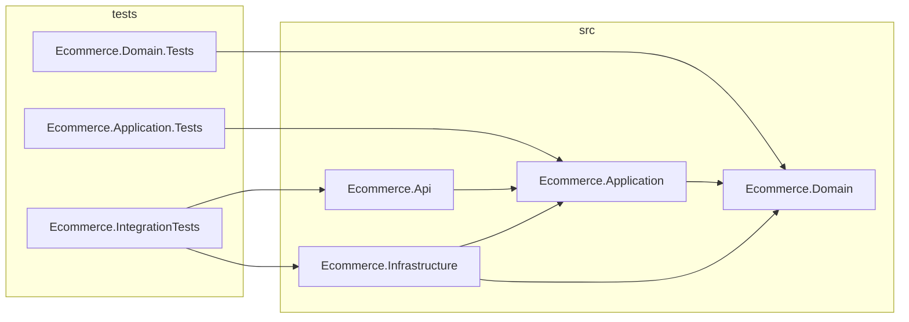

# Project Dependency Diagram

Notes:
- Directional dependencies: Api -> Application -> Domain.
- Infrastructure implements interfaces defined in `Ecommerce.Application` and depends on both `Application` and `Domain`.
- Tests target the appropriate projects (unit tests for Domain/Application; integration tests for Api+Infrastructure).
