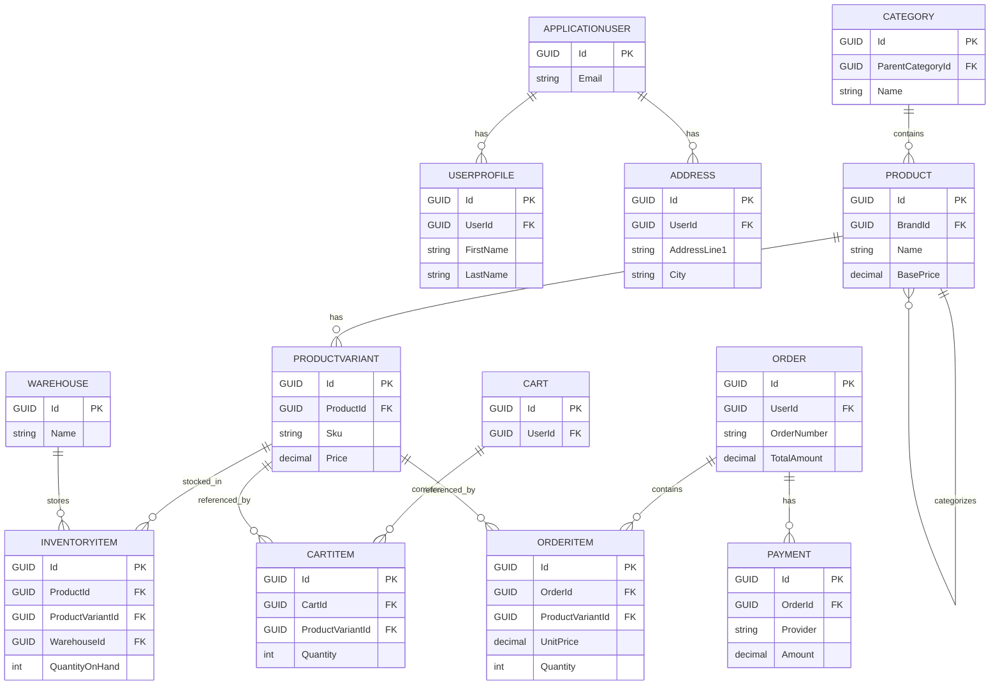

# Entity-Relationship Diagram (High-level)

This ERD captures the primary entities and relationships for the E-Commerce backend. It's intentionally high-level; detailed property lists, indexes, and constraints will follow.

Notes:
- This ERD is a starting point; many domain tables (Coupons, Promotions, Reviews, Shipments, Returns, AuditLogs, Translations, Vendors, etc.) will be added in the detailed model.
- Next: expand each entity with full property lists, PKs, FKs, unique constraints, indexes, delete behaviors, and concurrency controls.
